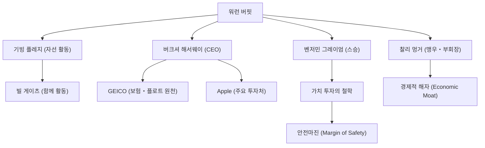

세계에서 가장 성공한 투자자로 알려진 워런 버핏(Warren Buffett). 「오마하의 현인」이라는 별명을 가진 그는 단순한 거대한 부를 이룩한 억만장자라는 틀에 얽매이지 않고, 투자 철학, 윤리관, 그리고 자선 활동에 있어서 전 세계 사람들에게 막대한 영향을 계속 주고 있습니다. 이 글에서는 그가 어떻게 투자의 신이 되었는지, 그의 생애와 독자적인 투자 철학, 그리고 후세에 남긴 것들에 대해 깊이 파헤쳐 보겠습니다.

### 유년 시절의 비즈니스 감각과 첫 투자

1930년 8월 30일, 네브래스카주 오마하에서 태어난 버핏은 어릴 적부터 경이로운 비즈니스 감각과 숫자에 대한 집착을 발휘했습니다. 할아버지의 식료품점에서 껌이나 코카콜라를 도매로 사와 이웃집을 돌며 방문 판매를 하여 착실하게 이익을 올리는 경험을 쌓았습니다.

놀랍게도 그는 11살 때 처음으로 주식(시티스 서비스의 우선주)을 매수했습니다. 이때 매수 후 주가가 일시적으로 하락했다가 그 후 소폭 상승한 타이밍에 매도하여 소액의 이익을 얻었습니다. 그러나 매도 후 그 주가가 다시 몇 배나 급등한 것을 보고 「인내심을 가지고 장기 보유하는 것의 중요성」을 일찍부터 뼈저리게 깨닫게 됩니다. 이 뼈아픈 경험이 훗날 그의 투자 스타일의 원점이 되었습니다.

### 스승 벤저민 그레이엄과의 만남

버핏의 투자자로서의 커리어를 결정지은 것은 컬럼비아 대학교에서 벤저민 그레이엄과의 만남입니다. 「가치 투자의 아버지」라 불리는 그레이엄은 기업의 「내재 가치(Intrinsic Value)」와 「시장 가격」의 괴리에 주목하는 투자 기법을 주창하고 있었습니다.

버핏은 그레이엄의 가르침을 탐욕스럽게 흡수하여, 재무제표를 철저하게 분석하고 내재 가치보다 저평가되어 시장에 방치된 기업에 투자한다는 확고한 기초를 다지게 됩니다. 그는 졸업 후 그레이엄의 투자 회사에서 일하며 그곳에서 투자의 진수를 더욱 깊이 배웠습니다.

### 버크셔 해서웨이의 구축과 진화

1960년대, 버핏은 경영 부진에 빠진 섬유 회사 「버크셔 해서웨이」의 주식을 사모아 마침내 경영권을 장악합니다. 당초에는 섬유업의 재건을 도모했지만, 나중에 이것이 사양 산업이며 구조적으로 어렵다는 것을 깨닫고 이 회사를 투자 지주회사로 멋지게 탈바꿈시켰습니다.

보험 사업(특히 GEICO)을 인수하고, 그곳에서 얻을 수 있는 「플로트(장래 보험금으로 지급할 때까지의 예수금)」를 무이자 투자 자금으로 활용하는 비즈니스 모델을 확립합니다. 이 구조야말로 버크셔 해서웨이를 세계 최대의 복합 기업 중 하나로 성장시킨 최대의 원동력이 되었습니다.

### 독자적인 투자 철학: 「경제적 해자」와 복리의 힘

버핏의 투자 철학은 그레이엄의 순수한 가치 투자에서, 오랜 맹우인 찰리 멍거의 영향을 받아 서서히 진화를 거듭했습니다. 「적당한 기업을 훌륭한 가격에 사는 것보다 훌륭한 기업을 적당한 가격에 사는 것이 낫다」는 방침으로의 전환입니다.

그의 철학의 핵심에는 다음과 같은 중요한 요소가 있습니다:

1. **이코노믹 모트(경제적 해자)**: 타사가 쉽게 모방할 수 없는 강력한 경쟁 우위를 가진 기업을 선호합니다. 강력한 브랜드 파워, 높은 전환 비용, 네트워크 효과 등이 이에 해당합니다.
2. **이해할 수 있는 비즈니스에 투자한다**: 자신이 이해할 수 없는 복잡한 테크놀로지 기업 등에는 오랜 기간 투자를 피해왔습니다. 자신의 「능력 범위」 안에 머무는 것을 철저히 하고 있습니다. (단, 나중에 Apple에 대규모 투자를 단행하여 유연한 태도도 보여주었습니다)
3. **장기 보유와 복리의 마법**: 「가장 선호하는 보유 기간은 『영원』이다」라고 말하듯, 뛰어난 경영진을 둔 우량 기업의 주식을 오래 보유하며 복리의 힘을 최대한 활용합니다.

### 버핏을 둘러싼 상관도와 업적의 흐름

버핏의 인맥과 그 철학에서 비롯된 사업 및 투자의 연결 고리를 아래 그림에 나타냅니다.

### 자선 활동과 후세에 미친 영향

버핏은 막대한 자산을 개인이나 일가가 끌어안고 있는 것이 아니라 사회에 환원하기로 결심했습니다. 2006년, 그는 자신의 자산 대부분을 빌 & 멀린다 게이츠 재단을 비롯한 자선 단체에 기부하겠다고 발표하여 세상을 놀라게 했습니다.

나아가 빌 게이츠 등과 함께 「기빙 플레지(The Giving Pledge)」를 설립하여 세계의 부유층들에게 생전 혹은 사후에 자산의 절반 이상을 자선 활동에 기부하도록 촉구하고 있습니다. 이는 현대 자본주의에 있어서 부의 재분배 방식에 큰 파문을 일으켰습니다.

그의 생활 방식은 놀라울 정도로 검소합니다. 현재도 1958년에 3만 1500달러에 구입한 오마하의 집에 계속 살며 매일 아침 맥도날드 조식을 즐기고 애마를 직접 운전합니다. 이는 부의 축적 자체를 목적으로 하지 않고, 투자라는 지적인 「게임」을 순수하게 사랑하는 그의 진실한 인간성을 보여줍니다.

### 요약

워런 버핏이 후세에 남긴 것은 복리가 가져다준 압도적인 수익이라는 숫자만이 아닙니다. 철저한 리서치와 합리적인 의사 결정, 시장의 패닉이나 눈앞의 이익에 현혹되지 않는 인내력, 그리고 얻은 부를 사회에 환원한다는 높은 윤리관입니다.

「오마하의 현인」의 삶의 방식과 깊고 흔들림 없는 철학은 프로 투자자뿐만 아니라 현대의 복잡한 자본주의 사회를 살아가는 모든 사람들에게 중요한 나침반이 될 것입니다.
