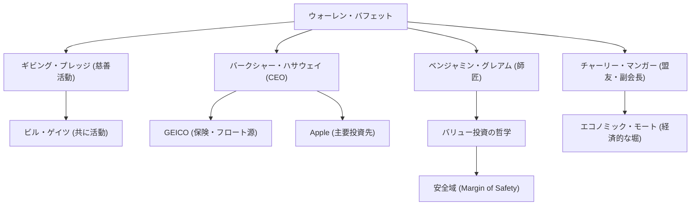

世界で最も成功した投資家として知られるウォーレン・バフェット（Warren Buffett）。「オマハの賢人」の異名を持つ彼は、単なる巨万の富を築いた億万長者という枠に収まらず、投資哲学、倫理観、そして慈善活動において世界中の人々に多大な影響を与え続けています。本記事では、彼がどのようにして投資の神様となったのか、その生涯と独自の投資哲学、そして後世に遺すものについて深く掘り下げます。

### 幼少期からのビジネスセンスと最初の投資

1930年8月30日、ネブラスカ州オマハで生まれたバフェットは、幼い頃から驚異的なビジネスセンスと数字への執着を発揮していました。祖父の食料品店でチューインガムやコカ・コーラを仕入れ、近所の家を回って訪問販売し、着実に利益を上げるという経験を積みました。

驚くべきことに、彼は11歳の時に初めて株式（シティーズ・サービスの優先株）を購入します。この時、購入後に株価が一時下落し、その後わずかに上昇したタイミングで売却して少額の利益を得ました。しかし、売却後にその株価がさらに数倍に急騰したことから、「忍耐強く長期保有することの重要性」を早くも痛感することになります。この苦い経験が、後の彼の投資スタイルの原点となりました。

### 師匠ベンジャミン・グレアムとの出会い

バフェットの投資家としてのキャリアを決定づけたのは、コロンビア大学でのベンジャミン・グレアムとの出会いです。「バリュー投資の父」と呼ばれるグレアムは、企業の「本来の価値（Intrinsic Value）」と「市場価格」の乖離に注目する投資手法を提唱していました。

バフェットはグレアムの教えを貪欲に吸収し、財務諸表を徹底的に読み解き、本質的価値よりも割安で市場に放置されている企業に投資するという確固たる基礎を築き上げます。彼は卒業後、グレアムの投資会社で働き、そこで投資の真髄をさらに深く学びました。

### バークシャー・ハサウェイの構築と進化

1960年代、バフェットは経営不振に陥っていた繊維会社「バークシャー・ハサウェイ」の株を買い集め、最終的に経営権を掌握します。当初は繊維業の立て直しを図りましたが、後にこれが斜陽産業であり構造的に厳しいことを悟り、同社を投資持株会社へと見事に転換させました。

保険事業（特にGEICO）を買収し、そこから得られる「フロート（将来保険金として支払うまでの預かり金）」を無利子の投資資金として活用するビジネスモデルを確立します。この仕組みこそが、バークシャー・ハサウェイを世界最大のコングロマリットの一つへと成長させる最大の原動力となりました。

### 独自の投資哲学：「経済的な堀」と複利の力

バフェットの投資哲学は、グレアムの純粋なバリュー投資から、長年の盟友チャーリー・マンガーの影響を受けて徐々に進化を遂げました。「そこそこの企業を素晴らしい価格で買うより、素晴らしい企業をそこそこの価格で買う方が良い」という方針への転換です。

彼の哲学の核心には以下の重要な要素があります：

1. **エコノミック・モート（経済的な堀）**：他社が容易に真似できない強固な競争優位性を持つ企業を好みます。強力なブランド力、高いスイッチング・コスト、ネットワーク効果などがこれに該当します。
2. **理解できるビジネスに投資する**：自分が理解できない複雑なテクノロジー企業などには長年投資を避けてきました。自分の「能力の輪」に留まることを徹底しています。（ただし、後にAppleへ大規模投資を行い、柔軟な姿勢も見せています）
3. **長期保有と複利の魔法**：「最も好ましい保有期間は『永遠』である」と語る通り、優れた経営陣を持つ優良企業の株を長く持ち続け、複利の力を最大限に活用します。

### バフェットを巡る相関図と功績のフロー

バフェットの人脈と、その哲学から生み出された事業・投資の繋がりを以下の図に示します。

### 慈善活動と後世への影響

バフェットは、莫大な資産を個人や一族で抱え込むのではなく、社会に還元することを決意しました。2006年、彼は自身の資産の大部分をビル＆メリンダ・ゲイツ財団をはじめとする慈善団体に寄付することを発表し、世界を驚かせました。

さらに、ビル・ゲイツらと共に「ギビング・プレッジ（The Giving Pledge）」を設立し、世界の富裕層に対して、生前あるいは死後に資産の半額以上を慈善活動に寄付するよう呼びかけています。これは、現代の資本主義における富の再分配のあり方に大きな一石を投じました。

彼の生活ぶりは驚くほど質素です。現在も1958年に3万1500ドルで購入したオマハの家に住み続け、毎朝マクドナルドの朝食を好み、愛車を自分で運転します。これは、富の蓄積そのものを目的とせず、投資という知的な「ゲーム」を純粋に愛する彼の誠実な人間性を表しています。

### まとめ

ウォーレン・バフェットが後世に遺すものは、複利がもたらした圧倒的なリターンという数字だけではありません。徹底したリサーチと合理的な意思決定、市場のパニックや目先の利益に惑わされない忍耐力、そして得た富を社会に還元するという高い倫理観です。

「オマハの賢人」の生き方と深く揺るぎない哲学は、プロの投資家のみならず、現代の複雑な資本主義社会を生きるすべての人々にとって、重要な羅針盤であり続けるでしょう。
