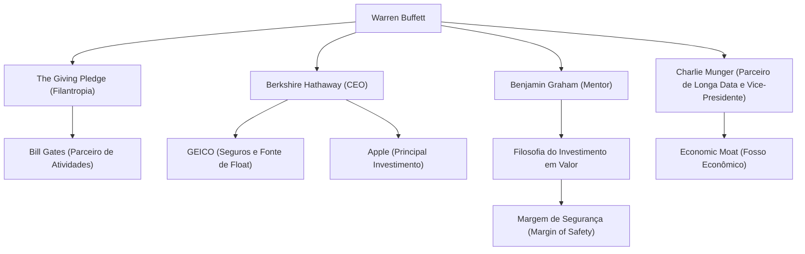

Conhecido como o investidor mais bem-sucedido do mundo, Warren Buffett. Apelidado de "Oráculo de Omaha", ele não se limita ao papel de um bilionário que acumulou uma fortuna colossal; ele continua a exercer uma profunda influência sobre pessoas no mundo inteiro no que diz respeito à filosofia de investimento, ética e filantropia. Neste artigo, vamos explorar profundamente como ele se tornou o deus dos investimentos, sua vida, sua filosofia de investimento única e o seu legado para as gerações futuras.

### Senso para Negócios desde a Infância e os Primeiros Investimentos

Nascido em 30 de agosto de 1930, em Omaha, Nebraska, Buffett demonstrou um notável senso para os negócios e uma fascinação por números desde muito jovem. Ele adquiriu experiência e obteve lucros de forma constante ao comprar chicletes e Coca-Cola na mercearia de seu avô para revendê-los de porta em porta na vizinhança.

Surpreendentemente, ele comprou suas primeiras ações (ações preferenciais da Cities Service) aos 11 anos de idade. Na ocasião, o preço das ações caiu temporariamente após a compra e, quando subiu um pouco, ele as vendeu, obtendo um pequeno lucro. No entanto, o preço daquelas ações disparou várias vezes depois que ele as vendeu, o que o fez perceber rapidamente a "importância de ter paciência e manter os investimentos a longo prazo". Essa experiência amarga tornou-se a base de seu futuro estilo de investimento.

### O Encontro com Seu Mentor, Benjamin Graham

O que definiu a carreira de Buffett como investidor foi o encontro com Benjamin Graham na Universidade de Columbia. Graham, conhecido como o "pai do investimento em valor", defendia uma abordagem de investimento focada na discrepância entre o "valor intrínseco" (Intrinsic Value) de uma empresa e o seu "preço de mercado".

Buffett absorveu avidamente os ensinamentos de Graham, lendo as demonstrações financeiras exaustivamente e construindo uma base sólida para investir em empresas que eram negligenciadas pelo mercado por um preço inferior ao seu valor intrínseco. Após se formar, ele trabalhou na empresa de investimentos de Graham, onde aprendeu ainda mais profundamente a essência dos investimentos.

### A Construção e a Evolução da Berkshire Hathaway

Na década de 1960, Buffett começou a comprar ações da Berkshire Hathaway, uma empresa têxtil que enfrentava dificuldades financeiras, e acabou assumindo o controle da gestão. Inicialmente, ele tentou reestruturar o negócio têxtil, mas depois percebeu que era uma indústria em declínio e com problemas estruturais difíceis de superar, transformando a empresa de forma brilhante em uma holding de investimentos.

Ele estabeleceu um modelo de negócios ao adquirir empresas de seguros (especialmente a GEICO) e usar o "float" (fundos retidos para o pagamento de prêmios de seguro futuros) gerado por elas como capital de investimento sem juros. Esse mecanismo foi a principal força motriz que transformou a Berkshire Hathaway em um dos maiores conglomerados do mundo.

### Uma Filosofia de Investimento Única: "Fosso Econômico" e o Poder dos Juros Compostos

A filosofia de investimento de Buffett evoluiu gradualmente, partindo do investimento em valor puro de Graham e sendo influenciada por seu parceiro de longa data, Charlie Munger. A mudança de foco foi para a ideia de que "é muito melhor comprar uma empresa maravilhosa por um preço justo do que uma empresa justa por um preço maravilhoso".

No centro de sua filosofia estão os seguintes elementos-chave:

1. **Economic Moat (Fosso Econômico)**: Ele prefere empresas com uma vantagem competitiva forte e difícil de ser imitada por outras empresas. Isso inclui um forte poder de marca, altos custos de mudança e efeitos de rede.
2. **Investir em Negócios Compreensíveis**: Por muitos anos, ele evitou investir em empresas de tecnologia complexas que não conseguia entender. Ele é rigoroso em permanecer dentro de seu "círculo de competência". (No entanto, ele demonstrou flexibilidade mais tarde ao fazer um grande investimento na Apple).
3. **Manutenção a Longo Prazo e a Magia dos Juros Compostos**: Como ele diz, "O nosso período de manutenção favorito é 'para sempre'". Ele mantém ações de empresas excelentes, com gestões excepcionais, por longos períodos, maximizando o poder dos juros compostos.

### Diagrama de Relacionamentos de Buffett e o Fluxo de Suas Conquistas

O diagrama abaixo mostra a rede de contatos de Buffett e as conexões entre seus negócios e investimentos derivados de sua filosofia.

### Filantropia e o Impacto nas Gerações Futuras

Buffett decidiu não reter sua imensa riqueza apenas para si mesmo ou para sua família, mas devolvê-la à sociedade. Em 2006, ele surpreendeu o mundo ao anunciar que doaria a maior parte de sua fortuna para organizações de caridade, incluindo a Fundação Bill e Melinda Gates.

Além disso, ele cofundou o "The Giving Pledge" com Bill Gates e outros, incentivando as pessoas mais ricas do mundo a doar mais da metade de sua riqueza para fins filantrópicos durante a vida ou em seus testamentos. Isso causou um grande impacto sobre como a riqueza é redistribuída no capitalismo moderno.

Seu estilo de vida é surpreendentemente frugal. Ele ainda mora na mesma casa em Omaha que comprou por 31.500 dólares em 1958, prefere o café da manhã do McDonald's todos os dias e dirige seu próprio carro. Isso reflete sua natureza humilde, na qual ele não busca o acúmulo de riqueza como um fim em si mesmo, mas ama genuinamente o "jogo" intelectual dos investimentos.

### Conclusão

O que Warren Buffett deixa para as gerações futuras vai muito além dos retornos esmagadores gerados pelos juros compostos. É sua pesquisa minuciosa, tomada de decisão racional, paciência para não ser influenciado pelo pânico do mercado ou lucros a curto prazo, e um alto padrão ético para devolver a riqueza conquistada à sociedade.

A vida e a filosofia profunda e inabalável do "Oráculo de Omaha" continuarão sendo uma bússola importante, não apenas para investidores profissionais, mas para todos nós que vivemos na complexa sociedade capitalista moderna.
