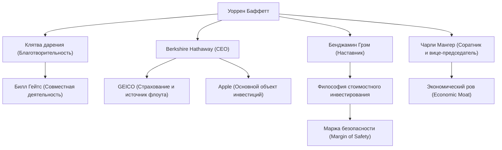

Уоррен Баффетт (Warren Buffett), известный как самый успешный инвестор в мире. Обладая прозвищем «Оракул из Омахи», он не просто миллиардер, сколотивший огромное состояние, но и человек, продолжающий оказывать огромное влияние на людей по всему миру своей философией инвестирования, этическими принципами и благотворительностью. В этой статье мы подробно рассмотрим, как он стал богом инвестирования, его жизнь, уникальную философию инвестирования и то, что он оставит после себя будущим поколениям.

### Деловое чутье с детства и первые инвестиции

Родившийся 30 августа 1930 года в Омахе, штат Небраска, Баффетт с ранних лет проявлял феноменальное деловое чутье и страсть к цифрам. Он покупал жевательную резинку и Coca-Cola в продуктовом магазине своего деда и продавал их, обходя соседние дома, тем самым получая стабильную прибыль.

Удивительно, но свои первые акции (привилегированные акции Cities Service) он купил, когда ему было всего 11 лет. Тогда акции временно упали в цене после покупки, а затем он продал их, как только они немного выросли, получив небольшую прибыль. Однако после того, как он их продал, цена акций взлетела в несколько раз, что заставило его рано осознать «важность терпеливого долгосрочного владения». Этот горький опыт стал отправной точкой его будущего инвестиционного стиля.

### Встреча с наставником Бенджамином Грэмом

Карьеру Баффетта как инвестора определила его встреча с Бенджамином Грэмом в Колумбийском университете. Грэм, которого называют «отцом стоимостного инвестирования», выступал за метод инвестирования, который фокусировался на разрыве между «внутренней стоимостью (Intrinsic Value)» компании и ее «рыночной ценой».

Баффетт жадно впитывал учения Грэма, тщательно изучал финансовые отчеты и заложил прочную основу для инвестирования в компании, которые остаются на рынке недооцененными по сравнению с их внутренней стоимостью. После окончания учебы он работал в инвестиционной компании Грэма, где еще глубже познал суть инвестирования.

### Создание и эволюция Berkshire Hathaway

В 1960-х годах Баффетт начал скупать акции испытывающей трудности текстильной компании Berkshire Hathaway и в конечном итоге получил контроль над ее управлением. Изначально он пытался восстановить текстильный бизнес, но позже понял, что это умирающая отрасль, структурно находящаяся в сложном положении, и блестяще преобразовал компанию в инвестиционный холдинг.

Он приобрел страховые компании (особенно GEICO) и создал бизнес-модель, в которой «флоут» (премии, удерживаемые до выплаты будущих страховых возмещений), получаемый от них, использовался в качестве беспроцентного инвестиционного капитала. Именно этот механизм стал главной движущей силой, превратившей Berkshire Hathaway в один из крупнейших конгломератов в мире.

### Уникальная философия инвестирования: «Экономический ров» и сила сложного процента

Философия инвестирования Баффетта постепенно эволюционировала от чистого стоимостного инвестирования Грэма под влиянием его давнего соратника Чарли Мангера. Это был переход к принципу «лучше купить отличную компанию по справедливой цене, чем справедливую компанию по отличной цене».

В основе его философии лежат следующие ключевые элементы:

1. **Экономический ров (Economic Moat)**: Он предпочитает компании, обладающие сильным конкурентным преимуществом, которое другие компании не могут легко скопировать. Сюда относятся сильная власть бренда, высокие затраты на переключение, сетевые эффекты и т.д.
2. **Инвестировать в понятный бизнес**: Он долгие годы избегал инвестиций в сложные технологические компании, которые не понимал. Он строго придерживается своего «круга компетенции». (Хотя позже он продемонстрировал гибкость, сделав крупные инвестиции в Apple).
3. **Долгосрочное владение и магия сложного процента**: Как он говорит, «наш любимый срок владения — это навсегда», он продолжает владеть акциями отличных компаний с превосходным руководством в течение длительного времени, максимально используя силу сложного процента.

### Схема связей Баффетта и поток достижений

Связи Баффетта, а также деловые и инвестиционные отношения, возникшие на основе его философии, показаны на следующей диаграмме.

### Благотворительность и влияние на будущие поколения

Баффетт решил вернуть свое огромное состояние обществу, а не хранить его для себя или своей семьи. В 2006 году он шокировал мир, объявив, что пожертвует большую часть своего состояния благотворительным организациям, включая Фонд Билла и Мелинды Гейтс.

Кроме того, он вместе с Биллом Гейтсом основал «Клятву дарения» (The Giving Pledge), призывая богатейших людей мира пожертвовать более половины своего состояния на благотворительность при жизни или после смерти. Это оказало огромное влияние на перераспределение богатства в современном капитализме.

Его образ жизни удивительно скромен. В настоящее время он продолжает жить в доме в Омахе, который купил за 31 500 долларов в 1958 году, любит завтракать в McDonald's каждое утро и сам водит машину. Это демонстрирует его искреннюю человечность, поскольку он не преследует цель накопления богатства, а искренне любит интеллектуальную «игру» инвестирования.

### Заключение

То, что Уоррен Баффетт оставит будущим поколениям, — это не только цифры ошеломляющей доходности, принесенной сложным процентом. Это также тщательные исследования и рациональное принятие решений, терпение, чтобы не поддаваться рыночной панике или краткосрочным прибылям, и высокие этические стандарты, позволяющие вернуть заработанное богатство обществу.

Образ жизни и глубокая, непоколебимая философия «Оракула из Омахи» будут оставаться важным компасом не только для профессиональных инвесторов, но и для всех людей, живущих в современном сложном капиталистическом обществе.
