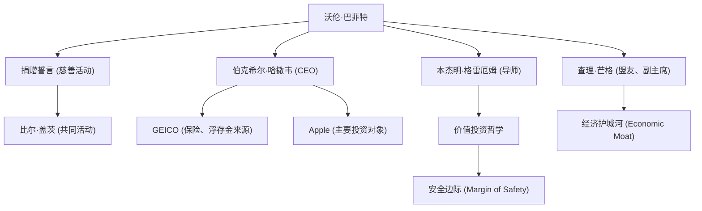

作为世界上最成功的投资者，沃伦·巴菲特（Warren Buffett）以“奥马哈先知”的称号闻名。他不仅仅是一个积累了巨额财富的亿万富翁，他的投资哲学、道德观以及慈善活动都在持续地对世界各地的人们产生深远影响。本文将深入探讨他如何成为投资界的神话、他的生平与独特的投资哲学，以及他留给后世的精神财富。

### 童年时期的商业头脑与最初的投资

1930年8月30日，巴菲特出生于内布拉斯加州奥马哈市，从小就展现出惊人的商业头脑和对数字的痴迷。他在祖父的杂货店里进货口香糖和可口可乐，然后挨家挨户上门推销，通过这种方式积累了稳扎稳打赚取利润的经验。

令人惊讶的是，他在11岁时就购买了人生中的第一只股票（城市服务公司的优先股）。当时，买入后股价一度下跌，随后在稍微回升时他就抛售赚取了微薄的利润。然而，在他卖出后，该股票的价格却暴涨了数倍，这让他过早地深切体会到了“耐心长期持有的重要性”。这次惨痛的教训成为了他日后投资风格的起点。

### 遇见导师本杰明·格雷厄姆

决定巴菲特投资者职业生涯的，是他在哥伦比亚大学与本杰明·格雷厄姆的相遇。被称为“价值投资之父”的格雷厄姆提倡关注企业“内在价值（Intrinsic Value）”与“市场价格”之间差异的投资方法。

巴菲特如饥似渴地吸收格雷厄姆的教诲，彻底钻研财务报表，建立起了坚实的投资基础，即投资那些被市场遗弃、价格低于其内在价值的企业。毕业后，他在格雷厄姆的投资公司工作，在那里进一步深入学习了投资的真谛。

### 伯克希尔·哈撒韦的建立与进化

20世纪60年代，巴菲特开始买入陷入经营困境的纺织公司“伯克希尔·哈撒韦”的股票，并最终掌握了经营权。起初他试图重振纺织业务，但后来意识到这是一个夕阳产业，在结构上面临严峻挑战，于是出色地将该公司转型为一家投资控股公司。

他确立了一种商业模式：收购保险业务（尤其是GEICO），并将其产生的“浮存金（作为未来保险金支付前的准备金）”作为无息投资资金加以利用。正是这一机制，成为了推动伯克希尔·哈撒韦成长为全球最大企业集团之一的最大动力。

### 独特的投资哲学：“护城河”与复利的力量

巴菲特的投资哲学从格雷厄姆纯粹的价值投资，在长年盟友查理·芒格的影响下逐渐发生演变。他转变了方针，认为“以合理的价格买入一家伟大的公司，远胜于以极佳的价格买入一家平庸的公司”。

他的哲学核心包含以下重要要素：

1. **经济护城河（Economic Moat）**：偏好那些拥有其他公司难以轻易模仿的强大竞争优势的企业。强大的品牌影响力、高昂的转换成本、网络效应等都属于这一类。
2. **投资于能够理解的业务**：长年以来，他避免投资自己无法理解的复杂科技公司等。他坚守自己的“能力圈”。（不过，后来他对苹果公司进行了大规模投资，也展现出了灵活的姿态）
3. **长期持有与复利的魔法**：正如他所说，“最理想的持有期是‘永远’”，他长期持有拥有优秀管理团队的优质企业股票，将复利的力量发挥到极致。

### 巴菲特相关人物与成就关系图

巴菲特的人脉网络以及由其哲学衍生出的事业与投资联系如下所示：

### 慈善活动与对后世的影响

巴菲特决定不将巨额财富据为己有或留给家族，而是回报给社会。2006年，他宣布将自己的大部分资产捐赠给包括比尔及梅琳达·盖茨基金会在内的慈善机构，震惊了世界。

此外，他与比尔·盖茨等人共同发起了“捐赠誓言（The Giving Pledge）”，呼吁全球富豪在生前或死后将至少一半的资产捐献给慈善事业。这在现代资本主义财富再分配的方式上激起了巨大的回响。

他的生活方式惊人地简朴。如今他依然住在那栋1958年以3.15万美元买下的奥马哈别墅里，每天早上喜欢吃麦当劳早餐，并且自己开车。这展现了他真诚的本性：他不以积累财富本身为目的，而是纯粹地热爱投资这场智力“游戏”。

### 总结

沃伦·巴菲特留给后世的，不仅仅是复利带来的惊人回报这些数字。更是透彻的研究与理性的决策、不被市场恐慌或眼前利益所迷惑的耐心，以及将所得财富回馈社会的高尚道德观。

“奥马哈先知”的生活方式与深邃坚定的哲学，不仅对专业投资者而言，对于所有生活在现代复杂资本主义社会中的人来说，都将是一座重要的指南针。
