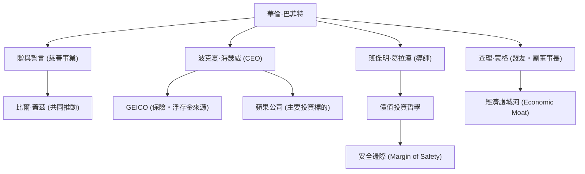

被譽為世界上最成功的投資家——華倫·巴菲特（Warren Buffett）。擁有「奧馬哈的先知」稱號的他，不僅僅是一個累積了巨額財富的億萬富翁，他在投資哲學、倫理觀以及慈善事業方面，也持續對全世界的人們產生深遠的影響。本文將深入探討他如何成為投資之神、他的生平與獨特的投資哲學，以及他留給後世的遺產。

### 從小展現的商業頭腦與首次投資

1930年8月30日出生於內布拉斯加州奧馬哈的巴菲特，從小就展現出驚人的商業頭腦和對數字的執著。他曾在祖父的雜貨店批發口香糖和可口可樂，並挨家挨戶推銷，累積了穩步獲利的經驗。

令人驚訝的是，他在11歲時就買下了人生的第一檔股票（城市服務公司的特別股）。當時，買入後股價一度下跌，隨後在稍微上漲時他便賣出，賺取了微薄的利潤。然而，在他賣出之後，該股票的價格竟飆升了數倍，這讓他早早體會到了「耐心長期持有的重要性」。這個苦澀的經驗，成為了他日後投資風格的起點。

### 與導師班傑明·葛拉漢的相遇

決定巴菲特投資生涯的關鍵，是他在哥倫比亞大學與班傑明·葛拉漢的相遇。被稱為「價值投資之父」的葛拉漢，提倡關注企業「內在價值（Intrinsic Value）」與「市場價格」之間落差的投資手法。

巴菲特如飢似渴地吸收了葛拉漢的教誨，徹底解讀財務報表，並建立起堅實的基礎：投資那些在市場上被低估、價格低於其內在價值的企業。畢業後，他在葛拉漢的投資公司工作，在那裡更進一步地學習了投資的精髓。

### 波克夏·海瑟威的建立與進化

1960年代，巴菲特開始收購陷入經營困境的紡織公司「波克夏·海瑟威」的股票，並最終掌握了經營權。起初他試圖重振紡織業務，但後來意識到這是一個夕陽產業且結構上困難重重，便成功將該公司轉型為一家投資控股公司。

他收購了保險業務（特別是GEICO），並確立了一種商業模式：利用從中獲得的「浮存金（在未來支付保險金之前所持有的資金）」作為無息的投資資金。這個機制正是推動波克夏·海瑟威成長為全球最大綜合企業之一的最大原動力。

### 獨特的投資哲學：「經濟護城河」與複利的力量

巴菲特的投資哲學，從葛拉漢純粹的價值投資，在長年盟友查理·蒙格的影響下逐漸演進。他轉變為「寧願以合理的價格買進一家好公司，也不要以好價格買進一家普通的公司」的方針。

他的哲學核心包含以下幾個重要元素：

1. **經濟護城河（Economic Moat）**：他偏好那些擁有其他公司難以輕易模仿的強大競爭優勢的企業。強大的品牌影響力、高轉換成本、網絡效應等都屬於此類。
2. **投資於自己能理解的業務**：多年來，他一直避免投資於自己無法理解的複雜科技公司。他堅持留在自己的「能力圈」內。（不過，他後來也對蘋果公司進行了大規模投資，展現出靈活的態度）
3. **長期持有與複利的魔法**：正如他所說「最理想的持有期限是『永遠』」，他會長期持有那些擁有優秀經營團隊的優質企業的股票，並將複利的力量發揮到極致。

### 圍繞巴菲特的關係圖與成就流程

下圖展示了巴菲特的人脈，以及由其哲學衍生出的事業與投資之間的連結。

### 慈善事業與對後世的影響

巴菲特決定不將龐大的資產留給個人或家族，而是回饋給社會。2006年，他宣布將大部分資產捐贈給比爾及梅琳達·蓋茲基金會等慈善機構，震驚了全世界。

此外，他與比爾·蓋茲等人共同創立了「贈與誓言（The Giving Pledge）」，呼籲全球富豪在生前或死後將至少一半的資產捐贈給慈善事業。這對現代資本主義中財富重新分配的方式投下了一顆震撼彈。

他的生活方式令人驚訝地簡樸。至今他仍住在1958年以31,500美元買下的奧馬哈房子裡，每天早上喜歡吃麥當勞的早餐，並自己開車。這展現了他真誠的人格特質：他不以累積財富本身為目的，而是純粹地熱愛投資這場充滿智慧的「遊戲」。

### 總結

華倫·巴菲特留給後世的，不僅僅是複利所帶來的驚人回報等數字。還有他徹底的研究與理性的決策、不被市場恐慌或眼前利益所迷惑的耐心，以及將獲得的財富回饋給社會的高尚倫理觀。

「奧馬哈的先知」的生活方式與深厚堅定的哲學，不僅對專業投資人而言，對所有生活在複雜現代資本主義社會中的人們來說，都將繼續成為重要的指南針。
