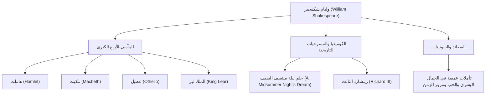

يُعتبر وليام شكسبير (1564 - 1616) على نطاق واسع أعظم كاتب مسرحي وشاعر في التاريخ، وغالباً ما يُطلق عليه لقب الشاعر الوطني لإنجلترا. لقد تجاوزت أعماله حواجز الزمان والثقافة، ولا تزال تُعرض وتُقرأ في جميع أنحاء العالم بعد أكثر من 400 عام. إن تصويره النابض بالحياة للعواطف والصراعات الإنسانية العالمية متجذر بعمق في الأدب الحديث والفن، وحتى في لغتنا اليومية.

## الانطلاق من ستراتفورد: حياة مبكرة غامضة ومجد في لندن

وُلد شكسبير عام 1564 في ستراتفورد أبون آفون، وهي بلدة تقع في وسط إنجلترا. كان والده صانع قفازات وشخصية محلية بارزة شغل حتى منصب العمدة. يُعتقد أن شكسبير تعلم أساسيات اللغة اللاتينية والأدب الكلاسيكي في مدرسة القواعد المحلية، لكنه لم يلتحق بالجامعة. في سن الثامنة عشرة، تزوج من آن هاثاواي وأنجب ثلاثة أطفال، لكن أعقب ذلك فترة تُعرف باسم "السنوات المفقودة" (Lost Years)، حيث اختفى خلالها من السجلات التاريخية.

ظهر مرة أخرى في السجلات عام 1592 في الساحة المسرحية في لندن. وبعد أن برز ككاتب مسرحي وممثل صاعد، تغلب على العديد من الصعوبات، بما في ذلك إغلاق المسارح بسبب الطاعون الذي كان منتشراً في ذلك الوقت، وأصبح عضواً مركزياً في فرقة التمثيل "رجال اللورد تشامبرلين" (التي عُرفت لاحقاً باسم "رجال الملك"). وبصفته شريكاً في ملكية المسرح، حقق أيضاً نجاحاً مالياً، حيث أنتج سلسلة من الروائع التي خلدها التاريخ.

## النظر في هاوية الوجود الإنساني: فلسفة شكسبير ومواضيعه

يكمن الجاذب الأكبر لشكسبير في "بصيرته العميقة في الإنسانية". لا يوجد تقريباً شخصيات خيرة تماماً أو شريرة تماماً في أعماله. يتم تصوير العواطف البشرية المعقدة والمتناقضة مثل الشهوة إلى السلطة، والغيرة، والحب، والجنون، والتردد بواقعية شديدة.

على سبيل المثال، في مسرحية "هاملت"، يتم استكشاف الخوف من اتخاذ الإجراءات والقلق الوجودي من خلال المناجاة الشهيرة "أكون أو لا أكون". وفي "مكبث"، يتم تصوير خراب رجل تملكه الطموح، وفي "عطيل"، المأساة التي تجلبها الغيرة. وبدلاً من فرض دروس أخلاقية، فقد شكك الجمهور نفسه حول "ما يعنيه أن تكون إنساناً" من خلال صراعات شخصياته.

يوضح الرسم البياني أدناه اتساع أنشطته الإبداعية المتنوعة وارتباط إنجازاته ببعضها البعض.

## خيميائي الكلمات: تأثير لا يُقاس على الأجيال القادمة

إن التأثير الذي أحدثه شكسبير على اللغة الإنجليزية بحد ذاتها لا يمكن قياسه. من خلال الجمع بين الكلمات الموجودة أو ابتكار كلمات جديدة تماماً، يُقال إنه أدخل حوالي 1700 كلمة وعبارة جديدة في اللغة الإنجليزية. العديد من التعبيرات التي لا تزال تستخدم يومياً حتى اليوم، مثل "break the ice" (كسر الجليد) و "heart of gold" (قلب من ذهب)، تعود أصولها إلى أعماله.

علاوة على ذلك، استمرت أعماله في إلهام جميع المجالات الثقافية، من الأدب إلى علم النفس، والفلسفة، والرسم، والموسيقى، والأفلام. درس سيغموند فرويد شخصيات شكسبير بعمق عند صياغة نظرياته في التحليل النفسي، ويمكن العثور على النماذج الأصلية (Archetype) للعديد من القصص الحديثة داخل مسرحياته.

## خاتمة: كلمات تعيش إلى الأبد

في عام 1616، انتهت حياة شكسبير في مسقط رأسه ستراتفورد عن عمر يناهز 52 عاماً. ومع ذلك، حتى لو فني جسده المادي، فإن الكلمات التي نسجها لم تمت أبداً. تماماً كما أشاد به الكاتب المسرحي المعاصر له بن جونسون بأنه "ليس لعصر واحد، بل لكل العصور"، فإن أعمال شكسبير هي إرث للإنسانية سيستمر في التألق إلى الأبد، طالما أن البشر لديهم مشاعر.
