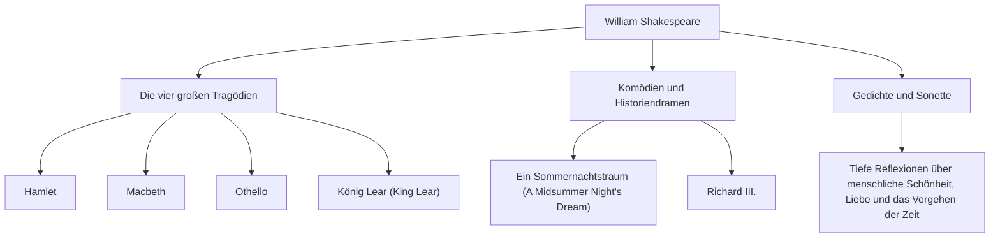

William Shakespeare (1564 - 1616) gilt weithin als der größte Dramatiker und Dichter der Geschichte und wird oft als englischer Nationaldichter bezeichnet. Seine Werke haben die Grenzen von Zeit und Kultur überschritten und werden auch über 400 Jahre später noch weltweit aufgeführt und gelesen. Seine lebendigen Darstellungen universeller menschlicher Emotionen und Konflikte sind tief in der modernen Literatur, Kunst und sogar in unserer Alltagssprache verwurzelt.

## Aufbruch aus Stratford: Eine geheimnisvolle Jugend und Ruhm in London

Shakespeare wurde 1564 in Stratford-upon-Avon, einer Stadt in Mittelengland, geboren. Sein Vater war Handschuhmacher und eine prominente lokale Persönlichkeit, die sogar als Bürgermeister diente. Es wird angenommen, dass Shakespeare die Grundlagen der lateinischen und klassischen Literatur an einer örtlichen Lateinschule lernte, aber er besuchte keine Universität. Im Alter von 18 Jahren heiratete er Anne Hathaway und bekam drei Kinder, aber danach folgte eine Zeit, die die "Verlorenen Jahre" (Lost Years) genannt wird und in der er aus historischen Aufzeichnungen verschwindet.

Er tauchte 1592 in der Londoner Theaterszene wieder in den Aufzeichnungen auf. Nachdem er sich als aufstrebender Dramatiker und Schauspieler hervorgetan hatte, überwand er zahlreiche Schwierigkeiten, darunter die Schließung der Theater aufgrund der damals grassierenden Pest, und wurde ein zentrales Mitglied der Theatergesellschaft "Lord Chamberlain's Men" (später "King's Men"). Als Mitinhaber des Theaters erzielte er auch finanziellen Erfolg und produzierte eine Reihe von Meisterwerken, die in die Geschichte eingehen sollten.

## Blick in den Abgrund der menschlichen Existenz: Shakespeares Philosophie und Themen

Shakespeares größte Anziehungskraft liegt in seiner "tiefen Einsicht in die Menschheit". Es gibt fast keine absolut guten oder vollständig bösen Charaktere in seinen Werken. Komplexe und widersprüchliche menschliche Emotionen wie Machtgier, Eifersucht, Liebe, Wahnsinn und Unentschlossenheit werden mit extremem Realismus dargestellt.

In "Hamlet" werden beispielsweise die Angst vor dem Handeln und die existenzielle Angst durch den berühmten Monolog "Sein oder Nichtsein" erforscht. In "Macbeth" wird der Ruin eines von Ehrgeiz besessenen Mannes dargestellt, und in "Othello" die durch Eifersucht hervorgerufene Tragödie. Anstatt moralische Lektionen aufzuzwingen, befragte er das Publikum selbst durch die Konflikte seiner Figuren, "was es bedeutet, menschlich zu sein".

Das folgende Diagramm veranschaulicht die Breite seiner vielfältigen kreativen Aktivitäten und die Korrelation seiner Leistungen.

## Der Alchemist der Worte: Unermesslicher Einfluss auf die Nachwelt

Der Einfluss, den Shakespeare auf die englische Sprache selbst hatte, ist unermesslich. Durch die Kombination bestehender Wörter oder die Schaffung völlig neuer Wörter soll er rund 1.700 neue Wörter und Phrasen in der englischen Sprache etabliert haben. Viele Ausdrücke, die heute noch alltäglich verwendet werden, wie "break the ice" (das Eis brechen) und "heart of gold" (Herz aus Gold), stammen aus seinen Werken.

Darüber hinaus haben seine Werke alle kulturellen Bereiche inspiriert, von der Literatur bis hin zu Psychologie, Philosophie, Malerei, Musik und Film. Sigmund Freud studierte Shakespeares Charaktere eingehend bei der Formulierung seiner Psychoanalyse, und die Archetypen vieler moderner Geschichten finden sich in seinen Theaterstücken.

## Fazit: Worte, die ewig leben

1616 endete Shakespeares Leben in seiner Heimatstadt Stratford im Alter von 52 Jahren. Doch auch wenn sein physischer Körper unterging, starben die Worte, die er spann, nie. Genau wie ihn sein zeitgenössischer Dramatiker Ben Jonson als "nicht für ein Zeitalter, sondern für alle Zeiten" pries, sind Shakespeares Werke ein Erbe der Menschheit, das für alle Ewigkeit weiter leuchten wird, solange Menschen Emotionen haben.
