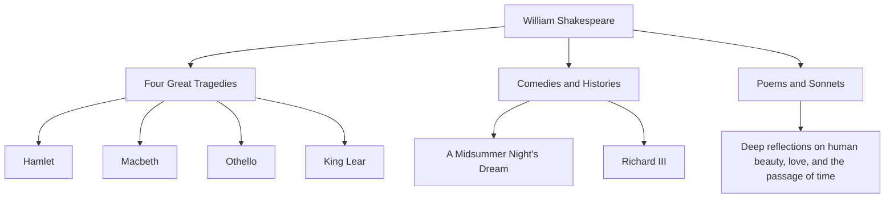

William Shakespeare (1564 - 1616) is widely regarded as the greatest playwright and poet in history, often called England's national poet. His works have transcended the barriers of time and culture, and are still performed and read worldwide over 400 years later. His vibrant depictions of universal human emotions and conflicts are deeply rooted in modern literature, art, and even our everyday language.

## Departure from Stratford: A Mysterious Early Life and Glory in London

Shakespeare was born in 1564 in Stratford-upon-Avon, a town in central England. His father was a glover and a prominent local figure who even served as mayor. It is believed that Shakespeare learned the basics of Latin and classical literature at a local grammar school, but he did not attend university. At the age of 18, he married Anne Hathaway and had three children, but this is followed by a period called the "Lost Years," during which he disappears from historical records.

He reappeared in records in 1592 in the London theatre scene. Having distinguished himself as an up-and-coming playwright and actor, he overcame numerous difficulties, including the closure of theatres due to the plague that was prevalent at the time, and became a central member of the playing company "Lord Chamberlain's Men" (later the "King's Men"). As a co-owner of the theatre, he also achieved financial success, producing a succession of masterpieces that would go down in history.

## Peering into the Abyss of Human Existence: Shakespeare's Philosophy and Themes

Shakespeare's greatest appeal lies in his "deep insight into humanity." There are almost no absolutely good or completely evil characters in his works. Complex and contradictory human emotions such as a lust for power, jealousy, love, madness, and indecision are portrayed with extreme realism.

For example, in "Hamlet," the fear of taking action and existential angst are explored through the famous soliloquy, "To be, or not to be." In "Macbeth," the ruin of a man possessed by ambition is depicted, and in "Othello," the tragedy brought about by jealousy. Rather than forcing moral lessons, he questioned the audience themselves about "what it means to be human" through the conflicts of his characters.

The diagram below illustrates the breadth of his wide-ranging creative activities and the correlation of his achievements.

## The Alchemist of Words: Immeasurable Influence on Posterity

The influence Shakespeare had on the English language itself is immeasurable. By combining existing words or creating entirely new ones, he is said to have established some 1,700 new words and phrases in the English language. Many expressions still in everyday use today, such as "break the ice" and "heart of gold," originate from his works.

Furthermore, his works have continued to inspire all cultural spheres, from literature to psychology, philosophy, painting, music, and film. Sigmund Freud deeply studied Shakespeare's characters in formulating his theories of psychoanalysis, and the archetypes of many modern stories can be found within his plays.

## Conclusion: Words That Live on Forever

In 1616, Shakespeare's life came to an end in his hometown of Stratford at the age of 52. However, even if his physical body perished, the words he spun never died. Just as his contemporary playwright Ben Jonson praised him as being "not of an age, but for all time," Shakespeare's works are a legacy of humanity that will continue to shine for all eternity, as long as humans have emotions.
