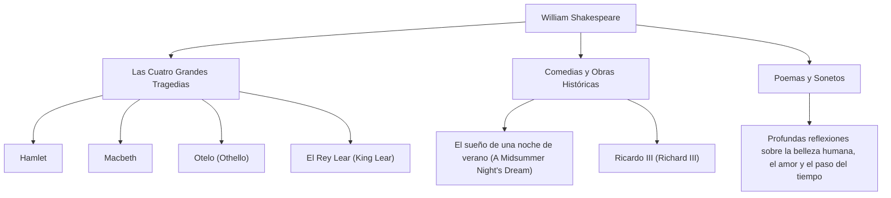

William Shakespeare (1564 - 1616) está considerado como el mayor dramaturgo y poeta de la historia, y a menudo se le llama el "poeta nacional de Inglaterra". Sus obras han superado las barreras del tiempo y la cultura, y todavía se interpretan y leen en todo el mundo más de 400 años después. Su vívida representación de las emociones humanas universales y los conflictos está profundamente arraigada en la literatura moderna, el arte e incluso en nuestro lenguaje cotidiano.

## Salida de Stratford: Una juventud misteriosa y gloria en Londres

Shakespeare nació en 1564 en Stratford-upon-Avon, una ciudad del centro de Inglaterra. Su padre era fabricante de guantes y una figura local destacada que incluso ocupó el cargo de alcalde. Se cree que Shakespeare aprendió los conceptos básicos del latín y la literatura clásica en la escuela primaria local, pero no asistió a la universidad. A los 18 años, se casó con Anne Hathaway y tuvo tres hijos, a lo que siguió un período conocido como los "Años perdidos", durante el cual desaparece de los registros históricos.

Reapareció en los registros en 1592 en la escena teatral de Londres. Habiendo destacado como un prometedor dramaturgo y actor, superó numerosas dificultades, incluido el cierre de teatros debido a la plaga imperante en ese momento, y se convirtió en un miembro central de la compañía de teatro "Los hombres del Lord Chamberlain" (más tarde "Los hombres del Rey"). Como copropietario del teatro, también logró el éxito financiero, produciendo una serie de obras maestras que pasarían a la historia.

## Asomándose al abismo de la existencia humana: Filosofía y temas de Shakespeare

El mayor atractivo de Shakespeare reside en su "profunda visión de la humanidad". Casi no hay personajes absolutamente buenos o completamente malos en sus obras. Las emociones humanas complejas y contradictorias, como la sed de poder, los celos, el amor, la locura y la indecisión, se retratan con extremo realismo.

Por ejemplo, en "Hamlet", el miedo a actuar y la angustia existencial se exploran a través del famoso soliloquio "Ser o no ser". En "Macbeth", se representa la ruina de un hombre poseído por la ambición, y en "Otelo", la tragedia provocada por los celos. En lugar de imponer lecciones morales, cuestionó a la propia audiencia sobre "qué significa ser humano" a través de los conflictos de sus personajes.

El siguiente diagrama ilustra la amplitud de sus diversas actividades creativas y la correlación de sus logros.

## El alquimista de las palabras: Inmensurable influencia en la posteridad

La influencia que Shakespeare tuvo sobre el idioma inglés en sí es inmensurable. Al combinar palabras existentes o crear otras completamente nuevas, se dice que estableció alrededor de 1.700 nuevas palabras y frases en el idioma inglés. Muchas expresiones que todavía se usan hoy en día, como "break the ice" (romper el hielo) y "heart of gold" (corazón de oro), se originan en sus obras.

Además, sus obras han seguido inspirando a todas las esferas culturales, desde la literatura hasta la psicología, la filosofía, la pintura, la música y el cine. Sigmund Freud estudió profundamente los personajes de Shakespeare al formular sus teorías del psicoanálisis, y los arquetipos de muchas historias modernas se pueden encontrar dentro de sus obras de teatro.

## Conclusión: Palabras que viven para siempre

En 1616, la vida de Shakespeare llegó a su fin en su ciudad natal de Stratford a la edad de 52 años. Sin embargo, aunque su cuerpo físico pereció, las palabras que hiló nunca murieron. Tal como lo elogió su dramaturgo contemporáneo Ben Jonson como alguien "no de una época, sino para todos los tiempos", las obras de Shakespeare son un legado de la humanidad que seguirá brillando para toda la eternidad, mientras los humanos tengan emociones.
