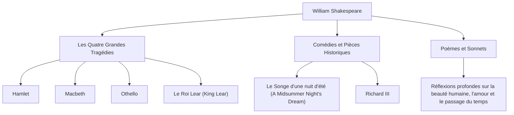

William Shakespeare (1564 - 1616) est largement considéré comme le plus grand dramaturge et poète de l'histoire, et est souvent appelé le « poète national de l'Angleterre ». Ses œuvres ont transcendé les barrières du temps et de la culture, et sont toujours jouées et lues dans le monde entier plus de 400 ans plus tard. Sa description vibrante des émotions et des conflits humains universels est profondément enracinée dans la littérature moderne, l'art, et même dans notre langage quotidien.

## Départ de Stratford : Une jeunesse mystérieuse et la gloire à Londres

Shakespeare est né en 1564 à Stratford-upon-Avon, une ville du centre de l'Angleterre. Son père était un gantier et une figure locale de premier plan qui a même été maire. On pense que Shakespeare a appris les bases du latin et de la littérature classique dans une grammar school locale, mais il n'a pas fréquenté l'université. À l'âge de 18 ans, il a épousé Anne Hathaway et a eu trois enfants, ce qui a été suivi d'une période appelée les « Années perdues » (Lost Years), au cours de laquelle il disparaît des archives historiques.

Il est réapparu dans les registres en 1592 sur la scène théâtrale londonienne. S'étant distingué en tant que dramaturge et acteur prometteur, il a surmonté de nombreuses difficultés, dont la fermeture des théâtres en raison de la peste qui sévissait à l'époque, et est devenu un membre central de la troupe de théâtre « Lord Chamberlain's Men » (plus tard les « King's Men »). En tant que copropriétaire du théâtre, il a également connu le succès financier, produisant une succession de chefs-d'œuvre qui allaient marquer l'histoire.

## Plongée dans l'abîme de l'existence humaine : Philosophie et thèmes de Shakespeare

Le plus grand attrait de Shakespeare réside dans sa « profonde vision de l'humanité ». Il n'y a presque pas de personnages absolument bons ou complètement mauvais dans ses œuvres. Les émotions humaines complexes et contradictoires, telles que la soif de pouvoir, la jalousie, l'amour, la folie et l'indécision, sont dépeintes avec un réalisme extrême.

Par exemple, dans « Hamlet », la peur d'agir et l'angoisse existentielle sont explorées à travers le célèbre soliloque « Être, ou ne pas être ». Dans « Macbeth », la ruine d'un homme possédé par l'ambition est décrite, et dans « Othello », la tragédie provoquée par la jalousie. Plutôt que d'imposer des leçons de morale, il a interrogé le public lui-même sur « ce que signifie être humain » à travers les conflits de ses personnages.

Le diagramme ci-dessous illustre l'étendue de ses diverses activités créatives et la corrélation de ses réalisations.

## L'alchimiste des mots : Une influence incommensurable sur la postérité

L'influence que Shakespeare a eue sur la langue anglaise elle-même est incommensurable. En combinant des mots existants ou en en créant de tout nouveaux, on dit qu'il a établi environ 1 700 nouveaux mots et expressions dans la langue anglaise. De nombreuses expressions encore d'usage quotidien aujourd'hui, telles que « break the ice » (briser la glace) et « heart of gold » (cœur d'or), proviennent de ses œuvres.

De plus, ses œuvres ont continué d'inspirer toutes les sphères culturelles, de la littérature à la psychologie, la philosophie, la peinture, la musique et le cinéma. Sigmund Freud a profondément étudié les personnages de Shakespeare en formulant ses théories de la psychanalyse, et les archétypes de nombreuses histoires modernes peuvent être trouvés dans ses pièces.

## Conclusion : Des mots qui vivent pour toujours

En 1616, la vie de Shakespeare a pris fin dans sa ville natale de Stratford à l'âge de 52 ans. Cependant, même si son corps physique a péri, les mots qu'il a tissés ne sont jamais morts. Tout comme son contemporain le dramaturge Ben Jonson l'a loué comme étant « non d'une époque, mais pour tous les temps », les œuvres de Shakespeare sont un héritage de l'humanité qui continuera de briller pour l'éternité, tant que les humains auront des émotions.
