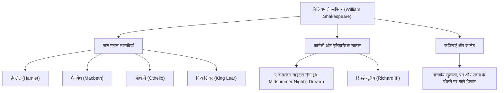

विलियम शेक्सपियर (1564 - 1616) को व्यापक रूप से इतिहास में सबसे महान नाटककार और कवि माना जाता है, और उन्हें इंग्लैंड का राष्ट्रीय कवि भी कहा जाता है। उनकी कृतियों ने समय और संस्कृति की बाधाओं को पार कर लिया है, और 400 से अधिक वर्षों के बाद भी आज दुनिया भर में उन्हें प्रदर्शित किया जाता है और पढ़ा जाता है। सार्वभौमिक मानवीय भावनाओं और संघर्षों का उनका जीवंत चित्रण आधुनिक साहित्य, कला और यहाँ तक कि हमारी रोजमर्रा की भाषा में भी गहराई से बसा हुआ है।

## स्ट्रैटफ़ोर्ड से प्रस्थान: एक रहस्यमय प्रारंभिक जीवन और लंदन में गौरव

शेक्सपियर का जन्म 1564 में मध्य इंग्लैंड के एक कस्बे स्ट्रैटफ़ोर्ड-अपॉन-एवन में हुआ था। उनके पिता एक दस्ताने बनाने वाले और एक प्रमुख स्थानीय व्यक्ति थे जिन्होंने मेयर के रूप में भी कार्य किया था। ऐसा माना जाता है कि शेक्सपियर ने स्थानीय ग्रामर स्कूल में लैटिन और शास्त्रीय साहित्य की मूल बातें सीखीं, लेकिन वे विश्वविद्यालय नहीं गए। 18 वर्ष की आयु में, उन्होंने ऐनी हैथवे से विवाह किया और उनके तीन बच्चे हुए, लेकिन इसके बाद "खोए हुए वर्ष" (Lost Years) नामक अवधि आती है, जिसके दौरान वे ऐतिहासिक रिकॉर्ड से गायब हो जाते हैं।

वे 1592 में लंदन के थिएटर जगत में रिकॉर्ड में फिर से दिखाई दिए। एक होनहार नाटककार और अभिनेता के रूप में अपनी पहचान बनाने के बाद, उन्होंने उस समय प्रचलित प्लेग के कारण थिएटरों के बंद होने सहित कई कठिनाइयों पर काबू पाया, और "लॉर्ड चेम्बरलेन्स मेन" (बाद में "किंग्स मेन") नामक नाटक कंपनी के प्रमुख सदस्य बन गए। थिएटर के सह-मालिक के रूप में, उन्होंने आर्थिक सफलता भी हासिल की, और एक के बाद एक ऐसी उत्कृष्ट कृतियों का निर्माण किया जो इतिहास में दर्ज हो गईं।

## मानव अस्तित्व की गहराई में झांकना: शेक्सपियर का दर्शन और विषय

शेक्सपियर का सबसे बड़ा आकर्षण "मानवता में उनकी गहरी अंतर्दृष्टि" है। उनकी कृतियों में शायद ही कोई पूर्ण रूप से अच्छे या पूरी तरह से बुरे पात्र हों। सत्ता की लालसा, ईर्ष्या, प्रेम, पागलपन और अनिर्णय जैसी जटिल और विरोधाभासी मानवीय भावनाओं को अत्यधिक यथार्थवाद के साथ चित्रित किया गया है।

उदाहरण के लिए, "हैमलेट" में, कार्रवाई करने के डर और अस्तित्वगत पीड़ा का पता प्रसिद्ध एकालाप, "टू बी, ऑर नॉट टू बी" के माध्यम से लगाया गया है। "मैकबेथ" में महत्वाकांक्षा के वशीभूत एक व्यक्ति के विनाश को दर्शाया गया है, और "ओथेलो" में ईर्ष्या द्वारा लाई गई त्रासदी को। नैतिक सबक थोपने के बजाय, उन्होंने अपने पात्रों के संघर्षों के माध्यम से दर्शकों से स्वयं सवाल किया कि "मानव होने का क्या अर्थ है।"

नीचे दिया गया चित्र उनकी व्यापक रचनात्मक गतिविधियों और उनकी उपलब्धियों के सहसंबंध को दर्शाता है।

## शब्दों के कीमियागर: भावी पीढ़ी पर अथाह प्रभाव

अंग्रेजी भाषा पर स्वयं शेक्सपियर का जो प्रभाव पड़ा वह अथाह है। मौजूदा शब्दों को मिलाकर या पूरी तरह से नए शब्द बनाकर, कहा जाता है कि उन्होंने अंग्रेजी भाषा में लगभग 1,700 नए शब्द और वाक्यांश स्थापित किए। आज भी रोजमर्रा के उपयोग में आने वाले कई भाव, जैसे "break the ice" (बर्फ तोड़ना) और "heart of gold" (सोने का दिल), उनके कार्यों से उत्पन्न हुए हैं।

इसके अलावा, उनके कार्यों ने साहित्य से लेकर मनोविज्ञान, दर्शन, चित्रकला, संगीत और फिल्म तक सभी सांस्कृतिक क्षेत्रों को प्रेरित करना जारी रखा है। सिगमंड फ्रायड ने मनोविश्लेषण के अपने सिद्धांतों को तैयार करते समय शेक्सपियर के पात्रों का गहराई से अध्ययन किया, और कई आधुनिक कहानियों के मूलरूप (आर्किटाइप) उनके नाटकों के भीतर पाए जा सकते हैं।

## निष्कर्ष: शब्द जो हमेशा जीवित रहते हैं

1616 में, 52 वर्ष की आयु में अपने गृह नगर स्ट्रैटफ़ोर्ड में शेक्सपियर का जीवन समाप्त हो गया। हालाँकि, भले ही उनका भौतिक शरीर नष्ट हो गया हो, लेकिन उनके द्वारा बुने गए शब्द कभी नहीं मरे। ठीक वैसे ही जैसे उनके समकालीन नाटककार बेन जॉनसन ने उनकी प्रशंसा करते हुए कहा था कि वे "एक युग के नहीं, बल्कि हर समय के लिए" थे, शेक्सपियर की कृतियां मानवता की एक विरासत हैं जो अनंत काल तक चमकती रहेंगी, जब तक मनुष्य में भावनाएँ हैं।
