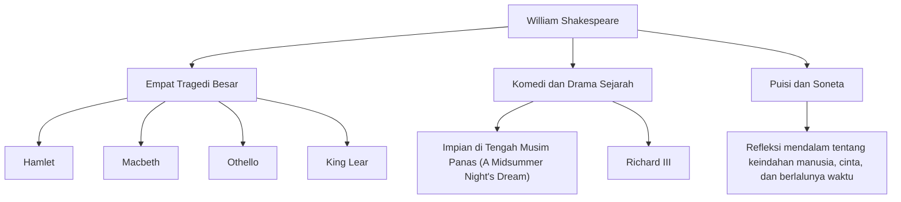

William Shakespeare (1564 - 1616) secara luas dianggap sebagai penulis drama dan penyair terbesar dalam sejarah, dan sering disebut sebagai penyair nasional Inggris. Karya-karyanya telah melampaui batas ruang dan waktu, serta masih dipentaskan dan dibaca di seluruh dunia lebih dari 400 tahun kemudian. Penggambarannya yang hidup tentang emosi dan konflik manusia yang universal tertanam kuat dalam sastra, seni modern, dan bahkan dalam bahasa kita sehari-hari.

## Keberangkatan dari Stratford: Masa Muda yang Misterius dan Kejayaan di London

Shakespeare lahir pada tahun 1564 di Stratford-upon-Avon, sebuah kota di Inggris bagian tengah. Ayahnya adalah pembuat sarung tangan dan tokoh lokal terkemuka yang bahkan pernah menjabat sebagai wali kota. Shakespeare diyakini mempelajari dasar-dasar bahasa Latin dan sastra klasik di sekolah tata bahasa setempat, namun ia tidak menempuh pendidikan di universitas. Pada usia 18 tahun, ia menikah dengan Anne Hathaway dan dikaruniai tiga orang anak. Setelah itu, ada periode yang disebut "Tahun-Tahun yang Hilang" (Lost Years), di mana ia menghilang dari catatan sejarah.

Ia kembali muncul dalam catatan pada tahun 1592 di kancah teater London. Setelah menonjolkan diri sebagai penulis drama dan aktor pendatang baru, ia mengatasi berbagai kesulitan, termasuk penutupan teater akibat wabah yang meluas saat itu, dan menjadi anggota inti dari kelompok teater "Lord Chamberlain's Men" (kemudian menjadi "King's Men"). Sebagai pemilik bersama teater, ia juga mencapai kesuksesan finansial, menghasilkan serangkaian mahakarya yang tercatat dalam sejarah.

## Menatap Jurang Kehidupan Manusia: Filosofi dan Tema Shakespeare

Daya tarik terbesar Shakespeare terletak pada "wawasannya yang dalam tentang kemanusiaan". Hampir tidak ada karakter yang benar-benar baik atau sepenuhnya jahat dalam karya-karyanya. Emosi manusia yang kompleks dan kontradiktif seperti hasrat akan kekuasaan, kecemburuan, cinta, kegilaan, dan keraguan digambarkan dengan realisme yang ekstrem.

Misalnya, dalam "Hamlet", ketakutan untuk mengambil tindakan dan penderitaan eksistensial dieksplorasi melalui monolog terkenal, "To be, or not to be" (Menjadi, atau tidak menjadi). Dalam "Macbeth", kehancuran seorang pria yang dirasuki oleh ambisi digambarkan, dan dalam "Othello", tragedi yang ditimbulkan oleh kecemburuan. Alih-alih memaksakan pelajaran moral, ia mempertanyakan penonton sendiri tentang "apa artinya menjadi manusia" melalui konflik karakter-karakternya.

Diagram di bawah ini mengilustrasikan luasnya berbagai aktivitas kreatifnya dan korelasi dari pencapaiannya.

## Sang Alkemis Kata: Pengaruh Tak Terukur pada Anak Cucu

Pengaruh Shakespeare pada bahasa Inggris itu sendiri tidak terukur. Dengan menggabungkan kata-kata yang ada atau menciptakan kata-kata yang sama sekali baru, ia dikatakan telah menetapkan sekitar 1.700 kata dan frasa baru dalam bahasa Inggris. Banyak ungkapan yang masih sering digunakan saat ini, seperti "break the ice" (memecah kebekuan) dan "heart of gold" (berhati emas), berasal dari karya-karyanya.

Selain itu, karya-karyanya terus menginspirasi semua bidang budaya, dari sastra hingga psikologi, filsafat, lukisan, musik, dan film. Sigmund Freud mempelajari karakter-karakter Shakespeare secara mendalam dalam merumuskan teori psikoanalisisnya, dan arketipe dari banyak cerita modern dapat ditemukan dalam drama-dramanya.

## Kesimpulan: Kata-kata yang Hidup Selamanya

Pada tahun 1616, kehidupan Shakespeare berakhir di kampung halamannya di Stratford pada usia 52 tahun. Namun, meskipun tubuh fisiknya hancur, kata-kata yang dirangkainya tidak pernah mati. Sama seperti rekan penulis dramanya Ben Jonson memujinya sebagai "bukan dari satu zaman, tetapi untuk sepanjang masa", karya-karya Shakespeare adalah warisan kemanusiaan yang akan terus bersinar selamanya, selama manusia memiliki emosi.
