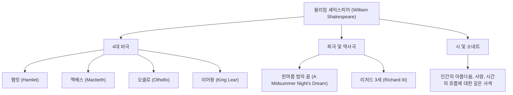

윌리엄 셰익스피어(William Shakespeare, 1564년 - 1616년)는 역사상 가장 위대한 극작가이자 시인으로 널리 알려져 있으며, 영국의 국민 시인으로 불립니다. 그의 작품은 시대와 문화의 장벽을 뛰어넘어 400년이 지난 오늘날에도 전 세계에서 공연되고 읽히고 있습니다. 인간의 보편적인 감정과 갈등을 생생하게 묘사한 그의 필치는 현대 문학과 예술, 나아가 우리의 일상 언어에까지 깊게 뿌리내리고 있습니다.

## 스트랫퍼드에서의 출발: 수수께끼에 싸인 초년과 런던에서의 영광

셰익스피어는 1564년 잉글랜드 중부의 마을 스트랫퍼드어폰에이번에서 태어났습니다. 그의 아버지는 장갑 가죽 장인이자 시장까지 지낸 지역의 유력자였습니다. 셰익스피어는 지역의 그래머 스쿨에서 라틴어와 고전 문학의 기초를 배운 것으로 추정되지만, 대학에는 진학하지 않았습니다. 18세에 앤 해서웨이와 결혼하여 세 자녀를 두었으나, 이후 역사적 기록에서 자취를 감추는 '잃어버린 세월(Lost Years)'이라는 시기가 이어집니다.

그가 다시 기록에 나타난 것은 1592년 런던 연극계에서였습니다. 신진 극작가 겸 배우로 두각을 나타낸 그는 당시 유행하던 흑사병으로 인한 극장 폐쇄 등 수많은 어려움을 극복하고 '궁내부 장관 극단'(이후 국왕 극단)의 핵심 멤버가 되었습니다. 극장의 공동 경영자이기도 했던 그는 경제적으로도 성공을 거두며 역사에 남을 걸작들을 잇달아 탄생시킵니다.

## 인간 존재의 심연을 들여다보다: 셰익스피어의 철학과 주제

셰익스피어의 가장 큰 매력은 그가 지닌 '인간 통찰의 깊이'에 있습니다. 그의 작품에는 절대적인 선인도 완전한 악인도 거의 등장하지 않습니다. 권력욕, 질투, 애정, 광기, 우유부단함 등 인간이 안고 있는 복잡하고 모순된 감정이 극히 사실적으로 묘사되어 있습니다.

예를 들어 《햄릿》에서는 "사느냐 죽느냐"라는 유명한 독백을 통해 행동하는 것에 대한 두려움과 실존적 고뇌를 탐구했습니다. 또한 《맥베스》에서는 야망에 사로잡힌 인간의 파멸이, 《오셀로》에서는 질투가 가져온 비극이 그려집니다. 그는 도덕적인 교훈을 강요하는 대신, 등장인물들의 갈등을 통해 관객 스스로에게 "인간이란 무엇인가"를 질문했습니다.

아래 다이어그램은 그의 폭넓은 창작 활동의 범위와 업적의 상관관계를 보여줍니다.

## 언어의 연금술사: 후세에 미친 헤아릴 수 없는 영향

셰익스피어가 영어라는 언어 자체에 미친 영향은 헤아릴 수 없습니다. 그는 기존의 단어를 조합하거나 완전히 새로운 단어를 창조함으로써 약 1,700개의 신어와 구를 영어에 정착시켰다고 합니다. "break the ice"(어색한 분위기를 깨다)나 "heart of gold"(순수한 마음) 등 현재에도 일상적으로 사용되는 표현 중 많은 부분이 그의 작품에서 유래했습니다.

또한 그의 작품은 문학에 머물지 않고 심리학, 철학, 회화, 음악, 그리고 영화에 이르기까지 모든 문화 영역에 영감을 불어넣고 있습니다. 지그문트 프로이트는 정신분석 이론을 구축할 때 셰익스피어의 등장인물을 깊이 연구했으며, 현대의 많은 이야기의 원형(아키타입)도 그의 희곡 속에서 찾아볼 수 있습니다.

## 맺음말: 영원히 살아 숨 쉬는 언어

1616년, 52세의 나이로 고향 스트랫퍼드에서 생을 마감한 셰익스피어. 그러나 그의 육신은 멸망했어도 그가 빚어낸 언어들은 결코 죽지 않았습니다. 동시대의 극작가 벤 존슨이 그를 "한 시대가 아니라 모든 시대를 위한 인물"이라고 찬사했듯이, 셰익스피어의 작품은 인간이 감정을 가지고 있는 한 영원히 빛날 인류의 유산입니다.
