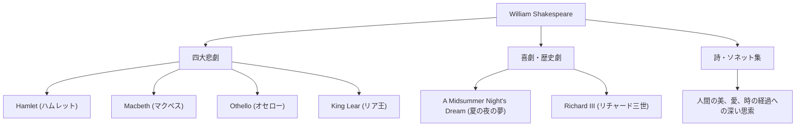

ウィリアム・シェイクスピア（William Shakespeare, 1564年 - 1616年）は、史上最も偉大な劇作家、詩人であり、「イギリスの国民的詩人」と称されています。彼の作品は、時代や文化の壁を越え、400年以上経った今でも世界中で上演され、読み継がれています。人間の普遍的な感情や葛藤を鮮やかに描き出した彼の筆致は、現代の文学や芸術、さらには私たちの日常の言語にまで深く根付いています。

## ストラトフォードからの旅立ち：謎に包まれた前半生とロンドンでの栄光

シェイクスピアは1564年、イングランド中部の町ストラトフォード・アポン・エイヴォンで生まれました。父親は手袋革職人であり、町長も務めた地元の有力者でした。シェイクスピアは地元のグラマースクールでラテン語や古典文学の基礎を学んだと考えられていますが、大学へは進学しませんでした。18歳の時にアン・ハサウェイと結婚し、3人の子供をもうけますが、その後、歴史の記録から姿を消す「失われた年月（Lost Years）」と呼ばれる時期があります。

彼が再び記録に現れるのは1592年、ロンドンの演劇界でのことです。新進気鋭の劇作家・俳優として頭角を現していた彼は、当時流行していたペストによる劇場の閉鎖など数々の困難を乗り越え、「宮内大臣一座（後の国王一座）」という劇団の中心メンバーとなりました。劇場の共同経営者でもあった彼は、経済的にも成功を収め、次々と歴史に残る傑作を生み出していきます。

## 人間存在の深淵を覗く：シェイクスピアの哲学とテーマ

シェイクスピアの最大の魅力は、その「人間洞察の深さ」にあります。彼の作品には、絶対的な善人も完全な悪人もほとんど登場しません。権力欲、嫉妬、愛情、狂気、優柔不断といった、人間が抱える複雑で矛盾した感情が、極めてリアルに描かれています。

例えば『ハムレット』では、「生きるべきか、死ぬべきか」という有名な独白を通じて、行動することの恐れと実存的な苦悩が探求されました。また、『マクベス』では野心に憑りつかれた人間の破滅が、『オセロー』では嫉妬がもたらす悲劇が描かれています。彼は道徳的な教訓を押し付けるのではなく、登場人物たちの葛藤を通じて、観客自身に「人間とは何か」を問いかけました。

以下の図は、彼の幅広い創作活動の広がりと功績の相関を示しています。

## 言葉の錬金術師：後世への計り知れない影響

シェイクスピアが英語という言語そのものに与えた影響は計り知れません。彼は既存の言葉を組み合わせ、あるいは全く新しい言葉を創造することで、約1700もの新語やフレーズを英語に定着させたとされています。"break the ice"（氷を砕く＝緊張をほぐす）、"heart of gold"（純粋な心）など、現在でも日常的に使われている表現の多くが彼の作品に由来しています。

また、彼の作品は文学にとどまらず、心理学、哲学、絵画、音楽、そして映画に至るまで、あらゆる文化領域にインスピレーションを与え続けています。ジークムント・フロイトは精神分析の理論を構築する上でシェイクスピアの登場人物を深く研究し、現代の多くの物語の原型（アーキタイプ）も彼の戯曲の中に見出すことができます。

## 結び：永遠に生き続ける言葉

1616年、52歳で故郷ストラトフォードにてその生涯を閉じたシェイクスピア。しかし、彼の肉体が滅びても、彼が紡ぎ出した言葉たちは死ぬことはありませんでした。同時代の劇作家ベン・ジョンソンが彼を「ひとつの時代ではなく、すべての時代に属する人物」と称賛したように、シェイクスピアの作品は、人間が感情を持つ限り、未来永劫輝き続ける人類の遺産なのです。
