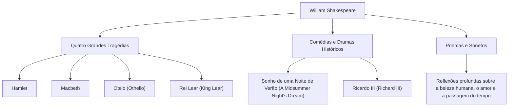

William Shakespeare (1564 - 1616) é amplamente considerado o maior dramaturgo e poeta da história, frequentemente chamado de poeta nacional da Inglaterra. As suas obras transcenderam as barreiras do tempo e da cultura e continuam a ser encenadas e lidas em todo o mundo, mais de 400 anos depois. A sua descrição vibrante das emoções e conflitos humanos universais está profundamente enraizada na literatura moderna, na arte e até mesmo na nossa linguagem quotidiana.

## Partida de Stratford: Uma juventude misteriosa e glória em Londres

Shakespeare nasceu em 1564 em Stratford-upon-Avon, uma cidade no centro da Inglaterra. O seu pai era fabricante de luvas e uma figura local proeminente que chegou a servir como presidente da câmara. Acredita-se que Shakespeare aprendeu os fundamentos do latim e da literatura clássica na escola secundária local, mas não frequentou a universidade. Aos 18 anos, casou-se com Anne Hathaway e teve três filhos, sendo este período seguido pelos chamados "Anos Perdidos" (Lost Years), durante os quais ele desaparece dos registos históricos.

Reapareceu nos registos em 1592 na cena teatral de Londres. Tendo-se destacado como um dramaturgo e ator promissor, superou inúmeras dificuldades, incluindo o encerramento dos teatros devido à peste predominante na época, e tornou-se um membro central da companhia de teatro "Lord Chamberlain's Men" (mais tarde "King's Men"). Como coproprietário do teatro, também alcançou o sucesso financeiro, produzindo uma sucessão de obras-primas que ficariam para a história.

## Espreitando o abismo da existência humana: Filosofia e temas de Shakespeare

O maior apelo de Shakespeare reside na sua "profunda visão sobre a humanidade". Quase não há personagens absolutamente boas ou completamente más nas suas obras. Emoções humanas complexas e contraditórias, como o desejo de poder, o ciúme, o amor, a loucura e a indecisão, são retratadas com extremo realismo.

Por exemplo, em "Hamlet", o medo de agir e a angústia existencial são explorados através do famoso monólogo "Ser ou não ser". Em "Macbeth", retrata-se a ruína de um homem possuído pela ambição, e em "Otelo", a tragédia provocada pelo ciúme. Em vez de impor lições de moral, ele questionou o próprio público sobre "o que significa ser humano" através dos conflitos das suas personagens.

O diagrama abaixo ilustra a amplitude das suas diversas atividades criativas e a correlação das suas conquistas.

## O Alquimista das Palavras: Influência imensurável na posteridade

A influência que Shakespeare teve na própria língua inglesa é imensurável. Ao combinar palavras existentes ou criar palavras inteiramente novas, diz-se que ele estabeleceu cerca de 1.700 novas palavras e frases na língua inglesa. Muitas expressões ainda usadas no dia a dia, como "break the ice" (quebrar o gelo) e "heart of gold" (coração de ouro), têm origem nas suas obras.

Além disso, as suas obras continuaram a inspirar todas as esferas culturais, da literatura à psicologia, filosofia, pintura, música e cinema. Sigmund Freud estudou profundamente as personagens de Shakespeare ao formular as suas teorias de psicanálise, e os arquétipos de muitas histórias modernas podem ser encontrados nas suas peças.

## Conclusão: Palavras que vivem para sempre

Em 1616, a vida de Shakespeare chegou ao fim na sua cidade natal, Stratford, aos 52 anos. No entanto, mesmo que o seu corpo físico tenha perecido, as palavras que ele teceu nunca morreram. Tal como o seu dramaturgo contemporâneo Ben Jonson o elogiou como sendo "não de uma época, mas para todos os tempos", as obras de Shakespeare são um legado da humanidade que continuará a brilhar por toda a eternidade, enquanto os humanos tiverem emoções.
