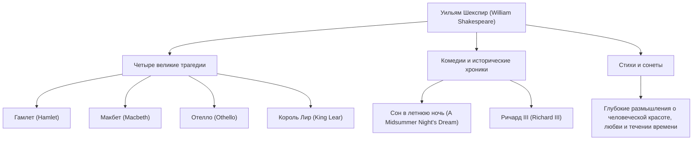

Уильям Шекспир (1564 - 1616) по праву считается величайшим драматургом и поэтом в истории, его часто называют национальным поэтом Англии. Его произведения преодолели барьеры времени и культуры, и спустя более 400 лет они по-прежнему ставятся и читаются во всем мире. Его яркое описание универсальных человеческих эмоций и конфликтов глубоко укоренилось в современной литературе, искусстве и даже в нашем повседневном языке.

## Отъезд из Стратфорда: Таинственная молодость и слава в Лондоне

Шекспир родился в 1564 году в Стратфорд-апон-Эйвоне, городке в центральной Англии. Его отец был перчаточником и видным местным деятелем, который даже занимал пост мэра. Считается, что Шекспир изучал основы латыни и классической литературы в местной грамматической школе, но в университет не поступал. В возрасте 18 лет он женился на Энн Хэтэуэй, у них родилось трое детей. За этим следует период, называемый «Утраченными годами» (Lost Years), когда он исчезает из исторических записей.

Вновь в документах он появляется в 1592 году на театральной сцене Лондона. Выделившись как многообещающий драматург и актер, он преодолел множество трудностей, включая закрытие театров из-за свирепствовавшей в то время чумы, и стал центральным участником театральной труппы «Слуги лорда-камергера» (позже «Слуги короля»). Будучи совладельцем театра, он также добился финансового успеха, создав череду шедевров, которые вошли в историю.

## Заглядывая в бездну человеческого существования: Философия и темы Шекспира

Главная привлекательность Шекспира кроется в его «глубоком понимании человеческой природы». В его произведениях почти нет абсолютно добрых или совершенно злых персонажей. Сложные и противоречивые человеческие эмоции, такие как жажда власти, ревность, любовь, безумие и нерешительность, изображены с крайним реализмом.

Например, в «Гамлете» страх перед действием и экзистенциальная тоска исследуются через знаменитый монолог «Быть или не быть». В «Макбете» изображено крушение человека, одержимого амбициями, а в «Отелло» — трагедия, вызванная ревностью. Вместо того чтобы навязывать моральные уроки, он задавал самой аудитории вопрос о том, «что значит быть человеком», через конфликты своих персонажей.

Приведенная ниже диаграмма иллюстрирует широту его разнообразной творческой деятельности и взаимосвязь его достижений.

## Алхимик слов: Неизмеримое влияние на потомков

Влияние, которое Шекспир оказал на сам английский язык, неизмеримо. Комбинируя существующие слова или создавая совершенно новые, он, как говорят, ввел в английский язык около 1700 новых слов и фраз. Многие выражения, которые до сих пор используются в повседневной жизни, такие как «break the ice» (разбить лед) и «heart of gold» (золотое сердце), берут свое начало из его произведений.

Кроме того, его работы продолжают вдохновлять все культурные сферы, от литературы до психологии, философии, живописи, музыки и кино. Зигмунд Фрейд глубоко изучал персонажей Шекспира при формулировании своих теорий психоанализа, и архетипы многих современных историй можно найти в его пьесах.

## Заключение: Слова, которые живут вечно

В 1616 году жизнь Шекспира оборвалась в его родном городе Стратфорде в возрасте 52 лет. Однако, даже если его физическое тело погибло, слова, которые он сплел, никогда не умирали. Как хвалил его современник драматург Бен Джонсон, говоря, что он «не принадлежит одной эпохе, но принадлежит всем временам», произведения Шекспира — это наследие человечества, которое будет сиять в вечности, пока у людей есть эмоции.
