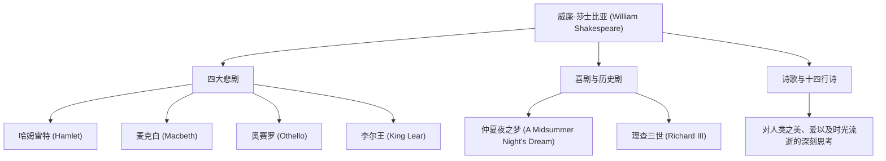

威廉·莎士比亚（William Shakespeare，1564年 - 1616年）被公认为史上最伟大的剧作家、诗人，并被誉为“英国的国民诗人”。他的作品超越了时代与文化的壁垒，在400多年后的今天依然在世界各地上演与传诵。他对人类普遍情感与冲突的生动描绘，深深扎根于现代文学、艺术，甚至我们的日常语言之中。

## 从斯特拉福德启程：充满谜团的早年与在伦敦的辉煌

莎士比亚于1564年出生在英格兰中部的斯特拉福德镇。他的父亲是一位手套皮匠，也是当地的知名人士，曾担任镇长。人们认为莎士比亚在当地的文法学校学习了拉丁语和古典文学的基础知识，但他并未上过大学。18岁时，他与安妮·海瑟薇结婚并育有三个孩子，但在那之后，有一段被称为“失落的岁月”（Lost Years）的时期，他在历史记录中销声匿迹。

他再次出现在记录中是在1592年的伦敦戏剧界。作为一名崭露头角的剧作家和演员，他克服了因当时鼠疫流行导致剧院关闭等重重困难，成为“内务大臣剧团”（后来的“国王剧团”）的核心成员。作为剧院的共同经营者，他在经济上也取得了成功，创作出了一部又一部名垂青史的杰作。

## 凝视人类生存的深渊：莎士比亚的哲学与主题

莎士比亚最大的魅力在于其“对人性的深刻洞察”。在他的作品中，几乎没有绝对的好人或完全的恶人。对权力的欲望、嫉妒、爱情、疯狂、优柔寡断等人类所具有的复杂而矛盾的情感，都被极其真实地描绘出来。

例如，在《哈姆雷特》中，通过“生存还是毁灭”（To be, or not to be）这句著名的独白，探讨了行动的恐惧与存在的苦恼。在《麦克白》中，描绘了被野心控制的人的毁灭；而在《奥赛罗》中，则展现了嫉妒带来的悲剧。他并没有强加道德教训，而是通过剧中人物的冲突，向观众自己发问“什么是人”。

下图展示了他广泛的创作活动及其成就的关联。

## 语言的炼金术士：对后世不可估量的影响

莎士比亚对英语这门语言本身产生的影响是不可估量的。通过组合现有的词汇或创造全新的词语，据说他为英语定型了约1700个新词和短语。许多至今仍在日常使用的表达，如“break the ice”（打破僵局）和“heart of gold”（金子般的心），都源自他的作品。

此外，他的作品不仅限于文学，还持续为心理学、哲学、绘画、音乐乃至电影等各个文化领域提供灵感。西格蒙德·弗洛伊德在构建精神分析理论时深入研究了莎士比亚的人物，许多现代故事的原型（Archetype）也能在他的戏剧中找到。

## 结语：永生的语言

1616年，52岁的莎士比亚在故乡斯特拉福德走到了生命的尽头。然而，即使他的肉体消亡，他所编织的语言却从未死去。正如同时代的剧作家本·琼森赞誉他为“不属于一个时代，而是属于所有时代的人物”，只要人类还有情感，莎士比亚的作品就是一份将永远闪耀的人类遗产。
