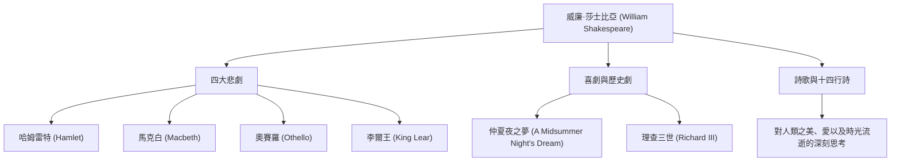

威廉·莎士比亞（William Shakespeare，1564年 - 1616年）被公認為史上最偉大的劇作家、詩人，並被譽為「英國的國民詩人」。他的作品超越了時代與文化的藩籬，在400多年後的今天依然在世界各地上演與傳誦。他對人類普遍情感與衝突的生動描繪，深深紮根於現代文學、藝術，甚至我們的日常語言之中。

## 從斯特拉福啟程：充滿謎團的早年與在倫敦的輝煌

莎士比亞於1564年出生在英格蘭中部的斯特拉福鎮。他的父親是一位手套皮匠，也是當地的知名人士，曾擔任鎮長。人們認為莎士比亞在當地的文法學校學習了拉丁語和古典文學的基礎知識，但他並未上過大學。18歲時，他與安妮·海瑟薇結婚並育有三個孩子，但在那之後，有一段被稱為「失落的歲月」（Lost Years）的時期，他在歷史記錄中銷聲匿跡。

他再次出現在記錄中是在1592年的倫敦戲劇界。作為一名嶄露頭角的劇作家和演員，他克服了因當時鼠疫流行導致劇院關閉等重重困難，成為「內務大臣劇團」（後來的「國王劇團」）的核心成員。作為劇院的共同經營者，他在經濟上也取得了成功，創作出了一部又一部名垂青史的傑作。

## 凝視人類生存的深淵：莎士比亞的哲學與主題

莎士比亞最大的魅力在於其「對人性的深刻洞察」。在他的作品中，幾乎沒有絕對的好人或完全的惡人。對權力的慾望、嫉妒、愛情、瘋狂、優柔寡斷等人類所具有的複雜而矛盾的情感，都被極其真實地描繪出來。

例如，在《哈姆雷特》中，透過「生存還是毀滅」（To be, or not to be）這句著名的獨白，探討了行動的恐懼與存在的苦惱。在《馬克白》中，描繪了被野心控制的人的毀滅；而在《奧賽羅》中，則展現了嫉妒帶來的悲劇。他並沒有強加道德教訓，而是透過劇中人物的衝突，向觀眾自己發問「什麼是人」。

下圖展示了他廣泛的創作活動及其成就的關聯。

## 語言的煉金術士：對後世不可估量的影響

莎士比亞對英語這門語言本身產生的影響是不可估量的。透過組合現有的詞彙或創造全新的詞語，據說他為英語定型了約1700個新詞和短語。許多至今仍在日常使用的表達，如「break the ice」（打破僵局）和「heart of gold」（真金般的心），都源自他的作品。

此外，他的作品不僅限於文學，還持續為心理學、哲學、繪畫、音樂乃至電影等各個文化領域提供靈感。西格蒙德·佛洛伊德在建構精神分析理論時深入研究了莎士比亞的人物，許多現代故事的原型（Archetype）也能在他的戲劇中找到。

## 結語：永生的語言

1616年，52歲的莎士比亞在故鄉斯特拉福走到了生命的盡頭。然而，即使他的肉體消亡，他所編織的語言卻從未死去。正如同時代的劇作家本·瓊森讚譽他為「不屬於一個時代，而是屬於所有時代的人物」，只要人類還有情感，莎士比亞的作品就是一份將永遠閃耀的人類遺產。
