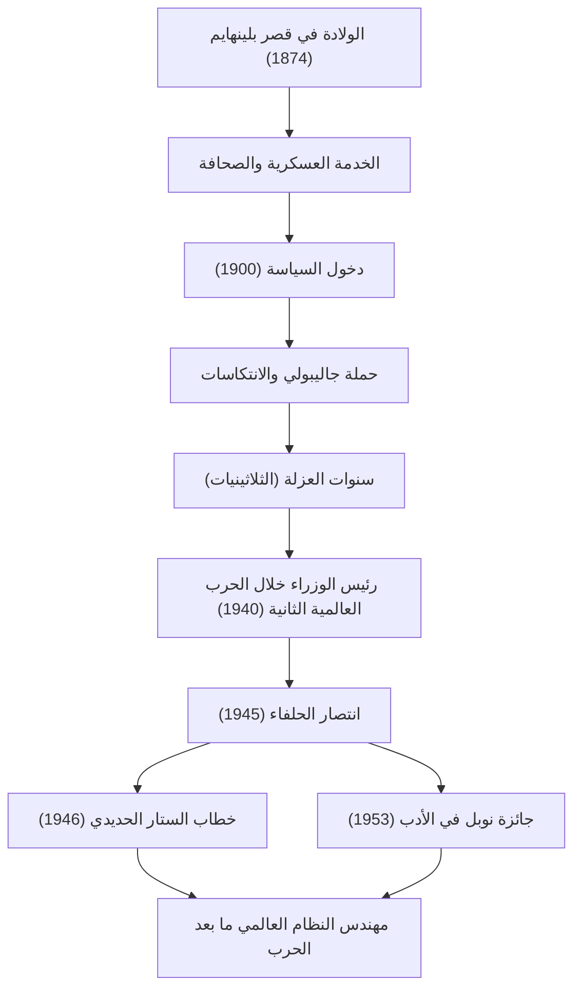

+++
title = "ونستون تشرشل: قيادة لا تُقهر وبصمات في التاريخ"
date = "2026-09-24T16:08:36+09:00"
categories = ["biography"]
tags = ["winston-churchill", "history"]
image = "eyecatch.jpg"
+++

## مقدمة: العملاق الذي حرّك التاريخ

ونستون ليونارد سبنسر تشرشل (1874–1965). عند الحديث عن تاريخ القرن العشرين، لا يمكن إغفال اسم هذا الرجل. في خضم الحرب العالمية الثانية، أعظم أزمة واجهت البشرية، كان هو القائد الذي لا يُقهر والذي قاد بصفته رئيس وزراء المملكة المتحدة بلاده والعالم الحر إلى النصر. وما جعله عظيمًا لم يكن مجرد فطنته السياسية، بل روحه المرنة و"قوة الكلمات" التي لامست قلوب الناس. في هذا المقال، نتعمق في حياة تشرشل المضطربة، وفلسفته الفريدة، وتأثيره المستمر على العالم الحديث.

## سلالة أرستقراطية وبداية من الانتكاسات

في عام 1874، وُلد تشرشل في قصر بلينهايم، المقر العائلي لدوقات مارلبورو المرموقين. على عكس نسبه المجيد، عانى من ضعف الأداء الأكاديمي خلال طفولته ولم يكن بأي حال من الأحوال من النخبة التي توقعها من حوله. ولم يتمكن من اجتياز امتحان الدخول إلى الأكاديمية العسكرية الملكية في ساندهيرست إلا في محاولته الثالثة.

ومع ذلك، يمكن القول إن هذه الانتكاسات المبكرة عززت مثابرته اللاحقة. كجندي، ذهب إلى الخطوط الأمامية في العالم، بما في ذلك كوبا والهند والسودان وحرب البوير في جنوب إفريقيا، بينما كان يكتب في الوقت نفسه تقارير حية كمراسل حربي. هروبه الدرامي من معسكر أسرى الحرب خلال حرب البوير دفعه على الفور إلى البطولة الوطنية. متخذًا ذلك كنقطة انطلاق، تم انتخابه لأول مرة في مجلس العموم عن حزب المحافظين في عام 1900 عن عمر يناهز 26 عامًا. وكان هذا بمثابة فجر مسيرته السياسية الرائعة.

## سنوات العزلة وبعد النظر

على الرغم من أن تشرشل شغل مناصب رئيسية في سن مبكرة، إلا أن حياته السياسية لم تكن سلسة أبدًا. خلال الحرب العالمية الأولى، بصفته لورد الأميرالية الأول، قاد حملة جاليبولي لكنه تعرض لهزيمة قاسية أسفرت عن خسائر فادحة، مما أدى إلى سقوطه. بعد ذلك، أثرت التغييرات المتكررة للحزب والموقف السياسي المتشدد ضده. في الثلاثينيات من القرن الماضي، عاش "سنوات العزلة (The Wilderness Years)"، وهي فترة استمرت قرابة عقد من الزمان تم فيها استبعاده من المناصب الوزارية.

ومع ذلك، ففي فترة العزلة هذه بالذات تجلت قيمته الحقيقية كسياسي. بينما كانت ألمانيا النازية، بقيادة أدولف هتلر، ترتقي إلى السلطة في القارة الأوروبية، تبنت الحكومة البريطانية في ذلك الوقت سياسة الاسترضاء. ومع ذلك، كان تشرشل من أوائل الذين رأوا الخطر. وقف وحيدًا، ومع ذلك دعا بصوت عالٍ ومستمر إلى إعادة التسلح الشامل واتخاذ موقف متشدد ضد النازيين. ورغم أن الكثيرين أدانوه ووصفوه بأنه "دعاة حرب"، إلا أنه عندما أصبحت تحذيراته حقيقة واقعة، أدرك الشعب البريطاني أن تشرشل هو الشخص الوحيد القادر على إنقاذ البلاد.

## الحرب العالمية الثانية: "دم وكدح ودموع وعرق"

في مايو 1940، عندما كان مصير أوروبا معلقًا بخيط رفيع بسبب الهجوم الشرس لألمانيا النازية، تولى تشرشل البالغ من العمر 65 عامًا أخيرًا منصب رئيس الوزراء. وفي خطاب ألقاه أمام مجلس العموم بعد وقت قصير من تشكيل حكومته، أعلن: "ليس لدي ما أقدمه سوى الدم والكدح والدموع والعرق (I have nothing to offer but blood, toil, tears and sweat)". هذه الكلمات شجعت الجمهور البريطاني، الذي كان يغرق في الخوف من الهزيمة.

ضد القوة العسكرية المتفوقة بشكل ساحق للقوات الألمانية، حافظ تشرشل على موقف المقاومة الشاملة. "سنقاتل على الشواطئ، سنقاتل في ميادين الإنزال... لن نستسلم أبدًا (We shall never surrender)". لم تكن خطاباته مجرد خطاب بلاغي؛ كانت السلاح النهائي في وضع يائس. ومن خلال تشكيل "الثلاثة الكبار" مع قادة يتمتعون بشخصيات قوية - الرئيس الأمريكي روزفلت والأمين العام السوفيتي ستالين - قام بتوجيه تحالفات معقدة بمهارة وقاد الحلفاء في النهاية إلى النصر النهائي.

## رسم بياني: رحلة تشرشل وإنجازاته

يوضح الرسم البياني التالي نقاط التحول الرئيسية في حياة تشرشل المضطربة وتسلسل إنجازاته العظيمة.

## خيميائي الكلمات ومؤرخ التاريخ

إن أعظم ميزة تميز تشرشل عن العديد من السياسيين الآخرين هي قدرته الأدبية غير العادية. طوال حياته، استمر في كتابة عدد هائل من المقالات والكتب لكسب لقمة العيش. وعلى وجه الخصوص، يُظهر عمله الضخم "الحرب العالمية الثانية" أنه لم يكن مجرد صانع للتاريخ، بل كان أيضًا راويًا له.

"سيكون التاريخ لطيفًا معي لأنني أنوي كتابته". وكما تقول هذه النكتة الشهيرة، فقد شكل التاريخ من منظوره الخاص. وفي عام 1953، مُنح جائزة نوبل في الأدب - وهو شرف استثنائي لسياسي - تقديرًا لإتقانه الوصف التاريخي وكاتب السير الذاتية، فضلاً عن الخطابة الرائعة في الدفاع عن القيم الإنسانية النبيلة.

## نبي الحرب الباردة والسنوات الأخيرة

في الانتخابات العامة لعام 1945، بعد الانتصار في الحرب مباشرة، مني حزب المحافظين الذي قاده بهزيمة ساحقة غير متوقعة. ومع ذلك، حتى بعد تنحيه، لم يتضاءل نفوذه الدولي. في خطاب عام 1946 في فولتون بولاية ميسوري بالولايات المتحدة، أشار إلى دول أوروبا الشرقية الخاضعة للنفوذ السوفيتي وقال: "من شتيتين في بحر البلطيق إلى ترييستي في البحر الأدرياتيكي، هبط 'ستار حديدي (Iron Curtain)' عبر القارة". أصبحت هذه الكلمات المفهوم المحدد للنظام العالمي الجديد في الحرب الباردة اللاحقة.

وعاد لاحقًا إلى منصب رئيس الوزراء في عام 1951 وتحمل عبء السياسة الوطنية حتى تقاعد لأسباب صحية في عام 1955. وعندما توفي عام 1965 عن عمر يناهز 90 عامًا، ودعته المملكة المتحدة بجنازة رسمية. كانت الجنازة الرسمية لشخص من خارج العائلة المالكة شرفًا استثنائيًا لم نشهده منذ إسحاق نيوتن وهوراشيو نيلسون.

## خاتمة: الفلسفة التي تركها تشرشل للعالم الحديث

لقد جسدت حياة ونستون تشرشل كلماته: "لا تستسلم أبدًا، أبدًا، أبدًا (Never, never, never give up)". على الرغم من تعرضه للعديد من الانتكاسات، والسقوط السياسي، وفترات العزلة، فقد كان ينهض في كل مرة ويعود إلى مركز الصدارة بإرادة أقوى.

كان جوهر قيادته يكمن في قدرته على عدم نسيان روح الدعابة أبدًا حتى على شفا اليأس، وإلهام الأمل والشجاعة في نفوس الناس من خلال قوة الكلمات. في عالم اليوم، حيث تتفشى الأخبار المزيفة وعدم اليقين وتتصاعد الشعبوية، فإن موقف تشرشل - التمسك بمعتقداته، وإخبار الجمهور بالحقائق الصعبة، وتوحيدهم في الوقت نفسه - يطرح علينا بقوة سؤالًا حول ماهية القيادة الحقيقية. البصمات والفلسفة التي تركها وراءه ليست مجرد صفحة في التاريخ؛ بل ستستمر في التألق كضوء ساطع يوجه البشرية لفترة طويلة قادمة.
