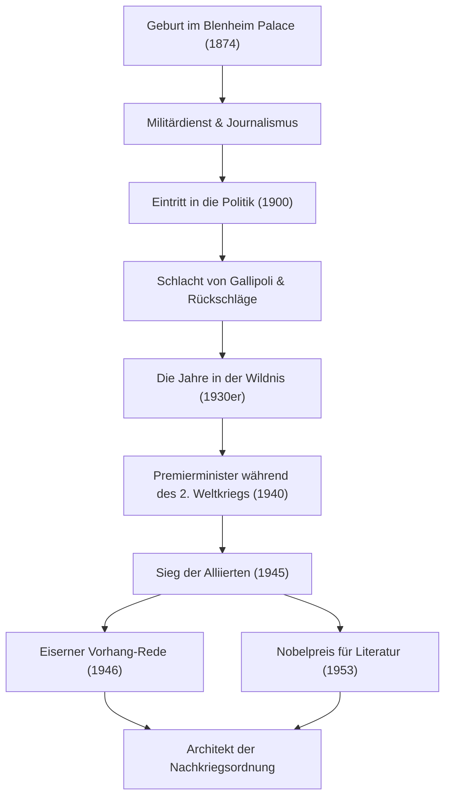

+++
title = "Winston Churchill: Unbezwingbare Führung und Spuren in der Geschichte"
date = "2026-09-24T16:08:36+09:00"
categories = ["biography"]
tags = ["winston-churchill", "history"]
image = "eyecatch.jpg"
+++

## Einleitung: Ein Gigant, der die Geschichte bewegte

Winston Leonard Spencer Churchill (1874–1965). Wenn man über die Geschichte des 20. Jahrhunderts spricht, darf der Name dieses Mannes nicht fehlen. Inmitten des Zweiten Weltkriegs, der größten Krise der Menschheit, war er die unbezwingbare Führungspersönlichkeit, die als Premierminister des Vereinigten Königreichs sein Land und die freie Welt zum Sieg führte. Was ihn groß machte, war nicht nur sein politischer Scharfsinn, sondern auch sein widerstandsfähiger Geist und die „Macht der Worte“, die die Herzen der Menschen bewegten. In diesem Artikel tauchen wir tief in Churchills turbulentes Leben, seine einzigartige Philosophie und seinen nachhaltigen Einfluss auf die moderne Welt ein.

## Aristokratische Blutlinie und ein Beginn von Rückschlägen

Im Jahr 1874 wurde Churchill im Blenheim Palace, dem Stammsitz der angesehenen Herzöge von Marlborough, geboren. Im Gegensatz zu seiner glorreichen Abstammung kämpfte er während seiner Kindheit mit schlechten schulischen Leistungen und war keineswegs die Elite, die von seinem Umfeld erwartet wurde. Er schaffte die Aufnahmeprüfung für die Royal Military College in Sandhurst erst im dritten Anlauf.

Es lässt sich jedoch sagen, dass gerade diese frühen Rückschläge seine spätere Beharrlichkeit förderten. Als Soldat ging er an die Fronten der Welt, darunter Kuba, Indien, Sudan und der Burenkrieg in Südafrika, während er gleichzeitig als Kriegsberichterstatter lebendige Reportagen verfasste. Seine dramatische Flucht aus einem Kriegsgefangenenlager während des Burenkrieges machte ihn sofort zu einem Nationalhelden. Dies nutzte er als Sprungbrett und wurde im Jahr 1900 im Alter von 26 Jahren für die Konservative Partei zum ersten Mal in das Unterhaus gewählt. Dies markierte den Beginn seiner brillanten politischen Karriere.

## Die Jahre in der Wildnis und Weitsicht

Obwohl Churchill in jungen Jahren Schlüsselpositionen innehatte, verlief sein politisches Leben nie reibungslos. Während des Ersten Weltkriegs führte er als Erster Lord der Admiralität die Schlacht von Gallipoli an, erlitt jedoch eine massive Niederlage, die zu enormen Verlusten und seinem Sturz führte. Danach wirkten sich häufige Parteiwechsel und eine harte politische Haltung zu seinen Ungunsten aus. In den 1930er Jahren erlebte er die „Jahre in der Wildnis (The Wilderness Years)“, eine Zeit von fast einem Jahrzehnt, in der er von Kabinettspositionen ausgeschlossen war.

Doch gerade in dieser Zeit der Isolation zeigte sich sein wahrer Wert als Politiker. Als Nazideutschland unter der Führung von Adolf Hitler auf dem europäischen Kontinent aufstieg, verfolgte die damalige britische Regierung eine Beschwichtigungspolitik. Churchill war jedoch einer der Ersten, der die Gefahr erkannte. Er stand allein, forderte aber laut und beharrlich eine umfassende Wiederaufrüstung und eine harte Haltung gegenüber den Nazis. Obwohl ihn viele als „Kriegstreiber“ verurteilten, erkannte das britische Volk, als seine Warnungen Realität wurden, dass Churchill die einzige Person war, die das Land retten konnte.

## Zweiter Weltkrieg: „Blut, Mühsal, Tränen und Schweiß“

Im Mai 1940, als das Schicksal Europas aufgrund des heftigen Angriffs Nazideutschlands am seidenen Faden hing, übernahm der 65-jährige Churchill schließlich das Amt des Premierministers. In einer Rede vor dem Unterhaus kurz nach der Bildung seines Kabinetts erklärte er: „Ich habe nichts zu bieten als Blut, Mühsal, Tränen und Schweiß (I have nothing to offer but blood, toil, tears and sweat).“ Diese Worte elektrisierten die britische Öffentlichkeit, die in der Angst vor einer Niederlage versunken war.

Gegen die militärische Übermacht der deutschen Streitkräfte hielt Churchill an einer Haltung des totalen Widerstands fest. „Wir werden an den Stränden kämpfen, wir werden an den Landeplätzen kämpfen... wir werden uns niemals ergeben (We shall never surrender).“ Seine Reden waren nicht nur bloße Rhetorik; sie waren die ultimative Waffe in einer verzweifelten Situation. Indem er mit Staatsoberhäuptern intensiver Persönlichkeit – US-Präsident Roosevelt und dem sowjetischen Generalsekretär Stalin – die „Großen Drei“ bildete, steuerte er geschickt durch komplexe Allianzen und führte die Alliierten schließlich zum endgültigen Sieg.

## Diagramm: Churchills Lebensweg und Errungenschaften

Das folgende Diagramm veranschaulicht die wichtigsten Wendepunkte in Churchills turbulentem Leben und die Abfolge seiner großen Errungenschaften.

## Alchemist der Worte und Chronist der Geschichte

Das größte Merkmal, das Churchill von vielen anderen Politikern unterscheidet, ist seine außergewöhnliche literarische Fähigkeit. Zeit seines Lebens schrieb er unzählige Artikel und Bücher, um seinen Lebensunterhalt zu verdienen. Insbesondere sein monumentales Werk „Der Zweite Weltkrieg“ zeigt, dass er nicht nur ein Schöpfer von Geschichte war, sondern auch ihr Erzähler.

„Die Geschichte wird mir gnädig sein, denn ich habe vor, sie zu schreiben.“ Wie dieser berühmte Witz besagt, formte er die Geschichte aus seiner eigenen Perspektive. 1953 wurde ihm der Nobelpreis für Literatur verliehen – eine außergewöhnliche Ehre für einen Politiker – in Anerkennung seiner Meisterschaft der historischen und biografischen Beschreibung sowie seiner brillanten Redekunst bei der Verteidigung hoher menschlicher Werte.

## Prophet des Kalten Krieges und späte Jahre

Bei den Unterhauswahlen 1945, unmittelbar nach dem Sieg im Krieg, erlitt die von ihm geführte Konservative Partei eine unerwartete, vernichtende Niederlage. Doch auch nach seinem Rücktritt ließ sein internationaler Einfluss nicht nach. In einer Rede in Fulton, Missouri, USA, im Jahr 1946 wies er auf die osteuropäischen Länder unter sowjetischem Einfluss hin und sagte: „Von Stettin an der Ostsee bis Triest an der Adria ist ein ‚Eiserner Vorhang (Iron Curtain)‘ über den Kontinent niedergegangen.“ Diese Worte wurden zum bestimmenden Konzept für die neue Weltordnung des darauffolgenden Kalten Krieges.

Später kehrte er 1951 in das Amt des Premierministers zurück und trug die Last der nationalen Politik, bis er sich 1955 aus gesundheitlichen Gründen zurückzog. Als er 1965 im Alter von 90 Jahren verstarb, verabschiedete sich das Vereinigte Königreich mit einem Staatsbegräbnis von ihm. Ein Staatsbegräbnis für eine Person außerhalb der königlichen Familie war eine außergewöhnliche Ehre, die es seit Isaac Newton und Horatio Nelson nicht mehr gegeben hatte.

## Fazit: Die Philosophie, die Churchill der modernen Welt hinterließ

Das Leben von Winston Churchill verkörperte seine eigenen Worte: „Niemals, niemals, niemals aufgeben (Never, never, never give up).“ Obwohl er zahlreiche Rückschläge, politische Stürze und Zeiten der Isolation erlebte, stand er jedes Mal wieder auf und kehrte mit noch stärkerem Willen auf die Hauptbühne zurück.

Der Kern seiner Führung lag in seiner Fähigkeit, auch am Rande der Verzweiflung nie seinen Sinn für Humor zu vergessen und den Menschen durch die Macht der Worte Hoffnung und Mut einzuflößen. In der heutigen Welt, in der Fake News und Unsicherheit grassieren und Populismus auf dem Vormarsch ist, stellt uns Churchills Haltung – an seinen Überzeugungen festzuhalten, der Öffentlichkeit harte Wahrheiten auszusprechen und sie dennoch zu vereinen – nachdrücklich die Frage, was wahre Führung ist. Die Spuren und die Philosophie, die er hinterlassen hat, sind nicht nur eine Seite in der Geschichte; sie werden der Menschheit noch lange als Leitstern dienen.
