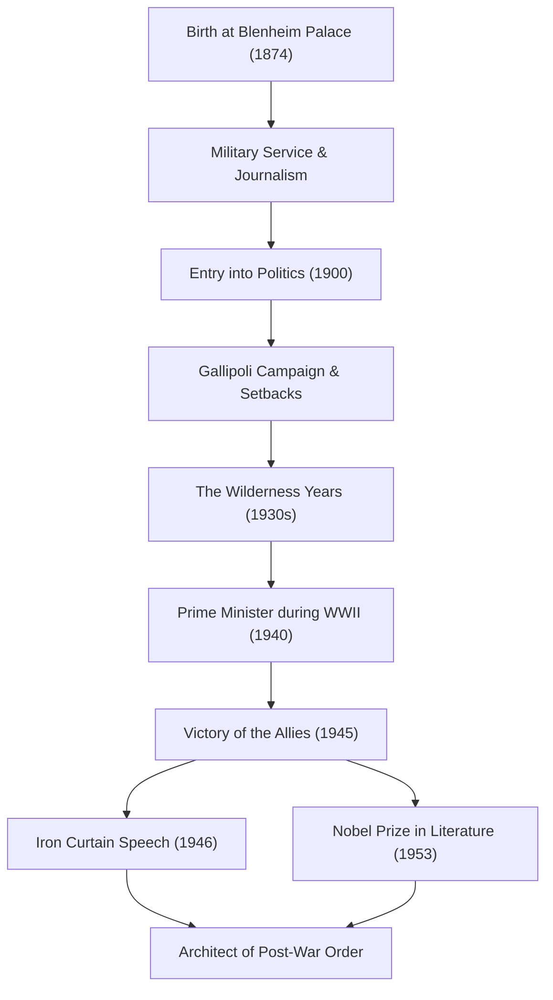

+++
title = "Winston Churchill: Indomitable Leadership and Footprints in History"
date = "2026-09-23T19:46:00+09:00"
categories = ["biography"]
tags = ["winston-churchill", "history"]
image = "eyecatch.jpg"
+++

## Introduction: A Giant Who Moved History

Winston Leonard Spencer Churchill (1874–1965). When speaking of the history of the 20th century, this man's name cannot be omitted. In the midst of World War II, the greatest crisis of humanity, he was the indomitable leader who, as the Prime Minister of the United Kingdom, led his country and the free world to victory. What made him great was not merely his political acumen, but his resilient spirit and the "power of words" that moved people's hearts. In this article, we delve deep into Churchill's turbulent life, his unique philosophy, and his enduring impact on the modern world.

## Aristocratic Bloodline and a Departure from Setbacks

In 1874, Churchill was born at Blenheim Palace, the ancestral seat of the prestigious Dukes of Marlborough. Contrary to his glorious lineage, he struggled with poor academic performance during his childhood and was by no means the elite expected by those around him. He only managed to pass the entrance exam for the Royal Military College, Sandhurst, on his third attempt.

However, it can be said that these early setbacks fostered his later perseverance. As a soldier, he went to the front lines of the world, including Cuba, India, Sudan, and the Boer War in South Africa, while simultaneously writing vivid reportage as a war correspondent. His dramatic escape from a prisoner-of-war camp during the Boer War instantly propelled him to national heroism. Using this as a stepping stone, he was first elected to the House of Commons from the Conservative Party in 1900 at the age of 26. This marked the dawn of his brilliant political career.

## The Wilderness Years and Foresight

Although Churchill held key posts at a young age, his political life was never smooth sailing. During World War I, as First Lord of the Admiralty, he led the Gallipoli Campaign but suffered a massive defeat resulting in tremendous casualties, leading to his downfall. Following this, frequent party switches and a hardline political stance worked against him. In the 1930s, he experienced the "Wilderness Years," a period of nearly a decade where he was excluded from cabinet positions.

Yet, it was precisely during this period of isolation that his true value as a politician shone through. As Nazi Germany, led by Adolf Hitler, rose to power on the European continent, the British government of the time adopted a policy of appeasement. Churchill, however, was among the first to see the danger. He stood alone, yet loudly and persistently advocated for thorough rearmament and a hardline stance against the Nazis. Although many condemned him as a "warmonger," when his warnings became reality, the British people realized that Churchill was the only person capable of saving the country.

## World War II: "Blood, Toil, Tears and Sweat"

In May 1940, when the fate of Europe hung by a thread due to the fierce onslaught of Nazi Germany, the 65-year-old Churchill finally assumed the seat of Prime Minister. In a speech to the House of Commons shortly after forming his cabinet, he declared: "I have nothing to offer but blood, toil, tears and sweat." These words galvanized the British public, who had been sinking in the fear of defeat.

Against the overwhelmingly superior military might of the German forces, Churchill maintained a stance of total resistance. "We shall fight on the beaches, we shall fight on the landing grounds... we shall never surrender." His speeches were not mere rhetoric; they were the ultimate weapon in a desperate situation. Forming the "Big Three" with leaders of intense personalities—US President Roosevelt and Soviet General Secretary Stalin—he skillfully navigated complex alliances and ultimately led the Allies to final victory.

## Diagram: Churchill's Journey and Achievements

The following diagram illustrates the major turning points in Churchill's turbulent life and the sequence of his great achievements.

## Alchemist of Words and Chronicler of History

The greatest characteristic that sets Churchill apart from many other politicians is his extraordinary literary ability. Throughout his life, he continued to write a vast number of articles and books to make a living. In particular, his monumental work, "The Second World War," shows that he was not only a creator of history but also its narrator.

"History will be kind to me for I intend to write it." As this famous joke goes, he shaped history from his own perspective. In 1953, he was awarded the Nobel Prize in Literature—an exceptional honor for a politician—in recognition of his mastery of historical and biographical description as well as for brilliant oratory in defending exalted human values.

## Prophet of the Cold War and Later Years

In the 1945 general election immediately following the victory in the war, the Conservative Party led by him suffered an unexpected, crushing defeat. However, even after stepping down, his international influence did not wane. In a 1946 speech in Fulton, Missouri, USA, he pointed to the Eastern European countries under Soviet influence and said, "From Stettin in the Baltic to Trieste in the Adriatic, an 'Iron Curtain' has descended across the Continent." These words became the defining concept for the new world order of the subsequent Cold War.

He later returned to the post of Prime Minister in 1951 and bore the burden of national politics until he retired for health reasons in 1955. When he passed away in 1965 at the age of 90, the United Kingdom bid him farewell with a state funeral. A state funeral for someone outside the royal family was an exceptional honor not seen since [Isaac Newton](/en/p/newton/) and Horatio Nelson.

## Conclusion: The Philosophy Churchill Left for the Modern World

Winston Churchill's life embodied his own words: "Never, never, never give up." Despite experiencing numerous setbacks, political downfalls, and periods of isolation, he stood up each time and returned to the center stage with an even stronger will.

The core of his leadership lay in his ability to never forget his sense of humor even on the brink of despair, and to inspire people with hope and courage through the power of words. In today's world, where fake news and uncertainty run rampant and populism is on the rise, Churchill's stance—sticking to his beliefs, speaking difficult truths to the public, and yet uniting them—strongly asks us what true leadership is. The footprints and philosophy he left behind are not just a page in history; they will continue to shine as a guiding light for humanity for a long time to come.
