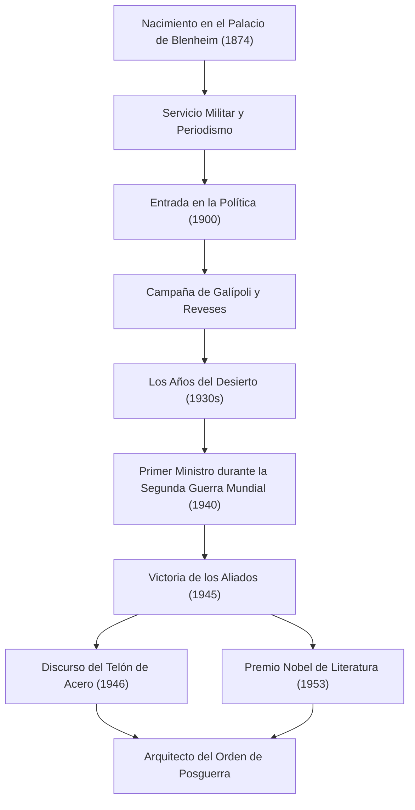

+++
title = "Winston Churchill: Liderazgo Indomable y Huellas en la Historia"
date: "2026-09-24T16:08:36+09:00"
categories = ["biography"]
tags = ["winston-churchill", "history"]
image = "eyecatch.jpg"
+++

## Introducción: Un Gigante que Movió la Historia

Winston Leonard Spencer Churchill (1874–1965). Al hablar de la historia del siglo XX, el nombre de este hombre no puede omitirse. En medio de la Segunda Guerra Mundial, la mayor crisis de la humanidad, fue el líder indomable que, como Primer Ministro del Reino Unido, llevó a su país y al mundo libre a la victoria. Lo que lo hizo grande no fue solo su perspicacia política, sino su espíritu resiliente y el "poder de las palabras" que conmovió los corazones de las personas. En este artículo, profundizamos en la turbulenta vida de Churchill, su filosofía única y su impacto duradero en el mundo moderno.

## Linaje Aristocrático y un Comienzo desde el Fracaso

En 1874, Churchill nació en el Palacio de Blenheim, la sede ancestral de los prestigiosos Duques de Marlborough. Contrariamente a su glorioso linaje, luchó con un bajo rendimiento académico durante su infancia y de ninguna manera era la élite que los que le rodeaban esperaban. Solo logró aprobar el examen de ingreso a la Real Academia Militar de Sandhurst en su tercer intento.

Sin embargo, se puede decir que estos primeros reveses fomentaron su perseverancia posterior. Como soldado, fue a las líneas del frente del mundo, incluyendo Cuba, India, Sudán y la Guerra de los Bóeres en Sudáfrica, mientras escribía vívidos reportajes como corresponsal de guerra. Su dramático escape de un campo de prisioneros de guerra durante la Guerra de los Bóeres lo impulsó instantáneamente al heroísmo nacional. Usando esto como un trampolín, fue elegido por primera vez a la Cámara de los Comunes por el Partido Conservador en 1900 a la edad de 26 años. Esto marcó el amanecer de su brillante carrera política.

## Los Años del Desierto y la Visión de Futuro

Aunque Churchill ocupó puestos clave a una edad temprana, su vida política nunca fue un camino de rosas. Durante la Primera Guerra Mundial, como Primer Lord del Almirantazgo, dirigió la Campaña de Galípoli, pero sufrió una derrota masiva que resultó en tremendas bajas, lo que llevó a su caída. Después de esto, los frecuentes cambios de partido y una postura política de línea dura jugaron en su contra. En la década de 1930, experimentó los "Años del Desierto (The Wilderness Years)", un período de casi una década en el que fue excluido de los puestos del gabinete.

Sin embargo, fue precisamente durante este período de aislamiento cuando brilló su verdadero valor como político. A medida que la Alemania nazi, liderada por Adolf Hitler, subió al poder en el continente europeo, el gobierno británico de la época adoptó una política de apaciguamiento. Churchill, sin embargo, fue uno de los primeros en ver el peligro. Se quedó solo, pero defendió de manera ruidosa y persistente un rearme completo y una postura de línea dura contra los nazis. Aunque muchos lo condenaron como un "belicista", cuando sus advertencias se hicieron realidad, el pueblo británico se dio cuenta de que Churchill era la única persona capaz de salvar al país.

## Segunda Guerra Mundial: "Sangre, Esfuerzo, Lágrimas y Sudor"

En mayo de 1940, cuando el destino de Europa pendía de un hilo debido al feroz ataque de la Alemania nazi, Churchill, de 65 años, finalmente asumió el cargo de Primer Ministro. En un discurso ante la Cámara de los Comunes poco después de formar su gabinete, declaró: "No tengo nada que ofrecer más que sangre, esfuerzo, lágrimas y sudor (I have nothing to offer but blood, toil, tears and sweat)". Estas palabras galvanizaron al público británico, que se había estado hundiendo en el miedo a la derrota.

Frente a la abrumadoramente superior fuerza militar de las fuerzas alemanas, Churchill mantuvo una postura de resistencia total. "Lucharemos en las playas, lucharemos en los campos de aterrizaje... nunca nos rendiremos (We shall never surrender)". Sus discursos no eran mera retórica; eran el arma definitiva en una situación desesperada. Formando los "Tres Grandes" con líderes de personalidades intensas, el presidente estadounidense Roosevelt y el secretario general soviético Stalin, navegó hábilmente por alianzas complejas y finalmente llevó a los Aliados a la victoria final.

## Diagrama: El Viaje y los Logros de Churchill

El siguiente diagrama ilustra los principales puntos de inflexión en la turbulenta vida de Churchill y la secuencia de sus grandes logros.

## Alquimista de las Palabras y Cronista de la Historia

La mayor característica que distingue a Churchill de muchos otros políticos es su extraordinaria habilidad literaria. A lo largo de su vida, continuó escribiendo un gran número de artículos y libros para ganarse la vida. En particular, su obra monumental, "La Segunda Guerra Mundial", muestra que no solo fue un creador de historia, sino también su narrador.

"La historia será amable conmigo porque tengo la intención de escribirla". Como dice esta famosa broma, dio forma a la historia desde su propia perspectiva. En 1953, fue galardonado con el Premio Nobel de Literatura, un honor excepcional para un político, en reconocimiento a su dominio de la descripción histórica y biográfica, así como por su brillante oratoria en la defensa de los elevados valores humanos.

## Profeta de la Guerra Fría y Últimos Años

En las elecciones generales de 1945, inmediatamente después de la victoria en la guerra, el Partido Conservador liderado por él sufrió una derrota aplastante e inesperada. Sin embargo, incluso después de dejar el cargo, su influencia internacional no disminuyó. En un discurso de 1946 en Fulton, Missouri, EE. UU., señaló a los países de Europa del Este bajo la influencia soviética y dijo: "Desde Stettin en el Báltico hasta Trieste en el Adriático, un 'Telón de Acero (Iron Curtain)' ha descendido a través del continente". Estas palabras se convirtieron en el concepto definitorio para el nuevo orden mundial de la posterior Guerra Fría.

Más tarde regresó al cargo de Primer Ministro en 1951 y asumió la carga de la política nacional hasta que se retiró por razones de salud en 1955. Cuando falleció en 1965 a la edad de 90 años, el Reino Unido le despidió con un funeral de estado. Un funeral de estado para alguien fuera de la familia real fue un honor excepcional que no se veía desde Isaac Newton y Horatio Nelson.

## Conclusión: La Filosofía que Churchill Dejó para el Mundo Moderno

La vida de Winston Churchill encarnó sus propias palabras: "Nunca, nunca, nunca te rindas (Never, never, never give up)". A pesar de experimentar numerosos reveses, caídas políticas y períodos de aislamiento, se levantó cada vez y regresó al centro del escenario con una voluntad aún más fuerte.

El núcleo de su liderazgo radicaba en su capacidad de no olvidar nunca su sentido del humor, incluso al borde de la desesperación, y de inspirar a las personas con esperanza y coraje a través del poder de las palabras. En el mundo actual, donde las noticias falsas y la incertidumbre proliferan y el populismo está en aumento, la postura de Churchill: apegarse a sus creencias, decir verdades difíciles al público y, sin embargo, unirlos, nos pregunta fuertemente qué es el verdadero liderazgo. Las huellas y la filosofía que dejó no son solo una página en la historia; continuarán brillando como una luz guía para la humanidad durante mucho tiempo.
