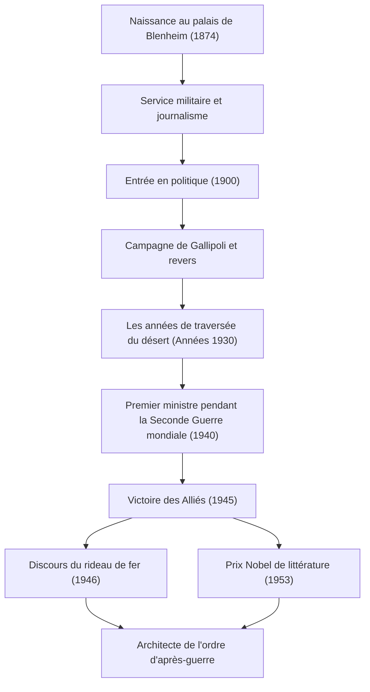

+++
title = "Winston Churchill : Un leadership indomptable et une empreinte dans l'histoire"
date = "2026-09-24T16:08:36+09:00"
categories = ["biography"]
tags = ["winston-churchill", "history"]
image = "eyecatch.jpg"
+++

## Introduction : Un géant qui a fait bouger l'histoire

Winston Leonard Spencer Churchill (1874–1965). Lorsqu'on parle de l'histoire du 20e siècle, le nom de cet homme ne peut être omis. Au milieu de la Seconde Guerre mondiale, la plus grande crise de l'humanité, il fut le leader indomptable qui, en tant que Premier ministre du Royaume-Uni, conduisit son pays et le monde libre à la victoire. Ce qui a fait sa grandeur n'est pas seulement sa perspicacité politique, mais aussi son esprit résilient et le « pouvoir des mots » qui ont ému le cœur des gens. Dans cet article, nous plongeons au cœur de la vie mouvementée de Churchill, de sa philosophie unique et de son impact durable sur le monde moderne.

## Lignée aristocratique et un départ marqué par les échecs

En 1874, Churchill est né au palais de Blenheim, le siège ancestral des prestigieux ducs de Marlborough. Contrairement à sa glorieuse lignée, il a lutté contre de mauvaises performances scolaires pendant son enfance et n'était en aucun cas l'élite attendue par son entourage. Il n'a réussi à passer l'examen d'entrée à l'Académie royale militaire de Sandhurst qu'à sa troisième tentative.

Cependant, on peut dire que ces premiers revers ont favorisé sa persévérance ultérieure. En tant que soldat, il s'est rendu sur les lignes de front du monde entier, y compris à Cuba, en Inde, au Soudan et à la guerre des Boers en Afrique du Sud, tout en rédigeant simultanément des reportages vivants en tant que correspondant de guerre. Son évasion dramatique d'un camp de prisonniers de guerre pendant la guerre des Boers l'a instantanément propulsé au rang de héros national. Utilisant cela comme tremplin, il fut élu pour la première fois à la Chambre des communes pour le Parti conservateur en 1900, à l'âge de 26 ans. Cela marqua l'aube de sa brillante carrière politique.

## Les années de traversée du désert et la clairvoyance

Bien que Churchill ait occupé des postes clés à un jeune âge, sa vie politique n'a jamais été un long fleuve tranquille. Au cours de la Première Guerre mondiale, en tant que Premier Lord de l'Amirauté, il a dirigé la campagne de Gallipoli, mais a subi une défaite massive entraînant d'énormes pertes, ce qui a conduit à sa chute. Par la suite, de fréquents changements de parti et une position politique intransigeante ont joué en sa défaveur. Dans les années 1930, il a connu les « années de traversée du désert (The Wilderness Years) », une période de près d'une décennie au cours de laquelle il a été exclu des postes du cabinet.

Pourtant, c'est précisément au cours de cette période d'isolement que sa véritable valeur en tant qu'homme politique s'est révélée. Alors que l'Allemagne nazie, dirigée par Adolf Hitler, montait en puissance sur le continent européen, le gouvernement britannique de l'époque a adopté une politique d'apaisement. Churchill, cependant, fut parmi les premiers à voir le danger. Il est resté seul, mais a plaidé haut et fort et avec persistance pour un réarmement complet et une position ferme contre les nazis. Bien que beaucoup l'aient condamné comme un « belliciste », lorsque ses avertissements sont devenus réalité, le peuple britannique a réalisé que Churchill était la seule personne capable de sauver le pays.

## Seconde Guerre mondiale : « Du sang, du labeur, des larmes et de la sueur »

En mai 1940, alors que le sort de l'Europe ne tenait qu'à un fil en raison de l'assaut féroce de l'Allemagne nazie, Churchill, âgé de 65 ans, assuma enfin le poste de Premier ministre. Dans un discours à la Chambre des communes peu après la formation de son cabinet, il déclara : « Je n'ai rien d'autre à offrir que du sang, du labeur, des larmes et de la sueur (I have nothing to offer but blood, toil, tears and sweat). » Ces mots ont galvanisé le public britannique, qui sombrait dans la peur de la défaite.

Face à la puissance militaire écrasante des forces allemandes, Churchill a maintenu une position de résistance totale. « Nous nous battrons sur les plages, nous nous battrons sur les terrains de débarquement... nous ne nous rendrons jamais (We shall never surrender). » Ses discours n'étaient pas de la simple rhétorique ; ils étaient l'arme ultime dans une situation désespérée. Formant les « Trois Grands » avec des dirigeants aux personnalités intenses — le président américain Roosevelt et le secrétaire général soviétique Staline —, il a habilement navigué dans des alliances complexes et a finalement conduit les Alliés à la victoire finale.

## Diagramme : Le parcours et les réalisations de Churchill

Le diagramme suivant illustre les principaux tournants de la vie mouvementée de Churchill et la séquence de ses grandes réalisations.

## Alchimiste des mots et chroniqueur de l'histoire

La plus grande caractéristique qui distingue Churchill de nombreux autres politiciens est son extraordinaire capacité littéraire. Tout au long de sa vie, il a continué à écrire un grand nombre d'articles et de livres pour gagner sa vie. En particulier, son œuvre monumentale, « La Seconde Guerre mondiale », montre qu'il n'était pas seulement un créateur de l'histoire, mais aussi son narrateur.

« L'histoire sera indulgente avec moi, car j'ai l'intention de l'écrire. » Comme le dit cette célèbre plaisanterie, il a façonné l'histoire de son propre point de vue. En 1953, il a reçu le prix Nobel de littérature — un honneur exceptionnel pour un homme politique — en reconnaissance de sa maîtrise de la description historique et biographique, ainsi que de sa brillante oratoire pour la défense des hautes valeurs humaines.

## Prophète de la guerre froide et dernières années

Lors des élections générales de 1945, immédiatement après la victoire de la guerre, le Parti conservateur qu'il dirigeait a subi une défaite cuisante et inattendue. Cependant, même après avoir quitté ses fonctions, son influence internationale n'a pas faibli. Dans un discours prononcé en 1946 à Fulton, Missouri (États-Unis), il a désigné les pays d'Europe de l'Est sous influence soviétique et a déclaré : « De Stettin dans la Baltique à Trieste dans l'Adriatique, un 'rideau de fer (Iron Curtain)' est descendu à travers le continent. » Ces mots sont devenus le concept déterminant du nouvel ordre mondial de la guerre froide qui a suivi.

Il est ensuite revenu au poste de Premier ministre en 1951 et a assumé le fardeau de la politique nationale jusqu'à ce qu'il se retire pour des raisons de santé en 1955. Lorsqu'il est décédé en 1965 à l'âge de 90 ans, le Royaume-Uni lui a fait ses adieux lors de funérailles nationales. Des funérailles nationales pour une personne extérieure à la famille royale étaient un honneur exceptionnel qui n'avait pas été vu depuis Isaac Newton et Horatio Nelson.

## Conclusion : La philosophie que Churchill a laissée au monde moderne

La vie de Winston Churchill a incarné ses propres mots : « Ne cédez jamais, jamais, jamais (Never, never, never give up). » Malgré de nombreux revers, des chutes politiques et des périodes d'isolement, il s'est relevé à chaque fois et est revenu sur le devant de la scène avec une volonté encore plus forte.

Le cœur de son leadership résidait dans sa capacité à ne jamais oublier son sens de l'humour, même au bord du désespoir, et à inspirer l'espoir et le courage aux gens par le pouvoir des mots. Dans le monde d'aujourd'hui, où les fausses nouvelles et l'incertitude sévissent et où le populisme est en hausse, la position de Churchill — rester fidèle à ses convictions, dire des vérités difficiles au public, et pourtant les unir — nous demande fortement ce qu'est le véritable leadership. Les empreintes et la philosophie qu'il a laissées derrière lui ne sont pas seulement une page de l'histoire ; elles continueront de briller comme une lumière directrice pour l'humanité pendant longtemps encore.
