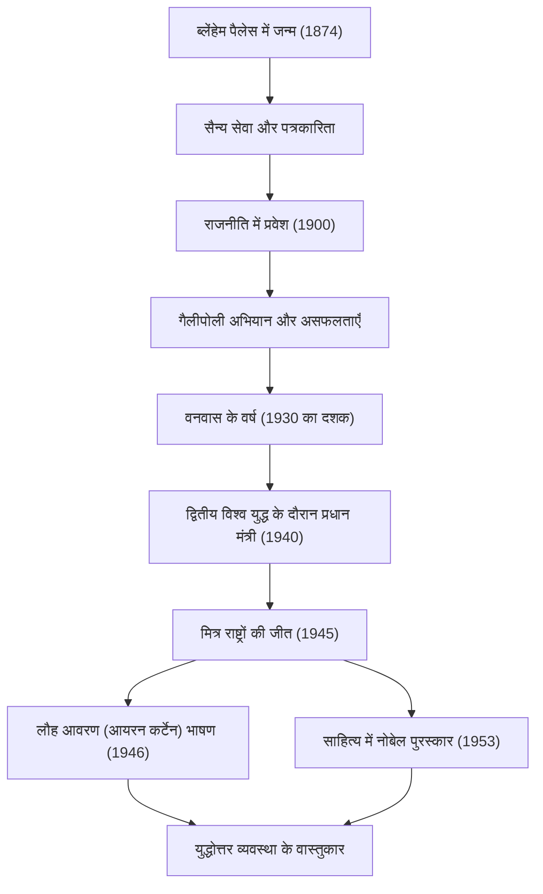

+++
title = "विंस्टन चर्चिल: अदम्य नेतृत्व और इतिहास में पदचिह्न"
date = "2026-09-23T19:46:00+09:00"
categories = ["biography"]
tags = ["winston-churchill", "history"]
image = "eyecatch.jpg"
+++

## परिचय: एक दिग्गज जिसने इतिहास को बदल दिया

विंस्टन लियोनार्ड स्पेंसर चर्चिल (1874-1965)। 20वीं सदी के इतिहास की बात करते समय इस व्यक्ति का नाम नहीं छोड़ा जा सकता। द्वितीय विश्व युद्ध के बीच, जो मानवता का सबसे बड़ा संकट था, वह एक अदम्य नेता थे जिन्होंने यूनाइटेड किंगडम के प्रधान मंत्री के रूप में अपने देश और स्वतंत्र विश्व को जीत दिलाई। उन्हें जो महान बनाता है, वह केवल उनकी राजनीतिक कुशाग्रता नहीं थी, बल्कि उनकी लचीली भावना और "शब्दों की शक्ति" थी जिसने लोगों के दिलों को झकझोर दिया। इस लेख में, हम चर्चिल के उतार-चढ़ाव वाले जीवन, उनके अद्वितीय दर्शन और आधुनिक दुनिया पर उनके स्थायी प्रभाव की गहराई से पड़ताल करते हैं।

## कुलीन रक्तरेखा और असफलताओं से शुरुआत

1874 में, चर्चिल का जन्म ब्लेंहेम पैलेस में हुआ था, जो प्रतिष्ठित मार्लबोरो के ड्यूक का पुश्तैनी घर था। अपने शानदार वंश के विपरीत, उन्होंने अपने बचपन के दौरान खराब शैक्षणिक प्रदर्शन के साथ संघर्ष किया और वह किसी भी तरह से वह कुलीन वर्ग नहीं थे जिसकी उनके आस-पास के लोग उम्मीद करते थे। उन्होंने अपने तीसरे प्रयास में सैंडहर्स्ट रॉयल मिलिट्री कॉलेज के लिए प्रवेश परीक्षा पास की।

हालाँकि, यह कहा जा सकता है कि इन शुरुआती असफलताओं ने ही उनकी बाद की दृढ़ता को बढ़ावा दिया। एक सैनिक के रूप में, वे क्यूबा, ​​भारत, सूडान और दक्षिण अफ्रीका में बोअर युद्ध सहित दुनिया के अग्रिम मोर्चों पर गए, साथ ही एक युद्ध संवाददाता के रूप में ज्वलंत रिपोर्टिंग भी लिखी। बोअर युद्ध के दौरान युद्धबंदी शिविर से उनके नाटकीय रूप से भागने ने उन्हें तुरंत राष्ट्रीय नायक बना दिया। इसे एक सीढ़ी के रूप में इस्तेमाल करते हुए, वे 1900 में 26 साल की उम्र में पहली बार कंजर्वेटिव पार्टी से हाउस ऑफ कॉमन्स के लिए चुने गए। इसने उनके शानदार राजनीतिक करियर की शुरुआत को चिह्नित किया।

## वनवास के वर्ष और दूरदर्शिता

यद्यपि चर्चिल ने कम उम्र में प्रमुख पदों को संभाला, लेकिन उनका राजनीतिक जीवन कभी भी आसान नहीं था। प्रथम विश्व युद्ध के दौरान, एडमिरल्टी के प्रथम लॉर्ड के रूप में, उन्होंने गैलीपोली अभियान का नेतृत्व किया, लेकिन उन्हें भारी हार का सामना करना पड़ा, जिसके परिणामस्वरूप भारी हताहत हुए, जिससे उनका पतन हुआ। इसके बाद, बार-बार पार्टी बदलने और कठोर राजनीतिक रुख ने उनके खिलाफ काम किया। 1930 के दशक में, उन्होंने "वनवास के वर्ष (The Wilderness Years)" का अनुभव किया, लगभग एक दशक की अवधि जहां उन्हें कैबिनेट पदों से बाहर रखा गया था।

फिर भी, ठीक इसी अलगाव की अवधि के दौरान एक राजनेता के रूप में उनका वास्तविक मूल्य सामने आया। जब एडॉल्फ हिटलर के नेतृत्व में नाजी जर्मनी यूरोपीय महाद्वीप पर सत्ता में आया, तो उस समय की ब्रिटिश सरकार ने तुष्टीकरण की नीति अपनाई। हालाँकि, चर्चिल उन लोगों में से थे जिन्होंने सबसे पहले खतरे को देखा था। वे अकेले खड़े थे, लेकिन जोरदार और लगातार तरीके से पूर्ण पुन: शस्त्रीकरण और नाजियों के खिलाफ कठोर रुख की वकालत की। हालाँकि कई लोगों ने उन्हें "युद्ध भड़काने वाला" कहकर निंदा की, लेकिन जब उनकी चेतावनियाँ सच हुईं, तो ब्रिटिश लोगों को एहसास हुआ कि देश को बचाने में सक्षम एकमात्र व्यक्ति चर्चिल ही हैं।

## द्वितीय विश्व युद्ध: "खून, कड़ी मेहनत, आँसू और पसीना"

मई 1940 में, जब नाजी जर्मनी के भयंकर हमले के कारण यूरोप का भाग्य अधर में लटका हुआ था, 65 वर्षीय चर्चिल ने अंततः प्रधान मंत्री का पद संभाला। अपने मंत्रिमंडल के गठन के तुरंत बाद हाउस ऑफ कॉमन्स में एक भाषण में, उन्होंने घोषणा की: "मेरे पास देने के लिए खून, कड़ी मेहनत, आँसू और पसीने के अलावा कुछ नहीं है (I have nothing to offer but blood, toil, tears and sweat)।" इन शब्दों ने ब्रिटिश जनता को प्रेरित किया, जो हार के डर में डूब रही थी।

जर्मन सेना की भारी श्रेष्ठ सैन्य शक्ति के खिलाफ, चर्चिल ने पूर्ण प्रतिरोध का रुख बनाए रखा। "हम समुद्र तटों पर लड़ेंगे, हम लैंडिंग मैदानों पर लड़ेंगे... हम कभी आत्मसमर्पण नहीं करेंगे (We shall never surrender)।" उनके भाषण मात्र बयानबाजी नहीं थे; वे एक हताश स्थिति में अंतिम हथियार थे। तीव्र व्यक्तित्व वाले नेताओं - अमेरिकी राष्ट्रपति रूजवेल्ट और सोवियत महासचिव स्टालिन - के साथ "द बिग थ्री" बनाते हुए, उन्होंने जटिल गठबंधनों को कुशलता से नेविगेट किया और अंततः मित्र राष्ट्रों को अंतिम जीत दिलाई।

## आरेख: चर्चिल की यात्रा और उपलब्धियां

निम्नलिखित आरेख चर्चिल के उतार-चढ़ाव वाले जीवन के प्रमुख मोड़ और उनकी महान उपलब्धियों के अनुक्रम को दर्शाता है।

## शब्दों के कीमियागर और इतिहास के इतिहासकार

चर्चिल को कई अन्य राजनेताओं से अलग करने वाली सबसे बड़ी विशेषता उनकी असाधारण साहित्यिक क्षमता है। जीवन भर, वे जीवन यापन के लिए बड़ी संख्या में लेख और किताबें लिखते रहे। विशेष रूप से, उनका स्मारकीय काम, "द सेकंड वर्ल्ड वॉर", दर्शाता है कि वे न केवल इतिहास के निर्माता थे बल्कि इसके कथाकार भी थे।

"इतिहास मेरे प्रति दयालु होगा क्योंकि मैं इसे लिखने का इरादा रखता हूं।" जैसा कि यह प्रसिद्ध चुटकुला है, उन्होंने अपने दृष्टिकोण से इतिहास को आकार दिया। 1953 में, उन्हें ऐतिहासिक और जीवनी वर्णन की महारत के साथ-साथ उच्च मानवीय मूल्यों की रक्षा में शानदार भाषण के लिए राजनीतिज्ञ के लिए एक असाधारण सम्मान, साहित्य का नोबेल पुरस्कार प्रदान किया गया।

## शीत युद्ध के पैगंबर और अंतिम वर्ष

युद्ध में जीत के तुरंत बाद 1945 के आम चुनाव में, उनके नेतृत्व वाली कंजर्वेटिव पार्टी को अप्रत्याशित, करारी हार का सामना करना पड़ा। हालाँकि, पद छोड़ने के बाद भी, उनका अंतर्राष्ट्रीय प्रभाव कम नहीं हुआ। 1946 में फुल्टन, मिसौरी, संयुक्त राज्य अमेरिका में एक भाषण में, उन्होंने सोवियत प्रभाव वाले पूर्वी यूरोपीय देशों की ओर इशारा करते हुए कहा, "बाल्टिक में स्टेटिन से लेकर एड्रियाटिक में ट्राइस्टे तक, पूरे महाद्वीप में एक 'लौह आवरण (Iron Curtain)' गिर गया है।" ये शब्द बाद के शीत युद्ध की नई विश्व व्यवस्था के लिए परिभाषित अवधारणा बन गए।

बाद में वे 1951 में प्रधान मंत्री के पद पर लौट आए और 1955 में स्वास्थ्य कारणों से सेवानिवृत्त होने तक राष्ट्रीय राजनीति का बोझ उठाया। जब 1965 में 90 वर्ष की आयु में उनका निधन हो गया, तो यूनाइटेड किंगडम ने राजकीय सम्मान के साथ उन्हें विदाई दी। शाही परिवार के बाहर किसी व्यक्ति के लिए राजकीय अंतिम संस्कार एक असाधारण सम्मान था जो [आइजैक न्यूटन](/hi/p/newton/) और होरेशियो नेल्सन के बाद से नहीं देखा गया था।

## निष्कर्ष: आधुनिक दुनिया के लिए चर्चिल का दर्शन

विंस्टन चर्चिल का जीवन उनके स्वयं के शब्दों का प्रतीक था: "कभी भी, कभी भी, कभी भी हार मत मानो (Never, never, never give up)।" कई असफलताओं, राजनीतिक पतन और अलगाव की अवधि का अनुभव करने के बावजूद, वे हर बार खड़े हुए और और भी मजबूत इच्छाशक्ति के साथ मंच पर वापस आए।

उनके नेतृत्व का मूल इस क्षमता में निहित था कि वे निराशा के कगार पर भी हास्य की भावना को कभी नहीं भूलते थे, और शब्दों की शक्ति के माध्यम से लोगों में आशा और साहस को प्रेरित करते थे। आज की दुनिया में, जहाँ फर्जी खबरें और अनिश्चितता व्याप्त है और लोकलुभावनवाद बढ़ रहा है, चर्चिल का रुख- अपने विश्वासों पर टिके रहना, जनता को कठिन सच्चाई बताना, और फिर भी उन्हें एकजुट करना- हमसे दृढ़ता से पूछता है कि सच्चा नेतृत्व क्या है। उनके द्वारा छोड़े गए पदचिह्न और दर्शन इतिहास का सिर्फ एक पन्ना नहीं हैं; वे लंबे समय तक मानवता के लिए मार्गदर्शक प्रकाश के रूप में चमकते रहेंगे।
