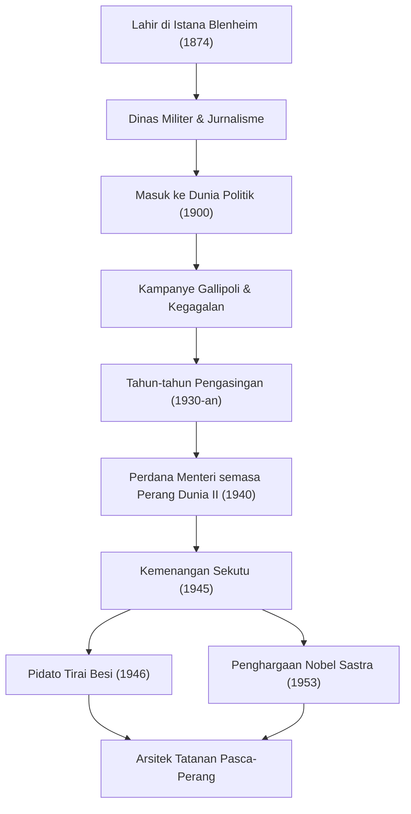

+++
title = "Winston Churchill: Kepemimpinan yang Tak Tergoyahkan dan Jejak dalam Sejarah"
date = "2026-09-24T16:08:36+09:00"
categories = ["biography"]
tags = ["winston-churchill", "history"]
image = "eyecatch.jpg"
+++

## Pendahuluan: Raksasa yang Menggerakkan Sejarah

Winston Leonard Spencer Churchill (1874–1965). Berbicara tentang sejarah abad ke-20, nama pria ini tidak bisa dilewatkan. Di tengah Perang Dunia II, krisis terbesar umat manusia, ia adalah pemimpin tak tergoyahkan yang, sebagai Perdana Menteri Inggris, memimpin negaranya dan dunia bebas menuju kemenangan. Yang membuatnya hebat bukan sekadar ketajaman politiknya, melainkan semangat pantang menyerah dan "kekuatan kata-kata" yang menggerakkan hati banyak orang. Dalam artikel ini, kita akan menggali lebih dalam kehidupan Churchill yang penuh gejolak, filosofinya yang unik, dan dampak abadinya terhadap dunia modern.

## Garis Keturunan Bangsawan dan Titik Tolak dari Kegagalan

Pada tahun 1874, Churchill lahir di Istana Blenheim, kediaman leluhur Duke of Marlborough yang bergengsi. Bertolak belakang dengan silsilahnya yang gemilang, ia berjuang dengan prestasi akademik yang buruk selama masa kecilnya dan sama sekali bukan elit yang diharapkan oleh orang-orang di sekitarnya. Ia baru berhasil lulus ujian masuk Royal Military College, Sandhurst, pada percobaan ketiga.

Akan tetapi, bisa dikatakan bahwa kegagalan-kegagalan awal inilah yang menumbuhkan kegigihannya di kemudian hari. Sebagai seorang tentara, ia pergi ke garis depan dunia, termasuk Kuba, India, Sudan, dan Perang Boer di Afrika Selatan, sembari menulis liputan yang hidup sebagai koresponden perang. Pelariannya yang dramatis dari kamp tawanan perang selama Perang Boer langsung menjadikannya pahlawan nasional. Menggunakan hal ini sebagai batu loncatan, ia pertama kali terpilih menjadi anggota House of Commons dari Partai Konservatif pada tahun 1900 pada usia 26 tahun. Ini menandai awal karier politiknya yang cemerlang.

## Tahun-tahun Pengasingan dan Pandangan Jauh ke Depan

Meskipun Churchill memegang jabatan-jabatan penting di usia muda, kehidupan politiknya tidak pernah mulus. Selama Perang Dunia I, sebagai First Lord of the Admiralty, ia memimpin Kampanye Gallipoli tetapi menderita kekalahan telak yang mengakibatkan jatuhnya banyak korban, yang berujung pada kejatuhannya. Setelah itu, perpindahan partai yang sering dan sikap politik garis keras berdampak buruk baginya. Pada tahun 1930-an, ia mengalami "Tahun-tahun Pengasingan (The Wilderness Years)", suatu periode hampir satu dekade di mana ia dikucilkan dari jabatan kabinet.

Namun, justru selama masa isolasi inilah nilai sejatinya sebagai politikus bersinar. Ketika Jerman Nazi, yang dipimpin oleh Adolf Hitler, bangkit berkuasa di benua Eropa, pemerintah Inggris saat itu mengadopsi kebijakan peredaan (appeasement). Namun, Churchill termasuk yang pertama melihat bahayanya. Ia berdiri sendiri, namun dengan lantang dan gigih mengadvokasi persenjataan kembali yang menyeluruh dan sikap keras terhadap Nazi. Walaupun banyak yang mengecamnya sebagai "penghasut perang", ketika peringatannya menjadi kenyataan, rakyat Inggris menyadari bahwa Churchill adalah satu-satunya orang yang mampu menyelamatkan negara.

## Perang Dunia II: "Darah, Keringat, Air Mata, dan Kerja Keras"

Pada bulan Mei 1940, ketika nasib Eropa berada di ujung tanduk akibat serangan brutal Jerman Nazi, Churchill yang berusia 65 tahun akhirnya mengambil alih kursi Perdana Menteri. Dalam pidatonya di House of Commons tak lama setelah membentuk kabinetnya, ia menyatakan: "Saya tidak memiliki apa-apa untuk ditawarkan selain darah, kerja keras, air mata, dan keringat (I have nothing to offer but blood, toil, tears and sweat)." Kata-kata ini membangkitkan semangat rakyat Inggris, yang tadinya tenggelam dalam ketakutan akan kekalahan.

Melawan kekuatan militer pasukan Jerman yang jauh lebih unggul, Churchill mempertahankan sikap perlawanan total. "Kita akan bertempur di pantai, kita akan bertempur di tempat pendaratan... kita tidak akan pernah menyerah (We shall never surrender)." Pidato-pidatonya bukanlah retorika belaka; itu adalah senjata pamungkas dalam situasi yang putus asa. Membentuk "Tiga Besar" bersama para pemimpin dengan kepribadian yang kuat—Presiden AS Roosevelt dan Sekretaris Jenderal Soviet Stalin—ia dengan terampil menavigasi aliansi yang kompleks dan pada akhirnya memimpin Sekutu menuju kemenangan akhir.

## Diagram: Perjalanan dan Pencapaian Churchill

Diagram berikut mengilustrasikan titik-titik balik utama dalam kehidupan Churchill yang penuh liku-liku dan rangkaian pencapaian besarnya.

## Alkemis Kata-Kata dan Pencatat Sejarah

Karakteristik terbesar yang membedakan Churchill dari banyak politisi lainnya adalah kemampuan sastranya yang luar biasa. Sepanjang hidupnya, ia terus menulis sejumlah besar artikel dan buku untuk mencari nafkah. Secara khusus, karya monumentalnya, "The Second World War", menunjukkan bahwa ia bukan hanya pencipta sejarah, tetapi juga penceritanya.

"Sejarah akan berbaik hati kepadaku karena aku bermaksud menulisnya." Seperti lelucon terkenal ini, ia membentuk sejarah dari sudut pandangnya sendiri. Pada tahun 1953, ia dianugerahi Penghargaan Nobel Sastra—sebuah kehormatan luar biasa bagi seorang politisi—sebagai pengakuan atas penguasaannya terhadap deskripsi sejarah dan biografi, serta pidatonya yang cemerlang dalam membela nilai-nilai kemanusiaan yang luhur.

## Nabi Perang Dingin dan Tahun-tahun Terakhir

Dalam pemilihan umum tahun 1945 segera setelah kemenangan dalam perang, Partai Konservatif yang dipimpinnya menderita kekalahan telak yang tak terduga. Akan tetapi, bahkan setelah turun dari jabatannya, pengaruh internasionalnya tidak memudar. Dalam pidato tahun 1946 di Fulton, Missouri, AS, ia menunjuk negara-negara Eropa Timur di bawah pengaruh Soviet dan berkata, "Dari Stettin di Baltik hingga Trieste di Adriatik, sebuah 'Tirai Besi (Iron Curtain)' telah turun membentang di Benua ini." Kata-kata ini menjadi konsep penentu bagi tatanan dunia baru dalam Perang Dingin berikutnya.

Ia kemudian kembali ke jabatan Perdana Menteri pada tahun 1951 dan memikul beban politik nasional hingga ia pensiun karena alasan kesehatan pada tahun 1955. Ketika ia meninggal dunia pada tahun 1965 pada usia 90 tahun, Inggris melepas kepergiannya dengan pemakaman kenegaraan. Pemakaman kenegaraan bagi seseorang di luar keluarga kerajaan adalah kehormatan luar biasa yang belum pernah terlihat lagi sejak Isaac Newton dan Horatio Nelson.

## Kesimpulan: Filosofi yang Ditinggalkan Churchill untuk Dunia Modern

Kehidupan Winston Churchill mewujudkan kata-katanya sendiri: "Jangan pernah, jangan pernah, jangan pernah menyerah (Never, never, never give up)." Meskipun mengalami banyak kegagalan, kejatuhan politik, dan masa-masa pengucilan, ia bangkit setiap saat dan kembali ke panggung utama dengan tekad yang lebih kuat.

Inti dari kepemimpinannya terletak pada kemampuannya untuk tidak pernah melupakan selera humornya bahkan di ambang keputusasaan, dan untuk menginspirasi harapan dan keberanian pada orang-orang melalui kekuatan kata-kata. Di dunia saat ini, di mana berita palsu dan ketidakpastian merajalela serta populisme sedang meningkat, sikap Churchill—berpegang teguh pada keyakinannya, menyampaikan kebenaran pahit kepada publik, dan menyatukan mereka—dengan kuat menanyakan kepada kita apa arti kepemimpinan sejati. Jejak langkah dan filosofi yang ditinggalkannya bukan hanya sebuah halaman dalam sejarah; hal itu akan terus bersinar sebagai cahaya penuntun bagi umat manusia untuk waktu yang lama.
