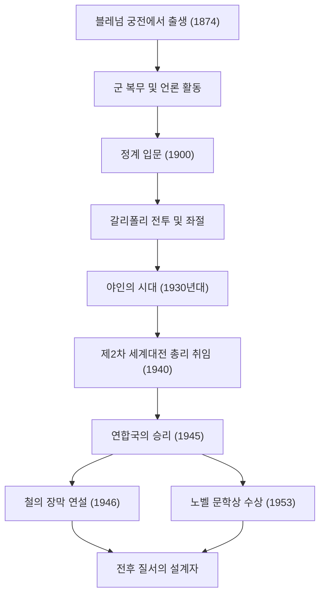

+++
title = "윈스턴 처칠: 불굴의 리더십과 역사에 남긴 발자취"
date: "2026-09-24T16:08:36+09:00"
categories = ["biography"]
tags = ["winston-churchill", "history"]
image = "eyecatch.jpg"
+++

## 시작하며: 역사를 움직인 거성

윈스턴 레너드 스펜서 처칠(1874–1965). 20세기 역사를 논할 때 이 남자의 이름을 빼놓을 수는 없습니다. 인류 최대의 위기였던 제2차 세계대전의 한가운데서, 영국 총리로서 자국과 자유주의 세계를 승리로 이끈 불굴의 지도자입니다. 그를 위대하게 만든 것은 단순한 정치적 수완뿐만 아니라, 그의 강인한 정신력과 사람들의 마음을 움직이는 '말의 힘'이었습니다. 본 기사에서는 처칠의 파란만장한 생애와 그가 가진 특유의 철학, 그리고 현대에 미치는 영향에 대해 깊이 파헤쳐 보겠습니다.

## 귀족의 혈통과 좌절에서의 출발

1874년, 처칠은 명문 말버러 공작 가문의 거성인 블레넘 궁전에서 태어났습니다. 빛나는 가문과는 반대로, 소년 시절의 그는 학업 부진에 시달렸으며 결코 주위에서 기대하는 엘리트가 아니었습니다. 샌드허스트 왕립 육군 사관학교에도 세 번째 도전 끝에 겨우 합격했습니다.

그러나 이 젊은 시절의 좌절이야말로 훗날 그의 끈기를 길러주었다고 할 수 있습니다. 군인이 된 그는 쿠바, 인도, 수단, 그리고 남아프리카의 보어 전쟁 등 세계의 최전선으로 향했고, 동시에 종군 기자로서 생생한 르포르타주를 집필했습니다. 보어 전쟁 당시 포로수용소에서의 극적인 탈출극은 그를 단숨에 국민적 영웅으로 만들었고, 이를 발판으로 1900년 26세의 나이에 보수당 소속으로 하원의원에 처음 당선되었습니다. 화려한 정치 커리어의 막이 오른 것입니다.

## 야인의 시대와 선견지명

젊은 나이에 요직을 두루 거친 처칠이었지만, 그의 정치 인생은 결코 순탄치 않았습니다. 제1차 세계대전 중 갈리폴리 전투에서는 해군 장관으로서 작전을 주도했으나 막대한 피해를 내고 실각했습니다. 그 후에도 잦은 당적 변경과 강경한 정치적 자세가 화근이 되어, 1930년대에는 약 10년에 걸쳐 각료직에서 배제되는 '야인의 시대(The Wilderness Years)'를 겪게 됩니다.

하지만 이 고립무원의 시기에 비로소 정치가로서의 그의 진가가 발휘되었습니다. 유럽 대륙에서 아돌프 히틀러가 이끄는 나치 독일이 대두하는 가운데, 당시 영국 정부는 유화 정책을 취하고 있었습니다. 그러나 처칠은 가장 먼저 그 위험성을 간파했습니다. 그는 고독하게, 하지만 목소리 높여 철저한 재군비와 나치에 대한 강경 자세를 지속적으로 주장했습니다. 당시 그를 '전쟁광'이라고 비난하는 목소리도 많았지만, 그의 경고가 현실이 되었을 때 영국 국민은 처칠이야말로 나라를 구할 유일한 인물임을 깨달았습니다.

## 제2차 세계대전: "피와 수고와 눈물과 땀"

1940년 5월, 나치 독일의 맹공으로 유럽의 운명이 풍전등화에 처했을 때, 65세의 처칠은 마침내 총리직에 오릅니다. 내각 구성 직후 하원 연설에서 그는 이렇게 선언했습니다. "제가 여러분께 드릴 수 있는 것은 피와 수고와 눈물과 땀뿐입니다(I have nothing to offer but blood, toil, tears and sweat)." 이 한마디는 패전의 공포에 빠져 있던 영국 국민을 분연히 일어서게 했습니다.

압도적인 군사력을 자랑하는 독일군에 맞서 처칠은 철저한 항전을 고수했습니다. "우리는 해변에서 싸울 것입니다, 우리는 상륙 지점에서 싸울 것입니다…… 우리는 결코 항복하지 않을 것입니다(We shall never surrender)." 그의 연설은 단순한 수사가 아니라, 절망적인 상황 속에서의 궁극적인 무기였습니다. 미국의 루스벨트 대통령, 소련의 스탈린 서기장이라는 강렬한 개성을 가진 지도자들과 '빅 3'를 형성하여, 복잡한 동맹 관계를 교묘하게 조율하며 마침내 연합국을 최종적인 승리로 이끌었습니다.

## 도해: 처칠의 행보와 업적

아래 도표는 처칠의 파란만장한 생애의 주요 전환점과 그가 남긴 위대한 업적의 흐름을 보여줍니다.

## 언어의 연금술사와 역사의 기록자

처칠을 다른 많은 정치인들과 구별 짓는 가장 큰 특징은 그의 탁월한 문장력입니다. 그는 생계를 유지하기 위해 평생에 걸쳐 방대한 수의 기사와 저작을 집필했습니다. 특히 대작 『제2차 세계대전 회고록』은 그 자신이 역사의 창조자인 동시에 그 역사의 서술자이기도 했음을 보여줍니다.

"역사는 나에게 호의적일 것이다. 왜냐하면 내가 역사를 쓸 것이기 때문이다." 이 유명한 농담처럼, 그는 자신의 관점에서 역사를 만들어 갔습니다. 1953년, 그의 역사와 전기에 있어서의 탁월한 묘사, 그리고 고양감 넘치는 웅변이 높이 평가받아 정치인으로는 이례적으로 노벨 문학상을 수상했습니다.

## 냉전의 예언자와 말년

전쟁에 승리한 직후인 1945년 총선에서 그가 이끄는 보수당은 뜻밖의 참패를 당합니다. 그러나 야당으로 물러난 후에도 그의 국제적인 영향력은 쇠퇴하지 않았습니다. 1946년, 미국 미주리주 풀턴에서 행한 연설에서 소련의 영향력 아래 있는 동유럽 국가들을 가리켜 "발트해의 슈테틴에서 아드리아해의 트리에스테까지, 대륙을 가로질러 '철의 장막(Iron Curtain)'이 드리워져 있다"고 말했습니다. 이 말은 그 후 동서 냉전이라는 새로운 세계 질서를 결정짓는 개념이 되었습니다.

그 후 1951년에 다시 총리직에 복귀하여, 1955년 건강상의 이유로 은퇴할 때까지 국정을 책임졌습니다. 1965년 90세의 나이로 세상을 떠났을 때, 영국은 국장으로 그를 배웅했습니다. 왕족 이외의 국장은 아이작 뉴턴이나 호레이쇼 넬슨 이래 이례적인 대우였습니다.

## 맺음말: 처칠이 현대에 남긴 철학

윈스턴 처칠의 생애는 "절대, 절대, 절대 포기하지 마라(Never, never, never give up)"라는 그 자신의 말을 체현하는 것이었습니다. 수차례의 좌절과 정치적 실각, 고독한 시대를 겪으면서도 그는 그때마다 일어섰고, 더욱 확고한 의지를 가지고 표무대로 돌아왔습니다.

그의 리더십의 핵심은 절망의 늪에 빠져 있어도 유머를 잃지 않고, 말을 통해 사람들에게 희망과 용기를 불어넣는 힘에 있었습니다. 가짜 뉴스와 불확실성이 만연하고 포퓰리즘이 대두하는 현대에, 신념을 관철하고 곤란한 진실을 국민에게 말하며, 나아가 그들을 결속시킨 처칠의 자세는 진정한 리더십이란 무엇인지를 우리에게 강하게 묻고 있습니다. 그가 남긴 발자취와 철학은 단순한 역사의 한 페이지에 머물지 않고, 앞으로도 오랫동안 인류의 지침으로서 빛날 것입니다.
