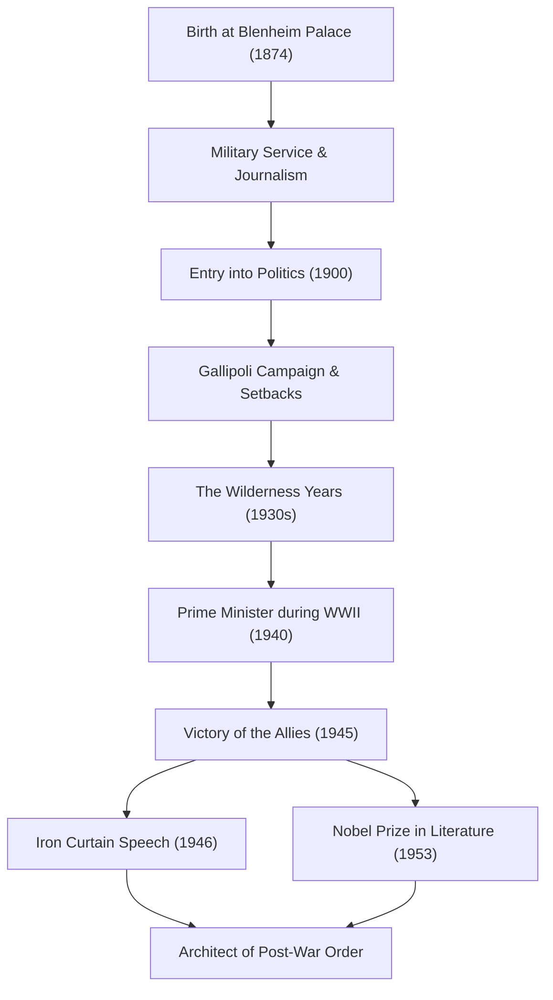

+++
title = "ウィンストン・チャーチル：不屈のリーダーシップと歴史への足跡"
date = "2026-09-24T16:08:36+09:00"
categories = ["biography"]
tags = ["winston-churchill", "history"]
image = "eyecatch.jpg"
+++

## はじめに：歴史を動かした巨星

ウィンストン・レナード・スペンサー＝チャーチル（1874–1965）。20世紀の歴史を語る上で、この男の名を外すことはできない。第二次世界大戦という人類最大の危機のさなか、イギリス首相として自国を、そして自由主義世界を勝利へと導いた不屈の指導者である。彼を偉大たらしめたのは、単なる政治的手腕だけでなく、その強靭な精神力と、人々の心を揺さぶる「言葉の力」であった。本記事では、チャーチルの波乱に満ちた生涯と彼の持つ特異な哲学、そして現代に及ぼす影響について深く掘り下げていく。

## 貴族の血脈と挫折からの出発

1874年、チャーチルは名門マールボロ公爵家の居城、ブレナム宮殿で生を受けた。輝かしい家柄とは裏腹に、少年時代の彼は学業不振に苦しみ、決して周囲から期待されるエリートではなかった。サンドハースト王立陸軍士官学校へも三度目の受験でようやく合格を果たしている。

しかし、この若き日の挫折こそが、後の彼の粘り強さを育んだと言える。軍人となった彼は、キューバ、インド、スーダン、そして南アフリカのボーア戦争など、世界の最前線に赴き、同時に従軍記者として鮮烈なルポルタージュを執筆した。ボーア戦争での捕虜収容所からの劇的な脱走劇は彼を一躍国民的英雄に押し上げ、これを足がかりに1900年、26歳で保守党から下院議員に初当選。華々しい政治キャリアの幕開けである。

## 荒野の時代と先見の明

若くして要職を歴任したチャーチルだったが、彼の政治人生は決して順風満帆ではなかった。第一次世界大戦中のガリポリの戦いでは海軍大臣として作戦を主導するも、甚大な被害を出して失脚。その後も度重なる政党の鞍替えや、強硬な政治姿勢が災いし、1930年代には約10年にわたって閣僚ポストから外れる「荒野の時代（The Wilderness Years）」を経験する。

だが、この孤立無援の時期にこそ、彼の政治家としての真価が発揮された。ヨーロッパ大陸でアドルフ・ヒトラー率いるナチス・ドイツが台頭する中、当時のイギリス政府は宥和政策をとっていたが、チャーチルはいち早くその危険性を見抜き、徹底的な再軍備とナチスへの強硬姿勢を孤独に、しかし声高に訴え続けたのである。当時の彼を「戦争屋」と非難する声も多かったが、彼の警告が現実のものとなったとき、イギリス国民はチャーチルこそが国を救う唯一の人物であると悟った。

## 第二次世界大戦：「血と労苦と涙と汗」

1940年5月、ナチス・ドイツの猛攻によりヨーロッパの命運が風前の灯火となった時、65歳のチャーチルはついに首相の座に就く。組閣直後の下院での演説で彼はこう宣言した。「私には、血と労苦と涙と汗のほかに提供できるものは何もない（I have nothing to offer but blood, toil, tears and sweat.）」。この一言は、敗戦の恐怖に沈んでいたイギリス国民を奮い立たせた。

圧倒的な軍事力を誇るドイツ軍に対し、チャーチルは徹底抗戦を貫いた。「我々は海岸で戦うだろう、我々は上陸地で戦うだろう……我々は決して降伏しない（We shall never surrender）」。彼の演説は単なるレトリックではなく、絶望的な状況下での究極の武器であった。アメリカのルーズベルト大統領、ソ連のスターリン書記長という強烈な個性を持つ指導者たちと「ビッグ・スリー」を形成し、複雑な同盟関係を巧みに操りながら、ついには連合国を最終的な勝利へと導いたのである。

## 図解：チャーチルの歩みと功績

以下の図は、チャーチルの波乱に満ちた生涯の主要な転換点と、彼が残した偉大な功績の流れを示している。

## 言葉の錬金術師と歴史の記録者

チャーチルを他の多くの政治家と隔てる最大の特徴は、その卓越した文筆能力である。彼は生計を立てるために生涯を通じて膨大な数の記事や著作を執筆し続けた。特に大著『第二次世界大戦回顧録』は、彼自身が歴史の創造者であると同時に、その歴史の語り部でもあったことを示している。

「歴史は私に好意的だろう。なぜなら私が歴史を書くつもりだからだ」。この有名な冗談の通り、彼は自身の視点から歴史を形作っていった。1953年、彼の歴史と伝記における卓越した描写、そして高揚感あふれる雄弁さが高く評価され、政治家としては異例のノーベル文学賞を受賞している。

## 冷戦の預言者と晩年

戦争に勝利した直後の1945年の総選挙で、彼率いる保守党はよもやの大敗を喫する。しかし、野に下った後も彼の国際的な影響力は衰えなかった。1946年、アメリカのミズーリ州フルトンで行った演説で、ソ連の影響下にある東欧諸国を指して「バルト海のシュテッティンからアドリア海のトリエステまで、大陸を横断して『鉄のカーテン（Iron Curtain）』が降ろされている」と語った。この言葉は、その後の東西冷戦という新しい世界秩序を決定づける概念となった。

その後、1951年に再び首相の座に返り咲き、1955年に健康上の理由で引退するまで国政を担った。1965年に90歳でこの世を去った際、イギリスは国葬をもって彼を見送った。王族以外の国葬は、アイザック・ニュートンやホレーショ・ネルソン以来の異例の待遇であった。

## おわりに：チャーチルが現代に残した哲学

ウィンストン・チャーチルの生涯は、「決して、決して、決して屈するな（Never, never, never give up.）」という彼自身の言葉を体現するものであった。幾度もの挫折や政治的失脚、孤独な時代を経験しながらも、彼はそのたびに立ち上がり、より強固な意志を持って表舞台へと舞い戻ってきた。

彼のリーダーシップの核心は、絶望の淵にあってもユーモアを忘れず、言葉によって人々に希望と勇気を吹き込む力にあった。フェイクニュースや不確実性が蔓延し、ポピュリズムが台頭する現代において、信念を貫き、困難な真実を国民に語り、なおかつ彼らを結束させたチャーチルの姿勢は、真のリーダーシップとは何かを我々に強く問いかけている。彼の遺した足跡と哲学は、単なる歴史の１ページにとどまらず、これからも長く人類の指針として輝き続けるだろう。
