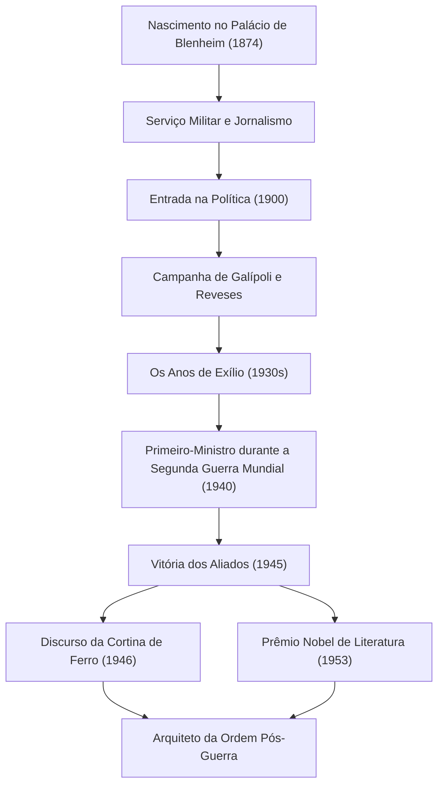

+++
title = "Winston Churchill: Liderança Indomável e Pegadas na História"
date = "2026-09-24T16:08:36+09:00"
categories = ["biography"]
tags = ["winston-churchill", "history"]
image = "eyecatch.jpg"
+++

## Introdução: Um Gigante que Moveu a História

Winston Leonard Spencer Churchill (1874–1965). Quando se fala da história do século XX, o nome deste homem não pode ser omitido. No meio da Segunda Guerra Mundial, a maior crise da humanidade, ele foi o líder indomável que, como Primeiro-Ministro do Reino Unido, levou seu país e o mundo livre à vitória. O que o tornou grande não foi apenas sua perspicácia política, mas seu espírito resiliente e o "poder das palavras" que comoveu os corações das pessoas. Neste artigo, nos aprofundamos na vida turbulenta de Churchill, sua filosofia única e seu impacto duradouro no mundo moderno.

## Linhagem Aristocrática e um Início a Partir do Fracasso

Em 1874, Churchill nasceu no Palácio de Blenheim, a sede ancestral dos prestigiados Duques de Marlborough. Ao contrário de sua linhagem gloriosa, ele lutou contra o fraco desempenho acadêmico durante a infância e não era de forma alguma a elite esperada por aqueles ao seu redor. Ele só conseguiu passar no exame de admissão para o Royal Military College, Sandhurst, em sua terceira tentativa.

No entanto, pode-se dizer que esses contratempos iniciais promoveram sua perseverança posterior. Como soldado, ele foi para as linhas de frente do mundo, incluindo Cuba, Índia, Sudão e a Guerra dos Bôeres na África do Sul, enquanto simultaneamente escrevia reportagens vívidas como correspondente de guerra. Sua fuga dramática de um campo de prisioneiros de guerra durante a Guerra dos Bôeres instantaneamente o impulsionou ao heroísmo nacional. Usando isso como um trampolim, ele foi eleito pela primeira vez para a Câmara dos Comuns pelo Partido Conservador em 1900, aos 26 anos. Isso marcou o amanhecer de sua brilhante carreira política.

## Os Anos de Exílio e Visão de Futuro

Embora Churchill ocupasse cargos importantes em uma idade jovem, sua vida política nunca foi um mar de rosas. Durante a Primeira Guerra Mundial, como Primeiro Lorde do Almirantado, ele liderou a Campanha de Galípoli, mas sofreu uma derrota maciça, resultando em enormes baixas, o que levou à sua queda. Depois disso, frequentes mudanças de partido e uma postura política de linha dura jogaram contra ele. Na década de 1930, ele experimentou os "Anos de Exílio (The Wilderness Years)", um período de quase uma década em que foi excluído dos cargos do gabinete.

No entanto, foi precisamente durante este período de isolamento que o seu verdadeiro valor como político brilhou. À medida que a Alemanha Nazista, liderada por Adolf Hitler, ascendia ao poder no continente europeu, o governo britânico da época adotava uma política de apaziguamento. Churchill, no entanto, foi um dos primeiros a ver o perigo. Ele ficou sozinho, mas de forma alta e persistente, defendeu um rearmamento completo e uma postura de linha dura contra os nazistas. Embora muitos o tenham condenado como um "belicista", quando suas advertências se tornaram realidade, o povo britânico percebeu que Churchill era a única pessoa capaz de salvar o país.

## Segunda Guerra Mundial: "Sangue, Trabalho, Lágrimas e Suor"

Em maio de 1940, quando o destino da Europa estava por um fio devido ao ataque feroz da Alemanha Nazista, Churchill, de 65 anos, finalmente assumiu a cadeira de Primeiro-Ministro. Em um discurso na Câmara dos Comuns logo após formar seu gabinete, ele declarou: "Não tenho nada a oferecer senão sangue, trabalho, lágrimas e suor (I have nothing to offer but blood, toil, tears and sweat)". Estas palavras galvanizaram o público britânico, que estava afundando no medo da derrota.

Contra o poderio militar esmagadoramente superior das forças alemãs, Churchill manteve uma postura de resistência total. "Lutaremos nas praias, lutaremos nos locais de desembarque... nunca nos renderemos (We shall never surrender)". Seus discursos não eram mera retórica; eles eram a arma definitiva em uma situação desesperadora. Formando os "Três Grandes" com líderes de personalidades intensas — o presidente dos EUA Roosevelt e o secretário-geral soviético Stalin — ele navegou habilmente em alianças complexas e finalmente liderou os Aliados à vitória final.

## Diagrama: A Jornada e as Conquistas de Churchill

O diagrama a seguir ilustra os principais pontos de inflexão na vida turbulenta de Churchill e a sequência de suas grandes conquistas.

## Alquimista de Palavras e Cronista da História

A maior característica que diferencia Churchill de muitos outros políticos é sua extraordinária capacidade literária. Ao longo de sua vida, ele continuou a escrever um vasto número de artigos e livros para ganhar a vida. Em particular, sua obra monumental, "A Segunda Guerra Mundial", mostra que ele não era apenas um criador de história, mas também seu narrador.

"A história será gentil comigo, pois pretendo escrevê-la". Como diz essa piada famosa, ele moldou a história sob sua própria perspectiva. Em 1953, ele foi agraciado com o Prêmio Nobel de Literatura — uma honra excepcional para um político — em reconhecimento de seu domínio da descrição histórica e biográfica, bem como pela brilhante oratória na defesa de valores humanos exaltados.

## Profeta da Guerra Fria e Últimos Anos

Nas eleições gerais de 1945, imediatamente após a vitória na guerra, o Partido Conservador liderado por ele sofreu uma derrota esmagadora e inesperada. No entanto, mesmo após deixar o cargo, sua influência internacional não diminuiu. Em um discurso em 1946 em Fulton, Missouri, EUA, ele apontou para os países da Europa Oriental sob influência soviética e disse: "De Stettin no Báltico a Trieste no Adriático, uma 'Cortina de Ferro (Iron Curtain)' desceu sobre o Continente". Essas palavras se tornaram o conceito definidor da nova ordem mundial da subsequente Guerra Fria.

Mais tarde, ele retornou ao posto de Primeiro-Ministro em 1951 e suportou o fardo da política nacional até se aposentar por motivos de saúde em 1955. Quando faleceu em 1965 aos 90 anos, o Reino Unido despediu-se com um funeral de estado. Um funeral de estado para alguém fora da família real foi uma honra excepcional não vista desde Isaac Newton e Horatio Nelson.

## Conclusão: A Filosofia que Churchill Deixou para o Mundo Moderno

A vida de Winston Churchill incorporou suas próprias palavras: "Nunca, nunca, nunca desista (Never, never, never give up)". Apesar de experimentar inúmeros contratempos, quedas políticas e períodos de isolamento, ele se levantou a cada vez e retornou ao centro do palco com uma vontade ainda mais forte.

O cerne de sua liderança residia em sua capacidade de nunca esquecer seu senso de humor, mesmo à beira do desespero, e de inspirar esperança e coragem nas pessoas por meio do poder das palavras. No mundo de hoje, onde notícias falsas e incertezas correm soltas e o populismo está em ascensão, a postura de Churchill — manter-se fiel às suas crenças, dizer verdades difíceis ao público e, ainda assim, uni-los — nos pergunta fortemente o que é a verdadeira liderança. As pegadas e a filosofia que ele deixou para trás não são apenas uma página na história; elas continuarão a brilhar como uma luz guia para a humanidade por um longo tempo.
