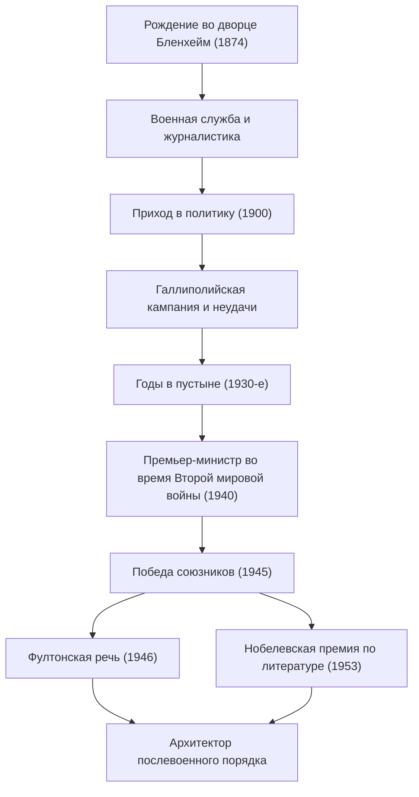

+++
title = "Уинстон Черчилль: Неукротимое лидерство и след в истории"
date = "2026-09-24T16:08:36+09:00"
categories = ["biography"]
tags = ["winston-churchill", "history"]
image = "eyecatch.jpg"
+++

## Введение: Гигант, двигавший историю

Уинстон Леонард Спенсер-Черчилль (1874–1965). Говоря об истории 20-го века, имя этого человека невозможно обойти вниманием. В разгар Второй мировой войны, величайшего кризиса человечества, он был тем неукротимым лидером, который в качестве премьер-министра Великобритании привел свою страну и свободный мир к победе. Великим его сделали не только политическая проницательность, но и несгибаемый дух, а также «сила слова», которая трогала сердца людей. В этой статье мы подробно рассмотрим бурную жизнь Черчилля, его уникальную философию и то длительное влияние, которое он оказал на современный мир.

## Аристократическое происхождение и путь, начавшийся с неудач

В 1874 году Черчилль родился во дворце Бленхейм, родовом поместье престижных герцогов Мальборо. Вопреки своему славному происхождению, в детстве он страдал от плохой успеваемости в учебе и ни в коем случае не был тем элитарным ребенком, которого от него ожидали окружающие. Вступительный экзамен в Королевское военное училище в Сандхерсте он смог сдать только с третьей попытки.

Однако можно сказать, что именно эти ранние неудачи воспитали его дальнейшую настойчивость. Став военным, он побывал на передовых линиях по всему миру, включая Кубу, Индию, Судан и Англо-бурскую войну в Южной Африке, одновременно с этим сочиняя яркие репортажи в качестве военного корреспондента. Его драматичный побег из лагеря для военнопленных во время Англо-бурской войны мгновенно сделал его национальным героем. Использовав это как трамплин, в 1900 году в возрасте 26 лет он был впервые избран в Палату общин от Консервативной партии. Это ознаменовало начало его блестящей политической карьеры.

## «Годы в пустыне» и дар предвидения

Хотя Черчилль занимал ключевые посты в молодом возрасте, его политическая жизнь никогда не была гладкой. Во время Первой мировой войны, будучи Первым лордом Адмиралтейства, он руководил Галлиполийской кампанией, но потерпел сокрушительное поражение, повлекшее огромные потери, что привело к его отставке. После этого частая смена партий и жесткая политическая позиция работали против него. В 1930-е годы он пережил «Годы в пустыне (The Wilderness Years)» — период продолжительностью около десяти лет, когда он был отстранен от должностей в кабинете министров.

Однако именно в этот период изоляции проявилась его истинная ценность как политика. В то время как нацистская Германия во главе с Адольфом Гитлером приходила к власти на европейском континенте, британское правительство того времени приняло политику умиротворения. Однако Черчилль одним из первых увидел опасность. Он стоял один, но громко и настойчиво выступал за полное перевооружение и жесткую позицию против нацистов. Хотя многие осуждали его как «разжигателя войны», когда его предупреждения стали реальностью, британский народ понял, что Черчилль — единственный человек, способный спасти страну.

## Вторая мировая война: «Кровь, тяжелый труд, слезы и пот»

В мае 1940 года, когда судьба Европы висела на волоске из-за жестокого натиска нацистской Германии, 65-летний Черчилль наконец занял пост премьер-министра. В своем выступлении перед Палатой общин вскоре после формирования кабинета он заявил: «Мне нечего предложить, кроме крови, тяжелого труда, слез и пота (I have nothing to offer but blood, toil, tears and sweat)». Эти слова воодушевили британскую общественность, которая погружалась в страх перед поражением.

Против подавляющего военного превосходства немецких войск Черчилль занял позицию тотального сопротивления. «Мы будем сражаться на пляжах, мы будем сражаться на местах высадки... мы никогда не сдадимся (We shall never surrender)». Его речи были не просто риторикой; они были абсолютным оружием в отчаянной ситуации. Образовав «Большую тройку» с лидерами с сильным характером — президентом США Рузвельтом и генеральным секретарем СССР Сталиным — он умело лавировал в сложных альянсах и в конечном итоге привел союзников к окончательной победе.

## Диаграмма: Жизненный путь и достижения Черчилля

Следующая диаграмма иллюстрирует основные поворотные моменты в бурной жизни Черчилля и последовательность его великих достижений.

## Алхимик слов и летописец истории

Самая большая особенность, отличающая Черчилля от многих других политиков, — это его выдающиеся литературные способности. На протяжении всей своей жизни он продолжал писать огромное количество статей и книг, чтобы заработать на жизнь. В частности, его монументальный труд «Вторая мировая война» показывает, что он был не только творцом истории, но и ее рассказчиком.

«История будет благосклонна ко мне, ибо я намерен написать ее». Как гласит эта известная шутка, он формировал историю со своей собственной точки зрения. В 1953 году он был удостоен Нобелевской премии по литературе — исключительная честь для политика — в знак признания его мастерства исторического и биографического описания, а также за блестящее ораторское искусство в защите возвышенных человеческих ценностей.

## Пророк холодной войны и последние годы

На всеобщих выборах 1945 года, сразу после победы в войне, возглавляемая им Консервативная партия потерпела неожиданное, сокрушительное поражение. Однако, даже после ухода с поста, его международное влияние не ослабло. В речи 1946 года в Фултоне, штат Миссури, США, он указал на восточноевропейские страны, находящиеся под влиянием СССР, и сказал: «От Штеттина на Балтике до Триеста на Адриатике на континент опустился "железный занавес" (Iron Curtain)». Эти слова стали определяющей концепцией для нового мирового порядка последовавшей холодной войны.

Позже он вернулся на пост премьер-министра в 1951 году и нес бремя национальной политики до тех пор, пока не ушел в отставку по состоянию здоровья в 1955 году. Когда он скончался в 1965 году в возрасте 90 лет, Великобритания попрощалась с ним государственными похоронами. Государственные похороны для человека, не принадлежащего к королевской семье, были исключительной честью, невиданной со времен Исаака Ньютона и Горацио Нельсона.

## Заключение: Философия, которую Черчилль оставил современному миру

Жизнь Уинстона Черчилля стала воплощением его собственных слов: «Никогда, никогда, никогда не сдавайтесь (Never, never, never give up)». Несмотря на многочисленные неудачи, политические падения и периоды изоляции, он каждый раз вставал и возвращался на центральную сцену с еще более сильной волей.

Суть его лидерства заключалась в его способности никогда не забывать о своем чувстве юмора, даже находясь на грани отчаяния, и вселять в людей надежду и мужество с помощью силы слов. В современном мире, где свирепствуют фальшивые новости и неопределенность, а популизм находится на подъеме, позиция Черчилля — придерживаться своих убеждений, говорить общественности трудную правду и при этом объединять ее — настоятельно спрашивает нас о том, что такое истинное лидерство. Следы и философия, которые он оставил после себя, — это не просто страница истории; они будут продолжать сиять как путеводный свет для человечества еще долгое время.
