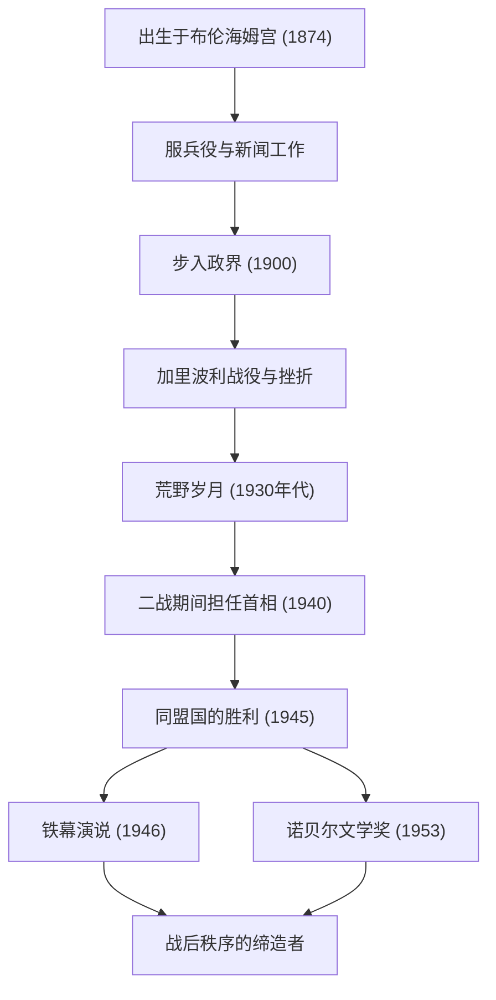

+++
title = "温斯顿·丘吉尔：不屈的领导力与历史足迹"
date: "2026-09-24T16:08:36+09:00"
categories = ["biography"]
tags = ["winston-churchill", "history"]
image = "eyecatch.jpg"
+++

## 引言：推动历史的巨星

温斯顿·伦纳德·斯宾塞-丘吉尔（1874–1965）。在讲述20世纪的历史时，这个男人的名字是不可忽略的。在第二次世界大战这一人类最大危机的时刻，作为英国首相，他是一位不屈的领袖，带领他的国家和自由世界走向了胜利。使他伟大的不仅仅是他的政治手腕，还有他坚韧的精神和打动人心的“言辞的力量”。在本文中，我们将深入探讨丘吉尔波澜壮阔的一生、他独特的哲学以及对现代世界的影响。

## 贵族血统与从挫折中起步

1874年，丘吉尔出生在著名的马尔博罗公爵家族的宅邸——布伦海姆宫。与他辉煌的家世相反，少年时代的他饱受学业不佳的困扰，绝不是周围人所期望的精英。他也是在第三次考试时才勉强考入桑赫斯特皇家军事学院。

然而，正是这些早年的挫折培养了他后来的坚韧不拔。作为一名军人，他前往世界各地的前线，包括古巴、印度、苏丹以及南非的布尔战争，同时作为战地记者撰写了生动的报道。在布尔战争期间，他从战俘营戏剧性逃脱，使他一跃成为民族英雄。以此为跳板，1900年，26岁的他代表保守党首次当选为下议院议员。这标志着他辉煌政治生涯的开端。

## 荒野岁月与先见之明

尽管丘吉尔年纪轻轻就担任要职，但他的政治生涯绝非一帆风顺。在第一次世界大战期间，作为海军大臣，他主导了加里波利战役，但由于伤亡惨重而黯然下台。此后，频繁更换党派和强硬的政治立场对他产生了不利影响。在20世纪30年代，他经历了长达约十年的“荒野岁月（The Wilderness Years）”，在此期间他被排除在内阁职位之外。

然而，正是在这段孤立无援的时期，他作为政治家的真正价值得到了体现。随着阿道夫·希特勒领导的纳粹德国在欧洲大陆崛起，当时的英国政府采取了绥靖政策。但丘吉尔最早察觉到了危险。他孤身一人，却高声且坚持不懈地呼吁全面重整军备并对纳粹采取强硬立场。尽管当时有许多人指责他为“好战分子”，但当他的警告成为现实时，英国人民意识到丘吉尔是唯一能够拯救国家的人。

## 第二次世界大战：“血、辛劳、眼泪和汗水”

1940年5月，当欧洲的命运在纳粹德国的猛烈攻势下岌岌可危时，65岁的丘吉尔终于登上了首相的宝座。在组阁后不久的下议院演讲中，他宣布：“我能奉献的没有其它，只有热血、辛劳、眼泪与汗水（I have nothing to offer but blood, toil, tears and sweat.）。”这句话振奋了沉浸在战败恐惧中的英国公众。

面对德国军队压倒性的军事力量，丘吉尔坚持了彻底抵抗的立场。“我们将在海滩上战斗，我们将在登陆点战斗……我们决不投降（We shall never surrender）。”他的演讲不仅仅是修辞；它们是在绝望局势下的终极武器。他与具有强烈个性的领导人——美国总统罗斯福和苏联总书记斯大林——组成了“三巨头”，巧妙地驾驭着复杂的同盟关系，并最终带领同盟国取得了最后的胜利。

## 图解：丘吉尔的旅程与成就

下图展示了丘吉尔波澜壮阔的一生中的主要转折点以及他伟大成就的历程。

## 语言的炼金术士与历史的记录者

丘吉尔与许多其他政治家最大的不同之处在于他卓越的文学才能。他一生中写下了大量的文章和著作以维持生计。尤其是他的不朽巨著《第二次世界大战回忆录》，表明他不仅是历史的创造者，也是历史的讲述者。

“历史将对我宽容，因为我打算自己来写它。”正如这个著名的笑话所言，他从自己的视角塑造了历史。1953年，为了表彰他在历史和传记描述方面的卓越才能，以及在捍卫崇高人类价值方面令人振奋的雄辩，他被授予诺贝尔文学奖——这对于政治家来说是一项非凡的荣誉。

## 冷战的先知与晚年

在战争胜利后不久的1945年大选中，他领导的保守党遭遇了意想不到的惨败。然而，即使在下野之后，他的国际影响力也没有减弱。1946年，在美国密苏里州富尔顿的一次演讲中，他指着受苏联影响的东欧国家说：“从波罗的海的斯德丁到亚得里亚海的里雅斯特，一幅横贯欧洲大陆的‘铁幕（Iron Curtain）’已经降下。”这句话成为了决定随后冷战这一新世界秩序的概念。

随后，他在1951年再次出任首相，并承担国家政治重任，直到1955年因健康原因退休。1965年，当他以90岁高龄去世时，英国以国葬为他送行。皇室成员之外的国葬，是自艾萨克·牛顿和霍雷肖·纳尔逊以来罕见的殊荣。

## 结语：丘吉尔留给现代的哲学

温斯顿·丘吉尔的一生体现了他自己的名言：“绝不、绝不、绝不放弃（Never, never, never give up.）。”尽管经历了无数次挫折、政治下台和孤立时期，他每次都能站起来，并以更坚定的意志回到舞台中央。

他领导力的核心在于，即使在绝望的边缘也能保持幽默感，并通过语言的力量向人们注入希望和勇气。在假新闻和不确定性蔓延、民粹主义抬头的现代，丘吉尔坚守信念、向公众讲述艰难真相并团结他们的姿态，向我们强烈地发出了关于什么是真正领导力的质问。他留下的足迹和哲学不仅仅是历史的一页，在未来很长一段时间内，它们将继续作为人类的指路明灯熠熠生辉。
