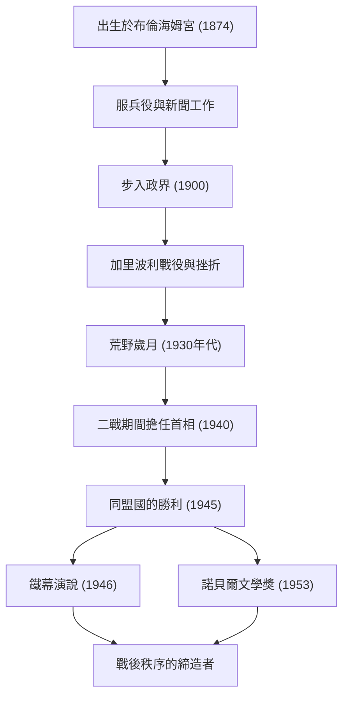

+++
title = "溫斯頓·邱吉爾：不屈的領導力與歷史足跡"
date: "2026-09-24T16:08:36+09:00"
categories = ["biography"]
tags = ["winston-churchill", "history"]
image = "eyecatch.jpg"
+++

## 引言：推動歷史的巨星

溫斯頓·倫納德·史賓賽-邱吉爾（1874–1965）。在講述20世紀的歷史時，這個男人的名字是不可忽略的。在第二次世界大戰這一人類最大危機的時刻，作為英國首相，他是一位不屈的領袖，帶領他的國家和自由世界走向了勝利。使他偉大的不僅僅是他的政治手腕，還有他堅韌的精神和打動人心的「言辭的力量」。在本文中，我們將深入探討邱吉爾波瀾壯闊的一生、他獨特的哲學以及對現代世界的影響。

## 貴族血統與從挫折中起步

1874年，邱吉爾出生在著名的馬爾博羅公爵家族的宅邸——布倫海姆宮。與他輝煌的家世相反，少年時代的他飽受學業不佳的困擾，絕不是周圍人所期望的精英。他也是在第三次考試時才勉強考入桑赫斯特皇家軍事學院。

然而，正是這些早年的挫折培養了他後來的堅韌不拔。作為一名軍人，他前往世界各地的前線，包括古巴、印度、蘇丹以及南非的波耳戰爭，同時作為戰地記者撰寫了生動的報導。在波耳戰爭期間，他從戰俘營戲劇性逃脫，使他一躍成為民族英雄。以此為跳板，1900年，26歲的他代表保守黨首次當選為下議院議員。這標誌著他輝煌政治生涯的開端。

## 荒野歲月與先見之明

儘管邱吉爾年紀輕輕就擔任要職，但他的政治生涯絕非一帆風順。在第一次世界大戰期間，作為海軍大臣，他主導了加里波利戰役，但由於傷亡慘重而黯然下台。此後，頻繁更換黨派和強硬的政治立場對他產生了不利影響。在20世紀30年代，他經歷了長達約十年的「荒野歲月（The Wilderness Years）」，在此期間他被排除在內閣職位之外。

然而，正是在這段孤立無援的時期，他作為政治家的真正價值得到了體現。隨著阿道夫·希特勒領導的納粹德國在歐洲大陸崛起，當時的英國政府採取了綏靖政策。但邱吉爾最早察覺到了危險。他孤身一人，卻高聲且堅持不懈地呼籲全面重整軍備並對納粹採取強硬立場。儘管當時有許多人指責他為「好戰分子」，但當他的警告成為現實時，英國人民意識到邱吉爾是唯一能夠拯救國家的人。

## 第二次世界大戰：「血、辛勞、眼淚和汗水」

1940年5月，當歐洲的命運在納粹德國的猛烈攻勢下岌岌可危時，65歲的邱吉爾終於登上了首相的寶座。在組閣後不久的下議院演講中，他宣布：「我能奉獻的沒有其它，只有熱血、辛勞、眼淚與汗水（I have nothing to offer but blood, toil, tears and sweat.）。」這句話振奮了沉浸在戰敗恐懼中的英國公眾。

面對德國軍隊壓倒性的軍事力量，邱吉爾堅持了徹底抵抗的立場。「我們將在海灘上戰鬥，我們將在登陸點戰鬥……我們決不投降（We shall never surrender）。」他的演講不僅僅是修辭；它們是在絕望局勢下的終極武器。他與具有強烈個性的領導人——美國總統羅斯福和蘇聯總書記史達林——組成了「三巨頭」，巧妙地駕馭著複雜的同盟關係，並最終帶領同盟國取得了最後的勝利。

## 圖解：邱吉爾的旅程與成就

下圖展示了邱吉爾波瀾壯闊的一生中的主要轉折點以及他偉大成就的歷程。

## 語言的煉金術士與歷史的記錄者

邱吉爾與許多其他政治家最大的不同之處在於他卓越的文學才能。他一生中寫下了大量的文章和著作以維持生計。尤其是他的不朽巨著《第二次世界大戰回憶錄》，表明他不僅是歷史的創造者，也是歷史的講述者。

「歷史將對我寬容，因為我打算自己來寫它。」正如這個著名的笑話所言，他從自己的視角塑造了歷史。1953年，為了表彰他在歷史和傳記描述方面的卓越才能，以及在捍衛崇高人類價值方面令人振奮的雄辯，他被授予諾貝爾文學獎——這對於政治家來說是一項非凡的榮譽。

## 冷戰的先知與晚年

在戰爭勝利後不久的1945年大選中，他領導的保守黨遭遇了意想不到的慘敗。然而，即使在下野之後，他的國際影響力也沒有減弱。1946年，在美國密蘇里州富爾頓的一次演講中，他指著受蘇聯影響的東歐國家說：「從波羅的海的斯德丁到亞得里亞海的里雅斯特，一幅橫貫歐洲大陸的『鐵幕（Iron Curtain）』已經降下。」這句話成為了決定隨後冷戰這一新世界秩序的概念。

隨後，他在1951年再次出任首相，並承擔國家政治重任，直到1955年因健康原因退休。1965年，當他以90歲高齡去世時，英國以國葬為他送行。皇室成員之外的國葬，是自艾薩克·牛頓和霍雷肖·納爾遜以來罕見的殊榮。

## 結語：邱吉爾留給現代的哲學

溫斯頓·邱吉爾的一生體現了他自己的名言：「絕不、絕不、絕不放棄（Never, never, never give up.）。」儘管經歷了無數次挫折、政治下台和孤立時期，他每次都能站起來，並以更堅定的意志回到舞台中央。

他領導力的核心在於，即使在絕望的邊緣也能保持幽默感，並通過語言的力量向人們注入希望和勇氣。在假新聞和不確定性蔓延、民粹主義抬頭的現代，邱吉爾堅守信念、向公眾講述艱難真相並團結他們的姿態，向我們強烈地發出了關於什麼是真正領導力的質問。他留下的足跡和哲學不僅僅是歷史的一頁，在未來很長一段時間內，它們將繼續作為人類的指路明燈熠熠生輝。
