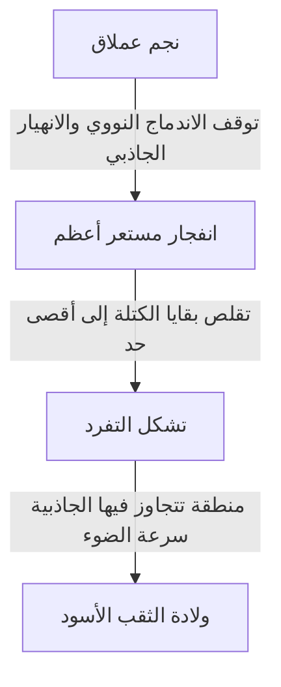

توجد في الكون أجرام سماوية متطرفة تفوق خيالنا. ومن بينها، الأكثر غموضاً والذي لا يزال يأسر الكثير من الناس هو "الثقب الأسود". هذا الجرم الذي يمتلك جاذبية قوية جداً لدرجة أن الضوء نفسه لا يستطيع الهروب منها، لا يقتصر على كونه مجرد موضوع في الخيال العلمي، بل هو أيضاً أحد أكبر الألغاز في طليعة الفيزياء الحديثة.

في هذا المقال، سنغوص بعمق وتفصيل في شرح آلية الثقب الأسود الأساسية، بدءاً من نظرية النسبية العامة لأينشتاين، وأفق الحدث (Event Horizon)، وصولاً إلى "إشعاع هوكينغ" الذي اقترحه الدكتور ستيفن هوكينغ.

## ما هو الثقب الأسود؟

يشير الثقب الأسود (Black Hole) إلى منطقة من الزمكان تتميز بكثافة عالية جداً وكتلة ضخمة، مما يولد جاذبية قوية تمنع أي شيء، ليس فقط المادة بل حتى الضوء (الموجات الكهرومغناطيسية)، من الإفلات منها.

سرعة الضوء (حوالي 300 ألف كيلومتر في الثانية) هي السرعة القصوى في هذا الكون، ولكن بمجرد الدخول ضمن مسافة معينة من مركز الثقب الأسود، فإن حتى سرعة الضوء لا تكفي للتغلب على جاذبيته والإفلات منها. يُطلق على هذا "الحد الذي لا يمكن العودة منه أبداً" اسم **أفق الحدث (Event Horizon)**.

### عملية التكوين

تتكون معظم الثقوب السوداء عندما تنهي النجوم ذات الكتلة الكبيرة دورة حياتها.
عادةً ما يحافظ النجم على شكله من خلال التوازن بين الضغط المتجه للخارج الناتج عن تفاعلات الاندماج النووي في مركزه، والجاذبية المتجهة للداخل الناتجة عن كتلة النجم نفسه والتي تحاول تقليصه.

ولكن، عندما يستنفد النجم وقوده من الهيدروجين والهيليوم، ويتشكل في النهاية قلب من الحديد، تتوقف تفاعلات الاندماج النووي. ونتيجة لذلك، يُفقد الضغط المتجه للخارج، ويبدأ النجم في الانهيار السريع تحت تأثير جاذبيته الخاصة (الانهيار الجاذبي).

إذا كان النجم صغير الكتلة (مشابهاً للشمس)، فإنه يتحول إلى قزم أبيض، وإذا كان أكبر قليلاً، فإنه يصبح نجماً نيوترونياً. أما في حالة النجوم الثقيلة جداً التي تفوق كتلة الشمس بعشرات المرات، فلا يمكن إيقاف الانهيار الجاذبي، وتتقلص في النهاية لتشكل "تفرد (Singularity)" بحجم صفر وكثافة لا نهائية. وهكذا يُولد ثقب أسود نجمي.

## أينشتاين ونظرية النسبية العامة

التنبؤ النظري بوجود الثقوب السوداء جاء من خلال **نظرية النسبية العامة (General Relativity)** التي نشرها ألبرت أينشتاين في عام 1915.

تصف النسبية العامة الجاذبية بأنها "انحناء في الزمكان". وجود جسم له كتلة يتسبب في انحناء الزمكان (الزمان والمكان) المحيط به. يشبه الأمر وضع كرة بولينج ثقيلة على ترامبولين، حيث يغوص الغطاء المطاطي للأسفل. إذا دحرجت كرة زجاجية صغيرة هناك، فإنها ستسقط نحو الحفرة التي أحدثتها كرة البولينج. هذه هي حقيقة "الجاذبية" كما شرحها أينشتاين.

### حل شوارزشيلد

في عام 1916، استنتج عالم الفيزياء الفلكية الألماني كارل شوارزشيلد أول حل دقيق لمعادلات مجال الجاذبية لأينشتاين (حل شوارزشيلد). لقد أثبت رياضياً أنه إذا تركزت الكتلة في نقطة واحدة، فإن الزمكان سينحني بشكل مفرط داخل نصف قطر معين (نصف قطر شوارزشيلد)، لدرجة أن الضوء نفسه لن يتمكن من الخروج.

$$ r_s = \frac{2GM}{c^2} $$

حيث يمثل $r_s$ نصف قطر شوارزشيلد، و $G$ ثابت الجاذبية، و $M$ كتلة الجرم السماوي، و $c$ سرعة الضوء. إذا أردنا تحويل الأرض إلى ثقب أسود، فسيتعين علينا ضغط كتلتها في كرة يبلغ نصف قطرها حوالي 9 مليمترات. أما في حالة الشمس، فسيكون نصف القطر حوالي 3 كيلومترات.

## بنية الثقب الأسود: أفق الحدث والتفرد

يتكون الثقب الأسود بشكل أساسي من عدة عناصر.

### 1. التفرد (Singularity)
نقطة في مركز الثقب الأسود، تُسحق فيها الكتلة إلى حجم متناهي الصغر. هنا، تصبح الكثافة وانحناء الزمكان لا نهائيين، وتنهار قوانين الفيزياء الحالية التي نعرفها (بما في ذلك النسبية العامة) تماماً. لوصف التفرد بشكل صحيح، يُعتقد أننا بحاجة إلى "نظرية الجاذبية الكمية" التي تدمج بين النسبية العامة وميكانيكا الكم، ولكنها لم تكتمل بعد.

### 2. أفق الحدث (Event Horizon)
الحد الذي يحيط بالتفرد. بمجرد تجاوز هذا الحد والدخول إلى الداخل، تتجاوز سرعة الإفلات سرعة الضوء، ولذلك لا يمكن نقل أي معلومات إلى الخارج. سُمي بهذا الاسم لأنه يمثل "الأفق (Horizon)" الذي تصبح عنده "الأحداث (Events)" غير مرئية.

### 3. القرص المزود (Accretion Disk)
قد يتشكل حول الثقب الأسود هيكل على شكل قرص حيث ينجذب الغاز والغبار بين النجمي، أو المادة المنتزعة من نجم مرافق في نظام ثنائي، نحو الثقب الأسود بفعل الجاذبية الهائلة ويسقط بحركة دوامية. بسبب الاحتكاك الشديد بين المواد، ترتفع درجات الحرارة بشكل هائل، مما يؤدي إلى انبعاث أشعة سينية وأشعة غاما قوية. إن قدرتنا على "رصد" الثقب الأسود ترجع بفضل الضوء المنبعث من هذا القرص المزود.

### 4. النفاثات النسبية (Relativistic Jet)
ظاهرة تنطلق فيها حزم من البلازما بسرعة تقترب من سرعة الضوء من الاتجاهات القطبية للثقب الأسود. يُعتقد أن المجالات المغناطيسية القوية تلعب دوراً في ذلك، ولكن لا تزال آلياتها التفصيلية قيد البحث حتى يومنا هذا.

## إشعاع هوكينغ ومفارقة المعلومات

لفترة طويلة، كان يُعتقد أن "الثقب الأسود يبتلع كل شيء ولا يصدر أي شيء على الإطلاق". ولكن في عام 1974، استخدم الفيزيائي البريطاني ستيفن هوكينغ مبدأ عدم اليقين في ميكانيكا الكم لنشر نظرية مذهلة تفيد بأن "الثقب الأسود يصدر إشعاعاً حرارياً، ويفقد كتلته تدريجياً حتى يتبخر في النهاية". هذا ما يُعرف بـ **إشعاع هوكينغ (Hawking Radiation)**.

### التقلبات الفراغية
في عالم ميكانيكا الكم، لا يوجد "فراغ" مطلق. إذا نظرنا على المستوى المجهري، فإن هناك ظاهرة تحدث باستمرار تُعرف بـ (التقلبات الكمية)، حيث تتولد جسيمات وجسيمات مضادة في أزواج، وتلتقي مباشرة لتفني بعضها البعض.

عندما يحدث تكوين هذا الزوج خارج أفق الحدث مباشرة، قد يُسحب أحد الجسيمين إلى الثقب الأسود، بينما يفلت الآخر إلى الخارج. من منظور خارجي، يبدو الأمر وكأن الثقب الأسود يشع جسيمات. ولأن الجسيم المسحوب يمتلك "طاقة سلبية"، فإن ذلك يؤدي في النهاية إلى انخفاض كتلة الثقب الأسود.

### مفارقة المعلومات
جلب إشعاع هوكينغ معضلة جديدة للفيزياء، وهي ما يُعرف بـ **مفارقة معلومات الثقب الأسود (Black Hole Information Paradox)**.

وفقاً للمبدأ الأساسي في ميكانيكا الكم، "المعلومات الفيزيائية لا تضيع أبداً". ولكن، إذا ابتلع الثقب الأسود المادة وتبخر في النهاية تماماً بسبب إشعاع هوكينغ، فأين ستذهب معلومات المادة المبتلعة (معلومات الحالة الكمية مثل ما إذا كانت المادة كتاباً أم تفاحة)؟

لا تزال هذه المشكلة قيد النقاش الحاد حتى اليوم من قبل كبار علماء الفيزياء النظرية مثل ليونارد ساسكيند وخوان مالداسينا، وهي بمثابة القوة الدافعة لتوليد أفكار جديدة مثل المبدأ الهولوغرافي.

## رصد الثقوب السوداء: من تلسكوب أفق الحدث (EHT) إلى موجات الجاذبية

لا تُصدر الثقوب السوداء ضوءاً، لذا لا يمكن رؤيتها مباشرة. ولكن بفضل التقدم التكنولوجي، نجحنا أخيراً في التقاط "ظلها".

### تلسكوب أفق الحدث (EHT)
في أبريل 2019، أعلن فريق البحث الدولي "تلسكوب أفق الحدث (EHT)" نجاحه في التقاط صورة لظل مظلم في المركز (ظل الثقب الأسود) وحلقة من الضوء المحيطة (القرص المزود) لثقب أسود فائق الكتلة في مركز مجرة M87 في كوكبة العذراء. تم ذلك من خلال ربط العديد من التلسكوبات الراديوية على الأرض لإنشاء تلسكوب افتراضي عملاق واحد. كان هذا إنجازاً غير مسبوق في تاريخ البشرية، أثبت صحة نظرية أينشتاين حتى في البيئات المتطرفة.
علاوة على ذلك، في عام 2022، تم أيضاً الكشف عن صورة لـ "الرامي A* (Sagittarius A*)" الموجود في مركز مجرتنا درب التبانة.

### مرصد لايغو (LIGO) وموجات الجاذبية
في عام 2015، اكتشف مرصد موجات الجاذبية الأمريكي لايغو (LIGO) لأول مرة بشكل مباشر "تموجات في الزمكان (موجات الجاذبية)" نتجت عن اندماج ثقبين أسودين على بعد 1.3 مليار سنة ضوئية. وقد فتح هذا نافذة جديدة تُعرف بـ "علم فلك موجات الجاذبية"، مما يتيح لنا استكشاف أعماق الكون التي لا يمكن رصدها باستخدام الضوء أو موجات الراديو.

## الخاتمة

لا يعتبر الثقب الأسود مجرد "وحش كوني" مدمر فحسب، بل يمتلك أيضاً جانباً كـ "خالق للكون" يشارك بعمق في تكوين المجرات وتطورها.
لا يزال هناك الكثير من الألغاز غير المحلولة مثل التفرد ومفارقة المعلومات، ولكن مع التطور المستقبلي لتقنيات الرصد والاختراقات في الفيزياء النظرية، قد يأتي اليوم الذي تُكشف فيه الحقيقة الأساسية للزمكان.

ففي داخل ذلك الظلام المطلق الذي لا يمكن للضوء حتى الهروب منه، تكمن ألمع أسرار الكون.
