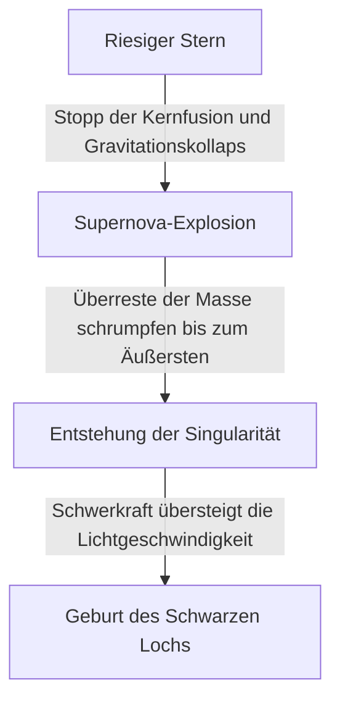

Im Universum existieren extreme Himmelskörper, die unsere Vorstellungskraft übersteigen. Der wohl mysteriöseste unter ihnen, der die Menschen unaufhörlich fasziniert, ist das "Schwarze Loch". Dieser Himmelskörper mit einer so starken Schwerkraft, dass nicht einmal Licht ihm entkommen kann, ist nicht nur ein beliebtes Thema der Science-Fiction, sondern auch eines der größten Rätsel an vorderster Front der modernen Physik.

In diesem Artikel werden wir tief und detailliert auf die grundlegenden Mechanismen von Schwarzen Löchern eingehen – von Einsteins allgemeiner Relativitätstheorie und dem Ereignishorizont bis hin zur "Hawking-Strahlung", die von Dr. Stephen Hawking postuliert wurde.

## Was ist ein Schwarzes Loch?

Ein Schwarzes Loch (Black Hole) bezeichnet eine Region der Raumzeit, in der aufgrund extremer Dichte und gewaltiger Masse eine derart starke Schwerkraft wirkt, dass weder Materie noch Licht (elektromagnetische Wellen) entkommen können.

Die Lichtgeschwindigkeit (etwa 300.000 Kilometer pro Sekunde) ist die Höchstgeschwindigkeit in diesem Universum. Sobald man jedoch einen bestimmten Abstand vom Zentrum eines Schwarzen Lochs unterschreitet, reicht selbst die Lichtgeschwindigkeit nicht mehr aus, um der Schwerkraft zu entkommen. Diese "Grenze ohne Wiederkehr" wird als **Ereignishorizont (Event Horizon)** bezeichnet.

### Der Entstehungsprozess

Viele Schwarze Löcher entstehen, wenn massereiche Sterne das Ende ihrer Lebensdauer erreichen.
Ein Stern behält normalerweise seine Form bei, weil sich der nach außen gerichtete Druck, der durch Kernfusionsreaktionen im Zentrum entsteht, und die nach innen gerichtete Schwerkraft, die durch die eigene Masse des Sterns verursacht wird, im Gleichgewicht befinden.

Wenn jedoch die Brennstoffe Wasserstoff und Helium aufgebraucht sind und sich schließlich ein Eisenkern bildet, finden keine weiteren Kernfusionsreaktionen mehr statt. Infolgedessen geht der nach außen gerichtete Druck verloren, und der Stern beginnt aufgrund seiner eigenen Schwerkraft rapide zu kollabieren (Gravitationskollaps).

Ein Stern mit geringer Masse (ähnlich der unserer Sonne) wird zu einem Weißen Zwerg, ein etwas größerer Stern zu einem Neutronenstern. Bei einem extrem schweren Stern mit der Dutzendfachen Sonnenmasse oder mehr kann der Gravitationskollaps jedoch nicht gestoppt werden, und er schrumpft schließlich zu einer "Singularität (Singularity)" mit einem Volumen von null und unendlicher Dichte. Auf diese Weise entsteht ein stellares Schwarzes Loch.

## Einstein und die Allgemeine Relativitätstheorie

Die Existenz von Schwarzen Löchern wurde theoretisch durch die **Allgemeine Relativitätstheorie (General Relativity)** vorhergesagt, die Albert Einstein 1915 veröffentlichte.

Die Allgemeine Relativitätstheorie beschreibt die Schwerkraft als "Krümmung der Raumzeit". Wenn ein Objekt mit Masse existiert, krümmt sich die Raumzeit (Raum und Zeit) in seiner Umgebung. Stellen Sie sich vor, Sie legen eine schwere Bowlingkugel auf ein Trampolin – das Gummituch sinkt ein. Wenn Sie dann eine Murmel darüber rollen lassen, fällt sie in die Vertiefung, die die Bowlingkugel erzeugt hat. Dies ist das wahre Gesicht der "Schwerkraft", wie sie von Einstein erklärt wurde.

### Die Schwarzschild-Lösung

Im Jahr 1916 leitete der deutsche Astrophysiker Karl Schwarzschild erstmals eine exakte Lösung für Einsteins Feldgleichungen der Gravitation ab (die Schwarzschild-Lösung). Er zeigte mathematisch, dass bei einer Konzentration der Masse auf einen einzigen Punkt die Raumzeit innerhalb eines bestimmten Radius (des Schwarzschild-Radius) extrem gekrümmt wird, sodass selbst Licht nicht mehr nach außen dringen kann.

$$ r_s = \frac{2GM}{c^2} $$

Hierbei steht $r_s$ für den Schwarzschild-Radius, $G$ für die Gravitationskonstante, $M$ für die Masse des Himmelskörpers und $c$ für die Lichtgeschwindigkeit. Wollte man die Erde in ein Schwarzes Loch verwandeln, müsste man ihre gesamte Masse in eine Kugel mit einem Radius von etwa 9 Millimetern pressen. Bei der Sonne wäre es ein Radius von etwa 3 Kilometern.

## Die Struktur eines Schwarzen Lochs: Ereignishorizont und Singularität

Ein Schwarzes Loch besteht grob aus mehreren Elementen.

### 1. Singularität (Singularity)
Der Punkt im Zentrum eines Schwarzen Lochs, an dem die Masse auf eine unendlich kleine Größe zusammengepresst ist. Hier werden Dichte und Raumzeitkrümmung unendlich, und die physikalischen Gesetze, wie wir sie heute kennen (einschließlich der allgemeinen Relativitätstheorie), brechen vollständig zusammen. Um die Singularität korrekt zu beschreiben, bedarf es vermutlich einer "Theorie der Quantengravitation", die die allgemeine Relativitätstheorie mit der Quantenmechanik vereint. Diese ist jedoch noch nicht vollendet.

### 2. Ereignishorizont (Event Horizon)
Die Grenze, die die Singularität umgibt. Überschreitet man diese Grenze nach innen, übersteigt die Fluchtgeschwindigkeit die Lichtgeschwindigkeit, sodass keinerlei Informationen nach außen gelangen können. Der Name leitet sich von der Bedeutung eines "Horizonts" (Horizon) ab, hinter dem "Ereignisse" (Event) unsichtbar werden.

### 3. Akkretionsscheibe (Accretion Disk)
Um ein Schwarzes Loch herum kann sich eine scheibenförmige Struktur bilden, wenn interstellares Gas, Staub oder Materie, die von einem Begleitstern in einem Doppelsternsystem abgerissen wurde, von der starken Schwerkraft angezogen wird und spiralförmig nach innen fällt. Durch die extreme Reibung zwischen den Materieteilchen entstehen ultrahohe Temperaturen, die starke Röntgen- und Gammastrahlen aussenden. Dass wir Schwarze Löcher "beobachten" können, verdanken wir dem Licht, das diese Akkretionsscheibe ausstrahlt.

### 4. Relativistischer Jet (Relativistic Jet)
Ein Phänomen, bei dem Plasma-Bündel mit nahezu Lichtgeschwindigkeit aus den Polregionen des Schwarzen Lochs ausgestoßen werden. Es wird angenommen, dass starke Magnetfelder daran beteiligt sind, aber der genaue Mechanismus wird noch immer intensiv erforscht.

## Hawking-Strahlung und das Informationsparadoxon

Lange Zeit glaubte man: "Ein Schwarzes Loch saugt alles ein und gibt absolut nichts mehr ab." Doch 1974 veröffentlichte der britische Physiker Stephen Hawking unter Anwendung der heisenbergschen Unschärferelation aus der Quantenmechanik eine bahnbrechende Theorie: "Schwarze Löcher geben Wärmestrahlung ab, verlieren dabei allmählich an Masse und verdampfen schließlich." Dies ist die **Hawking-Strahlung (Hawking Radiation)**.

### Quantenfluktuationen
In der Welt der Quantenmechanik existiert kein vollkommenes "Nichts" (Vakuum). Auf mikroskopischer Ebene entstehen ständig Paare aus Teilchen und Antiteilchen, die sich kurz darauf treffen und gegenseitig vernichten (Quantenfluktuation).

Wenn diese Paarbildung knapp außerhalb des Ereignishorizonts stattfindet, kann es passieren, dass ein Teilchen in das Schwarze Loch gesaugt wird, während das andere entkommt. Von außen betrachtet sieht es so aus, als würde das Schwarze Loch Teilchen abstrahlen. Das eingesaugte Teilchen besitzt eine "negative Energie", was dazu führt, dass die Masse des Schwarzen Lochs im Endeffekt abnimmt.

### Das Informationsparadoxon
Die Hawking-Strahlung brachte ein neues, schwieriges Problem für die Physik mit sich: das **Informationsparadoxon Schwarzer Löcher (Black Hole Information Paradox)**.

Gemäß den Grundprinzipien der Quantenmechanik dürfen "physikalische Informationen niemals verloren gehen". Wenn jedoch Materie in ein Schwarzes Loch gesaugt wird und das Schwarze Loch schließlich durch die Hawking-Strahlung vollständig verdampft und verschwindet – wo bleiben dann die Informationen der eingesaugten Materie (die Quantenzustandsinformationen darüber, ob es sich um ein Buch oder einen Apfel handelte)?

Dieses Problem wird auch heute noch von führenden theoretischen Physikern wie Leonard Susskind und Juan Maldacena heftig debattiert und ist eine treibende Kraft für neue Ideen wie das holografische Prinzip.

## Die Beobachtung Schwarzer Löcher: Vom EHT bis zu Gravitationswellen

Da Schwarze Löcher kein Licht aussenden, kann man sie nicht direkt sehen. Dank des technologischen Fortschritts ist es uns jedoch endlich gelungen, ihren "Schatten" einzufangen.

### EHT (Event Horizon Telescope)
Im April 2019 gab das internationale Forschungsteam "Event Horizon Telescope (EHT)" bekannt, dass es durch die Zusammenschaltung mehrerer Radioteleskope auf der Erde zu einem riesigen virtuellen Teleskop gelungen ist, das ringförmige Licht (die Akkretionsscheibe) um das supermassereiche Schwarze Loch im Zentrum der Galaxie M87 im Sternbild Jungfrau sowie dessen dunklen Schatten im Zentrum (den Schatten des Schwarzen Lochs) zu fotografieren. Dies war eine beispiellose Meisterleistung in der Geschichte der Menschheit und bewies, dass Einsteins Theorie selbst unter solch extremen Bedingungen ihre Gültigkeit behält.
Darüber hinaus wurde 2022 auch ein Bild von "Sagittarius A* (A-Stern)" im Zentrum unserer eigenen Milchstraße veröffentlicht.

### LIGO und Gravitationswellen
Im Jahr 2015 wies das amerikanische Gravitationswellen-Observatorium LIGO erstmals direkt die "Kräuselungen der Raumzeit" (Gravitationswellen) nach, die entstanden, als zwei Schwarze Löcher in einer Entfernung von 1,3 Milliarden Lichtjahren miteinander verschmolzen. Dies öffnete ein neues Fenster zur "Gravitationswellenastronomie", wodurch es nun möglich ist, die Tiefen des Universums zu erforschen, die weder durch Licht noch durch Radiowellen beobachtet werden können.

## Fazit

Schwarze Löcher sind zerstörerische "Monster des Universums", spielen aber gleichzeitig als "Schöpfer des Universums" eine wichtige Rolle bei der Entstehung und Entwicklung von Galaxien.
Zwar bleiben noch viele ungelöste Rätsel wie die Singularität und das Informationsparadoxon, doch mit der künftigen Entwicklung von Beobachtungstechnologien und Durchbrüchen in der theoretischen Physik könnte der Tag kommen, an dem die fundamentalen Wahrheiten der Raumzeit enthüllt werden.

Gerade in der absoluten Dunkelheit, der nicht einmal Licht entkommen kann, verbergen sich vielleicht die strahlendsten Geheimnisse des Universums.
