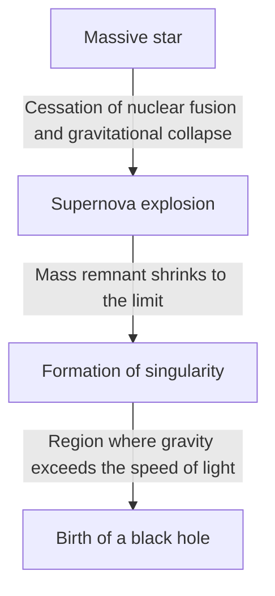

The universe is home to extreme celestial bodies that defy our imagination. Among them, the "black hole" is the most mysterious and never ceases to captivate many people. This celestial body, with gravity so intense that not even light can escape, is not merely a subject of science fiction; it is one of the greatest mysteries at the forefront of modern physics.

In this article, we will delve deeply and in detail into the fundamental mechanisms of black holes, from Einstein's general theory of relativity and the event horizon to "Hawking radiation" proposed by Dr. Stephen Hawking.

## What is a Black Hole?

A black hole is a region of spacetime where an extremely high density and massive mass create such strong gravity that nothing, not even light (electromagnetic waves), can escape from it.

The speed of light (approximately 300,000 kilometers per second) is the ultimate speed limit in this universe, but once you enter within a certain distance from the center of a black hole, even the speed of light cannot overcome its gravity. This "boundary of no return" is called the **Event Horizon**.

### The Formation Process

Many black holes are formed when massive stars reach the end of their lifespans.
Normally, a star maintains its shape through a balance between the outward pressure caused by nuclear fusion reactions in its core and the inward gravitational pull caused by its own mass.

However, when it exhausts its fuel, such as hydrogen and helium, and an iron core is ultimately formed, no further nuclear fusion reactions occur. As a result, the outward pressure is lost, and the star rapidly begins to collapse under its own gravity (gravitational collapse).

While a low-mass star (similar to the Sun) will become a white dwarf, and a slightly larger star will become a neutron star, a very massive star, tens of times the mass of the Sun or more, cannot stop the gravitational collapse and eventually shrinks into a "Singularity" with zero volume and infinite density. This is how a stellar-mass black hole is born.

## Einstein and the General Theory of Relativity

The theoretical prediction of the existence of black holes was made by Albert Einstein in 1915 with his **General Relativity**.

General relativity describes gravity as a "distortion of spacetime." The presence of an object with mass warps the spacetime (time and space) around it. Imagine placing a heavy bowling ball on a trampoline, causing the rubber sheet to sink. If you roll a marble onto it, it falls toward the depression created by the bowling ball. This is the true nature of "gravity" explained by Einstein.

### The Schwarzschild Solution

In 1916, German astrophysicist Karl Schwarzschild derived the first exact solution to Einstein's field equations of gravity (the Schwarzschild solution). He mathematically demonstrated that if mass is concentrated in a single point, within a certain radius (the Schwarzschild radius), spacetime becomes so extremely warped that even light cannot escape.

$$ r_s = \frac{2GM}{c^2} $$

Here, $r_s$ is the Schwarzschild radius, $G$ is the gravitational constant, $M$ is the mass of the celestial body, and $c$ is the speed of light. If we were to turn the Earth into a black hole, we would need to compress its mass into a sphere with a radius of about 9 millimeters. For the Sun, the radius would be about 3 kilometers.

## The Structure of a Black Hole: Event Horizon and Singularity

A black hole is broadly composed of several elements.

### 1. Singularity
The point at the center of a black hole where mass is crushed to an infinitely small size. Here, density and the curvature of spacetime become infinite, and the laws of physics as we know them today (including general relativity) completely break down. To correctly describe a singularity, a "theory of quantum gravity," which integrates general relativity and quantum mechanics, is considered necessary, but it has not yet been completed.

### 2. Event Horizon
The boundary line surrounding the singularity. Once this boundary is crossed and one enters the inside, the escape velocity exceeds the speed of light, so no information can be transmitted to the outside. It is named from the meaning of a "Horizon" beyond which "Events" can no longer be seen.

### 3. Accretion Disk
Around a black hole, interstellar gas, dust, or matter stripped from a companion star in a binary system can be drawn in by powerful gravity, forming a disk-like structure that spirals inward as it falls. Intense friction between the matter causes it to reach ultra-high temperatures, emitting powerful X-rays and gamma rays. It is thanks to the light emitted by this accretion disk that we are able to "observe" black holes.

### 4. Relativistic Jet
A phenomenon in which bundles of plasma are ejected from the polar directions of a black hole at speeds close to the speed of light. Powerful magnetic fields are thought to be involved, but detailed mechanisms continue to be researched today.

## Hawking Radiation and the Information Paradox

For a long time, it was thought that "a black hole sucks everything in and emits absolutely nothing." However, in 1974, British physicist Stephen Hawking used the uncertainty principle of quantum mechanics to present the astonishing theory that "black holes emit thermal radiation, gradually lose mass, and eventually evaporate." This is known as **Hawking Radiation**.

### Vacuum Fluctuations
In the world of quantum mechanics, a perfect "nothingness (vacuum)" does not exist. On a microscopic scale, a phenomenon called quantum fluctuation constantly occurs, where pairs of particles and antiparticles are created and then immediately meet and annihilate each other.

When this pair production occurs just outside the event horizon, one particle may be sucked into the black hole while the other escapes outside. From the outside, it appears as though particles are being radiated from the black hole. The particle that is sucked in has "negative energy," resulting in a decrease in the black hole's mass.

### The Information Paradox
Hawking radiation brought a new conundrum to physics. This is the **Black Hole Information Paradox**.

According to the fundamental principles of quantum mechanics, "physical information is never lost." However, if matter is sucked into a black hole and the black hole eventually completely evaporates and disappears due to Hawking radiation, where does the information of the sucked matter (the quantum state information of whether it was a book or an apple) go?

This problem is currently the subject of fierce debate among top theoretical physicists like Leonard Susskind and Juan Maldacena, and serves as a driving force for generating new ideas such as the holographic principle.

## Observing Black Holes: From EHT to Gravitational Waves

Because black holes do not emit light, they cannot be seen directly. However, thanks to technological advancements, we have finally succeeded in capturing their "shadows."

### EHT (Event Horizon Telescope)
In April 2019, the international research team "Event Horizon Telescope (EHT)" announced that by linking multiple radio telescopes on Earth to construct a single giant virtual telescope, they succeeded in capturing the ring-like light (accretion disk) and the central dark shadow (black hole shadow) surrounding the supermassive black hole at the center of the Virgo galaxy M87. This was an unprecedented achievement in human history and proved that Einstein's theory holds true even in extreme environments.
Furthermore, in 2022, an image of "Sagittarius A* (A-star)" located at the center of our Milky Way galaxy was also released.

### LIGO and Gravitational Waves
In 2015, the American gravitational-wave observatory LIGO made the first direct human detection of "ripples in spacetime (gravitational waves)" generated when two black holes, located 1.3 billion light-years away, merged. This opened a new window called "gravitational-wave astronomy," allowing us to explore the depths of the universe that cannot be observed with light or radio waves.

## Conclusion

Black holes are destructive "monsters of the universe," but at the same time, they possess the aspect of "creators of the universe," deeply involved in the formation and evolution of galaxies.
Although many unexplained mysteries, such as singularities and the information paradox, still remain, the day may come when the fundamental truths of spacetime are unraveled by the future development of observation technology and breakthroughs in theoretical physics.

It is precisely within the absolute darkness from which not even light can escape that the universe's most brilliant secrets are hidden.
