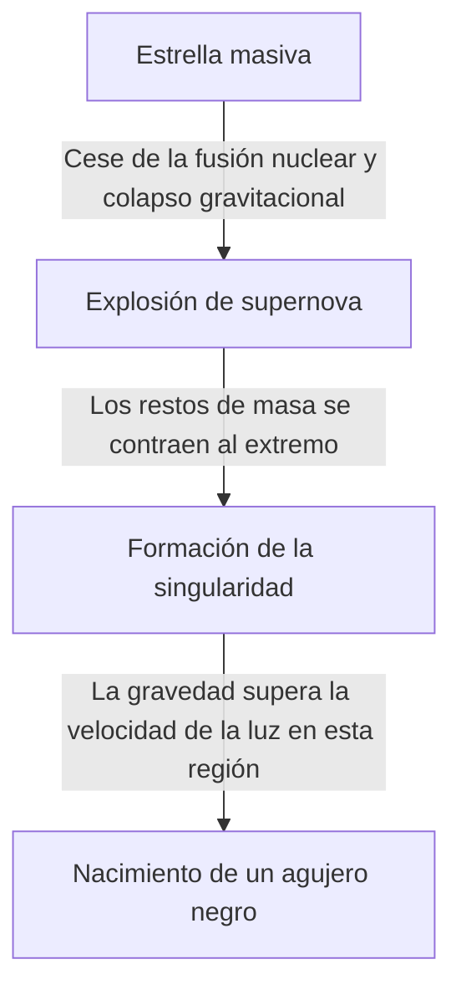

En el universo existen cuerpos celestes extremos que superan nuestra imaginación. Entre ellos, el más misterioso y que nunca deja de fascinar a muchas personas es el "agujero negro". Este cuerpo celeste, con una gravedad tan fuerte que ni siquiera la luz puede escapar, no es solo un tema de ciencia ficción, sino también uno de los mayores misterios en la vanguardia de la física moderna.

En este artículo, exploraremos en profundidad y detalle desde el mecanismo básico de un agujero negro hasta la teoría de la relatividad general de Einstein, el horizonte de sucesos (Event Horizon) y la "radiación de Hawking" propuesta por el Dr. Stephen Hawking.

## ¿Qué es un agujero negro?

Un agujero negro (Black Hole) se refiere a una región del espacio-tiempo donde, debido a su masa extremadamente masiva y alta densidad, ejerce una gravedad tan fuerte que nada, ni la materia ni la luz (ondas electromagnéticas), puede escapar.

La velocidad de la luz (aproximadamente 300.000 kilómetros por segundo) es la velocidad máxima en este universo, pero una vez que se entra dentro de una cierta distancia desde el centro de un agujero negro, incluso a la velocidad de la luz, es imposible liberarse de su gravedad. Esta "frontera de la que nunca se puede regresar" se llama **horizonte de sucesos (Event Horizon)**.

### El proceso de formación

Muchos agujeros negros se forman cuando una estrella masiva llega al final de su vida.
Normalmente, una estrella mantiene su forma gracias al equilibrio entre la presión generada por las reacciones de fusión nuclear en su núcleo, que tiende a expandirla hacia afuera, y la gravedad debida a su propia masa, que tiende a contraerla hacia adentro.

Sin embargo, cuando se agota el hidrógeno o el helio que sirve como combustible y finalmente se forma un núcleo de hierro, ya no ocurren más reacciones de fusión nuclear. Como resultado, se pierde la presión hacia afuera y la estrella comienza a colapsar rápidamente (colapso gravitacional) bajo su propia gravedad.

Si es una estrella de baja masa (similar a nuestro Sol), se convertirá en una enana blanca; si es un poco más grande, en una estrella de neutrones. Pero en el caso de estrellas muy masivas, con decenas de veces la masa del Sol, el colapso gravitacional no puede detenerse y, en última instancia, se contrae hasta convertirse en una "singularidad (Singularity)" con volumen cero y densidad infinita. Así es como nace un agujero negro de masa estelar.

## Einstein y la teoría de la relatividad general

La existencia de los agujeros negros fue predicha teóricamente por la **teoría de la relatividad general (General Relativity)** que Albert Einstein publicó en 1915.

La teoría de la relatividad general describe la gravedad como la "curvatura del espacio-tiempo". Cuando existe un objeto con masa, el espacio-tiempo (espacio y tiempo) a su alrededor se deforma. Es similar a poner una pesada bola de boliche en un trampolín, haciendo que la lona elástica se hunda. Si lanzas una canica allí, rodará hacia la depresión creada por la bola de boliche. Esta es la verdadera naturaleza de la "gravedad" explicada por Einstein.

### La solución de Schwarzschild

En 1916, el astrofísico alemán Karl Schwarzschild derivó por primera vez una solución exacta de las ecuaciones del campo gravitatorio de Einstein (la solución de Schwarzschild). Demostró matemáticamente que, si una masa se concentra en un solo punto, dentro de un cierto radio específico (el radio de Schwarzschild), el espacio-tiempo se deforma de manera tan extrema que ni siquiera la luz puede escapar.

$$ r_s = \frac{2GM}{c^2} $$

Donde $r_s$ es el radio de Schwarzschild, $G$ es la constante gravitacional, $M$ es la masa del cuerpo celeste y $c$ representa la velocidad de la luz. Si intentáramos convertir la Tierra en un agujero negro, tendríamos que comprimir toda su masa en una esfera de unos 9 milímetros de radio. Para el Sol, el radio sería de unos 3 kilómetros.

## La estructura de un agujero negro: el horizonte de sucesos y la singularidad

Un agujero negro se compone principalmente de varios elementos.

### 1. Singularidad (Singularity)
El punto en el centro del agujero negro donde la masa está aplastada a un tamaño infinitamente pequeño. Aquí, la densidad y la curvatura del espacio-tiempo se vuelven infinitas, y las leyes físicas actuales que conocemos (incluida la teoría de la relatividad general) colapsan por completo. Para describir correctamente la singularidad, se cree que es necesaria una "teoría de la gravedad cuántica" que integre la relatividad general y la mecánica cuántica, pero aún no se ha completado.

### 2. Horizonte de sucesos (Event Horizon)
La frontera que rodea la singularidad. Una vez que se cruza esta frontera hacia el interior, la velocidad de escape supera a la velocidad de la luz, por lo que ninguna información puede transmitirse al exterior. Recibe su nombre porque es un "horizonte (Horizon)" más allá del cual los "sucesos (Event)" ya no se pueden ver.

### 3. Disco de acreción (Accretion Disk)
Alrededor de un agujero negro, se puede formar una estructura en forma de disco cuando el gas interestelar, el polvo o el material arrancado de una estrella compañera en un sistema binario son atraídos por la intensa gravedad y caen en espiral. Debido a la fricción extrema entre la materia, alcanza temperaturas ultra altas y emite potentes rayos X y rayos gamma. El hecho de que podamos "observar" un agujero negro se debe en parte a la luz emitida por este disco de acreción.

### 4. Chorros relativistas (Relativistic Jet)
Un fenómeno en el cual haces de plasma son expulsados desde las direcciones polares del agujero negro a velocidades cercanas a la de la luz. Se cree que están involucrados fuertes campos magnéticos, pero su mecanismo detallado todavía se está investigando.

## La radiación de Hawking y la paradoja de la información

Durante mucho tiempo se pensó que "un agujero negro absorbe todo y no emite absolutamente nada". Sin embargo, en 1974, el físico británico Stephen Hawking utilizó el principio de incertidumbre de la mecánica cuántica para publicar la asombrosa teoría de que "los agujeros negros emiten radiación térmica, perdiendo masa poco a poco hasta finalmente evaporarse". Esto es la **radiación de Hawking (Hawking Radiation)**.

### Fluctuaciones del vacío
En el mundo de la mecánica cuántica, la "nada (vacío)" absoluta no existe. A escala microscópica, hay un fenómeno constante (fluctuación cuántica) en el que partículas y antipartículas se crean en pares y se aniquilan entre sí inmediatamente después.

Cuando esta creación de pares ocurre justo fuera del horizonte de sucesos, una de las partículas puede ser absorbida por el agujero negro mientras la otra escapa. Visto desde fuera, parece que el agujero negro está emitiendo partículas. Como la partícula absorbida tiene "energía negativa", la masa del agujero negro disminuye en consecuencia.

### Paradoja de la información
La radiación de Hawking trajo un nuevo rompecabezas a la física. Esta es la **paradoja de la información del agujero negro (Black Hole Information Paradox)**.

Según los principios fundamentales de la mecánica cuántica, "la información física nunca se pierde". Sin embargo, si la materia es absorbida por un agujero negro y este finalmente se evapora y desaparece por completo a través de la radiación de Hawking, ¿a dónde va a parar la información (información del estado cuántico sobre si era un libro o una manzana) de la materia absorbida?

Este problema sigue siendo debatido intensamente por físicos teóricos de primer nivel como Leonard Susskind y Juan Maldacena, y es la fuerza impulsora detrás de nuevas ideas como el principio holográfico.

## La observación de agujeros negros: desde el EHT hasta las ondas gravitacionales

Como los agujeros negros no emiten luz, no pueden verse directamente. Sin embargo, gracias a los avances tecnológicos, finalmente hemos logrado capturar su "sombra".

### EHT (Event Horizon Telescope)
En abril de 2019, el equipo de investigación internacional "Event Horizon Telescope (EHT)" anunció que, vinculando varios radiotelescopios en la Tierra para construir un telescopio virtual gigante, había logrado fotografiar la luz en forma de anillo (disco de acreción) y la sombra oscura central (sombra del agujero negro) alrededor del agujero negro supermasivo en el centro de la galaxia M87, en la constelación de Virgo. Esta fue una hazaña sin precedentes en la historia de la humanidad, que demostró que la teoría de Einstein también era correcta en entornos extremos.
Además, en 2022, también se publicó una imagen de "Sagitario A* (A estrella)", en el centro de nuestra galaxia, la Vía Láctea.

### LIGO y las ondas gravitacionales
En 2015, el observatorio de ondas gravitacionales estadounidense LIGO detectó directamente por primera vez en la historia de la humanidad "ondulaciones en el espacio-tiempo (ondas gravitacionales)" generadas por la fusión de dos agujeros negros a 1.300 millones de años luz de distancia. Esto abrió una nueva ventana llamada "astronomía de ondas gravitacionales", permitiéndonos explorar las profundidades del universo que no se pueden observar con luz o radio.

## Conclusión

Los agujeros negros son "monstruos cósmicos" destructivos, pero al mismo tiempo tienen un aspecto como "creadores cósmicos" profundamente involucrados en la formación y evolución de las galaxias.
Todavía quedan muchos misterios sin resolver, como las singularidades y la paradoja de la información, pero con el futuro desarrollo de la tecnología de observación y los avances en la física teórica, puede llegar el día en que se revelen las verdades fundamentales del espacio-tiempo.

Es en la oscuridad absoluta, de la que ni siquiera la luz puede escapar, donde se esconden los secretos más brillantes del universo.
