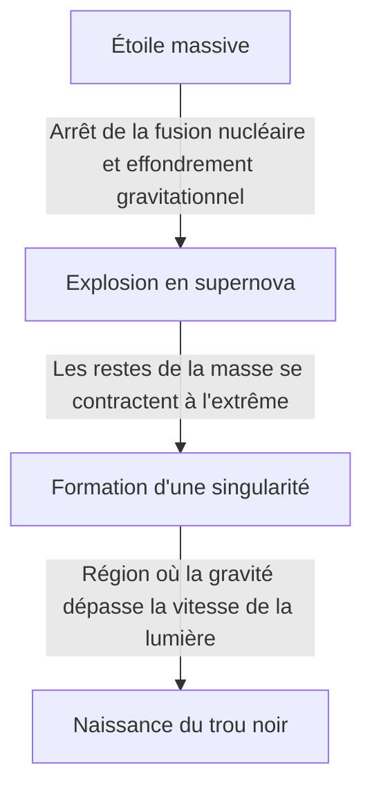

L'univers abrite des objets cosmiques extrêmes qui défient notre imagination. Parmi eux, le plus mystérieux et celui qui ne cesse de fasciner les foules est le « trou noir ». Cet objet céleste, doté d'une gravité si intense que même la lumière ne peut s'en échapper, n'est pas seulement un sujet de science-fiction, mais représente aussi l'une des plus grandes énigmes à la pointe de la physique moderne.

Dans cet article, nous explorerons en profondeur et en détail les mécanismes fondamentaux des trous noirs, allant de la théorie de la relativité générale d'Einstein à l'horizon des événements, en passant par le « rayonnement de Hawking » théorisé par le Dr Stephen Hawking.

## Qu'est-ce qu'un trou noir ?

Un trou noir (Black Hole) désigne une région de l'espace-temps extrêmement dense et massive, où la force de gravité est si puissante que ni la matière ni même la lumière (les ondes électromagnétiques) ne peuvent s'en échapper.

La vitesse de la lumière (environ 300 000 kilomètres par seconde) est la vitesse maximale dans notre univers, mais si l'on s'approche en deçà d'une certaine distance du centre d'un trou noir, même la vitesse de la lumière ne suffit plus pour vaincre sa gravité. Cette « frontière de non-retour » est appelée l'**horizon des événements (Event Horizon)**.

### Processus de formation

La plupart des trous noirs se forment lorsqu'une étoile massive arrive à la fin de sa vie.
Les étoiles conservent généralement leur forme grâce à l'équilibre entre la pression générée par les réactions de fusion nucléaire en leur cœur, qui pousse vers l'extérieur, et la gravité due à leur propre masse, qui les fait se contracter vers l'intérieur.

Cependant, lorsque le carburant (hydrogène et hélium) est épuisé et qu'un noyau de fer finit par se former, plus aucune réaction de fusion nucléaire ne se produit. En conséquence, la pression dirigée vers l'extérieur disparaît et l'étoile commence à s'effondrer brutalement sur elle-même sous l'effet de sa propre gravité (effondrement gravitationnel).

Si l'étoile a une faible masse (similaire à celle du Soleil), elle devient une naine blanche, et si elle est un peu plus massive, une étoile à neutrons. Toutefois, dans le cas d'étoiles très massives (plusieurs dizaines de fois la masse du Soleil), l'effondrement gravitationnel ne peut être stoppé, et l'étoile finit par se contracter jusqu'à atteindre un volume nul et une densité infinie : la « singularité (Singularity) ». C'est ainsi que naissent les trous noirs stellaires.

## Einstein et la relativité générale

L'existence des trous noirs a été prédite théoriquement par la **théorie de la relativité générale (General Relativity)**, publiée par Albert Einstein en 1915.

La relativité générale décrit la gravité comme une « déformation de l'espace-temps ». Lorsqu'un objet doté d'une masse est présent, l'espace-temps (l'espace et le temps) qui l'entoure se déforme. Imaginez une lourde boule de bowling placée sur un trampoline : la toile s'enfonce. Si vous y faites rouler une bille, elle tombera vers le creux formé par la boule de bowling. Voilà la véritable nature de la « gravité » expliquée par Einstein.

### La solution de Schwarzschild

En 1916, l'astrophysicien allemand Karl Schwarzschild a dérivé pour la première fois une solution exacte aux équations du champ gravitationnel d'Einstein (la solution de Schwarzschild). Il a démontré mathématiquement que si la masse était concentrée en un seul point, l'espace-temps serait si extrêmement déformé en deçà d'un certain rayon (le rayon de Schwarzschild) que même la lumière ne pourrait plus s'en échapper.

$$ r_s = \frac{2GM}{c^2} $$

Ici, $r_s$ représente le rayon de Schwarzschild, $G$ la constante gravitationnelle, $M$ la masse de l'astre céleste, et $c$ la vitesse de la lumière. Si nous devions transformer la Terre en trou noir, il faudrait compresser toute sa masse dans une sphère d'environ 9 millimètres de rayon. Pour le Soleil, ce rayon serait d'environ 3 kilomètres.

## La structure d'un trou noir : l'horizon des événements et la singularité

Un trou noir est principalement composé de plusieurs éléments.

### 1. La singularité (Singularity)
Le point situé au centre du trou noir, où la masse est écrasée en un point infiniment petit. Ici, la densité et la courbure de l'espace-temps deviennent infinies, et les lois actuelles de la physique telles que nous les connaissons (y compris la relativité générale) s'effondrent complètement. Pour décrire correctement la singularité, il est admis qu'une théorie de la « gravité quantique », intégrant la relativité générale et la mécanique quantique, est nécessaire, mais elle n'est pas encore achevée.

### 2. L'horizon des événements (Event Horizon)
La frontière entourant la singularité. Si l'on franchit cette limite vers l'intérieur, la vitesse de libération dépasse la vitesse de la lumière, empêchant toute information d'être transmise vers l'extérieur. Son nom vient du fait que les « événements (Event) » situés au-delà de cet « horizon (Horizon) » deviennent invisibles.

### 3. Le disque d'accrétion (Accretion Disk)
Autour d'un trou noir, il se forme parfois une structure en forme de disque dans laquelle le gaz interstellaire, la poussière ou la matière arrachée à l'étoile compagne d'un système binaire tombe en tourbillonnant, attiré par la puissante gravité. La friction intense entre ces matières crée des températures extrêmement élevées, émettant de puissants rayons X et gamma. C'est grâce à la lumière émise par ce disque d'accrétion que nous pouvons « observer » les trous noirs.

### 4. Les jets relativistes (Relativistic Jet)
Le phénomène par lequel des faisceaux de plasma sont éjectés depuis les pôles d'un trou noir à une vitesse proche de celle de la lumière. On pense que de puissants champs magnétiques y sont impliqués, mais le mécanisme détaillé fait toujours l'objet de recherches à ce jour.

## Le rayonnement de Hawking et le paradoxe de l'information

Pendant longtemps, on a cru que « les trous noirs absorbaient tout et ne rejetaient absolument rien ». Cependant, en 1974, le physicien britannique Stephen Hawking a publié une théorie stupéfiante en utilisant le principe d'incertitude de la mécanique quantique : « les trous noirs émettent un rayonnement thermique, perdant progressivement de la masse pour finalement s'évaporer ». C'est ce qu'on appelle le **rayonnement de Hawking (Hawking Radiation)**.

### Les fluctuations quantiques du vide
Dans le monde de la mécanique quantique, le « néant (vide) » absolu n'existe pas. À l'échelle microscopique, des particules et des antiparticules sont constamment créées par paires pour s'annihiler presque immédiatement (fluctuations quantiques).

Lorsque cette création de paires se produit juste à l'extérieur de l'horizon des événements, il arrive qu'une particule soit aspirée dans le trou noir tandis que l'autre s'échappe vers l'extérieur. Vu de l'extérieur, il semble que le trou noir émette une particule. La particule absorbée portant une « énergie négative », la masse du trou noir finit par diminuer.

### Le paradoxe de l'information
Le rayonnement de Hawking a soulevé un nouveau défi en physique. Il s'agit du **paradoxe de l'information du trou noir (Black Hole Information Paradox)**.

Selon les principes fondamentaux de la mécanique quantique, « l'information physique n'est jamais perdue ». Mais si de la matière est aspirée par un trou noir et que ce dernier finit par s'évaporer complètement et disparaître à cause du rayonnement de Hawking, qu'advient-il des informations de la matière absorbée (savoir s'il s'agissait d'un livre ou d'une pomme, c'est-à-dire l'information sur son état quantique) ?

Ce problème fait encore aujourd'hui l'objet de vifs débats parmi les meilleurs physiciens théoriciens, tels que Leonard Susskind ou Juan Maldacena, et constitue un moteur d'innovation pour de nouvelles idées telles que le principe holographique.

## L'observation des trous noirs : de l'EHT aux ondes gravitationnelles

Puisque les trous noirs n'émettent pas de lumière, il est impossible de les voir directement. Cependant, grâce aux avancées technologiques, nous avons enfin réussi à capturer leur « ombre ».

### L'EHT (Event Horizon Telescope)
En avril 2019, l'équipe de recherche internationale « Event Horizon Telescope (EHT) » a relié plusieurs radiotélescopes terrestres pour construire un seul télescope virtuel géant. Elle a annoncé avoir réussi à photographier l'anneau de lumière (le disque d'accrétion) entourant le trou noir supermassif au centre de la galaxie M87 de la Vierge, ainsi que son ombre centrale sombre (l'ombre du trou noir). Il s'agissait d'une prouesse historique, prouvant que la théorie d'Einstein restait exacte même dans des environnements extrêmes.
De plus, en 2022, l'image de « Sagittarius A* (A-star) », situé au centre de notre propre Voie lactée, a également été dévoilée.

### LIGO et les ondes gravitationnelles
En 2015, l'observatoire américain d'ondes gravitationnelles LIGO a détecté directement, pour la première fois de l'histoire humaine, les « ondulations de l'espace-temps (ondes gravitationnelles) » provoquées par la fusion de deux trous noirs situés à 1,3 milliard d'années-lumière. Cela a ouvert une nouvelle fenêtre appelée « astronomie des ondes gravitationnelles », nous permettant d'explorer les profondeurs de l'univers, invisibles à la lumière et aux ondes radio.

## En conclusion

Les trous noirs sont à la fois des « monstres cosmiques » destructeurs et des « créateurs de l'univers », jouant un rôle profond dans la formation et l'évolution des galaxies.
De nombreux mystères inexpliqués subsistent encore, tels que la singularité et le paradoxe de l'information. Cependant, avec le développement futur des technologies d'observation et les avancées en physique théorique, le jour viendra peut-être où la vérité fondamentale de l'espace-temps sera élucidée.

C'est précisément dans cette obscurité absolue, dont même la lumière ne peut s'échapper, que sont dissimulés les secrets les plus éclatants de l'univers.
