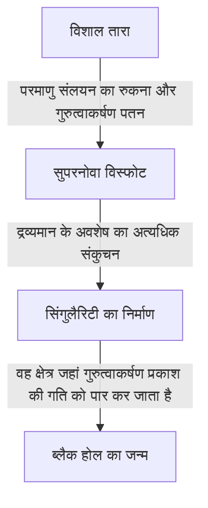

ब्रह्मांड में हमारी कल्पना से भी परे कई चरम खगोलीय पिंड मौजूद हैं। इनमें से सबसे रहस्यमयी और लोगों को सबसे ज्यादा आकर्षित करने वाला पिंड 'ब्लैक होल' है। एक ऐसा खगोलीय पिंड जिसका गुरुत्वाकर्षण इतना अधिक शक्तिशाली है कि प्रकाश भी इससे बच नहीं सकता, यह केवल विज्ञान कथाओं का विषय नहीं है, बल्कि आधुनिक भौतिकी के सबसे मोर्चे पर मौजूद सबसे बड़े रहस्यों में से एक है।

इस लेख में, हम ब्लैक होल की बुनियादी कार्यप्रणाली से लेकर आइंस्टीन के जनरल रिलेटिविटी के सिद्धांत, इवेंट होराइजन (Event Horizon) और डॉ. स्टीफन हॉकिंग द्वारा प्रस्तावित 'हॉकिंग रेडिएशन' तक, सभी विषयों पर गहराई से और विस्तार से चर्चा करेंगे।

## ब्लैक होल क्या है?

ब्लैक होल (Black Hole) स्पेस-टाइम (अंतरिक्ष-समय) का एक ऐसा क्षेत्र है जहाँ अत्यधिक घनत्व और विशाल द्रव्यमान के कारण गुरुत्वाकर्षण इतना शक्तिशाली होता है कि पदार्थ ही नहीं, बल्कि प्रकाश (विद्युत चुम्बकीय तरंगें) भी इससे बाहर नहीं निकल सकता।

प्रकाश की गति (लगभग 3,00,000 किलोमीटर प्रति सेकंड) इस ब्रह्मांड में सबसे तेज गति है, लेकिन यदि आप ब्लैक होल के केंद्र से एक निश्चित दूरी के भीतर प्रवेश करते हैं, तो प्रकाश की गति भी उसके गुरुत्वाकर्षण को मात नहीं दे सकती। इस 'नो रिटर्न की सीमा' को **इवेंट होराइजन (Event Horizon)** या घटना क्षितिज कहा जाता है।

### निर्माण की प्रक्रिया

अधिकांश ब्लैक होल तब बनते हैं जब विशाल तारों का जीवनकाल समाप्त हो जाता है।
तारे आमतौर पर अपने केंद्र में परमाणु संलयन प्रतिक्रियाओं के कारण बाहर की ओर विस्तार करने वाले दबाव, और तारे के स्वयं के द्रव्यमान के कारण अंदर की ओर सिकुड़ने वाले गुरुत्वाकर्षण के बीच संतुलन बनाकर अपना आकार बनाए रखते हैं।

हालांकि, जब ईंधन के रूप में हाइड्रोजन और हीलियम खत्म हो जाते हैं और अंततः लोहे का कोर बन जाता है, तो आगे कोई परमाणु संलयन प्रतिक्रिया नहीं होती है। परिणामस्वरूप, बाहर की ओर जाने वाला दबाव खत्म हो जाता है और तारा अपने ही गुरुत्वाकर्षण के कारण तेजी से ढहने (गुरुत्वाकर्षण पतन) लगता है।

यदि तारे का द्रव्यमान कम है (सूर्य के समान), तो यह एक सफेद बौना (White Dwarf) बन जाता है, और यदि यह थोड़ा बड़ा है, तो यह एक न्यूट्रॉन तारा बन जाता है। लेकिन सूर्य के द्रव्यमान से दर्जनों गुना अधिक विशाल तारों के मामले में, गुरुत्वाकर्षण पतन को रोका नहीं जा सकता है, और यह अंततः सिकुड़कर शून्य आयतन और अनंत घनत्व वाली 'सिंगुलैरिटी (Singularity)' बन जाता है। इस प्रकार एक तारकीय द्रव्यमान वाले ब्लैक होल (Stellar-mass black hole) का जन्म होता है।

## आइंस्टीन और जनरल रिलेटिविटी का सिद्धांत

ब्लैक होल के अस्तित्व की सैद्धांतिक भविष्यवाणी अल्बर्ट आइंस्टीन ने 1915 में अपने **जनरल रिलेटिविटी के सिद्धांत (General Relativity)** में की थी।

जनरल रिलेटिविटी गुरुत्वाकर्षण को 'स्पेस-टाइम में वक्रता (Curvature of Spacetime)' के रूप में वर्णित करता है। जब द्रव्यमान वाली कोई वस्तु मौजूद होती है, तो उसके चारों ओर का स्पेस-टाइम (समय और अंतरिक्ष) मुड़ जाता है। यह एक ट्रैम्पोलिन पर भारी बॉलिंग बॉल रखने की कल्पना करने जैसा है, जिससे रबर शीट नीचे दब जाती है। यदि आप वहां एक कंचा घुमाते हैं, तो वह बॉलिंग बॉल द्वारा बनाए गए गड्ढे की ओर गिरेगा। यही आइंस्टीन द्वारा वर्णित 'गुरुत्वाकर्षण' का वास्तविक स्वरूप है।

### श्वार्जस्चिल्ड समाधान (Schwarzschild Solution)

1916 में, जर्मन खगोल भौतिक विज्ञानी कार्ल श्वार्जस्चिल्ड ने पहली बार आइंस्टीन के गुरुत्वाकर्षण क्षेत्र के समीकरणों का सटीक समाधान (श्वार्जस्चिल्ड समाधान) निकाला। उन्होंने गणितीय रूप से यह दर्शाया कि यदि द्रव्यमान एक बिंदु पर केंद्रित हो, तो एक विशिष्ट त्रिज्या (श्वार्जस्चिल्ड त्रिज्या) के अंदर स्पेस-टाइम इतना अधिक विकृत हो जाएगा कि प्रकाश भी बाहर नहीं निकल पाएगा।

$$ r_s = \frac{2GM}{c^2} $$

यहाँ, $r_s$ श्वार्जस्चिल्ड त्रिज्या है, $G$ गुरुत्वाकर्षण स्थिरांक है, $M$ खगोलीय पिंड का द्रव्यमान है, और $c$ प्रकाश की गति है। यदि हम पृथ्वी को एक ब्लैक होल में बदलना चाहते हैं, तो इसके पूरे द्रव्यमान को लगभग 9 मिलीमीटर त्रिज्या वाले एक गोले के अंदर दबाना होगा। सूर्य के मामले में, यह त्रिज्या लगभग 3 किलोमीटर है।

## ब्लैक होल की संरचना: इवेंट होराइजन और सिंगुलैरिटी

ब्लैक होल को मुख्य रूप से कई तत्वों से बना माना जाता है।

### 1. सिंगुलैरिटी (Singularity)
यह ब्लैक होल के केंद्र में मौजूद वह बिंदु है जहां द्रव्यमान अनंत रूप से छोटे आकार में कुचल जाता है। यहां, घनत्व और स्पेस-टाइम की वक्रता अनंत हो जाती है, और भौतिकी के वर्तमान नियम जो हम जानते हैं (जनरल रिलेटिविटी सहित) पूरी तरह से टूट जाते हैं। सिंगुलैरिटी का सही वर्णन करने के लिए, 'क्वांटम ग्रेविटी के सिद्धांत' की आवश्यकता मानी जाती है जो जनरल रिलेटिविटी और क्वांटम यांत्रिकी को एकीकृत करता हो, लेकिन यह अभी तक पूरा नहीं हुआ है।

### 2. इवेंट होराइजन (Event Horizon)
यह सिंगुलैरिटी को घेरने वाली सीमा रेखा है। यदि कोई इस सीमा को पार करके अंदर जाता है, तो एस्केप वेलोसिटी (पलायन वेग) प्रकाश की गति से अधिक हो जाती है, इसलिए कोई भी जानकारी बाहर नहीं भेजी जा सकती। इसे यह नाम इसलिए दिया गया है क्योंकि यह वह 'क्षितिज (Horizon)' है जिसके पार कोई 'घटना (Event)' नहीं देखी जा सकती।

### 3. एक्रीशन डिस्क (Accretion Disk)
ब्लैक होल के चारों ओर एक डिस्क जैसी संरचना बन सकती है जिसमें अंतरतारकीय गैस और धूल, या बाइनरी सिस्टम में साथी तारे से छिने गए पदार्थ तीव्र गुरुत्वाकर्षण के कारण भंवर की तरह घूमते हुए गिरते हैं। पदार्थों के बीच तीव्र घर्षण के कारण यह अत्यधिक गर्म हो जाती है और शक्तिशाली एक्स-रे तथा गामा किरणें उत्सर्जित करती है। यह इस एक्रीशन डिस्क से निकलने वाला प्रकाश ही है जिसके कारण हम ब्लैक होल का 'अवलोकन' कर पाते हैं।

### 4. रिलेटिविस्टिक जेट (Relativistic Jet)
यह वह घटना है जिसमें ब्लैक होल के ध्रुवों से प्रकाश की गति के करीब की गति पर प्लाज्मा की एक धारा निकलती है। माना जाता है कि इसमें शक्तिशाली चुंबकीय क्षेत्र शामिल हैं, लेकिन इसके विस्तृत तंत्र पर अभी भी शोध किया जा रहा है।

## हॉकिंग रेडिएशन और सूचना विरोधाभास (Information Paradox)

लंबे समय तक यह माना जाता था कि 'ब्लैक होल सब कुछ निगल लेता है और कभी कुछ भी बाहर नहीं छोड़ता'। हालांकि, 1974 में, ब्रिटिश भौतिक विज्ञानी स्टीफन हॉकिंग ने क्वांटम यांत्रिकी के अनिश्चितता सिद्धांत (Uncertainty Principle) का उपयोग करते हुए यह चौंकाने वाला सिद्धांत प्रस्तुत किया कि 'ब्लैक होल थर्मल रेडिएशन उत्सर्जित करते हैं, जिससे वे धीरे-धीरे अपना द्रव्यमान खोते हैं और अंततः वाष्पित हो जाते हैं'। इसे ही **हॉकिंग रेडिएशन (Hawking Radiation)** कहा जाता है।

### निर्वात का उतार-चढ़ाव (Quantum Fluctuation)
क्वांटम यांत्रिकी की दुनिया में, पूर्ण 'शून्यता (निर्वात)' का कोई अस्तित्व नहीं है। सूक्ष्म स्तर पर देखने पर, कण और प्रतिकण (Anti-particle) जोड़े में उत्पन्न होते हैं और तुरंत एक-दूसरे से टकराकर नष्ट हो जाते हैं। यह घटना (क्वांटम उतार-चढ़ाव) लगातार हो रही है।

जब यह जोड़ा इवेंट होराइजन के ठीक बाहर बनता है, तो एक कण ब्लैक होल में खिंच सकता है, जबकि दूसरा बाहर निकल सकता है। बाहर से देखने पर ऐसा लगता है जैसे ब्लैक होल से कण उत्सर्जित हो रहे हैं। क्योंकि अंदर खिंचे जाने वाले कण में 'नकारात्मक ऊर्जा' होती है, इसके परिणामस्वरूप ब्लैक होल का द्रव्यमान कम हो जाता है।

### सूचना विरोधाभास (Information Paradox)
हॉकिंग रेडिएशन ने भौतिकी में एक नई समस्या खड़ी कर दी। इसे **ब्लैक होल सूचना विरोधाभास (Black Hole Information Paradox)** कहा जाता है।

क्वांटम यांत्रिकी के मूल सिद्धांत के अनुसार, 'भौतिक जानकारी कभी नष्ट नहीं होती'। लेकिन, अगर कोई पदार्थ ब्लैक होल में खिंच जाता है, और अंततः ब्लैक होल हॉकिंग रेडिएशन के कारण पूरी तरह से वाष्पित होकर गायब हो जाता है, तो अंदर गए पदार्थ की जानकारी (क्वांटम स्थिति की जानकारी, जैसे कि क्या वह एक किताब थी या सेब) का क्या होता है? वह कहाँ चली जाती है?

यह समस्या अभी भी लियोनार्ड सुस्काइंड और जुआन मालदासेना जैसे शीर्ष स्तर के सैद्धांतिक भौतिक विज्ञानियों के बीच गहन बहस का विषय है, और इसने होलोग्राफिक सिद्धांत (Holographic Principle) जैसे नए विचारों को जन्म देने में प्रेरक शक्ति के रूप में काम किया है।

## ब्लैक होल का अवलोकन: EHT से लेकर गुरुत्वाकर्षण तरंगों तक

चूंकि ब्लैक होल प्रकाश उत्सर्जित नहीं करते, इसलिए उन्हें सीधे नहीं देखा जा सकता। हालांकि, तकनीकी प्रगति के कारण, हम अंततः इसकी 'छाया' को कैद करने में सफल रहे हैं।

### EHT (इवेंट होराइजन टेलीस्कोप)
अप्रैल 2019 में, अंतर्राष्ट्रीय शोध दल 'इवेंट होराइजन टेलीस्कोप (EHT)' ने घोषणा की कि उन्होंने एक विशाल आभासी दूरबीन बनाने के लिए पृथ्वी पर कई रेडियो दूरबीनों को जोड़ा, और कन्या (Virgo) तारामंडल में गैलेक्सी M87 के केंद्र में स्थित सुपरमैसिव ब्लैक होल के चारों ओर वलय के आकार के प्रकाश (एक्रीशन डिस्क) और उसके केंद्र की गहरी छाया (ब्लैक होल शैडो) की तस्वीर लेने में सफलता प्राप्त की। यह मानव इतिहास में एक अभूतपूर्व उपलब्धि थी, जिसने साबित कर दिया कि आइंस्टीन का सिद्धांत चरम वातावरण में भी सही है।
इसके बाद 2022 में, हमारी आकाशगंगा (Milky Way) के केंद्र में स्थित 'सैगिटेरियस ए* (Sagittarius A*)' की छवि भी जारी की गई।

### LIGO और गुरुत्वाकर्षण तरंगें (Gravitational Waves)
2015 में, अमेरिकी गुरुत्वाकर्षण तरंग वेधशाला (LIGO) ने 1.3 अरब प्रकाश वर्ष दूर दो ब्लैक होल के विलय से उत्पन्न 'स्पेस-टाइम में लहरों (गुरुत्वाकर्षण तरंगों)' का पहली बार प्रत्यक्ष रूप से पता लगाया। इसने 'गुरुत्वाकर्षण तरंग खगोल विज्ञान' की एक नई खिड़की खोल दी, जिससे ब्रह्मांड की उन गहराइयों का पता लगाना संभव हो गया जिन्हें प्रकाश या रेडियो तरंगों के माध्यम से नहीं देखा जा सकता।

## निष्कर्ष

ब्लैक होल न केवल विनाशकारी 'अंतरिक्ष के राक्षस' हैं, बल्कि आकाशगंगाओं के निर्माण और विकास में गहराई से शामिल 'ब्रह्मांड के निर्माता' के रूप में भी कार्य करते हैं।
हालांकि सिंगुलैरिटी और सूचना विरोधाभास जैसे कई अनसुलझे रहस्य अभी भी बाकी हैं, लेकिन भविष्य में अवलोकन तकनीक में प्रगति और सैद्धांतिक भौतिकी में सफलताओं के साथ, वह दिन आ सकता है जब स्पेस-टाइम के मूलभूत सत्य उजागर हो जाएंगे।

उस परम अंधकार के भीतर, जहां से प्रकाश भी नहीं बच सकता, ब्रह्मांड के सबसे चमकदार रहस्य छिपे हुए हैं。
