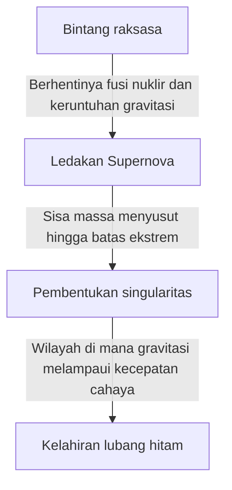

Di alam semesta ini, terdapat benda-benda langit ekstrem yang melampaui imajinasi kita. Di antaranya, yang paling misterius dan tidak pernah berhenti memikat perhatian banyak orang adalah "lubang hitam" (black hole). Benda langit ini memiliki gravitasi yang sangat kuat hingga cahaya sekalipun tidak dapat lolos darinya, dan bukan hanya sekadar tema fiksi ilmiah, melainkan salah satu misteri terbesar di garis depan fisika modern.

Dalam artikel ini, kita akan membahas secara mendalam dan terperinci, mulai dari mekanisme dasar lubang hitam, teori relativitas umum Einstein, horizon peristiwa (event horizon), hingga "radiasi Hawking" yang diusulkan oleh Dr. Stephen Hawking.

## Apa Itu Lubang Hitam?

Lubang hitam (Black Hole) merujuk pada wilayah ruang-waktu di mana gravitasi bekerja begitu kuat akibat kepadatan dan massa yang sangat besar, sehingga tidak hanya materi, tetapi bahkan cahaya (gelombang elektromagnetik) tidak dapat melarikan diri.

Kecepatan cahaya (sekitar 300.000 kilometer per detik) adalah kecepatan tertinggi di alam semesta ini. Namun, jika sesuatu memasuki jarak tertentu dari pusat lubang hitam, bahkan dengan kecepatan cahaya pun, ia tidak akan mampu melepaskan diri dari tarikan gravitasinya. Batas "titik tanpa harapan untuk kembali" ini disebut sebagai **Horizon Peristiwa (Event Horizon)**.

### Proses Pembentukan

Sebagian besar lubang hitam terbentuk ketika sebuah bintang bermassa besar mencapai akhir masa hidupnya.
Biasanya, sebuah bintang mempertahankan bentuknya karena adanya keseimbangan antara tekanan yang berusaha mengembang ke luar akibat reaksi fusi nuklir di intinya, dan gravitasi yang berusaha menyusut ke dalam akibat massa bintang itu sendiri.

Namun, ketika bahan bakar seperti hidrogen dan helium habis dan inti besi terbentuk pada akhirnya, reaksi fusi nuklir tidak akan terjadi lagi. Akibatnya, tekanan ke arah luar menghilang, dan bintang mulai runtuh secara tiba-tiba (keruntuhan gravitasi) di bawah gravitasinya sendiri.

Jika bintang memiliki massa yang kecil (seukuran Matahari), ia akan menjadi katai putih, dan jika sedikit lebih besar, ia akan menjadi bintang neutron. Namun, pada kasus bintang yang sangat masif, puluhan kali massa Matahari, keruntuhan gravitasi tidak dapat dihentikan dan pada akhirnya akan menyusut menjadi "Singularitas (Singularity)" dengan volume nol dan kepadatan tak terhingga. Beginilah lubang hitam bermassa bintang lahir.

## Einstein dan Teori Relativitas Umum

Keberadaan lubang hitam diprediksi secara teoritis oleh **Teori Relativitas Umum (General Relativity)** yang diumumkan oleh Albert Einstein pada tahun 1915.

Teori relativitas umum mendeskripsikan gravitasi sebagai "kelengkungan ruang-waktu". Ketika terdapat objek bermassa, ruang-waktu (ruang dan waktu) di sekitarnya akan melengkung. Bayangkan meletakkan bola boling yang berat di atas sebuah trampolin, maka lembaran karet tersebut akan melesak ke bawah. Jika Anda menggelindingkan kelereng ke sana, kelereng tersebut akan jatuh ke arah cekungan yang dibuat oleh bola boling. Inilah identitas asli "gravitasi" seperti yang dijelaskan oleh Einstein.

### Solusi Schwarzschild

Pada tahun 1916, astrofisikawan Jerman Karl Schwarzschild untuk pertama kalinya menemukan solusi eksak untuk persamaan medan gravitasi Einstein (Solusi Schwarzschild). Dia secara matematis menunjukkan bahwa jika sebuah massa dikonsentrasikan pada satu titik tunggal, maka di dalam radius tertentu (Radius Schwarzschild), ruang-waktu akan melengkung secara ekstrem sehingga cahaya sekalipun tidak dapat keluar.

$$ r_s = \frac{2GM}{c^2} $$

Di mana, $r_s$ adalah radius Schwarzschild, $G$ adalah konstanta gravitasi, $M$ adalah massa benda langit, dan $c$ adalah kecepatan cahaya. Jika kita ingin menjadikan Bumi sebagai lubang hitam, kita harus memampatkan massanya ke dalam sebuah bola dengan radius sekitar 9 milimeter. Untuk Matahari, radiusnya adalah sekitar 3 kilometer.

## Struktur Lubang Hitam: Horizon Peristiwa dan Singularitas

Lubang hitam secara garis besar tersusun dari beberapa elemen utama.

### 1. Singularitas (Singularity)
Titik di pusat lubang hitam di mana massanya dimampatkan menjadi ukuran yang sangat kecil dan tak terhingga. Di titik ini, kepadatan dan kelengkungan ruang-waktu menjadi tak terhingga, dan hukum fisika yang kita kenal saat ini (termasuk teori relativitas umum) hancur sepenuhnya. Untuk dapat mendeskripsikan singularitas secara tepat, diyakini bahwa kita memerlukan "teori gravitasi kuantum" yang mengintegrasikan teori relativitas umum dan mekanika kuantum, namun teori ini masih belum selesai.

### 2. Horizon Peristiwa (Event Horizon)
Batas yang mengelilingi singularitas. Begitu sesuatu melewati batas ini dan masuk ke dalam, kecepatan lepasnya melampaui kecepatan cahaya, sehingga informasi apa pun tidak dapat diteruskan ke luar. Dinamakan demikian karena "Peristiwa (Event)" menjadi tidak terlihat di balik "Cakrawala (Horizon)".

### 3. Piringan Akresi (Accretion Disk)
Di sekitar lubang hitam, materi seperti gas dan debu antarbintang, atau materi yang dilucuti dari bintang pendamping dalam sistem biner, ditarik oleh gravitasi yang sangat kuat, dan sering kali membentuk struktur mirip piringan tempat materi tersebut berputar dan jatuh ke dalam. Gesekan yang hebat antara materi-materi tersebut menyebabkannya bersuhu sangat tinggi, dan memancarkan sinar-X serta sinar gamma yang kuat. Kita dapat "mengobservasi" lubang hitam berkat cahaya yang dipancarkan oleh piringan akresi ini.

### 4. Jet Relativistik (Relativistic Jet)
Sebuah fenomena di mana seberkas plasma memancar dari arah kutub lubang hitam dengan kecepatan yang mendekati kecepatan cahaya. Meskipun diyakini bahwa medan magnet yang kuat terlibat dalam fenomena ini, mekanisme rincinya masih terus diteliti hingga saat ini.

## Radiasi Hawking dan Paradoks Informasi

Untuk waktu yang sangat lama, diyakini bahwa "lubang hitam menyedot segala sesuatu dan tidak akan pernah melepaskan apa pun." Namun pada tahun 1974, fisikawan Inggris Stephen Hawking menggunakan prinsip ketidakpastian dalam mekanika kuantum untuk mengumumkan teori mengejutkan yang menyatakan bahwa "lubang hitam memancarkan radiasi termal, secara perlahan kehilangan massanya, dan pada akhirnya menguap." Inilah yang disebut **Radiasi Hawking (Hawking Radiation)**.

### Fluktuasi Kuantum (Quantum Fluctuation)
Dalam dunia mekanika kuantum, tidak ada "ketiadaan (vakum)" yang absolut. Pada skala mikroskopis, fenomena terbentuknya pasangan partikel dan antipartikel yang kemudian segera bertemu dan saling memusnahkan (fluktuasi kuantum) terjadi secara terus-menerus.

Ketika pembentukan pasangan ini terjadi tepat di luar horizon peristiwa, salah satu partikel mungkin tersedot ke dalam lubang hitam, sementara yang lainnya melarikan diri ke luar. Dari luar, hal ini terlihat seolah-olah lubang hitam sedang memancarkan partikel. Partikel yang tersedot memiliki "energi negatif", sehingga pada akhirnya massa lubang hitam akan berkurang.

### Paradoks Informasi
Radiasi Hawking membawa tantangan baru bagi dunia fisika. Itulah **Paradoks Informasi Lubang Hitam (Black Hole Information Paradox)**.

Menurut prinsip dasar mekanika kuantum, "informasi fisik tidak pernah hilang." Namun, jika materi tersedot ke dalam lubang hitam, dan pada akhirnya lubang hitam tersebut menguap sepenuhnya karena radiasi Hawking hingga menghilang, ke mana perginya informasi dari materi yang tersedot tersebut (informasi keadaan kuantum tentang apakah materi itu sebuah buku, atau sebuah apel)?

Masalah ini masih terus diperdebatkan secara sengit oleh para fisikawan teoritis kelas atas seperti Leonard Susskind dan Juan Maldacena, dan telah menjadi kekuatan pendorong bagi terciptanya ide-ide baru seperti prinsip holografik.

## Pengamatan Lubang Hitam: Dari EHT hingga Gelombang Gravitasi

Karena lubang hitam tidak memancarkan cahaya, ia tidak dapat dilihat secara langsung. Namun, dengan kemajuan teknologi, kita akhirnya berhasil menangkap "bayangan"-nya.

### EHT (Event Horizon Telescope)
Pada April 2019, tim peneliti internasional "Event Horizon Telescope (EHT)" menghubungkan beberapa teleskop radio di bumi untuk membangun sebuah teleskop virtual raksasa, dan mengumumkan keberhasilannya menangkap gambar cahaya berbentuk cincin (piringan akresi) di sekitar lubang hitam supermasif di pusat galaksi M87 di rasi bintang Virgo, beserta bayangan gelap di pusatnya (bayangan lubang hitam). Ini adalah sebuah pencapaian yang belum pernah terjadi sebelumnya dalam sejarah umat manusia, dan membuktikan bahwa teori Einstein benar bahkan di lingkungan yang paling ekstrem sekalipun.
Lebih lanjut, pada tahun 2022, gambar "Sagittarius A* (A-star)" yang berada di pusat galaksi Bima Sakti tempat kita tinggal, juga dipublikasikan.

### LIGO dan Gelombang Gravitasi
Pada tahun 2015, teleskop gelombang gravitasi Amerika Serikat, LIGO, menjadi yang pertama dalam sejarah umat manusia yang mendeteksi langsung "riak ruang-waktu (gelombang gravitasi)" yang dihasilkan ketika dua lubang hitam, yang berjarak 1,3 miliar tahun cahaya, bergabung. Hal ini membuka jendela baru yang disebut "astronomi gelombang gravitasi", memungkinkan kita untuk menjelajahi kedalaman alam semesta yang tidak dapat diamati menggunakan cahaya atau gelombang radio.

## Penutup

Lubang hitam, selain merupakan "monster kosmik" yang merusak, juga memiliki sisi sebagai "pencipta kosmik" yang sangat terlibat dalam pembentukan dan evolusi galaksi.
Meski masih banyak misteri yang belum terpecahkan, seperti singularitas dan paradoks informasi, seiring dengan perkembangan teknologi pengamatan dan terobosan dalam fisika teoritis di masa depan, mungkin akan tiba harinya di mana kebenaran fundamental tentang ruang-waktu dapat terungkap.

Justru di dalam kegelapan absolut di mana cahaya sekalipun tidak dapat meloloskan diri, tersembunyi rahasia paling cemerlang dari alam semesta.
