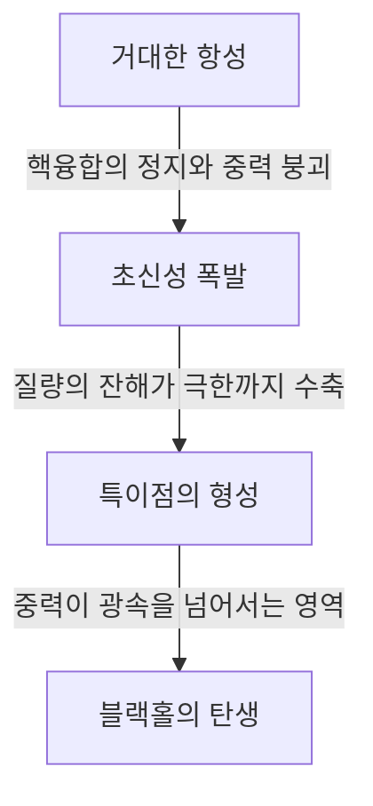

우주에는 우리의 상상을 초월하는 극한의 천체들이 존재합니다. 그 중에서도 가장 미스터리하고 수많은 사람들을 매료시키는 것이 바로 '블랙홀'입니다. 빛조차 빠져나갈 수 없을 만큼 강력한 중력을 가진 이 천체는 단순한 SF의 소재에 그치지 않고, 현대 물리학의 최전선에 있는 가장 큰 수수께끼 중 하나이기도 합니다.

본 기사에서는 블랙홀의 기본적인 원리부터 아인슈타인의 일반상대성이론, 사건의 지평선(이벤트 호라이즌), 그리고 스티븐 호킹 박사가 제창한 '호킹 복사'에 이르기까지 깊고 상세하게 파헤쳐 설명해 드립니다.

## 블랙홀이란 무엇인가?

블랙홀(Black Hole)이란 매우 높은 밀도와 큰 질량을 가지고 있어 강력한 중력이 작용하며, 물질뿐만 아니라 빛(전자기파)조차 탈출할 수 없는 시공간의 영역을 가리킵니다.

광속(초속 약 30만 킬로미터)은 이 우주에서 가장 빠른 속도이지만, 블랙홀의 중심에서 일정 거리 이내로 들어가면 빛의 속도로도 그 중력을 뿌리칠 수 없게 됩니다. 이 '두 번 다시 돌아올 수 없는 경계선'을 **사건의 지평선(Event Horizon)**이라고 부릅니다.

### 형성 과정

대부분의 블랙홀은 질량이 큰 항성이 그 수명을 다할 때 형성됩니다.
별은 보통 중심부에서의 핵융합 반응을 통해 바깥쪽으로 팽창하려는 압력과 별 자신의 질량으로 인해 안쪽으로 수축하려는 중력이 균형을 이룸으로써 그 형태를 유지합니다.

하지만 연료인 수소나 헬륨을 다 소진하고 최종적으로 철로 된 코어가 형성되면 더 이상의 핵융합 반응은 일어나지 않게 됩니다. 그 결과 바깥쪽으로 향하는 압력이 사라지고, 별은 스스로의 중력에 의해 급격히 붕괴(중력 붕괴)를 시작합니다.

질량이 작은 별(태양과 비슷한 정도)이라면 백색왜성으로, 조금 더 큰 별이라면 중성자별이 되지만, 태양 질량의 수십 배 이상이라는 매우 무거운 별의 경우 중력 붕괴를 멈추지 못하고 최종적으로 부피가 0이고 밀도가 무한대인 '특이점(Singularity)'까지 수축해 버립니다. 이렇게 탄생하는 것이 항성 질량 블랙홀입니다.

## 아인슈타인과 일반상대성이론

블랙홀의 존재를 이론적으로 예언한 것은 알베르트 아인슈타인이 1915년에 발표한 **일반상대성이론(General Relativity)**입니다.

일반상대성이론은 중력을 '시공간의 휘어짐'으로 기술합니다. 질량을 가진 물체가 존재하면 그 주변의 시공간(시간과 공간)이 휘어집니다. 트램펄린 위에 무거운 볼링공을 올려두면 고무 시트가 가라앉는 모습을 상상해 보세요. 그곳에 쇠구슬을 굴리면 볼링공이 만든 웅덩이를 향해 굴러떨어지게 됩니다. 이것이 아인슈타인이 설명한 '중력'의 정체입니다.

### 슈바르츠실트 해

1916년, 독일의 천체물리학자 카를 슈바르츠실트는 아인슈타인의 중력장 방정식의 엄밀해를 처음으로 도출해냈습니다(슈바르츠실트 해). 그는 질량이 한 점에 집중되었을 경우 특정 반경(슈바르츠실트 반경)보다 안쪽에서는 시공간이 극단적으로 휘어져 빛조차 밖으로 빠져나올 수 없게 된다는 것을 수학적으로 증명했습니다.

$$ r_s = \frac{2GM}{c^2} $$

여기서 $r_s$는 슈바르츠실트 반경, $G$는 중력상수, $M$은 천체의 질량, $c$는 광속을 나타냅니다. 만약 지구를 블랙홀로 만들고자 한다면 그 질량을 반경 약 9밀리미터의 구 안에 밀어넣어야 합니다. 태양의 경우에는 반경 약 3킬로미터입니다.

## 블랙홀의 구조: 사건의 지평선과 특이점

블랙홀은 크게 몇 가지 요소로 구성되어 있습니다.

### 1. 특이점(Singularity)
블랙홀의 중심에 있는, 질량이 무한히 작게 짓눌린 점. 이곳에서는 밀도와 시공간의 곡률이 무한대가 되어 우리가 알고 있는 현재의 물리 법칙(일반상대성이론 포함)이 완전히 붕괴되고 맙니다. 특이점을 올바르게 기술하기 위해서는 일반상대성이론과 양자역학을 통합한 '양자중력 이론'이 필요할 것으로 생각되지만, 아직 완성에는 이르지 못했습니다.

### 2. 사건의 지평선(Event Horizon)
특이점을 둘러싼 경계선. 이 경계를 넘어 안쪽으로 들어가면 탈출 속도가 광속을 넘어서기 때문에 그 어떤 정보도 밖으로 전달할 수 없습니다. '사건(Event)'이 보이지 않게 되는 '지평선(Horizon)'이라는 의미에서 이름 붙여졌습니다.

### 3. 강착 원반(Accretion Disk)
블랙홀의 주변에는 성간 가스와 먼지, 혹은 쌍성계의 동반성으로부터 떨어져 나온 물질이 강력한 중력에 이끌려 소용돌이치며 떨어져 내리는 원반 모양의 구조가 형성되기도 합니다. 물질들 간의 격렬한 마찰로 인해 초고온 상태가 되며, 강력한 X선이나 감마선을 방출합니다. 우리가 블랙홀을 '관측'할 수 있는 것은 이 강착 원반이 뿜어내는 빛 덕분입니다.

### 4. 상대론적 제트(Relativistic Jet)
블랙홀의 극 방향에서 광속에 가까운 속도로 플라스마 다발이 분출되는 현상. 강력한 자기장이 관여하고 있는 것으로 여겨지지만, 그 상세한 메커니즘은 현재도 계속해서 연구되고 있습니다.

## 호킹 복사와 정보 역설

오랫동안 '블랙홀은 모든 것을 빨아들이기만 할 뿐 절대 아무것도 방출하지 않는다'고 여겨져 왔습니다. 하지만 1974년 영국의 물리학자 스티븐 호킹은 양자역학의 불확정성 원리를 사용하여 '블랙홀은 열복사를 하고 있으며 조금씩 질량을 잃어 최종적으로는 증발한다'는 경이로운 이론을 발표했습니다. 이것이 **호킹 복사(Hawking Radiation)**입니다.

### 진공의 요동
양자역학의 세계에서는 완벽한 '무(진공)'란 존재하지 않습니다. 미시적인 척도로 보면 입자와 반입자가 쌍으로 생성되고 직후에 만나 쌍소멸하는 현상(양자 요동)이 끊임없이 일어나고 있습니다.

사건의 지평선 바로 바깥쪽에서 이러한 쌍생성이 일어났을 때, 한쪽 입자가 블랙홀로 빨려 들어가고 다른 한쪽은 밖으로 달아나는 경우가 있습니다. 밖에서 보면 블랙홀로부터 입자가 방출되고 있는 것처럼 보입니다. 빨려 들어간 입자는 '음의 에너지'를 갖기 때문에 결과적으로 블랙홀의 질량은 감소하게 됩니다.

### 정보 역설
호킹 복사는 물리학에 새로운 난제를 가져왔습니다. 그것이 바로 **블랙홀 정보 역설(Black Hole Information Paradox)**입니다.

양자역학의 기본 원리에 따르면 '물리적인 정보는 결코 소실되지 않는다'고 합니다. 하지만 물질이 블랙홀에 빨려 들어가고 최종적으로 블랙홀이 호킹 복사에 의해 완전히 증발하여 소멸해 버린 경우, 빨려 들어간 물질의 정보(그것이 책이었는지, 사과였는지와 같은 양자 상태의 정보)는 어디로 가버리는 것일까요?

이 문제는 현재도 레너드 서스킨드나 후안 말다세나와 같은 세계 최고 수준의 이론 물리학자들 사이에서 격렬한 논쟁이 벌어지고 있으며, 홀로그래픽 원리 등 새로운 아이디어를 탄생시키는 원동력이 되고 있습니다.

## 블랙홀의 관측: EHT부터 중력파까지

블랙홀은 빛을 발하지 않기 때문에 직접 볼 수는 없습니다. 하지만 기술의 진보로 인해 우리는 마침내 그 '그림자'를 포착해내는 데 성공했습니다.

### EHT(이벤트 호라이즌 망원경)
2019년 4월, 국제 연구팀 '이벤트 호라이즌 망원경(EHT)'은 지구상의 여러 전파망원경을 연동시켜 하나의 거대한 가상 망원경을 구축해, 처녀자리 은하 M87의 중심에 있는 초대질량 블랙홀 주변의 고리 모양 빛(강착 원반)과 중심의 어두운 그림자(블랙홀 섀도)를 촬영하는 데 성공했다고 발표했습니다. 이는 인류 역사상 최초의 쾌거이자, 아인슈타인의 이론이 극한 환경에서도 옳다는 것을 증명하는 것이었습니다.
게다가 2022년에는 우리가 사는 우리은하 중심에 있는 '궁수자리 A*(에이스타)'의 이미지도 공개되었습니다.

### LIGO와 중력파
2015년 미국의 중력파 망원경 LIGO는 13억 광년 떨어진 두 개의 블랙홀이 병합할 때 발생한 '시공간의 잔물결(중력파)'을 인류 최초로 직접 검출해냈습니다. 이로써 '중력파 천문학'이라는 새로운 창이 열리며 빛이나 전파로는 관측할 수 없는 우주의 심연을 탐구할 수 있게 되었습니다.

## 맺음말

블랙홀은 파괴적인 '우주의 몬스터'인 동시에 은하의 형성과 진화에 깊이 관여하는 '우주의 창조주'로서의 측면도 함께 가지고 있습니다.
특이점이나 정보 역설 등 미해결된 수수께끼가 아직 많이 남아있지만, 앞으로의 관측 기술 발전이나 이론 물리학의 돌파구를 통해 시공간의 근원적인 진리가 밝혀질 날이 올지도 모릅니다.

빛조차 빠져나갈 수 없는 절대적인 암흑 속에 비로소 우주의 가장 눈부신 비밀이 숨겨져 있는 것입니다.
