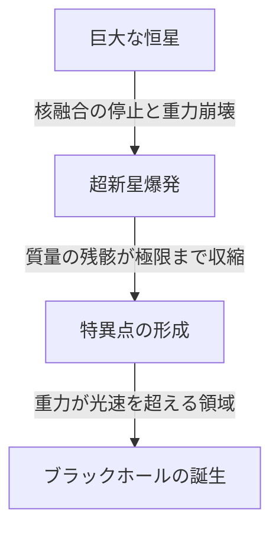

宇宙には、私たちの想像を絶するような極限の天体が存在します。その中でも最もミステリアスで、かつ多くの人々を惹きつけてやまないのが「ブラックホール」です。光すら逃れられないほどの強い重力を持つこの天体は、単なるSFの題材にとどまらず、現代物理学の最前線における最大の謎の一つでもあります。

本記事では、ブラックホールの基本的な仕組みから、アインシュタインの一般相対性理論、事象の地平面（イベント・ホライズン）、そしてスティーヴン・ホーキング博士が提唱した「ホーキング放射」に至るまで、深く詳細に掘り下げて解説します。

## ブラックホールとは何か？

ブラックホール（Black Hole）とは、極めて高密度で大質量を持つために、強い重力が働き、物質だけでなく光（電磁波）さえも脱出することができない時空の領域を指します。

光速（秒速約30万キロメートル）は、この宇宙における最高速度ですが、ブラックホールの中心から一定の距離以内に入ると、光の速度をもってしてもその重力を振り切ることができなくなります。この「二度と戻ってくることのできない境界線」を**事象の地平面（Event Horizon）**と呼びます。

### 形成のプロセス

多くのブラックホールは、質量の大きな恒星がその寿命を終える際に形成されます。
星は通常、中心部での核融合反応によって外側に向かって膨張しようとする圧力と、星自身の質量による内側に向かって収縮しようとする重力が釣り合うことで、その形を保っています。

しかし、燃料となる水素やヘリウムを使い果たし、最終的に鉄のコアが形成されると、それ以上の核融合反応は起きなくなります。その結果、外側に向かう圧力が失われ、星は自らの重力によって急激に崩壊（重力崩壊）を始めます。

質量の小さな星（太陽と同程度）であれば白色矮星に、もう少し大きな星であれば中性子星になりますが、太陽の質量の数十倍以上という非常に重い星の場合、重力崩壊を止めることができず、最終的に体積ゼロ・密度無限大の「特異点（Singularity）」にまで収縮してしまいます。こうして誕生するのが恒星質量ブラックホールです。

## アインシュタインと一般相対性理論

ブラックホールの存在を理論的に予言したのが、アルベルト・アインシュタインが1915年に発表した**一般相対性理論（General Relativity）**です。

一般相対性理論は、重力を「時空の歪み」として記述します。質量を持つ物体が存在すると、その周囲の時空（時間と空間）が歪みます。トランポリンの上に重いボウリングの球を置くと、ゴムのシートが沈み込むようなイメージです。そこへパチンコ玉を転がすと、ボウリングの球が作ったくぼみに向かって落ちていきます。これが、アインシュタインが説明した「重力」の正体です。

### シュヴァルツシルト解

1916年、ドイツの天体物理学者カール・シュヴァルツシルトは、アインシュタインの重力場の方程式の厳密解を初めて導き出しました（シュヴァルツシルト解）。彼は、質量が一点に集中した場合、ある特定の半径（シュヴァルツシルト半径）よりも内側では、時空が極端に歪み、光すら外に出られなくなることを数学的に示しました。

$$ r_s = \frac{2GM}{c^2} $$

ここで、$r_s$ はシュヴァルツシルト半径、$G$ は重力定数、$M$ は天体の質量、$c$ は光速を表します。もし地球をブラックホールにしようとすると、その質量を半径約9ミリメートルの球の中に押し込む必要があります。太陽の場合は、半径約3キロメートルです。

## ブラックホールの構造：事象の地平面と特異点

ブラックホールは、大きく分けていくつかの要素から構成されています。

### 1. 特異点（Singularity）
ブラックホールの中心にある、質量が無限に小さく押し潰された点。ここでは、密度と時空の曲率が無限大となり、私たちが知っている現在の物理法則（一般相対性理論を含む）が完全に崩壊してしまいます。特異点を正しく記述するためには、一般相対性理論と量子力学を統合した「量子重力理論」が必要であると考えられていますが、未だ完成には至っていません。

### 2. 事象の地平面（Event Horizon）
特異点を囲む境界線。この境界を超えて内側に入ると、脱出速度が光速を超えてしまうため、いかなる情報も外に伝えることができません。「事象（Event）」が見えなくなる「地平線（Horizon）」という意味から名付けられました。

### 3. 降着円盤（Accretion Disk）
ブラックホールの周囲には、星間ガスや塵、あるいは連星系の伴星から引き剥がされた物質が、強力な重力に引かれて渦を巻きながら落下していく円盤状の構造が形成されることがあります。物質同士の激しい摩擦によって超高温となり、強力なX線やガンマ線を放射します。私たちがブラックホールを「観測」できるのは、この降着円盤が放つ光のおかげです。

### 4. 相対論的ジェット（Relativistic Jet）
ブラックホールの極方向から、光速に近い速度でプラズマの束が噴出する現象。強力な磁場が関与していると考えられていますが、その詳細なメカニズムは現在も研究が続けられています。

## ホーキング放射と情報パラドックス

長らく、「ブラックホールはあらゆるものを吸い込み、絶対に何も放出しない」と考えられていました。しかし1974年、イギリスの物理学者スティーヴン・ホーキングは、量子力学の不確定性原理を用いることで、「ブラックホールは熱放射を行っており、少しずつ質量を失って最終的には蒸発する」という驚異的な理論を発表しました。これが**ホーキング放射（Hawking Radiation）**です。

### 真空のゆらぎ
量子力学の世界では、完全な「無（真空）」は存在しません。微視的なスケールで見ると、粒子と反粒子がペアで生成され、直後に出会って対消滅するという現象（量子ゆらぎ）が絶えず起きています。

事象の地平面のすぐ外側でこのペア生成が起きた時、一方の粒子がブラックホールに吸い込まれ、もう一方が外へ逃れ去ることがあります。外から見ると、ブラックホールから粒子が放射されているように見えます。吸い込まれた粒子は「負のエネルギー」を持つため、結果的にブラックホールの質量は減少します。

### 情報パラドックス
ホーキング放射は、物理学に新たな難問をもたらしました。それが**ブラックホール情報パラドックス（Black Hole Information Paradox）**です。

量子力学の基本原理によれば、「物理的な情報は決して失われない」とされています。しかし、物質がブラックホールに吸い込まれ、最終的にブラックホールがホーキング放射によって完全に蒸発して消滅してしまった場合、吸い込まれた物質の情報（それが本だったのか、リンゴだったのか、という量子状態の情報）はどこへ行ってしまうのでしょうか？

この問題は、現在もレオナルド・サスキンドやフアン・マルダセナといったトップクラスの理論物理学者たちによって激しい議論が交わされており、ホログラフィック原理などの新しいアイデアを生み出す原動力となっています。

## ブラックホールの観測：EHTから重力波まで

ブラックホールは光を発しないため、直接見ることはできません。しかし、技術の進歩により、私たちはついにその「影」を捉えることに成功しました。

### EHT（イベント・ホライズン・テレスコープ）
2019年4月、国際研究チーム「イベント・ホライズン・テレスコープ（EHT）」は、地球上の複数の電波望遠鏡を連動させて一つの巨大な仮想望遠鏡を構築し、おとめ座の銀河M87の中心にある超大質量ブラックホールの周囲のリング状の光（降着円盤）と、中心の暗い影（ブラックホール・シャドウ）の撮影に成功したと発表しました。これは人類史上初の快挙であり、アインシュタインの理論が極限環境でも正しいことを証明するものでした。
さらに2022年には、私たちの住む天の川銀河の中心にある「いて座A*（エースター）」の画像も公開されました。

### LIGOと重力波
2015年、アメリカの重力波望遠鏡LIGOは、13億光年離れた2つのブラックホールが合体した際に生じた「時空のさざなみ（重力波）」を人類で初めて直接検出しました。これにより、「重力波天文学」という新たな窓が開き、光や電波では観測できない宇宙の深淵を探ることができるようになりました。

## 終わりに

ブラックホールは、破壊的な「宇宙のモンスター」であると同時に、銀河の形成や進化に深く関わる「宇宙の創造主」としての側面も持ち合わせています。
特異点や情報パラドックスなど、未解明の謎はまだ多く残されていますが、今後の観測技術の発展や理論物理学のブレイクスルーにより、時空の根源的な真理が解き明かされる日が来るかもしれません。

光すら逃れられない絶対的な暗黒の中にこそ、宇宙の最も輝かしい秘密が隠されているのです。
