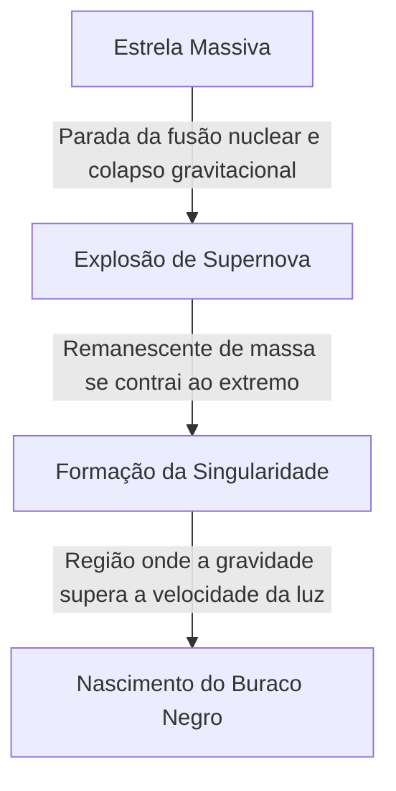

No universo, existem corpos celestes extremos que superam a nossa imaginação. Entre eles, o mais misterioso e que nunca deixa de fascinar as pessoas é o "buraco negro". Este corpo celeste, com uma gravidade tão intensa da qual nem a luz consegue escapar, não é apenas um tema de ficção científica, mas também um dos maiores mistérios na vanguarda da física moderna.

Neste artigo, aprofundaremos em detalhes desde o mecanismo básico dos buracos negros, passando pela teoria da relatividade geral de Einstein, o horizonte de eventos, até a "radiação Hawking", proposta pelo Dr. Stephen Hawking.

## O Que é um Buraco Negro?

Um buraco negro (Black Hole) refere-se a uma região do espaço-tempo que possui uma densidade extrema e uma massa colossal, resultando em uma forte força gravitacional de onde nem mesmo a matéria e a luz (ondas eletromagnéticas) conseguem escapar.

A velocidade da luz (cerca de 300.000 quilômetros por segundo) é a velocidade máxima neste universo, mas ao entrar a uma certa distância do centro de um buraco negro, nem mesmo essa velocidade pode superar sua atração gravitacional. Esse "limite de onde não há retorno" é chamado de **horizonte de eventos (Event Horizon)**.

### O Processo de Formação

Muitos buracos negros são formados quando estrelas de grande massa chegam ao fim de suas vidas.
Normalmente, as estrelas mantêm a sua forma devido ao equilíbrio entre a pressão que tenta expandi-las para fora, gerada por reações de fusão nuclear em seus núcleos, e a gravidade gerada por sua própria massa, que tenta colapsá-las para dentro.

No entanto, quando esgotam o hidrogênio e o hélio que servem como combustível, e por fim forma-se um núcleo de ferro, não ocorrem mais reações de fusão nuclear. Como resultado, a pressão voltada para fora se perde e a estrela começa a colapsar rapidamente (colapso gravitacional) sob seu próprio peso.

Se for uma estrela de massa pequena (semelhante à do Sol), ela se tornará uma anã branca, e se for um pouco maior, uma estrela de nêutrons. Porém, no caso de estrelas extremamente massivas, com dezenas de vezes a massa do Sol, o colapso gravitacional não pode ser contido, contraindo-se até se tornar uma "singularidade (Singularity)" de volume zero e densidade infinita. Assim nasce um buraco negro de massa estelar.

## Einstein e a Teoria da Relatividade Geral

A existência de buracos negros foi prevista teoricamente pela **Teoria da Relatividade Geral (General Relativity)**, apresentada por Albert Einstein em 1915.

A relatividade geral descreve a gravidade como uma "curvatura do espaço-tempo". Quando um objeto com massa existe, o espaço-tempo (espaço e tempo) ao seu redor se curva. Imagine colocar uma pesada bola de boliche sobre um trampolim, fazendo a lona afundar. Se você rolar uma bola de gude ali, ela cairá em direção à depressão criada pela bola de boliche. Esta é a verdadeira natureza da "gravidade" explicada por Einstein.

### A Solução de Schwarzschild

Em 1916, o astrofísico alemão Karl Schwarzschild deduziu pela primeira vez a solução exata para as equações de campo de Einstein (Solução de Schwarzschild). Ele demonstrou matematicamente que, se uma massa se concentrar em um único ponto, dentro de um determinado raio (raio de Schwarzschild), o espaço-tempo se curva de forma tão extrema que nem a luz consegue escapar.

$$ r_s = \frac{2GM}{c^2} $$

Aqui, $r_s$ representa o raio de Schwarzschild, $G$ a constante gravitacional, $M$ a massa do corpo celeste e $c$ a velocidade da luz. Se fôssemos transformar a Terra em um buraco negro, teríamos que comprimir toda a sua massa em uma esfera com um raio de cerca de 9 milímetros. Para o Sol, o raio seria de aproximadamente 3 quilômetros.

## Estrutura de um Buraco Negro: O Horizonte de Eventos e a Singularidade

Os buracos negros são compostos basicamente por alguns elementos principais.

### 1. Singularidade (Singularity)
O ponto no centro de um buraco negro onde a massa foi esmagada até se tornar infinitamente pequena. Aqui, a densidade e a curvatura do espaço-tempo tornam-se infinitas, e as leis atuais da física que conhecemos (incluindo a relatividade geral) colapsam completamente. Acredita-se que uma "teoria da gravidade quântica", que unifique a relatividade geral e a mecânica quântica, seja necessária para descrever a singularidade corretamente, mas ela ainda não está concluída.

### 2. Horizonte de Eventos (Event Horizon)
A fronteira que circunda a singularidade. Ao cruzar esse limite e entrar, a velocidade de escape excede a velocidade da luz, impossibilitando a transmissão de qualquer informação para o exterior. Foi nomeado por ser o "horizonte (Horizon)" além do qual os "eventos (Event)" não podem mais ser vistos.

### 3. Disco de Acreção (Accretion Disk)
Ao redor de um buraco negro, gás e poeira interestelar, ou matéria arrancada de uma estrela companheira em um sistema binário, são atraídos pela forte gravidade, caindo em redemoinho e formando uma estrutura em forma de disco. A intensa fricção entre as matérias gera temperaturas ultra-altas, emitindo poderosos raios-X e raios gama. É graças à luz emitida por esse disco de acreção que podemos "observar" os buracos negros.

### 4. Jato Relativístico (Relativistic Jet)
Um fenômeno no qual feixes de plasma são ejetados dos polos de um buraco negro a velocidades próximas à da luz. Acredita-se que fortes campos magnéticos estejam envolvidos, mas seus mecanismos exatos continuam sendo objeto de pesquisa até hoje.

## Radiação Hawking e o Paradoxo da Informação

Por muito tempo, acreditou-se que "buracos negros engolem tudo e nunca emitem absolutamente nada". No entanto, em 1974, o físico britânico Stephen Hawking utilizou o princípio da incerteza da mecânica quântica para anunciar a surpreendente teoria de que "buracos negros emitem radiação térmica e gradualmente perdem massa até evaporarem por completo". Esta é a **Radiação Hawking (Hawking Radiation)**.

### A Flutuação do Vácuo
No mundo da mecânica quântica, o "nada (vácuo)" absoluto não existe. Em uma escala microscópica, pares de partículas e antipartículas são criados constantemente, encontrando-se e aniquilando-se logo em seguida (flutuação quântica).

Quando a criação desses pares ocorre logo fora do horizonte de eventos, uma das partículas pode ser atraída para o buraco negro enquanto a outra consegue escapar. Do ponto de vista de um observador externo, parece que partículas estão sendo emitidas pelo buraco negro. Como a partícula que cai para dentro carrega "energia negativa", a massa do buraco negro diminui como consequência.

### Paradoxo da Informação
A radiação Hawking trouxe um novo desafio para a física. Trata-se do **Paradoxo da Informação em Buracos Negros (Black Hole Information Paradox)**.

De acordo com os princípios fundamentais da mecânica quântica, "as informações físicas nunca podem ser perdidas". No entanto, se a matéria for sugada por um buraco negro e, eventualmente, ele evaporar completamente e desaparecer devido à radiação Hawking, para onde vai a informação da matéria sugada (a informação do estado quântico de se era um livro, ou uma maçã)?

Esse problema continua sendo debatido intensamente por físicos teóricos de ponta, como Leonard Susskind e Juan Maldacena, impulsionando novas ideias como o princípio holográfico.

## A Observação de Buracos Negros: Do EHT às Ondas Gravitacionais

Como os buracos negros não emitem luz, não podem ser vistos diretamente. No entanto, com os avanços da tecnologia, finalmente conseguimos capturar a sua "sombra".

### EHT (Telescópio do Horizonte de Eventos)
Em abril de 2019, a equipe internacional de pesquisa "Telescópio do Horizonte de Eventos (Event Horizon Telescope - EHT)" anunciou ter interligado vários radiotelescópios ao redor da Terra para criar um telescópio virtual gigante, capturando com sucesso o anel de luz (disco de acreção) e a sombra escura no centro (sombra do buraco negro) ao redor do buraco negro supermassivo no centro da galáxia M87, na constelação de Virgem. Foi um feito histórico para a humanidade e provou que a teoria de Einstein é correta mesmo em ambientes extremos.
Além disso, em 2022, também foi divulgada uma imagem de "Sagitário A* (A estrela)", no centro da Via Láctea, a nossa galáxia.

### LIGO e as Ondas Gravitacionais
Em 2015, o observatório de ondas gravitacionais dos EUA, LIGO, detectou pela primeira vez na história da humanidade de forma direta as "ondulações do espaço-tempo (ondas gravitacionais)" geradas pela colisão de dois buracos negros a 1,3 bilhão de anos-luz de distância. Isso abriu uma nova janela chamada "astronomia de ondas gravitacionais", permitindo explorar as profundezas do universo que não podem ser observadas através da luz ou ondas de rádio.

## Conclusão

Os buracos negros são, ao mesmo tempo, "monstros cósmicos" destrutivos e "criadores do universo", tendo um papel profundo na formação e evolução das galáxias.
Muitos mistérios permanecem sem solução, como a singularidade e o paradoxo da informação, mas com o avanço contínuo das tecnologias de observação e descobertas revolucionárias na física teórica, talvez chegue o dia em que as verdades fundamentais do espaço-tempo sejam reveladas.

É precisamente na escuridão absoluta da qual nem a luz pode escapar que estão escondidos os segredos mais brilhantes do universo.
