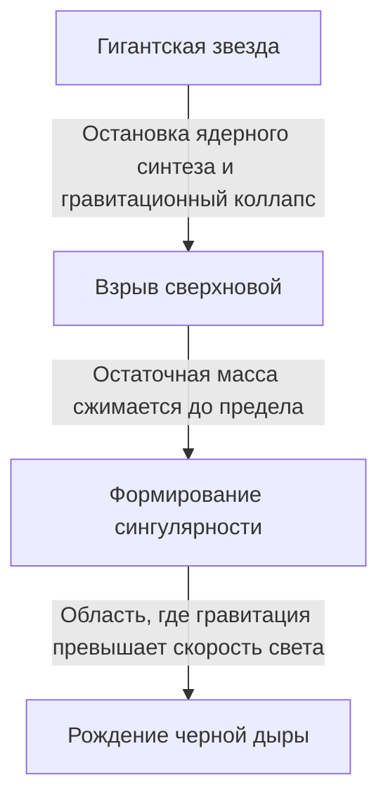

Во Вселенной существуют экстремальные небесные тела, которые превосходят наше воображение. Самым загадочным из них, неизменно привлекающим внимание множества людей, является «черная дыра». Этот космический объект обладает настолько сильной гравитацией, что от нее не может ускользнуть даже свет. Он является не просто темой для научной фантастики, но и одной из величайших загадок на передовом рубеже современной физики.

В этой статье мы подробно и глубоко рассмотрим основные механизмы черных дыр: от общей теории относительности Эйнштейна и горизонта событий до «излучения Хокинга», предложенного доктором Стивеном Хокингом.

## Что такое черная дыра?

Черная дыра (Black Hole) — это область пространства-времени с настолько высокой плотностью и огромной массой, что возникающая в ней мощная гравитация не позволяет вырваться наружу не только веществу, но даже свету (электромагнитным волнам).

Скорость света (около 300 тысяч километров в секунду) является максимальной скоростью в нашей Вселенной, но если оказаться на определенном расстоянии от центра черной дыры, даже скорости света не хватит, чтобы преодолеть ее гравитацию. Эта «граница, из-за которой невозможно вернуться», называется **горизонтом событий (Event Horizon)**.

### Процесс формирования

Многие черные дыры образуются, когда массивные звезды завершают свой жизненный цикл.
Звезда обычно сохраняет свою форму благодаря равновесию: давлению, стремящемуся расширить звезду наружу за счет реакций ядерного синтеза в ядре, и гравитации, стремящейся сжать ее внутрь за счет собственной массы звезды.

Однако, когда звезда исчерпывает запасы топлива, такого как водород и гелий, и в конечном итоге образуется железное ядро, реакции ядерного синтеза прекращаются. В результате давление, направленное наружу, исчезает, и звезда начинает стремительно коллапсировать (гравитационный коллапс) под действием собственной гравитации.

Звезда небольшой массы (сопоставимой с массой Солнца) превратится в белого карлика, чуть более массивная — в нейтронную звезду. Однако для очень тяжелых звезд, чья масса в десятки раз превышает массу Солнца, гравитационный коллапс остановить невозможно, и в конечном итоге они сжимаются до «сингулярности (Singularity)» — точки с нулевым объемом и бесконечной плотностью. Так рождается черная дыра звездной массы.

## Эйнштейн и общая теория относительности

Существование черных дыр было теоретически предсказано **общей теорией относительности (General Relativity)**, опубликованной Альбертом Эйнштейном в 1915 году.

Общая теория относительности описывает гравитацию как «искривление пространства-времени». Присутствие объекта, обладающего массой, искривляет окружающее его пространство-время (время и пространство). Представьте, что на батут положили тяжелый шар для боулинга, и резиновое полотно прогнулось под ним. Если затем покатить туда шарик для пинбола, он упадет в углубление, созданное шаром для боулинга. Это и есть истинная природа «гравитации», описанная Эйнштейном.

### Решение Шварцшильда

В 1916 году немецкий астрофизик Карл Шварцшильд впервые вывел точное решение уравнения гравитационного поля Эйнштейна (решение Шварцшильда). Он математически доказал, что если масса сосредоточена в одной точке, то внутри определенного радиуса (радиуса Шварцшильда) пространство-время искривляется настолько сильно, что даже свет не может выйти наружу.

$$ r_s = \frac{2GM}{c^2} $$

Где $r_s$ — радиус Шварцшильда, $G$ — гравитационная постоянная, $M$ — масса небесного тела, а $c$ — скорость света. Если бы мы захотели превратить Землю в черную дыру, ее массу пришлось бы сжать в сферу радиусом около 9 миллиметров. Для Солнца этот радиус составляет около 3 километров.

## Структура черной дыры: горизонт событий и сингулярность

Черная дыра в общих чертах состоит из нескольких элементов.

### 1. Сингулярность (Singularity)
Бесконечно малая, сжатая точка в центре черной дыры. Здесь плотность и кривизна пространства-времени становятся бесконечными, и известные нам законы физики (включая общую теорию относительности) полностью перестают работать. Считается, что для правильного описания сингулярности необходима «теория квантовой гравитации», объединяющая общую теорию относительности и квантовую механику, однако она до сих пор не создана.

### 2. Горизонт событий (Event Horizon)
Граница, окружающая сингулярность. Если пересечь эту границу и попасть внутрь, скорость убегания превысит скорость света, из-за чего никакая информация не сможет быть передана наружу. Название происходит от значения «горизонт (Horizon)», за которым не видно «событий (Event)».

### 3. Аккреционный диск (Accretion Disk)
Вокруг черной дыры может образовываться дискообразная структура из межзвездного газа, пыли или материи, сорванной со звезды-компаньона в двойной системе, которая втягивается мощной гравитацией и падает по спирали. Из-за сильного трения между частицами материи они нагреваются до сверхвысоких температур и излучают мощные рентгеновские и гамма-лучи. Мы можем «наблюдать» черные дыры именно благодаря свету, излучаемому этим аккреционным диском.

### 4. Релятивистский джет (Relativistic Jet)
Явление, при котором из полярных областей черной дыры со скоростью, близкой к скорости света, выбрасываются пучки плазмы. Считается, что в этом процессе участвуют мощные магнитные поля, но точный механизм джетов до сих пор исследуется.

## Излучение Хокинга и информационный парадокс

Долгое время считалось, что «черные дыры поглощают всё и абсолютно ничего не излучают». Однако в 1974 году британский физик Стивен Хокинг, опираясь на принцип неопределенности квантовой механики, выдвинул поразительную теорию о том, что «черные дыры испускают тепловое излучение, постепенно теряют массу и в конечном итоге испаряются». Это явление получило название **излучение Хокинга (Hawking Radiation)**.

### Квантовые флуктуации вакуума
В мире квантовой механики полного «ничто (вакуума)» не существует. На микроскопическом уровне непрерывно происходит процесс парного рождения частиц и античастиц, которые сразу же встречаются и аннигилируют (квантовые флуктуации).

Когда такое рождение пары происходит прямо за пределами горизонта событий, одна частица может быть затянута в черную дыру, а другая — ускользнуть наружу. Для внешнего наблюдателя это выглядит так, будто черная дыра излучает частицы. Поглощенная частица обладает «отрицательной энергией», что в результате приводит к уменьшению массы черной дыры.

### Информационный парадокс
Излучение Хокинга принесло физике новую неразрешимую проблему. Она известна как **информационный парадокс черных дыр (Black Hole Information Paradox)**.

Согласно базовым принципам квантовой механики, «физическая информация никогда не теряется». Однако если материя поглощается черной дырой, а сама черная дыра в конечном итоге полностью испаряется из-за излучения Хокинга и исчезает, то куда девается информация о поглощенной материи (информация о ее квантовом состоянии, будь то книга или яблоко)?

Эта проблема до сих пор является предметом ожесточенных дискуссий среди таких ведущих физиков-теоретиков, как Леонард Сасскинд и Хуан Малдасена, и служит движущей силой для рождения новых идей, таких как голографический принцип.

## Наблюдение черных дыр: от EHT до гравитационных волн

Поскольку черные дыры не излучают свет, их невозможно увидеть напрямую. Однако благодаря развитию технологий нам наконец удалось запечатлеть их «тень».

### EHT (Телескоп горизонта событий)
В апреле 2019 года международная исследовательская группа «Телескоп горизонта событий» (Event Horizon Telescope, EHT) объявила об успешном создании гигантского виртуального телескопа путем объединения нескольких радиотелескопов на Земле, и о получении снимка кольцеобразного света (аккреционного диска) вокруг сверхмассивной черной дыры в центре галактики M87 в созвездии Девы, а также темной тени в её центре (тени черной дыры). Это стало беспрецедентным достижением в истории человечества и доказало, что теория Эйнштейна верна даже в таких экстремальных условиях.
Позже, в 2022 году, также было опубликовано изображение сверхмассивной черной дыры «Стрелец A*» (Sagittarius A*), находящейся в центре нашей галактики Млечный Путь.

### LIGO и гравитационные волны
В 2015 году американская гравитационно-волновая обсерватория LIGO впервые в истории человечества напрямую зафиксировала «рябь пространства-времени» (гравитационные волны), возникшую при слиянии двух черных дыр на расстоянии 1,3 миллиарда световых лет. Это открыло новое окно — «гравитационно-волновую астрономию», позволив нам исследовать глубины космоса, которые невозможно наблюдать с помощью света или радиоволн.

## Заключение

Черные дыры — это не только разрушительные «космические монстры», но и «космические творцы», тесно связанные с формированием и эволюцией галактик.
Хотя еще остается много неразгаданных тайн, таких как сингулярности и информационный парадокс, возможно, настанет день, когда благодаря развитию наблюдательных технологий и прорывам в теоретической физике будут раскрыты фундаментальные истины пространства-времени.

Именно в абсолютной тьме, из которой не может вырваться даже свет, скрываются самые яркие тайны нашей Вселенной.
