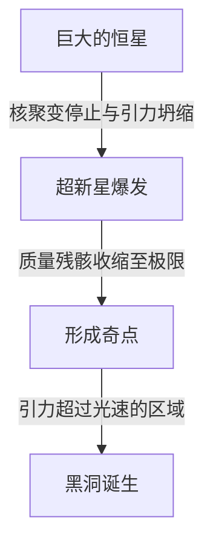

宇宙中存在着超乎我们想象的极端天体。其中最神秘且最让人着迷的，莫过于“黑洞”了。这种拥有连光都无法逃脱的强大引力的天体，不仅是科幻小说的绝佳题材，更是现代物理学最前沿的最大谜团之一。

本文将深入探讨黑洞的基本机制，从爱因斯坦的广义相对论、事件视界（Event Horizon），一直讲到斯蒂芬·霍金博士提出的“霍金辐射”，为您进行详尽的解析。

## 什么是黑洞？

黑洞（Black Hole）是指由于密度极高、质量巨大，从而产生强大的引力，使得不仅是物质，甚至连光（电磁波）都无法逃脱的时空区域。

光速（每秒约30万公里）是这个宇宙中的最高速度，但一旦进入距离黑洞中心一定范围内的区域，即便是光速也无法摆脱其引力。这个“有去无回的边界线”被称为**事件视界（Event Horizon）**。

### 形成过程

许多黑洞是在大质量恒星走向生命终点时形成的。
通常情况下，恒星通过中心部分的核聚变反应产生向外膨胀的压力，与恒星自身质量产生向内收缩的引力保持平衡，从而维持其形状。

然而，当作为燃料的氢和氦耗尽，最终形成铁核时，核聚变反应便不再发生。结果，向外的压力消失，恒星在其自身引力的作用下开始急剧坍缩（引力坍缩）。

如果是质量较小的恒星（与太阳相当），会变成白矮星；质量稍大一些的，会变成中子星。但如果是质量达到太阳数十倍以上的超大质量恒星，引力坍缩将无法停止，最终会收缩成体积为零、密度无限大的“奇点（Singularity）”。恒星级黑洞便由此诞生。

## 爱因斯坦与广义相对论

在理论上预言黑洞存在的，是阿尔伯特·爱因斯坦于1915年发表的**广义相对论（General Relativity）**。

广义相对论将引力描述为“时空的弯曲”。当有质量的物体存在时，其周围的时空（时间和空间）就会发生扭曲。这就像在蹦床上放一个沉重的保龄球，橡胶垫会凹陷下去。此时如果滚入一颗弹珠，弹珠就会向保龄球压出的凹坑掉落。这就是爱因斯坦所解释的“引力”的本质。

### 史瓦西解

1916年，德国天体物理学家卡尔·史瓦西首次推导出了爱因斯坦引力场方程的精确解（史瓦西解）。他从数学上证明，当质量集中在一点时，在某个特定半径（史瓦西半径）以内，时空会发生极度扭曲，连光都无法逃逸。

$$ r_s = \frac{2GM}{c^2} $$

这里，$r_s$ 代表史瓦西半径，$G$ 为引力常数，$M$ 为天体质量，$c$ 代表光速。如果要把地球变成黑洞，必须将其全部质量压缩进一个半径约9毫米的球体中。而对于太阳来说，这个半径约为3公里。

## 黑洞的结构：事件视界与奇点

黑洞主要由以下几个要素构成。

### 1. 奇点（Singularity）
位于黑洞中心，质量被压缩到无限小的点。在这里，密度和时空曲率变得无限大，我们所知的现有物理定律（包括广义相对论）将彻底失效。为了准确描述奇点，人们认为需要一种将广义相对论与量子力学统一起来的“量子引力理论”，但该理论至今尚未完成。

### 2. 事件视界（Event Horizon）
围绕奇点的边界线。一旦越过这条边界进入其内部，逃逸速度就会超过光速，因此任何信息都无法传递到外部。它得名于使“事件（Event）”变得不可见的“视界（Horizon）”。

### 3. 吸积盘（Accretion Disk）
在黑洞周围，星际气体、尘埃或从双星系统的伴星上剥离的物质，会被强大的引力吸引，一边旋转一边落下，从而形成盘状结构。物质之间剧烈的摩擦会产生超高温，放射出强烈的X射线和伽马射线。我们之所以能够“观测”到黑洞，正是多亏了这层吸积盘发出的光芒。

### 4. 相对论性喷流（Relativistic Jet）
从黑洞的两极方向，以接近光速喷射出等离子体束的现象。人们认为这与强大的磁场有关，但其详细机制目前仍在研究之中。

## 霍金辐射与信息悖论

长期以来，人们一直认为“黑洞会吞噬一切，绝不释放任何东西”。但在1974年，英国物理学家斯蒂芬·霍金运用量子力学的不确定性原理，提出了一个惊人的理论：“黑洞会进行热辐射，并逐渐失去质量，最终蒸发殆尽”。这就是**霍金辐射（Hawking Radiation）**。

### 真空涨落
在量子力学的世界里，不存在绝对的“无（真空）”。在微观尺度下，粒子与反粒子总是成对产生，然后瞬间相遇并湮灭，这种现象（量子涨落）在不断发生。

当这种成对产生发生在事件视界之外极近的地方时，有时一个粒子会被黑洞吸入，而另一个粒子则逃逸到外部。从外部看来，就好像是黑洞在发射粒子。由于被吸入的粒子带有“负能量”，这导致黑洞的质量随之减少。

### 信息悖论
霍金辐射给物理学带来了一个新的难题，那就是**黑洞信息悖论（Black Hole Information Paradox）**。

根据量子力学的基本原理，“物理信息永远不会丢失”。然而，如果物质被黑洞吸入，最终黑洞又因霍金辐射而完全蒸发消失，那么被吸入物质的信息（比如它是一本书还是一个苹果的量子状态信息）到底去哪儿了呢？

这个问题至今仍是伦纳德·萨斯坎德和胡安·马尔达西那等顶尖理论物理学家们激烈争论的焦点，并成为了孕育全息原理等新思想的驱动力。

## 黑洞的观测：从EHT到引力波

由于黑洞不发光，我们无法直接看到它。但是，随着技术的进步，我们终于成功捕捉到了它的“影子”。

### EHT（事件视界望远镜）
2019年4月，国际研究团队“事件视界望远镜（EHT）”通过联动地球上的多台射电望远镜，构建了一台巨大的虚拟望远镜，宣布成功拍摄到了位于室女座M87星系中心的超大质量黑洞周围的环状光芒（吸积盘）及其中心的暗影（黑洞阴影）。这是人类历史上的首次壮举，证明了爱因斯坦的理论在极端环境下依然成立。
此外，在2022年，研究团队还公布了位于我们所居住的银河系中心的“人马座A*”的图像。

### LIGO与引力波
2015年，美国的引力波望远镜LIGO，人类历史上首次直接探测到了13亿光年外两个黑洞合并时产生的“时空涟漪（引力波）”。这打开了“引力波天文学”这扇全新的窗口，使我们能够探索用光和电波无法观测到的宇宙深渊。

## 结语

黑洞既是具有破坏性的“宇宙怪物”，同时又扮演着深度参与星系形成与演化的“宇宙造物主”的角色。
尽管奇点和信息悖论等许多未解之谜依然存在，但随着未来观测技术的进步和理论物理学的突破，揭开时空根本真理的那一天或许终将到来。

正是在这连光都无法逃脱的绝对黑暗之中，隐藏着宇宙最耀眼的秘密。
