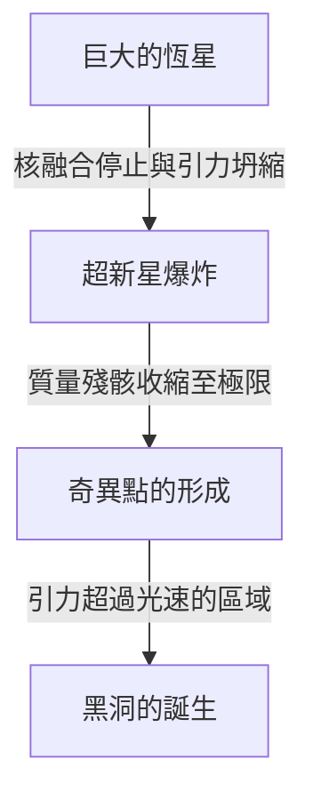

宇宙中存在著超乎我們想像的極限天體。其中最神祕、且最令人著迷的，莫過於「黑洞」。這種擁有極強引力、連光都無法逃脫的天體，不僅僅是科幻小說的題材，更是現代物理學最前沿的最大謎團之一。

本文將從黑洞的基本機制開始，深入詳細地探討愛因斯坦的廣義相對論、事件視界（Event Horizon），以及史蒂芬·霍金博士所提出的「霍金輻射」。

## 什麼是黑洞？

黑洞（Black Hole）是指因為擁有極高密度與巨大質量，產生了強大引力，導致不僅是物質，就連光（電磁波）也無法逃脫的時空區域。

光速（每秒約30萬公里）是這個宇宙中的最高速度，但一旦進入距離黑洞中心一定的範圍內，即使以光的速度也無法擺脫其引力。這個「一去不復返的邊界線」被稱為**事件視界（Event Horizon）**。

### 形成的過程

許多黑洞是在大質量恆星結束其壽命時形成的。
恆星通常是藉由中心部位核融合反應產生向外膨脹的壓力，與恆星自身質量產生向內收縮的引力達到平衡，來維持其形狀。

然而，當作為燃料的氫與氦耗盡，最終形成鐵核時，就不會再發生進一步的核融合反應。結果，向外的壓力消失，恆星便會在自身引力的作用下開始急劇坍縮（引力坍縮）。

如果是小質量的恆星（與太陽相當），會變成白矮星；稍大一點的則會變成中子星；但如果是質量達太陽數十倍以上的極重恆星，引力坍縮將無法停止，最終會收縮成體積為零、密度無限大的「奇異點（Singularity）」。這樣誕生出來的就是恆星質量黑洞。

## 愛因斯坦與廣義相對論

在理論上預言黑洞存在的，是阿爾伯特·愛因斯坦於1915年發表的**廣義相對論（General Relativity）**。

廣義相對論將引力描述為「時空的扭曲」。當有質量的物體存在時，其周圍的時空（時間與空間）就會發生扭曲。可以想像成在彈簧床上放一顆重的保齡球，橡膠墊就會凹陷下去。這時如果滾動一顆彈珠，它就會朝著保齡球造成的凹陷處掉落。這就是愛因斯坦所解釋的「引力」的真面目。

### 史瓦西解

1916年，德國天體物理學家卡爾·史瓦西首次推導出了愛因斯坦引力場方程式的精確解（史瓦西解）。他在數學上證明了，當質量集中於一點時，在某個特定半徑（史瓦西半徑）以內，時空會極度扭曲，連光都無法逃出。

$$ r_s = \frac{2GM}{c^2} $$

在這裡，$r_s$ 代表史瓦西半徑，$G$ 是引力常數，$M$ 是天體的質量，$c$ 則是光速。如果要把地球變成黑洞，必須將其質量壓縮到一個半徑約9公厘的球體內。如果是太陽的話，半徑約為3公里。

## 黑洞的結構：事件視界與奇異點

黑洞大致上由幾個要素構成。

### 1. 奇異點（Singularity）
位於黑洞中心，質量被無限擠壓成極小的一點。在這裡，密度與時空曲率變得無限大，我們目前所知的物理定律（包括廣義相對論）將完全崩潰。為了正確描述奇異點，人們認為需要結合廣義相對論與量子力學的「量子引力理論」，但該理論至今尚未完成。

### 2. 事件視界（Event Horizon）
圍繞著奇異點的邊界線。一旦越過這個邊界進入內部，逃逸速度就會超過光速，因此任何資訊都無法傳遞到外部。其命名由來是因為在這個「地平線（Horizon）」之下，所有的「事件（Event）」都將變得不可見。

### 3. 吸積盤（Accretion Disk）
在黑洞周圍，星際氣體、塵埃或是從聯星系統的伴星被剝離出來的物質，有時會被強大的引力吸引，一邊形成漩渦一邊掉落，進而形成盤狀結構。物質之間劇烈的摩擦會產生超高溫，並釋放出強烈的X射線與伽瑪射線。我們能夠「觀測」到黑洞，正是多虧了這個吸積盤所發出的光。

### 4. 相對論性噴流（Relativistic Jet）
從黑洞的極區方向，以接近光速的速度噴射出電漿束的現象。一般認為這與強大的磁場有關，但其詳細機制目前仍在持續研究中。

## 霍金輻射與資訊悖論

長久以來，人們認為「黑洞會吸入所有東西，且絕對不會釋放任何物質」。然而在1974年，英國物理學家史蒂芬·霍金運用量子力學的不確定性原理，發表了一個驚人的理論：「黑洞會進行熱輻射，逐漸失去質量，最終蒸發殆盡」。這就是**霍金輻射（Hawking Radiation）**。

### 真空漲落
在量子力學的世界裡，完全的「無（真空）」是不存在的。從微觀尺度來看，粒子與反粒子成對產生，隨即相遇並互相湮滅的現象（量子漲落）正在不斷發生。

當這種成對產生發生在事件視界的外側邊緣時，有時其中一個粒子會被黑洞吸入，另一個則逃逸到外部。從外面看起來，就好像是黑洞正在放射出粒子。被吸入的粒子帶有「負能量」，這導致黑洞的質量隨之減少。

### 資訊悖論
霍金輻射為物理學帶來了一個新的難題。那就是**黑洞資訊悖論（Black Hole Information Paradox）**。

根據量子力學的基本原理，「物理資訊絕對不會遺失」。但是，當物質被黑洞吸入，最終黑洞又因為霍金輻射而完全蒸發消失時，被吸入物質的資訊（例如它原本是一本書還是一顆蘋果這種量子態的資訊）到底去了哪裡？

這個問題至今仍由李奧納特·蘇士侃和胡安·馬爾達西那等頂尖理論物理學家進行著激烈的辯論，並成為催生出全息原理等新概念的驅動力。

## 黑洞的觀測：從EHT到重力波

因為黑洞不發光，所以無法直接看見。然而，隨著科技進步，我們終於成功捕捉到了它的「剪影」。

### EHT（事件視界望遠鏡）
2019年4月，國際研究團隊「事件視界望遠鏡（EHT）」連動地球上多座電波望遠鏡，構建出一個巨大的虛擬望遠鏡，宣布成功拍攝到位於室女座M87星系中心超大質量黑洞周圍的光環（吸積盤）以及中心的暗影（黑洞剪影）。這是人類歷史上的首次壯舉，也證明了愛因斯坦的理論在極端環境下依然正確。
隨後在2022年，又公布了位於我們所居住的銀河系中心「人馬座A*（Sagittarius A*）」的影像。

### LIGO與重力波
2015年，美國的重力波望遠鏡LIGO，人類史上首次直接探測到距離13億光年外兩個黑洞合併時產生的「時空漣漪（重力波）」。這開啟了「重力波天文學」這扇新窗，讓我們得以探索無法用光或電波觀測到的宇宙深淵。

## 結語

黑洞既是具破壞性的「宇宙怪物」，同時也具備了深深參與星系形成與演化的「宇宙造物主」的一面。
儘管仍有奇異點與資訊悖論等許多未解之謎，但隨著未來觀測技術的發展以及理論物理學的突破，或許有一天，我們能解開時空最根本的真理。

正是在連光都無法逃脫的絕對黑暗之中，隱藏著宇宙最耀眼的秘密。
