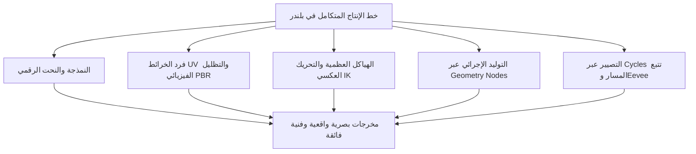
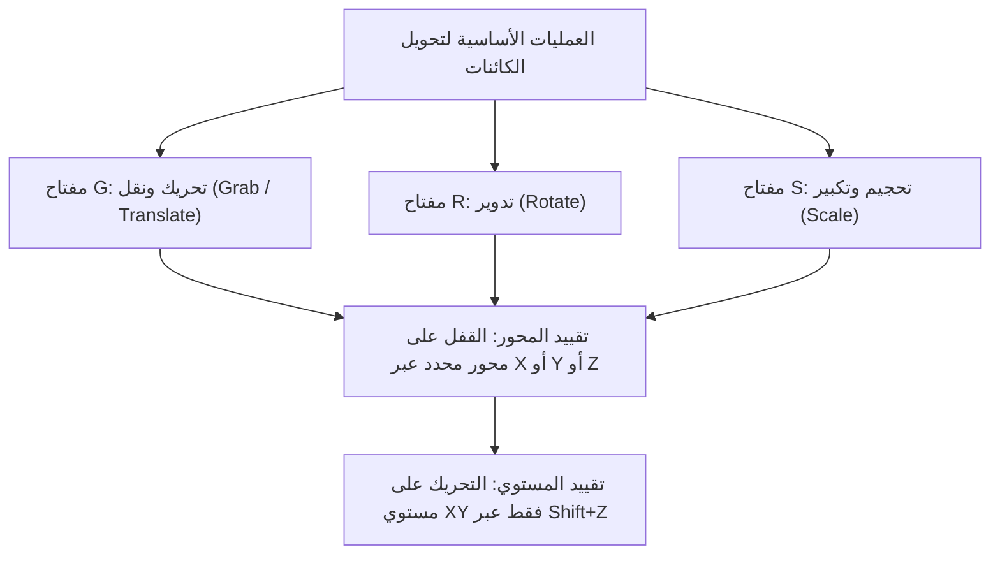
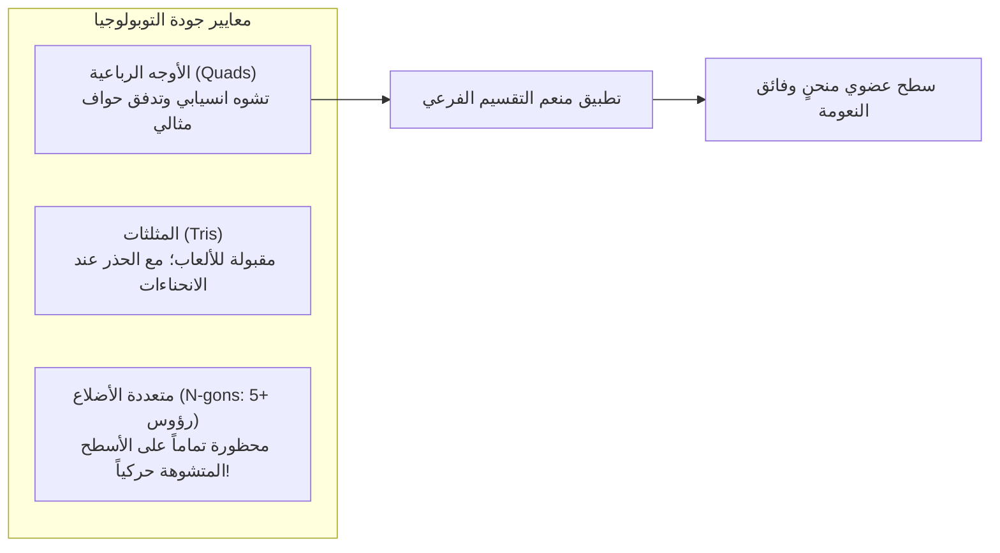
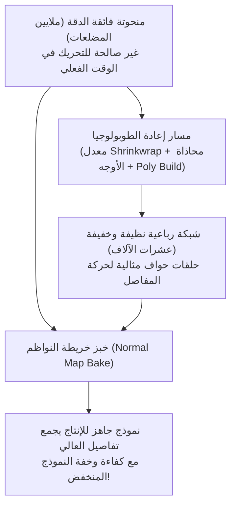
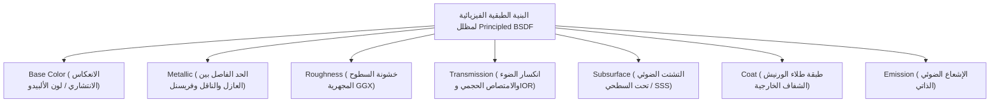
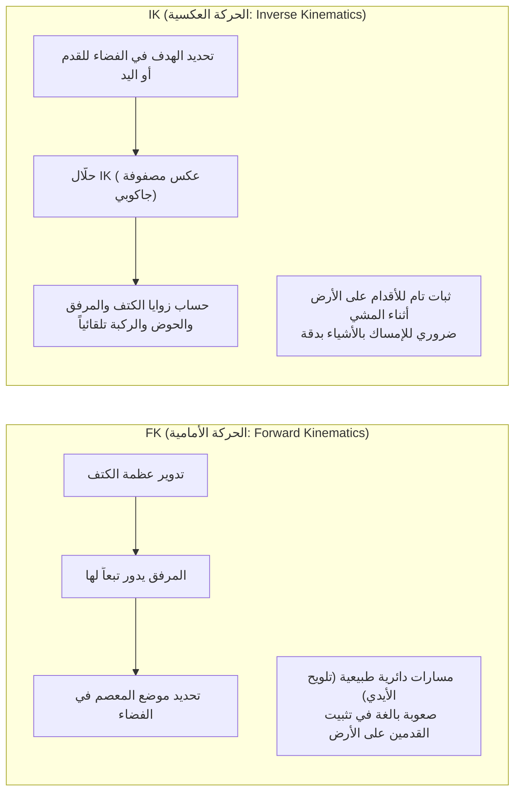
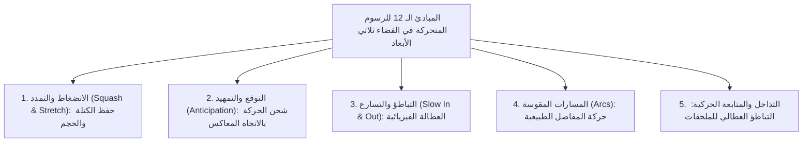
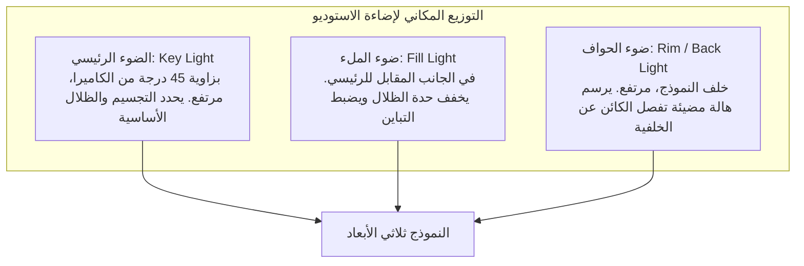

## 1. مقدمة: بلندر بوصفه ثورة البرمجيات ثلاثية الأبعاد مفتوحة المصدر

### 1.1 تاريخ تون روزندال ومؤسسة بلندر الملحمي

نشأ برنامج "بلندر" (Blender) في أوائل التسعينيات كأداة داخلية في استوديو الرسوم المتحركة الهولندي NeoGeo، وتحول اليوم إلى أقوى حزمة برمجية ثلاثية الأبعاد مفتوحة المصدر في العالم، ليدعم صناعة الترفيه الرقمي العالمية، وتطوير ألعاب الفيديو، ومؤثرات هوليوود البصرية (VFX)، والإظهار المعماري، والأبحاث الأكاديمية المتقدمة.

إن تاريخه أشبه بملحمة درامية مذهلة؛ فبعد إفلاس استوديو NeoGeo، استولى الدائنون على حقوق الملكية الفكرية لبرنامج بلندر، مما هدد مشروعه بالتوقف النهائي. وفي عام 1998، أسس المبتكر تون روزندال (Ton Roosendaal) "مؤسسة بلندر" (Blender Foundation) وأطلق حملة تمويل جماعي تاريخية لم يسبق لها مثيل. ومن خلال جمع 100 ألف يورو من تبرعات الفنانين في جميع أنحاء العالم، اشترى الكود المصدري من الدائنين، وفي 13 أكتوبر 2002 أطلق بلندر للعالم كبرنامج حر بالكامل ومفتوح المصدر تحت رخصة جنو العمومية (GPL).

وفي حين تفرض البرمجيات التجارية المغلقة باهظة الثمن (مثل Maya و3ds Max وCinema 4D) اشتراكات سنوية بآلاف الدولارات، يظل بلندر متمسكاً برسالته النبيلة: **"ألا يُحرم أحد؛ وتوفير أرقى أدوات الإبداع لجميع فناني العالم مجاناً بالكامل إلى الأبد"**.



---

### 1.2 التحديث الشامل للواجهة في 2.80 والوصول إلى المعيار الصناعي في الجيل 4.x

لسنوات عديدة، كان المحترفون يتفادون بلندر بسبب واجهة المستخدم الغريبة وغير التقليدية، ولا سيما اعتمادها على التحديد بالنقر بزر الفأرة الأيمن كإعداد افتراضي.

غير أن إطلاق "Blender 2.80" في عام 2019 أحدث زلزالاً معرفياً في صناعة الرسوم الحاسوبية؛ إذ تم تجديد الواجهة بالكامل، واعتماد التحديد بالزر الأيسر قياسياً، وإطلاق محرك العرض الفوري الفيزيائي "Eevee". وسارعت كبرى شركات التكنولوجيا العالمية — مثل Epic Games (Unreal Engine)، وUbisoft، وUnity، وNVIDIA، وAMD، وApple، وMicrosoft، وAmazon — لدعم صندوق تطوير بلندر كشركاء ورعاة مؤسسيين.

ومع جيل "Blender 4.x" الحالي، رسخت منظومة إدارة الألوان AgX القياسية، وتقنية ربط الإضاءة (Light Linking)، وإعادة البناء الفيزيائي الصارم لمظلل Principled BSDF v2، والانفجار البرمجي في العقد الهندسية Geometry Nodes، مكانة بلندر كركيزة أساسية لا غنى عنها في خطوط إنتاج أكبر الاستوديوهات العالمية.

---

## 2. البنية التحتية، الواجهة وفلسفة الاختصارات

إن العائق الأكبر أمام المبتدئين في بلندر — وهو في الوقت نفسه سر السرعة الخارقة التي لا يضاهيها أي برنامج آخر بمجرد إتقانه — يكمن في "واجهته المعتمدة كلياً على اختصارات لوحة المفاتيح".

### 2.1 أنظمة الإحداثيات الهندسية والتحويلات في الفضاء ثلاثي الأبعاد

يتم تعريف الفضاء الافتراضي ثلاثي الأبعاد في بلندر بواسطة نظام الإحداثيات الديكارتية المتعامدة (المحور $X$: يمين/يسار / أحمر، المحور $Y$: أمام/خلف / أخضر، المحور $Z$: أعلى/أسفل / أزرق)، وفقاً لقاعدة اليد اليمنى.



- **أنماط نظام الإحداثيات**:
  - **العالمي (Global)**: الاتجاهات الأساسية الثابتة والمطلقة للفضاء الافتراضي بأكمله.
  - **المحلي (Local)**: إحداثيات نسبية تعتمد على اتجاه دوران الكائن نفسه (الضغط على $Z$ مرتين يتيح التحريك على طول محور الكائن المحلي $Z$).
  - **الناظمي (Normal)**: نظام إحداثيات موجه عمودياً على أسطح المضلعات المحددة.
- **نقاط الارتكاز (Pivot Points)**:
  - مركز الصندوق المحيط، والنقطة الوسطية (Median Point)، ومراكز الكائنات الفردية، والعنصر النشط، والأهم من ذلك كله **"المؤشر ثلاثي الأبعاد (3D Cursor)"**.
  - يمكن وضع المؤشر ثلاثي الأبعاد في أي موضع في الفضاء عبر النقر بزر الفأرة الأيمن مع مفتاح Shift، ليعمل كمركز دوران حر أو كنقطة إنشاء للكائنات الجديدة، موفراً انسيابية فائقة وسرعة منقطعة النظير.

---

### 2.2 الاختصارات الثمانية الجوهرية في وضع التحرير (Edit Mode)

بالنقر على مفتاح `Tab` بعد تحديد الكائن، ينتقل المستخدم من "وضع الكائن" العام إلى "وضع التحرير" لتعديل البنية الهندسية للمضلعات مباشرة. وتعتمد نمذجة الشبكات على ثمانية اختصارات رئيسية:

| الاختصار | الوظيفة | الآلية البرمجية والخيارات المتقدمة |
| :---: | :--- | :--- |
| **`E`** | **البثق (Extrude)** | يسحب الأوجه أو الحواف أو الرؤوس المحددة على طول نواظمها لإنشاء أشكال هندسية جديدة. يوفر `Alt + E` البثق للأوجه الفردية أو على طول النواظم. |
| **`I`** | **إدراج الأوجه (Inset)** | ينشئ أوجهاً متحدة المركز داخل التحديد بمسافة إزاحة موحدة. وهو الأساس لتشكيل الحواف والتجاويف واللوحات الميكانيكية. |
| **`Ctrl + B`** | **الشطف والتنعيم (Bevel)** | يكسر الحواف الحادة بزاوية مائلة. تدوير عجلة الفأرة يضيف قطاعات لتدوير الزوايا بنعومة. مفتاح `V` يبدل إلى شطف الرؤوس. |
| **`Ctrl + R`** | **القطع الحلقي (Loop Cut)** | يدرج حلقة حواف متصلة تخترق التوبولوجيا الرباعية للشبكة. عجلة الفأرة تزيد عدد القطوع؛ والنقر الأيسر يسمح بالانزلاق. |
| **`K`** | **أداة السكين (Knife)** | تقطع المضلعات وتقسمها يدوياً بخطوط مستقيمة عبر النقر المباشر على السطح. `C` لقفل الزاوية؛ `Z` للقطع النافذ عبر الأسطح المخفية. |
| **`Alt + M` / `M`** | **الدمج (Merge)** | يلحم عدة رؤوس محددة في نقطة واحدة ("في المركز"، "عند المؤشر"، "عند الأول/الأخير"). الدمج التلقائي Auto Merge يلحم الرؤوس المتقاربة ذاتياً. |
| **`GG`** | **انزلاق الرأس / الحافة** | الضغط مرتين بسرعة على `G` يتيح تحريك الرأس أو الحافة على طول مسار الحواف المجاورة دون تشويه انحناء السطح الأصلي. |
| **`F`** | **بناء حافة / وجه (Make Edge/Face)** | يربط بين رأسين محددين بحافة، أو يغلق ثلاثة رؤوس أو حواف فأكثر ليشكل وجهاً مضلعاً مغلقاً. |

---

## 3. نمذجة المضلعات وأوج أسطح التقسيم الفرعي

### 3.1 مبادئ الطوبولوجيا وسيادة الأوجه الرباعية (Quads)

في النمذجة ثلاثية الأبعاد، تُصنف الأوجه حسب عدد الرؤوس المكونة لها:
1. **المثلثات (Tris: 3 رؤوس)**: تحافظ دائماً على استوائها وتُعد المعيار النهائي لمحركات الألعاب في الوقت الفعلي، لكنها تسبب تشوهات وانثناءات قبيحة (Pinching) عند تطبيق خوارزميات التقسيم الفرعي أو التحريك العظمي.
2. **الرباعيات (Quads: 4 رؤوس)**: **المعيار الذهبي المطلق في الإنتاج الاحترافي**. يتدفق فيها مسار الحواف (Edge Flow) بانسيابية ونظام، وتتفرع بسلاسة تحت خوارزميات التنعيم.
3. **متعددة الأضلاع (N-gons: 5 رؤوس فأكثر)**: باستثناء الأسطح المستوية تماماً في المراحل المبكرة، **يُعد ترك أوجه N-gon على الأسطح المنحنية أو مفاصل الحركة خطيئة كبرى**. لا تستطيع الخوارزميات تحديد مسار تقسيمها بدقة، مما يولد بقعاً سوداء وتشوهات تظليل كارثية أثناء التصيير.

علاوة على ذلك، فإن الرؤوس التي تتلاقى عندها 5 حواف فأكثر (E-poles) أو 3 حواف فقط (N-poles) تُعد عقد دوران (Poles) تُغير مسار الحواف. ويُقاس تميز فنان النمذجة بقدرته على إبعاد هذه العقد عن مناطق ثني المفاصل وعضلات تعابير الوجه، وتوجيه مسارات الحواف بما يتوافق مع التشريح العضلي الطبيعي.



---

### 3.2 رياضيات أسطح التقسيم الفرعي: خوارزمية كتمول-كلارك (Catmull-Clark)

تتحول النماذج الأساسية منخفضة التفاصيل إلى كائنات ناعمة وأجسام سيارات انسيابية عبر تطبيق معدل **"Subdivision Surface"** (`Ctrl + 1~3`).

تعتمد خوارزمية كتمول-كلارك، التي صاغها عام 1978 إدوين كتمول وجيم كلارك، على إجراء ثلاث عمليات حسابية متتالية في كل مستوى تقسيم:

1. **نقطة الوجه (Face Point)**: مركز الثقل الهندسي لجميع رؤوس الوجه:
   $$F = \frac{1}{n} \sum_{i=1}^n V_i$$
2. **نقطة الحافة (Edge Point)**: المتوسط الحسابي لنهايتي الحافة ونقطتي الوجه للوجهين المتجاورين المشتركين في تلك الحافة:
   $$E = \frac{V_1 + V_2 + F_1 + F_2}{4}$$
3. **نقطة الرأس الجديدة (Vertex Point)**: للرأس الأصلي $V$، يتم حساب موضعه المنعم $V'$ بدمج متوسط نقاط الأوجه المجاورة $Q$، ومتوسط منتصفات الحواف المتصلة $R$، والرأس الأصلي ذي الدرجة $n$:
   $$V' = \frac{Q + 2R + (n-3)V}{n}$$

وبتكرار هذه الخوارزمية، يتقارب القفص المضلع الخشن رياضياً نحو سطح نهائي أملس ومستمر يكافئ منحنيات B-spline التكعيبية.

#### حلقات الدعم والتحزيز (Support Loops & Crease)
للحفاظ على الحواف الحادة أثناء التنعيم، تُضاف **حلقات دعم (holding loops)** ملاصقة تماماً للحواف الهيكلية الرئيسية. فكلما ضاقت المسافة بين الحواف المتوازية، كُبح تأثير التدوير لخوارزمية كتمول-كلارك، مما يبرز اللمعان الحاد للمعادن والبلاستيك الصلب (أو عبر وزن التحزيز Crease).

---

### 3.3 مرونة مكدس المعدلات غير التدميري (Modifier Stack)

تنبثق قوة النمذجة في بلندر من **مكدس المعدلات (Modifier Stack)**، الذي يتيح تطبيق التحويلات والعمليات الهندسية المعيارية لحظياً دون تدمير أو تعديل بيانات الشبكة الأصلية بصورة نهائية.

| المعدل | الفئة | آلية العمل وأفضل الممارسات |
| :--- | :---: | :--- |
| **Mirror (المرآة)** | توليد | يعكس الشبكة تماثلياً عبر محور (غالباً X). خاصية "Clipping" تلحم الرؤوس المركزية دون ترك فجوات. أساسي للشخصيات والمركبات. |
| **Array (المصفوفة)** | توليد | يكرر الهندسة بمعدل إزاحة أو دوران محدد (Object Offset). مثالي لصنع السلالم، والسلاسل، والأسوار، ومصفوفات المسامير الدائرية. |
| **Boolean (العمليات المنطقية)** | توليد | يجري عمليات المجموعات على المجسمات (اتحاد، طرح، تقاطع). يتضمن محركي Exact وFast لفتح التجاويف والثقوب ميكانيكياً في لحظات. |
| **Solidify (التجسيم)** | توليد | يمنح سماكة جدارية منتظمة على طول النواظم للأسطح الرقيقة أحادية الجدار. لا غنى عنه للملابس، والأواني الزجاجية، وألواح هياكل السيارات. |
| **Bevel (الشطف)** | تحرير | يشطف الحواف الحادة بشكل غير تدميري وفق أوزان أو زوايا ($\ge 30^\circ$). يمنح حوافاً واقعية عاكسة للضوء دون تضخيم كثافة المضلعات. |
| **Weighted Normal** | تعديل | يعيد حساب نواظم الرؤوس عبر إعطاء وزن أكبر للأسطح المستوية الكبيرة على حساب الشطفات الصغيرة، مانعاً تشوهات التظليل في الموديلات الخفيفة. |

---

## 4. النحت الرقمي وإعادة بناء الطوبولوجيا (Retopology)

يوفر "وضع النحت (Sculpt Mode)" تجربة حسية وانسيابية تحاكي التعامل مع الطين والصلصال الرقمي، وهو مثالي لبناء الكائنات العضوية، وتشريح الجسد، وتجاعيد الملابس.

### 4.1 خصائص فراشي النحت الأساسية

- **Draw**: ترفع السطح على طول النواظم؛ والضغط على `Ctrl` يحفر السطح للداخل.
- **Clay Strips**: تضيف شرائح طينية مستطيلة، لبناء الكتل العضلية والهيكل العظمي بسرعة فائقة.
- **Grab**: تسحب مساحات واسعة من الشبكة لتعديل النسب والصورة الظلية (Silhouette) بمرونة.
- **Crease**: تنحت شقوقاً وتجاعيد حادة وغائرة، وهي أساسية لثنايا الجلد وطيات الأقمشة.
- **Smooth**: تنعم التعرجات السطحية (متاحة فوراً من أي فرشاة بالضغط المستمر على `Shift`).
- **Inflate**: تنفخ المنطقة المحددة نحو الخارج في جميع الاتجاهات كالبالون.

---

### 4.2 الطوبولوجيا الديناميكية (Dyntopo) مقابل إعادة البناء الحجمي (Voxel Remesh)

أثناء نحت النماذج فائقة التفاصيل التي تحوي ملايين المضلعات، تصبح إدارة الكثافة الهندسية عاملاً حاسماً.

1. **الطوبولوجيا الديناميكية (Dyntopo)**:
   - تقسم وتضيف مثلثات جديدة تكيفياً فقط في الموضع الذي تلامسه ضربات الفرشاة مباشرة.
   - تتيح نحت تفاصيل دقيقة مجهرية (كالجفون والأصابع والمسام) دون إثقال كاهل بقية الجسد بالمضلعات غير الضرورية.
2. **إعادة البناء الحجمي (Voxel Remesh: `Ctrl + R`)**:
   - يقسم الفضاء ثلاثي الأبعاد إلى شبكة من الفوكسلات المكعبة المتساوية (مثلاً $0.01\,\text{m}$)، ليعيد بناء النموذج بالكامل في شبكة رباعية منتظمة ومتجانسة.
   - يلحم الفواصل الناتجة عن دمج القطع بالعمليات المنطقية (Boolean)، ويزيل المضلعات الممتدة والمشوهة، معيداً المجسم إلى حالة الطين المتجانس.

---

### 4.3 نظرية وتطبيق إعادة بناء الطوبولوجيا (Retopology)

المنحوتات الرقمية فائقة الدقة (التي تحوي ملايين أو عشرات ملايين المضلعات) تشتمل على كميات هائلة من البيانات، مما يجعل تشغيلها مستحيلاً في محركات الألعاب الفورية أو تحريكها عبر الهياكل العظمية.

لذا، فإن **"إعادة بناء الطوبولوجيا (Retopology)"** هي عملية يدوية منهجية لإعادة تشييد شبكة رباعية خفيفة ومنظمة (تتراوح بين بضعة آلاف إلى عشرات الآلاف من المضلعات) تلتصق تماماً بسطح المنحوتة وتتبع المسارات التشريحية الصحيحة.



1. تفعيل معدل الانكماش **Shrinkwrap** مع خاصية الالتصاق السطحي **Face Project**.
2. بناء حلقات دائرية متحدة المركز حول فتحات الوجه الحركية (العينين، الفم، الأنف).
3. وصل مسارات الفك نحو الرقبة والكتفين؛ وزرع ثلاث حلقات حماية حول المفاصل (المرفق والركبة) لمنع انهيار الحجم أثناء الثني.
4. عقب الاكتمال، تُنقل التفاصيل الدقيقة كالمسام والتجاعيد من النموذج الكثيف إلى النموذج الخفيف عبر حرقها في **خريطة نواظم (Normal Map)**.

---

## 5. تظليل الخامات وعلم التصيير المعتمد على الفيزياء (PBR)

يتم بناء الخامات في بلندر عبر "محرر المظللات" (Shader Editor) القائم على العقد. ويحاكي المعيار الصناعي الحديث "PBR (Physically Based Rendering)" التفاعلات الكهرومغناطيسية للضوء (الانعكاس، الانكسار، الامتصاص، التشتت) بالاستناد إلى القوانين الفيزيائية البصرية.

### 5.1 التحليل الرياضي لمظلل Principled BSDF v2

يعتمد المظلل الرئيسي الشامل في بلندر "Principled BSDF" على نموذج Disney Principled BRDF لعام 2012، وقد أعيد بناؤه بصرامة في Blender 4.0 لتحقيق الحفظ الدقيق لطاقة السطوح المجهرية.



1. **اللون الأساسي (Base Color / Albedo)**:
   - للعوازل (غير المعادن): يمثل لون الضوء الانتشاري الذي ينفذ تحت السطح، ويتشتت داخلياً ثم ينبثق عائداً للخارج.
   - للمعادن (النواقل): يمتص الضوء النافذ فوراً بفعل الإلكترونات الحرة، فيكون الانعكاس الانتشاري صفراً. ويحدد Base Color مباشرة لون الانعكاس المرآوي عند السقوط العمودي ($F_0$) (الذهب أصفر لامع، والنحاس ضارب للحمرة).
2. **المعدنية (Metallic: $0.0 \sim 1.0$)**:
   - المواد في الطبيعة ثنائية قطبياً: إما **عوازل (Metallic = 0.0)** أو **معادن نقية (Metallic = 1.0)**. القيم البينية مثل 0.5 غير موجودة فيزيائياً إلا كحالات انتقالية ناتجة عن تراكم الغبار أو الصدأ المجهري.
3. **الخشونة (Roughness)**:
   - تتحكم في توزيع اتجاه النواظم المجهرية وفق توزيع GGX.
   - $0.0$: مرآة عاكسة مصقولة تماماً بلا أي تشتت.
   - $1.0$: سطح بالغ الخشونة يتشتت الضوء عنه بالتساوي في جميع الاتجاهات كالطبشور أو الطين الجاف.
4. **معامل الانكسار (IOR - Index of Refraction)**:
   - يحدد انحراف مسار الضوء وفق قانون سنيل ($n_1 \sin \theta_1 = n_2 \sin \theta_2$).
   - الهواء: $1.0003$، الماء: $1.333$، الأكريليك: $1.49$، زجاج النوافذ: $1.52$، الألماس: $2.417$.
5. **التشتت تحت السطحي (Subsurface Scattering / SSS)**:
   - يحدث في الأوساط نصف الشفافة (جلد الإنسان، الرخام، الشمع، الحليب، اليشم) حيث تخترق الفوتونات السطح وتتصادم بلا حصر ثم تنبثق من مواضع قريبة.
   - يمتص الجلد الضوء الأزرق في الطبقات السطحية، بينما يخترق الضوء الأحمر عميقاً بفضل الهيموغلوبين، مما يمنح شحمة الأذن وأطراف الأصابع ذلك التوهج القرمزي المميز عند سقوط الضوء من الخلف (يُضبط عبر نصف القطر Subsurface Radius لكل قناة من قنوات RGB).

---

### 5.2 فرد الخرائط (UV Unwrapping) وكثافة التكسل (Texel Density)

لإسقاط الصور ثنائية الأبعاد (الألوان، الخشونة، النواظم) على أسطح ثلاثية الأبعاد دون تشويه، يجب بسط الشبكة على مستوٍ ثنائي الأبعاد مثل فرد الباترون في صناعة الملابس، وهو ما يُعرف بـ **"UV Unwrapping"**.

- **وضع خطوط الدرزات (Seams)**:
  - الاختصار `Ctrl + E` $\rightarrow$ "Mark Seam (تحديد درزة)".
  - كما في حياكة الأزياء الراقية، يجب إخفاء خطوط الوصل في أماكن بعيدة عن زوايا الكاميرا المباشرة (بين الفخذين، تحت منابت الشعر، ومنتصف الظهر).
- **توحيد كثافة التكسل (Texel Density)**:
  - عدد بكسلات الصورة المخصصة لكل وحدة قياس فيزيائية في الفضاء ثلاثي الأبعاد (مثل $\text{px/cm}$).
  - فإذا نال الوجه كثافة $20.48\,\text{px/cm}$ بينما نال الجذع $2.56\,\text{px/cm}$، سيظهر تباين شاذ ومزعج في جودة الصورة. يجب تحجيم كل الجزر البصرية بمقياس موحد ورصها بكفاءة في نطاق المربع $[0, 1]$.

---

## 6. تركيب العظام والتحريك الحركي (Rigging)

التحريك الهيكلي (Rigging) هو الفن الهندسي لبناء هيكل عظمي تراتبي داخلي ("Armature") يُمكن النموذج ثلاثي الأبعاد الثابت من الحركة والتشوه بمرونة وتطابق تشريحي سليم.

### 6.1 الصراع الرياضي: الحركة الأمامية (FK) مقابل الحركة العكسية (IK)

يعتمد توجيه أطراف الشخصيات على نهجين رياضيين متكاملين:



- **FK (Forward Kinematics)**: تنتقل التدويرات تسلسلياً من العظام الآباء إلى الأبناء. ممتاز للحركات الحرة في الهواء (كالتلويح أو المبارزة)، لكنه يسبب إرباكاً شديداً عند ملامسة الأرض: فعند خفض الحوض، تخترق القدمان الأرض، مما يتطلب تعديلاً يدوياً مضنياً لكل إطار.
- **IK (Inverse Kinematics)**: يتم تثبيت الطرف النهائي (القدم أو المعصم) عند إحداثية مكانية؛ ويتولى **حلّال الحركة العكسية (مثل CCD-IK أو FABRIK)** استنتاج زوايا الدوران المطلوبة للمفاصل السابقة (الفخذ، الساق). أساسي لحركات السير لضمان ثبات القدمين على التضاريس.
- **الهدف القطبي (Pole Target)**: متجه فضائي يوجه اتجاه ثني الركبة أو المرفق، مانعاً المفاصل من الانثناء بزوايا معكوسة مشوهة.

---

### 6.2 تلوين الأوزان (Weight Painting)

يحدد مقدار التأثير الحركي ($0.0 \sim 1.0$، ممتداً من الأزرق $= 0$ عبر الأخضر $= 0.5$ إلى الأحمر $= 1.0$) لكل عظمة على رؤوس الشبكة المحيطة.
- لتأمين انثناء طبيعي، يتطلب باطن المفصل (داخل الكوع أو خلف الركبة) تدرجاً حاداً للأوزان، بينما يتطلب الجانب الخارجي تدرجاً انسيابياً ناعماً للحفاظ على الكتلة.
- يجب دائماً ضبط مجموع أوزان العظام المؤثرة على كل رأس لتساوي $1.0$ بالضبط عبر خيار "Normalize All"، لتفادي تمزق الشبكة أو تشتت الرؤوس في الفضاء.

---

## 7. ثورة التوليد الإجرائي: العقد الهندسية (Geometry Nodes)

منذ إصدار Blender 3.0، أحدثت **"العقد الهندسية (Geometry Nodes)"** ثورة عارمة بين الفنانين التقنيين، وهي بيئة برمجة مرئية قائمة على ربط العقد لإنشاء أشكال وتراكيب ثلاثية الأبعاد خوارزمياً وبلا حدود.

### 7.1 معمارية الحقول (Fields)

تخلت Geometry Nodes عن الحلقات التكرارية البطيئة عنصراً بعنصر، واعتمدت معمارية "الحقول (Fields)". فالبيانات المارة بين العقد ليست مجرد شبكات هندسية جامدة، بل دوال رياضية يتم تقييمها لحظياً عبر السياق الهندسي بأكمله.


### 7.2 مثال عملي: بناء غابة إجرائية بالعقد الهندسية

1. إدخال شبكة تضاريس الأرض عبر `Group Input`.
2. **Distribute Points on Faces**: توزيع سحابة نقاط عشوائية بنظام Poisson Disk لضمان مسافات أمان دنيا بين الأشجار.
3. توصيل عقدة **Noise Texture** بمقبس الكثافة (`Density`) لخلق تنوع طبيعي بين البقع الشجرية الكثيفة والمساحات المفتوحة.
4. **Instance on Points**: استنساخ مجموعات أشجار مصممة مسبقاً (`Collection Info`) وتثبيتها فوق النقاط المتولدة.
5. **Rotate Instances / Scale Instances**: توصيل عقد **Random Value** لتدوير الأشجار عشوائياً حول المحور $Z$ ($0 \sim 2\pi$) وتنويع الحجم وفق توزيع طبيعي بين $0.7$ و$1.3$.
6. بمجرد اكتمال الشبكة، فإن أي تعديل يدوي في تضاريس الأرض يعيد توزيع الغابة بأكملها لحظياً وإجرائياً.

وباستخدام عقد المحاكاة الحديثة **"Simulation Nodes"**، يمكن محاكاة تمايل الأعشاب مع الرياح، وتساقط حبات الرمال، وارتطام قطرات المطر، ومحاكاة السوائل البسيطة كلياً داخل بيئة العقد الهندسية.

---

## 8. فيزياء محركات التصيير: Cycles مقابل Eevee Next

يتضمن بلندر محركي تصيير متطورين يلبيان مختلف متطلبات الإنتاج البصري.

### 8.1 Cycles: فيزياء تتبع المسار بطريقة مونت كارلو (Path Tracing)

محرك Cycles هو محرك تصيير إنتاجي واقعي وفيزيائي غير متحيز (Unbiased) يحاكي انتشار أشعة الضوء بدقة بصرية متناهية.

يطلق المحرك أشعة افتراضية عكسياً من حساس الكاميرا إلى المشهد، حاسباً آلاف الارتدادات العشوائية وفق دوال BSDF الخاصة بالخامات باستخدام تكامل مونت كارلو:

$$L_o(p, \omega_o) = L_e(p, \omega_o) + \int_{\Omega} f_r(p, \omega_i, \omega_o) L_i(p, \omega_i) (\omega_i \cdot n) d\omega_i$$

- من خلال حل **معادلة كاجيا للتصيير (Kajiya's Rendering Equation)**، تتولد الإضاءة العامة غير المباشرة (GI)، ونزيف الألوان (color bleeding: صبغ الجدار القرمزي للأرضية البيضاء المجاورة بلون دافئ)، وانكسارات الزجاج الواقعية، والظلال الناعمة طبيعياً ودون أي خداع بصري.
- **إزالة التشويش بالذكاء الاصطناعي (Denoising)**: يتم تنظيف التشويش العشوائي المصاحب لعينات مونت كارلو فورياً عبر شبكات الذكاء الاصطناعي العميقة (Intel Open Image Denoise / NVIDIA OptiX)، مما يمنح صوراً فائقة النقاء بعدد عينات منخفض نسبياً (128 إلى 512 عينة).

---

### 8.2 Eevee Next: آفاق التصيير النقطي في الوقت الفعلي

لمعاينة سريعة وتفاعلية بسرعة عشرات الإطارات في الثانية، يبرز محرك "Eevee".
وقد طورت معمارية "Eevee Next" الجديدة انعكاسات الفضاء المشهدي (SSR)، وحطمت قيود دقة الظلال عبر خرائط الظلال الافتراضية (VSM)، ودمجت التشتت تحت السطحي مع انسداد الإضاءة المحيطة GTAO، مقدمة جودة بصرية تقارب Cycles في غضون ثوانٍ معدودة.

---

### 8.3 إدارة الألوان: العلم الكامن وراء AgX

قضت منظومة إدارة الألوان **"AgX"**، التي أصبحت قياسية بدءاً من Blender 4.0، على التغيرات اللونية الشاذة والاحتراق البلاستيكي الأبيض الذي كانت تعاني منه أنظمة sRGB وFilmic السابقة في مناطق الإضاءة الشديدة.

وبمحاكاة الاستجابة الطيفية للمخاريط البصرية في شبكية العين البشرية والمنحنى اللوغاريتمي لفيلم السينما، تحافظ منظومة AgX على نقاء التدرج اللوني (Hue) حتى في حالات التعريض الشديد عبر تدرج ناعم وممتد (roll-off). فتبدو ألسنة اللهب، وأضواء النيون، والبشرة المعرضة لشمس ساطعة بغنى بصري سينمائي عميق.

---

## 6.4 نبض الرسوم المتحركة: المبادئ الـ 12 لديزني في الفضاء ثلاثي الأبعاد ومنحنيات F

إن الاكتفاء بوضع الإطارات المفتاحية (`I`) على العظام يولد حركات خشبية تفتقر للحياة، لتهوي بالشخصية في قاع "الوادي الغريب" (Uncanny Valley). ويتطلب بث الروح في الشخصيات تحويل **"المبادئ الـ 12 للرسوم المتحركة"** — التي صاغها رواد استوديوهات والت ديزني في الثلاثينيات ("Nine Old Men") — إلى منحنيات رياضية في محرر الرسوم البيانية Graph Editor ببلندر.



### 1. حفظ الحجم في الانضغاط والتمدد (Squash and Stretch)
عندما ترتطم كرة بالأرض، تنضغط مفلطحة (Squash)؛ وعندما ترتد لأعلى، تستطيل باتجاه حركتها (Stretch).
- **القانون الفيزيائي الأسمى**: أثناء أي تشوه، **يجب أن يظل الحجم الكلي للمجسم ثابتاً تماماً (Volume Preservation)**.
- فإذا انضغط الكائن على المحور $Z$ إلى النصف ($0.5$)، يجب أن يتمدد على المحورين $X$ و$Y$ بمقدار $\sqrt{1 / 0.5} \approx 1.414$ للحفاظ على الكتلة. وفي بلندر، يتكفل قيد العظام "Stretch To" بحساب هذا الحفظ آلياً.

### 2. محرر الرسوم البيانية (Graph Editor) وديناميكية منحنيات بيزييه التكعيبية
يرسم Graph Editor تطور التحويلات المكانية عبر الزمن في شكل منحنيات ثنائية الأبعاد تُدعى "منحنيات الدوال" (F-Curves).
- **الاستيفاء الخطي (Linear)**: حركة ميكانيكية بسرعة ثابتة خالية من الإحساس بالوزن.
- **استيفاء بيزييه (Bézier)**: يتيح تعديل مقابض المماس تسارعاً سلساً في البداية (Ease-In) وتباطؤاً أنيقاً قبل التوقف (Ease-Out) وفق دوال تكعيبية ناعمة.
- وفي دورة المشي (Walk Cycle)، فإن إزاحة توقيت حركة الحوض وخطوات الأرجل وتأرجح الأذرع ببضعة إطارات (الحركة المتداخلة) يجسد بدقة انتقال مركز ثقل الجسد البشري الحي.

---

## 7.5 الأتمتة والبرمجة الإجرائية عبر واجهة بايثون (`bpy`)

إن أعظم ميزة في معمارية بلندر البرمجية هي أن كل زر وخاصية وبنية بيانات مرتبطة بالكامل بلغة "بايثون" (Python). وبمجرد تمرير الفأرة فوق أي عنصر في الواجهة، يظهر مسار خاصية بايثون المقابل له فوراً.

وبفتح مساحة العمل `Scripting`، يتيح تشغيل نصوص بايثون توليد أشكال رياضية بالغة التعقيد في غضون ثوانٍ معدودة.

### نص برمجي ببايثون: التوليد الإجرائي لشريط موبيوس (Möbius Strip)
```python
import bpy
import math

# حذف الكائنات الشبكية الموجودة في المشهد
bpy.ops.object.select_all(action='SELECT')
bpy.ops.object.delete()

# المعاملات الهندسية لشريط موبيوس
R = 3.0           # نصف القطر الرئيسي
w = 1.0           # نصف عرض الشريط
u_segments = 120  # عدد التقسيمات على المحيط
v_segments = 20   # عدد التقسيمات على العرض

verts = []
faces = []

for i in range(u_segments):
    u = 2.0 * math.pi * i / u_segments
    for j in range(v_segments + 1):
        v = -w + (2.0 * w * j / v_segments)
        
        # المعادلات الوسيطية لشريط موبيوس
        x = (R + v * math.cos(u / 2.0)) * math.cos(u)
        y = (R + v * math.cos(u / 2.0)) * math.sin(u)
        z = v * math.sin(u / 2.0)
        
        verts.append((x, y, z))

# توليد مؤشرات الأوجه المضلعة
for i in range(u_segments):
    next_i = (i + 1) % u_segments
    for j in range(v_segments):
        p1 = i * (v_segments + 1) + j
        p2 = i * (v_segments + 1) + (j + 1)
        
        # قلب التوصيل عند إغلاق الحلقة لمطابقة الالتواء النصفي
        if next_i == 0:
            p3 = next_i * (v_segments + 1) + (v_segments - (j + 1))
            p4 = next_i * (v_segments + 1) + (v_segments - j)
        else:
            p3 = next_i * (v_segments + 1) + (j + 1)
            p4 = next_i * (v_segments + 1) + j
            
        faces.append((p1, p2, p3, p4))

# إنشاء الشبكة وربط الكائن بمجموعة المشهد
mesh = bpy.data.meshes.new(name="Mobius_Strip_Mesh")
mesh.from_pydata(verts, [], faces)
mesh.update()

obj = bpy.data.objects.new(name="Mobius_Strip", object_data=mesh)
bpy.context.collection.objects.link(obj)

# تفعيل التظليل الناعم
for poly in mesh.polygons:
    poly.use_smooth = True
```

وبفضل واجهة بايثون (`bpy`)، يرتقي بلندر من كونه مجرد برنامج تصميم فني ليصبح منصة حاسوبية رائدة للهندسة المعمارية التوليدية، والتجسيم الطبي ثلاثي الأبعاد لبيانات الأشعة المقطعية، والتوليد الآلي لبيانات التدريب الاصطناعية (Synthetic Datasets) لشبكات الذكاء الاصطناعي.

---

## 8.4 فيزياء إضاءة الاستوديو وفنون التركيب والمعالجة (Compositor)

مهما بلغت براعة النمذجة ودقة خامات PBR، فإن الإضاءة المتواضعة تجعل العمل يبدو مسطحاً وخالياً من الجاذبية.

### 1. إتقان الإضاءة الكلاسيكية ثلاثية النقاط (Three-Point Lighting)
القاعدة الذهبية لإبراز العمق والتجسيم والملامح ثلاثية الأبعاد:



- **نسب التباين (الرئيسي إلى الملء)**:
  - المشاهد الإعلانية والكوميدية: $2:1 \sim 3:1$ (مشاهد ساطعة وظلال لطيفة شفافة).
  - المشاهد الدرامية وأفلام النوار (Film Noir): $8:1 \sim 16:1$ (ظلال عميقة وغموض بصري آسر).
- **حجم مصدر الضوء وشبه الظل (Shadow Penumbra)**:
  - الضوء النقطي ضئيل الحجم ينتج ظلالاً حادة وقاطعة (Hard Shadows).
  - توسيع مساحة المصدر المضيء (Softboxes وArea Lights) يجعل الضوء يلتف حول الحواف، صانعاً تدرجاً ناعماً في الظل (Soft Shadows).

### 2. المعالجة السينمائية اللاحقة عبر المُرَكِّب (Compositor)
الصورة الناتجة عن محرك التصيير ليست سوى "نيجاتيف رقمي خام". وتمنح عقد التركيب ببلندر اللمسات السينمائية الأخيرة:

1. **عقدة التوهج (Glare Node)**: بنمط "Fog Glow" تضيف هالة انتشار جوي (Bloom) حول المناطق الساطعة؛ وبنمط "Streaks" تولد خطوط التوهج الأفقية المميزة للعدسات اللاسماوية (Anamorphic).
2. **عمق الميدان (Depth of Field)**: بمحاكاة البعد البؤري وفتحة العدسة (F-Stop)، تنتج ضبابية بصرية واقعية (Bokeh)، موجهة أنظار المشاهد نحو بطل القصة.
3. **التشتت اللوني وانحراف العدسة (Lens Distortion & Dispersion)**: إدخال تشتت طفيف ($0.01 \sim 0.02$) يفرق قنوات RGB عند حواف المشهد، كاسراً الجفاف الرقمي الصارم ليضفي دفء العدسات السينمائية الحقيقية.

---

## 8.5 ديناميكا أنظمة المحاكاة الفيزيائية

يشتمل بلندر على محركات حاسوبية دقيقة لمحاكاة قوانين الميكانيكا الكلاسيكية:

1. **محاكاة الأجسام الصلبة (Rigid Body)**:
   - تحسب التصادمات، والارتداد، والاحتكاك، وتساقط أحجار الدومينو وفق قوانين نيوتن.
   - تحدد الكائنات كـ "Active" (متحركة بالقوى) أو "Passive" (ثابتة كأرضية ومصدات)، مع ضبط شكل التصادم من "Convex Hull" إلى "Mesh" دقيق.
2. **محاكاة الأقمشة (Cloth)**:
   - تحاكي الملابس والرايات بنظام الكتل والنوابض (Mass-Spring System).
   - تضبط الصلابة ومقاومة الانثناء ومقاومة الهواء، مع تفعيل "Self-Collision" لمنع تداخل القماش مع نفسه.
3. **محاكاة السوائل والدخان (Mantaflow)**:
   - حسابات هيدروديناميكية عالية الدقة مبنية على معادلات نافييه-ستوكس (Navier-Stokes).
   - تخبز (Bake) قطرات السوائل المتناثرة، والنيران، ودوامات الدخان المعقدة (Vorticity) داخل نطاق فوكسلي محدد (Domain).

---

## 9. الخاتمة: مستقبل المبدعين والآفاق التي يفتحها بلندر

إن خوض غمار بلندر هو رحلة استكشافية بديعة تلتقي فيها الرياضيات، وفيزياء البصريات، والتشريح، ونظريات الألوان، مع الحس الفني الخالص.

فمنذ اللحظة التي يُحذف فيها المكعب الافتراضي (Default Cube) ويُبثق فيها أول رأس هندسي:
- تنحت أسطح كتمول-كلارك ملامح الحياة العضوية؛
- وتنسج المظللات الفيزيائية ملحمة تفاعل الضوء مع المادة؛
- وتنفث العظام والحركة الروح والوزن في الأجساد؛
- وتشيد العقد الهندسية عوالم إجرائية لا نهائية؛
- وأخيراً يلتقط تتبع المسار في Cycles فيض مليارات الفوتونات ليصوغ لوحات فوتوغرافية مبهرة.

إن ما كان في الماضي حكراً على محطات العمل العملاقة واستوديوهات هوليوود المغلقة، بات اليوم متاحاً مجاناً لكل إنسان يمتلك جهاز حاسوب وبرنامج بلندر.

"كل ما يمكن لمخيلتك تصوره، تستطيع تجسيده واقعاً ببلندر."
فأمام الفنان الذي يمتلك جناحي بلندر، ينبسط كون إبداعي لا نهائي، حدوده الوحيدة هي حدود عقله ومخيلته.
