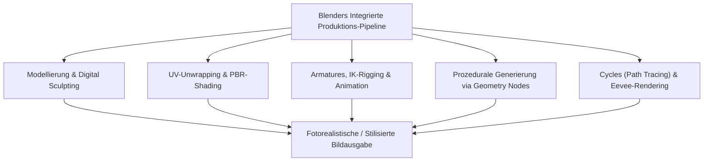
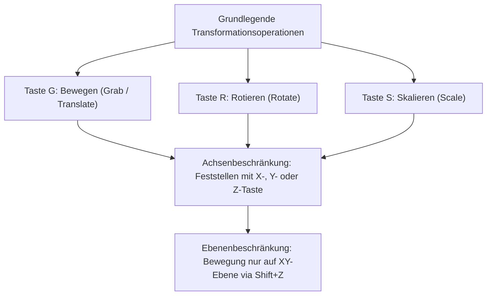
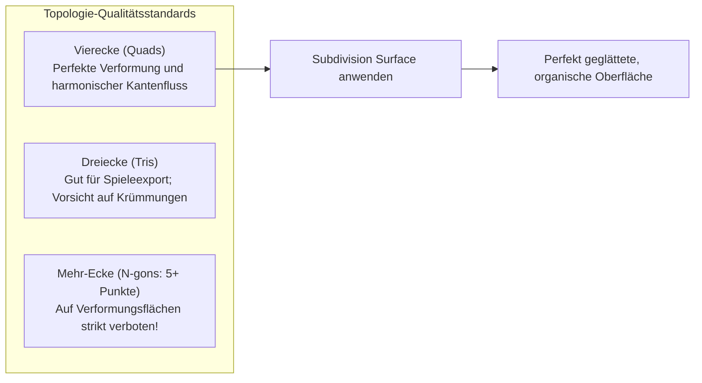
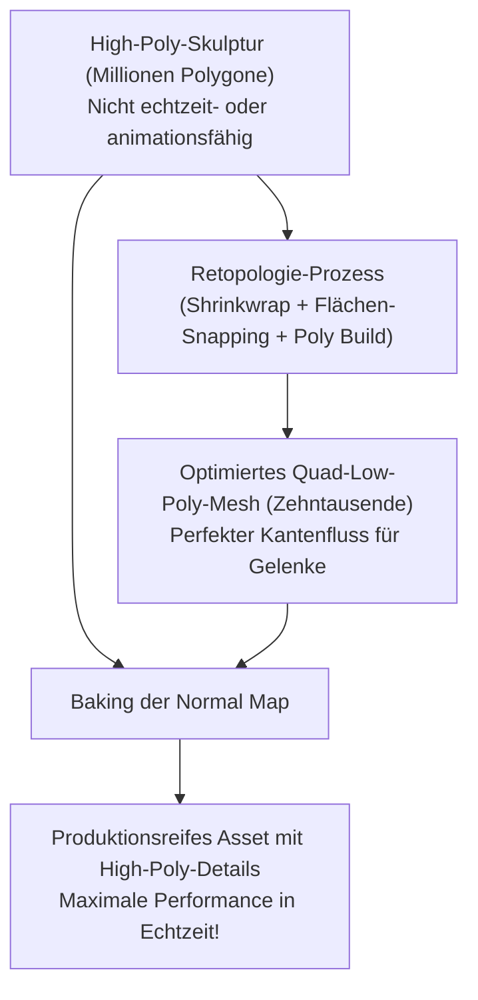
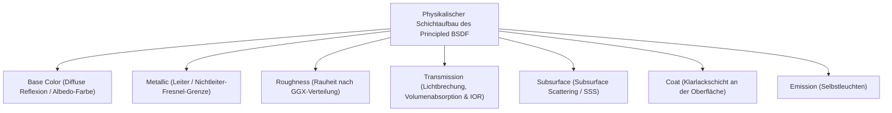
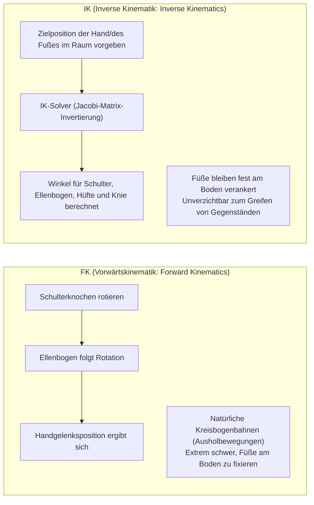
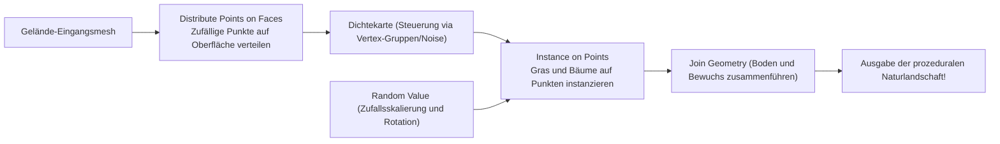
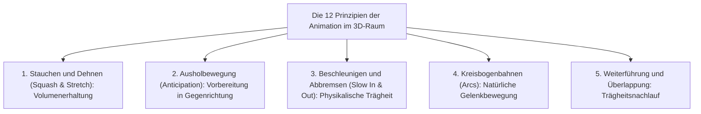
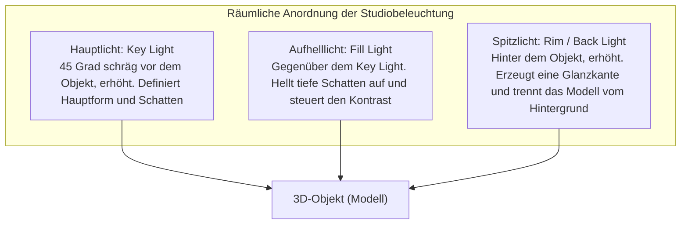

## 1. Einleitung: Blender als Open-Source-Revolution der 3DCG

### 1.1 Die Wundersame Geschichte von Ton Roosendaal und der Blender Foundation

In den frühen 1990er-Jahren als internes Werkzeug des niederländischen Animationsstudios NeoGeo entstanden, hat sich „Blender“ zur weltweit mächtigsten Open-Source-3DCG-Suite entwickelt. Heute bildet die Software das technologische Fundament der globalen digitalen Unterhaltungsindustrie, der Spieleentwicklung, der Hollywood-VFX, der Architekturvisualisierung und der wissenschaftlichen Forschung.

Die Geschichte der Software gleicht einem dramatischen Wunder. Nach der Insolvenz von NeoGeo wurden die geistigen Eigentumsrechte an Blender von Gläubigern beschlagnahmt, womit die Weiterentwicklung vor dem endgültigen Aus stand. 1998 gründete der Schöpfer Ton Roosendaal die „Blender Foundation“ und startete eine beispiellose Crowdfunding-Initiative. Mit Spenden in Höhe von 100.000 Euro, zusammengetragen von Kreativen aus aller Welt, kaufte er den Quellcode von den Gläubigern zurück. Am 13. Oktober 2002 wurde Blender unter der GNU General Public License (GPL) vollständig als Open Source der Welt geschenkt.

Während teure proprietäre Softwarelösungen (wie Maya, 3ds Max oder Cinema 4D) jährliche Lizenzgebühren von mehreren tausend Euro verlangen, hält Blender unbeirrt an seinem edlen Leitmotiv fest: **„Niemanden ausschließen; allen Künstlern weltweit die fortschrittlichsten Werkzeuge dauerhaft und völlig kostenlos zur Verfügung stellen.“**



---

### 1.2 Der Große UI-Umbruch in 2.80 und das Erreichen des Industriestandards in 4.x

Über viele Jahre hinweg wurde Blender von etablierten Studios oft gemieden, was vor allem an der eigenwilligen Benutzeroberfläche und der berüchtigten Selektion per Rechtsklick lag.

Mit der Veröffentlichung von „Blender 2.80“ im Jahr 2019 vollzog sich jedoch ein monumentaler Paradigmenwechsel in der CG-Industrie: Eine grundlegend modernisierte Benutzeroberfläche, der Standard-Linksklick und die Einführung der Echtzeit-PBR-Viewport-Engine „Eevee“ versetzten die Fachwelt in Erstaunen. Führende globale Technologiekonzerne wie Epic Games (Unreal Engine), Ubisoft, Unity, NVIDIA, AMD, Apple, Microsoft und Amazon traten der Blender Foundation umgehend als Großsponsoren (Corporate Patrons) bei.

In der modernen Generation „Blender 4.x“ haben das standardmäßige AgX-Farbmanagement, Light Linking, die physikalische Neugestaltung des Principled BSDF v2 und das explosionsartige Wachstum von Geometry Nodes dazu geführt, dass Blender heute als Hauptpipeline in renommierten kommerziellen Studios fest etabliert ist.

---

## 2. Grundarchitektur, Benutzeroberfläche und Shortcut-Philosophie

Die größte Einstiegshürde bei Blender – und zugleich die Quelle unübertroffener Arbeitsgeschwindigkeit nach der Einarbeitung – ist die „konsequent tastaturgesteuerte Arbeitsweise“.

### 2.1 Geometrische Koordinatensysteme und Transformationen im 3D-Raum

Der dreidimensionale virtuelle Raum in Blender basiert auf einem kartesischen Koordinatensystem ($X$-Achse: Links/Rechts / Rot, $Y$-Achse: Vorne/Hinten / Grün, $Z$-Achse: Oben/Unten / Blau) und folgt der Rechte-Hand-Regel.



- **Koordinatensystem-Modi**:
  - **Global**: Die absolute räumliche Ausrichtung der gesamten virtuellen Welt.
  - **Local**: Relative Koordinaten basierend auf der Eigendrehung des Objekts (zweimaliges Drücken von $Z$ bewegt entlang der lokalen $Z$-Achse des Objekts).
  - **Normal**: Ein Koordinatensystem, das sich an den Oberflächennormalen der selektierten Polygone orientiert.
- **Drehpunkt-Zentren (Pivot Points)**:
  - Bounding-Box-Zentrum, Schwerpunkt (Median Point), Individuelle Ursprünge, Aktives Element und der unverzichtbare **„3D-Cursor“**.
  - Der 3D-Cursor (der via Shift + Rechtsklick frei im Raum platziert werden kann) fungiert als Rotationsmittelpunkt oder Erzeugungsursprung für neue Objekte und begründet Blenders extrem schnelle Arbeitsabläufe.

---

### 2.2 Die 8 Essenziellen Shortcuts im Edit Mode

Durch Drücken der `Tab`-Taste wechselt man vom Objektmodus in den Bearbeitungsmodus (Edit Mode), um die Polygonstruktur direkt zu verändern. Die Kernarbeit der Polygonmodellierung basiert auf folgenden acht Tastenbefehlen:

| Tastenkürzel | Funktion | Interner Ablauf & Wichtige Optionen |
| :---: | :--- | :--- |
| **`E`** | **Extrudieren (Extrude)** | Zieht selektierte Flächen, Kanten oder Punkte entlang ihrer Flächennormale (oder einer Achse) heraus und erzeugt neue Geometrie. `Alt + E` öffnet „Individuelle Flächen extrudieren“ und „Entlang Normalen extrudieren“. |
| **`I`** | **Fläche Einfügen (Inset)** | Erzeugt konzentrisch nach innen versetzte neue Flächen innerhalb der Selektion mit gleichmäßigem Randabstand. Grundlage für Rahmen und Vertiefungen. |
| **`Ctrl + B`** | **Abschrägen (Bevel)** | Bricht scharfe Kanten im Winkel an. Das Drehen des Mausrads fügt Segmente hinzu, um Rundungen zu glätten. Taste `V` schaltet auf Eckpunkt-Bevel um. |
| **`Ctrl + R`** | **Schleifenschnitt (Loop Cut)** | Fügt eine umlaufende Kantenschleife entlang der Quad-Topologie des Meshes ein. Mausrad regelt die Anzahl; Linksklick erlaubt anschließendes Verschieben. |
| **`K`** | **Messer-Werkzeug (Knife)** | Zerschneidet Polygone frei Hand mit geraden Schnittlinien direkt auf der Modelloberfläche. `C` rastet Winkel ein; `Z` schneidet durch das gesamte Modell hindurch. |
| **`Alt + M` / `M`** | **Zusammenfügen (Merge)** | Verschmilzt mehrere Punkte zu einem einzigen Punkt („Im Zentrum“, „Am Cursor“, „Am ersten/letzten Punkt“). Auto Merge verschmilzt nah beieinanderliegende Punkte automatisch. |
| **`GG`** | **Kanten-/Punktschlittern (Slide)** | Zweimaliges kurzes Drücken von `G` bewegt selektierte Punkte oder Kanten entlang angrenzender Kanten, ohne die Krümmung der Oberfläche zu zerstören. |
| **`F`** | **Fläche/Kante Bilden (Make Face/Edge)** | Verbindet zwei Punkte mit einer Kante oder schließt drei oder mehr Punkte/Kanten zu einer Polygonfläche. |

---

## 3. Polygon-Modellierung und die Perfektion von Subdivision Surfaces

### 3.1 Regeln der Topologie und die Unabdingbarkeit von Vierecken (Quads)

In der polygonalen 3D-Modellierung werden Flächen anhand ihrer Eckpunktanzahl in drei Kategorien unterteilt:
1. **Dreiecke (Tris: 3 Punkte)**: Bleiben stets planar und sind das Standardformat in Echtzeit-Engines, erzeugen aber bei Subdivision-Berechnungen und Skelettverformungen unschöne Verzerrungen und Falten (Pinching).
2. **Vierecke (Quads: 4 Punkte)**: **Der uneingeschränkte Goldstandard im professionellen Modellbau**. Kantenflüsse (Edge Flows) verlaufen sauber und berechenbar, während Subdivision-Surfaces makellos interpoliert werden.
3. **Mehr-Ecke (N-gons: 5 oder mehr Punkte)**: Außer auf vollkommen ebenen Flächen im frühen Modellierstadium **sind N-gons in gekrümmten oder beweglichen Bereichen strengstens verboten**. Subdivision-Algorithmen können sie nicht eindeutig triangulieren, was zu schweren Schattierungsfehlern und schwarzen Flecken beim Rendering führt.

Zudem wirken Punkte, an denen fünf oder mehr Kanten (E-Poles) oder nur drei Kanten (N-Poles) zusammentreffen, als Weichen für den Kantenverlauf. Diese Pole von Gelenkbiegungen und Gesichtsmuskeln fernzuhalten und dem anatomischen Muskelverlauf zu folgen, zeichnet erstklassige Modeller aus.



---

### 3.2 Die Mathematik der Subdivision Surfaces: Das Catmull-Clark-Verfahren

Sanft geschwungene Filmcharaktere und aerodynamische Automobilkarosserien entstehen durch Anwendung des **„Subdivision Surface Modifiers“** (`Ctrl + 1~3`) auf ein grobes Basiskäfigmodell.

Der Catmull-Clark-Algorithmus, 1978 von Edwin Catmull und Jim Clark formuliert, führt bei jedem Verfeinerungsschritt drei grundlegende Berechnungen durch:

1. **Flächenmittelpunkt (Face Point)**: Der Schwerpunkt aller Eckpunkte des jeweiligen Polygons:
   $$F = \frac{1}{n} \sum_{i=1}^n V_i$$
2. **Kantenmittelpunkt (Edge Point)**: Das arithmetische Mittel der beiden Kantenendpunkte und der Flächenmittelpunkte der zwei angrenzenden Polygone:
   $$E = \frac{V_1 + V_2 + F_1 + F_2}{4}$$
3. **Neuer Punktort (Vertex Point)**: Für einen bestehenden Punkt $V$ ergibt sich die neue Position $V'$ aus dem Mittelwert $Q$ aller angrenzenden Flächenmittelpunkte, dem Mittelwert $R$ aller angrenzenden Kantenmittelpunkte und dem Punkt selbst mit Valenz $n$:
   $$V' = \frac{Q + 2R + (n-3)V}{n}$$

Durch wiederholte Anwendung konvergiert das eckige Netz mathematisch exakt gegen eine stetige kubische B-Spline-Grenzfläche.

#### Stützkanten und Kantenfaltung (Support Loops & Crease)
Um Kanten trotz Subdivision scharf zu halten, platziert man **Stützkanten (Holding/Support Loops)** in geringem Abstand parallel zur Hauptkante. Je enger der Abstand, desto stärker wird die Rundungswirkung eingedämmt, was präzise Glanzlichter auf Metall- oder Kunststoffteilen erzeugt (alternativ steuerbar über Edge Crease).

---

### 3.3 Der Zerstörungsfreie Workflow des Modifier Stacks

Die fundamentale Stärke von Blender liegt im **Modifier Stack**, der geometrische Operationen parametrisch in Echtzeit berechnet, ohne die ursprüngliche Netzgeometrie irreversibel zu zerstören.

| Modifier | Kategorie | Funktionsweise & Industrielle Best Practices |
| :--- | :---: | :--- |
| **Mirror (Spiegeln)** | Generieren | Spiegelt das Mesh achsensymmetrisch (meist X-Achse). „Clipping“ verschmilzt Punkte auf der Mittelachse nahtlos. Essenziell für Charaktere und Fahrzeuge. |
| **Array (Anordnung)** | Generieren | Klont Geometrie mehrfach anhand fester Abstände oder Objekt-Offsets. Erzeugt Treppen, Ketten, Zäune und kreisförmige Schraubenanordnungen prozedural. |
| **Boolean (Boolesche)** | Generieren | Führt Mengenoperationen (Vereinigung, Differenz, Schnittmenge) aus. Bietet Modi Exact und Fast. Schlägt Nuten und Löcher im Hard-Surface-Modeling blitzschnell aus. |
| **Solidify (Verdicken)** | Generieren | Verleiht flachen, dickenlosen Flächen eine gleichmäßige Wandstärke entlang der Normalen. Unverzichtbar für Kleidung, Glasflaschen und Karosseriebleche. |
| **Bevel (Fase)** | Bearbeiten | Rundet scharfe Kanten zerstörungsfrei nach Gewichtung oder Grenzwinkeln ($\ge 30^\circ$) ab. Erzeugt fotorealistische Glanzkanten ohne Mesh-Aufblähung. |
| **Weighted Normal** | Modifizieren | Berechnet Eckpunktnormalen neu, indem große Planarflächen gegenüber kleinen Fasen bevorzugt werden. Beseitigt Schattierungsfehler auf Low-Poly-Modellen spurlos. |

---

## 4. Digital Sculpting und Retopologie

Der „Sculpt Mode“ bietet eine intuitive Modellierumgebung, die dem Kneten von Ton ähnelt und sich ideal für Kreaturen, Muskelstrukturen und feine Hautfalten eignet.

### 4.1 Die Wichtigsten Sculpting-Pinsel

- **Draw**: Hebt die Oberfläche entlang der Normalen an; mit gedrückter `Ctrl`-Taste wird Geometrie eingekerbt.
- **Clay Strips**: Trägt rechteckige Tonstreifen auf, um primäre Skelett- und Muskelvolumina schnell aufzubauen.
- **Grab**: Greift weite Bereiche des Meshes, um Silhouetten und anatomische Proportionen dynamisch anzupassen.
- **Crease**: Zieht scharfe Vertiefungen und Faltenlinien ein, unentbehrlich für Mimikfalten und Stoffdrapierungen.
- **Smooth**: Glättet Unebenheiten (aus jedem Pinsel sofort durch Halten von `Shift` erreichbar).
- **Inflate**: Bläht die gewählte Region wie einen Ballon allseitig entlang der Normalen auf.

---

### 4.2 Dynamic Topology (Dyntopo) vs. Voxel Remesh

Beim Sculpting hochdetaillierter Modelle mit mehreren Millionen Polygonen ist die Steuerung der Netzdichte entscheidend.

1. **Dyntopo (Dynamic Topology)**:
   - Unterteilt Dreiecke in Echtzeit adaptiv nur dort, wo der Pinselstrich die Oberfläche berührt.
   - Ermöglicht mikroskopische Details an Augen, Fingern und Ohren, ohne das restliche Modell unnötig zu belasten.
2. **Voxel Remesh (`Ctrl + R`)**:
   - Zerlegt den 3D-Raum in ein Gitter gleichmäßiger Voxel-Würfel (z. B. $0,01\,\text{m}$) und baut das Netz als gleichförmige Quad-Struktur komplett neu auf.
   - Verschmilzt Boolesche Baugruppen nahtlos, beseitigt extreme Polygonverzerrungen und stellt eine homogene Knetmasse wieder her.

---

### 4.3 Theorie und Praxis der Retopologie

Hochaufgelöste Skulpturen (oft dutzende Millionen Polygone) sind datenseitig viel zu schwer, um in Echtzeit gerendert oder mit einem Animationsskelett verformt zu werden.

**„Retopologie“** bezeichnet das präzise Neuaufbauen eines optimierten Low-Poly-Meshes (tausende bis zehntausende Quads), das sich eng an die Oberfläche der High-Poly-Skulptur anschmiegt und einen sauberen Kantenfluss besitzt.



1. **Shrinkwrap-Modifier** und **Face-Project-Snapping** aktivieren.
2. Konzentrische Kantenringe um stark verformbare Bereiche (Augen, Lippen, Nasenflügel) legen.
3. Den Fluss vom Kiefer über den Hals zu den Schultern leiten und an Knien und Ellbogen dreifache Stützringe einbauen, um Volumenverlust beim Beugen zu verhindern.
4. Nach Abschluss werden feinste Poren und Falten des High-Poly-Modells auf das Low-Poly-Modell als **Normal Map** gebacken.

---

## 5. Material-Shading und die Wissenschaft des PBR-Renderings

Die Erstellung von Materialien erfolgt in Blenders knotenbasiertem Shader Editor. Das moderne „Physically Based Rendering (PBR)“ simuliert die elektromagnetischen Wechselwirkungen des Lichts (Reflexion, Brechung, Absorption, Streuung) auf Basis physikalischer Gesetze.

### 5.1 Mathematische Analyse des Principled BSDF v2

Der Allround-Shader „Principled BSDF“ basiert auf dem Disney Principled BRDF Modell von 2012 und wurde in Blender 4.0 im Hinblick auf Mikrofacetten-Energieerhaltung nochmals präzisiert.



1. **Base Color (Grundfarbe / Albedo)**:
   - Bei Nichtleitern (Dielektrika): Farbe des diffusen Lichts, das in das Material eindringt, mehrfach gestreut wird und wieder austritt.
   - Bei Leitern (Metallen): Licht dringt ein und wird sofort von freien Elektronen absorbiert; diffuse Reflexion ist null. Die Base Color definiert direkt die spiegelnde Reflexionsfarbe bei senkrechtem Einfall ($F_0$) (Gold ist gelb, Kupfer rötlich).
2. **Metallic ($0.0 \sim 1.0$)**:
   - In der Natur gibt es nur **Nichtleiter (Metallic = 0.0)** oder **Metalle (Metallic = 1.0)**. Zwischenwerte (wie 0.5) sind physikalisch unsinnig und kommen nur bei staubigen oder angerosteten Grenzflächen vor.
3. **Roughness (Oberflächenrauheit)**:
   - Steuert die mikroskopische Ausrichtung der Facetten (GGX-Verteilung).
   - $0.0$: Ein makelloser Spiegel (Lichtstrahlen reflektieren ungestreut).
   - $1.0$: Maximale Rauheit (Licht wird gleichmäßig in alle Raumrichtungen gestreut, wie bei Kreide).
4. **IOR (Brechungsindex / Index of Refraction)**:
   - Bestimmt die Lichtbrechung nach dem Snelliusschen Brechungsgesetz ($n_1 \sin \theta_1 = n_2 \sin \theta_2$).
   - Luft: $1.0003$, Wasser: $1.333$, Acrylglas: $1.49$, Fensterglas: $1.52$, Diamant: $2.417$.
5. **Subsurface Scattering (SSS / Untergrundstreuung)**:
   - Tritt bei halbdurchlässigen Materialien (Haut, Marmor, Wachs, Milch, Jade) auf, wo Photonen unter die Oberfläche dringen, milliardenfach gestreut werden und versetzt wieder austreten.
   - Kurzwelliges blaues Licht wird in der Haut rasch absorbiert, während rotes Licht durch Hämoglobin tief vordringt; dadurch leuchten Ohren und Fingerkuppen im Gegenlicht rötlich (Subsurface Radius für RGB-Kanäle).

---

### 5.2 UV-Unwrapping und Texeldichte (Texel Density)

Um zweidimensionale Bildtexturen (Albedo, Roughness, Normal) verzerrungsfrei auf ein 3D-Objekt aufzubringen, muss das Netz wie ein Papierschnittmuster auf eine 2D-Ebene abgewickelt werden (**UV-Unwrapping**).

- **Nahtplatzierung (Seams)**:
  - Tastenkürzel `Ctrl + E` $\rightarrow$ „Mark Seam“.
  - Wie bei maßgeschneiderter Kleidung sollten Nähte verdeckt platziert werden (Beininnenseiten, Haaransatz, Rückenmitte).
- **Einheitliche Texeldichte**:
  - Verhältnis von Texturpixeln zu physikalischen 3D-Längeneinheiten ($\text{px/cm}$).
  - Besitzt das Gesicht $20,48\,\text{px/cm}$ und der Torso nur $2,56\,\text{px/cm}$, wirkt das Modell unharmonisch aufgelöst. Alle UV-Inseln müssen auf denselben Maßstab skaliert und platzsparend im UV-Raum $[0, 1]$ angeordnet werden.

---

## 6. Armature-Rigging und Mechanik der Animation

Rigging ist die Kunst, ein inneres Knochenskelett („Armature“) zu konstruieren, um starre 3D-Modelle organisch zu deformieren und lebendig zu animieren.

### 6.1 Der Mathematische Konflikt: Vorwärtskinematik (FK) vs. Inverse Kinematik (IK)

Zur Steuerung von Gliedmaßen existieren zwei entgegengesetzte mathematische Ansätze:



- **FK (Forward Kinematics)**: Rotationswerte vererben sich vom Eltern- auf den Kindknochen. Ideal für freie Gesten in der Luft, aber fatal bei Bodenkontakt: Beugt sich die Figur, versinken die Füße im Boden und erfordern aufwendige Einzelbildkorrekturen.
- **IK (Inverse Kinematics)**: Die Position des Endglieds (Fuß oder Hand) wird im Raum arretiert; ein **IK-Solver (z. B. CCD-IK oder FABRIK)** errechnet automatisch die nötigen Gelenkwinkel der darüberliegenden Knochen. Unerlässlich für Gehzyklen.
- **Pole Target**: Ein Steuerungsvektor im Raum, der die Ausrichtung des Knies oder Ellenbogens vorgibt und verhindert, dass Gelenke unnatürlich umknicken.

---

### 6.2 Weight Painting (Gewichtsmalung)

Definiert den Einfluss ($0.0 \sim 1.0$, visuell von Blau $= 0$ über Grün $= 0.5$ bis Rot $= 1.0$), den ein Knochen auf die umliegenden Eckpunkte des Netzes ausübt.
- An Gelenken wie Knie oder Ellenbogen benötigt die Innenseite steile Übergänge, während die Außenseite weich verlaufen muss, um ein Einstürzen der Geometrie zu verhindern.
- Die Summe aller Knocheneinflüsse auf einen Punkt muss stets mit „Normalize All“ auf exakt $1.0$ normiert sein, da sonst Verzerrungen oder Artefakte entstehen.

---

## 7. Die Revolution der Prozeduralen Generierung: Geometry Nodes

Seit Blender 3.0 begeistern **„Geometry Nodes“** technische Künstler weltweit: Ein visuelles Programmiersystem, das über verknüpfte Rechenknoten unendliche geometrische Variationen vollautomatisch generiert.

### 7.1 Die Fields-Architektur

Geometry Nodes verzichten auf träge Schleifen über Einzelpunkte und nutzen stattdessen das „Fields“-Datenflussmodell. Datenströme fungieren als mathematische Funktionen, die über den gesamten geometrischen Kontext gleichzeitig evaluiert werden.



### 7.2 Praxisbeispiel: Prozeduraler Wald mit Geometry Nodes

1. Das Geländemesh dient als Basiseingabe (`Group Input`).
2. **Distribute Points on Faces**: Verteilt Punkte über die Oberfläche mittels Poisson-Disk-Sampling, um Mindestabstände zwischen Bäumen einzuhalten.
3. Ein **Noise Texture** Node steuert den `Density`-Eingang, um dichte Waldstücke von offenen Lichtungen organisch abzugrenzen.
4. **Instance on Points**: Instanziert vorbereitete Baumsammlungen (`Collection Info`) auf den generierten Punkten.
5. **Rotate Instances / Scale Instances**: Ein **Random Value** Node variiert die $Z$-Achsen-Drehung ($0 \sim 2\pi$) und die Skalierung (Normalverteilung $0.7 \sim 1.3$).
6. Wird das Gelände im Edit Mode verformt, passt sich der gesamte Wald prozedural in Echtzeit an die neue Topografie an.

Mit modernen **„Simulation Nodes“** lassen sich sogar im Wind wehendes Gras, fallende Sandkörner, Regeneinschläge und einfache Fluiddynamiken direkt innerhalb der Geometry Nodes berechnen.

---

## 8. Rendering-Physik: Cycles vs. Eevee Next

Blender verfügt über zwei hochmoderne Render-Engines für unterschiedliche Einsatzzwecke.

### 8.1 Cycles: Die Physik des Monte-Carlo-Path-Tracing

Cycles ist eine unvoreingenommene (unbiased), physikalisch basierte Path-Tracing-Engine, die die Ausbreitung von Licht exakt simuliert.

Sie schießt virtuelle Lichtstrahlen von der Kamera rückwärts in die Szene und berechnet tausende stochastische Abprallvorgänge anhand von Material-BSDFs mittels Monte-Carlo-Integration:

$$L_o(p, \omega_o) = L_e(p, \omega_o) + \int_{\Omega} f_r(p, \omega_i, \omega_o) L_i(p, \omega_i) (\omega_i \cdot n) d\omega_i$$

- Durch Lösen der **Kajiya-Rendering-Gleichung** entstehen globale Beleuchtung, Farbausbluten (Color Bleeding: rotes Licht einer Wand färbt einen weißen Boden leicht ein), realistische Glasbrechung, Kaustiken und physikalisch weiche Schatten vollkommen authentisch.
- **KI-Denoising**: Das typische Monte-Carlo-Rauschen wird durch Deep-Learning-Algorithmen (Intel Open Image Denoise / NVIDIA OptiX) augenblicklich entfernt, sodass schon bei moderaten Samplezahlen (128 bis 512) rauschfreie Bilder entstehen.

---

### 8.2 Eevee Next: Echtzeit-Rasterisierung auf Höchstniveau

Für blitzschnelle Viewport-Vorschauen bei interaktiven Bildraten sorgt „Eevee“.
Die modernisierte Architektur von „Eevee Next“ verbessert Screen-Space-Reflexionen (SSR), beseitigt Schattenauflösungsgrenzen via Virtual Shadow Maps (VSM) und integriert Screen-Space-Subsurface-Scattering sowie Ambient Occlusion (GTAO), wodurch in Sekundenschnelle Ergebnisse nahe an Cycles-Qualität entstehen.

---

### 8.3 Farbmanagement: Die Wissenschaft Hinter AgX

Das ab Blender 4.0 standardmäßig integrierte Farbmanagementsystem **„AgX“** löst das Problem des Ausbrennens und der Farbtonverschiebungen, unter dem frühere sRGB- und Filmic-Pipelines in hellen Glanzlichtern litten.

Indem es die spektrale Lichtempfindlichkeit der menschlichen Netzhautzapfen und die logarithmische Belichtungskurve (Log) von Kinofilm imitiert, bewahrt AgX die Farbtreue (Hue) selbst bei extremer Überbelichtung durch einen sanften Tonwertabfall (Roll-Off). Flammen, Neonröhren und sonnenbeschienene Hautpartien werden mit großem Dynamikumfang filmreif gerendert.

---

## 6.4 Das Herz der Animation: Disneys 12 Prinzipien in 3D und F-Kurven

Das bloße Setzen von Keyframes (`I`) auf Knochen führt zu steifen, roboterhaften Bewegungen, die im „Uncanny Valley“ enden. Lebendigkeit entsteht erst, wenn die in den 1930er-Jahren von Walt Disneys legendären Animatoren („Nine Old Men“) formulierten **„12 Prinzipien der Animation“** im Graph Editor umgesetzt werden.



### 1. Volumenerhaltung bei Squash and Stretch
Prallt ein springender Ball auf den Boden, staucht er sich flach zusammen (Squash); schnellt er empor, dehnt er sich in Bewegungsrichtung (Stretch).
- **Zentrales Gesetz**: Während jeder Verformung **muss das Gesamtvolumen des Körpers konstant bleiben**.
- Wird ein Objekt auf der $Z$-Achse auf $0.5$ gestaucht, müssen die $X$- und $Y$-Achsen um $\sqrt{1 / 0.5} \approx 1.414$ expandieren. In Blender übernimmt das Bone-Constraint „Stretch To“ diesen Ausgleich automatisch.

### 2. Der Graph Editor und die Dynamik Kubischer Bézier-Kurven
Der Graph Editor stellt Parameteränderungen über die Zeit als zweidimensionale „F-Kurven“ dar.
- **Lineare Interpolation**: Erzeugt gleichförmige, mechanische Bewegungen ohne physikalisches Eigengewicht.
- **Bézier-Interpolation**: Sanftes Beschleunigen (Ease-In) und harmonisches Abbremsen (Ease-Out) über kubische Polynomkurven.
- In einem Gehzyklus (Walk Cycle) werden Hüftbewegung, Beinschwung und Armpendeln um wenige Frames zeitlich gegeneinander versetzt (Overlapping Action), um die komplexe Schwerpunktverlagerung des menschlichen Körpers nachzubilden.

---

## 7.5 Prozedurale Automatisierung mit der Python-API (`bpy`)

Die herausragende Stärke der Blender-Architektur liegt in der vollständigen Anbindung aller Funktionen, Datenstrukturen und Bedienelemente an „Python“. Fährt man mit der Maus über eine beliebige Schaltfläche, wird der dazugehörige Python-Attributpfad angezeigt.

Im Arbeitsbereich `Scripting` lassen sich komplexe mathematische Formen per Skript in Sekundenschnelle generieren.

### Python-Skript: Prozedurale Generierung eines Möbiusbands
```python
import bpy
import math

# Bestehende Mesh-Objekte aus der Szene löschen
bpy.ops.object.select_all(action='SELECT')
bpy.ops.object.delete()

# Parameter für das Möbiusband
R = 3.0           # Hauptradius
w = 1.0           # Halbe Bandbreite
u_segments = 120  # Auflösung entlang des Umfangs
v_segments = 20   # Auflösung über die Breite

verts = []
faces = []

for i in range(u_segments):
    u = 2.0 * math.pi * i / u_segments
    for j in range(v_segments + 1):
        v = -w + (2.0 * w * j / v_segments)
        
        # Parametergleichungen des Möbiusbands
        x = (R + v * math.cos(u / 2.0)) * math.cos(u)
        y = (R + v * math.cos(u / 2.0)) * math.sin(u)
        z = v * math.sin(u / 2.0)
        
        verts.append((x, y, z))

# Flächenindizes für das Mesh berechnen
for i in range(u_segments):
    next_i = (i + 1) % u_segments
    for j in range(v_segments):
        p1 = i * (v_segments + 1) + j
        p2 = i * (v_segments + 1) + (j + 1)
        
        # Topologische Umkehrung beim Ringschluss (halbe Verdrillung)
        if next_i == 0:
            p3 = next_i * (v_segments + 1) + (v_segments - (j + 1))
            p4 = next_i * (v_segments + 1) + (v_segments - j)
        else:
            p3 = next_i * (v_segments + 1) + (j + 1)
            p4 = next_i * (v_segments + 1) + j
            
        faces.append((p1, p2, p3, p4))

# Neues Mesh erzeugen und Objekt zur Szene hinzufügen
mesh = bpy.data.meshes.new(name="Mobius_Strip_Mesh")
mesh.from_pydata(verts, [], faces)
mesh.update()

obj = bpy.data.objects.new(name="Mobius_Strip", object_data=mesh)
bpy.context.collection.objects.link(obj)

# Schattierungsglättung (Smooth Shading) aktivieren
for poly in mesh.polygons:
    poly.use_smooth = True
```

Über die Python-API (`bpy`) wächst Blender weit über eine reine Modellierungssoftware hinaus und fungiert als leistungsfähige Plattform für parametrische Architektur, 3D-Volumenrekonstruktion medizinischer CT-Daten und automatisierte Generierung synthetischer Datensätze für Machine Learning.

---

## 8.4 Physik der Studiobeleuchtung und die Kunst des Compositors

Selbst das beste Modell mit perfekten PBR-Shadern wirkt flach und leblos, wenn die Lichtkomposition mangelhaft ist.

### 1. Die Klassische Drei-Punkt-Beleuchtung (Three-Point Lighting)
Das bewährte Grundschema, um plastische Tiefe und Materialkonturen im 3D-Raum herauszuarbeiten:



- **Kontrastverhältnisse (Key zu Fill)**:
  - Werbe- und Komödienstil: $2:1 \sim 3:1$ (Helle Grundstimmung, weiche Schatten).
  - Dramatischer Film-Noir-Stil: $8:1 \sim 16:1$ (Tiefe Schatten und prägnanter Hell-Dunkel-Kontrast).
- **Lichtquellengröße und Halbschatten (Shadow Penumbra)**:
  - Punktförmige Lichtquellen erzeugen rasiermesserscharfe, harte Schatten (Hard Shadows).
  - Große Flächenleuchten (Softboxen, Area Lights) umfluten Kanten und werfen weich verlaufende Halbschatten (Soft Shadows).

### 2. Filmische Postproduktion im Compositor
Das reine Render-Ergebnis ist wie ein digitales Negativ. Erst im knotenbasierten Compositor erhält das Bild seinen kinoreifen Schliff:

1. **Glare Node**: Erzeugt im Modus „Fog Glow“ atmosphärische Lichtüberstrahlung (Bloom) um Glanzpunkte; im Modus „Streaks“ simuliert er horizontale Linsenreflexe anamorphotischer Objektive.
2. **Tiefenschärfe (Depth of Field)**: Über Brennweite und Blendenwert (F-Stop) der virtuellen Kamera entsteht ein fotorealistisches Bokeh, das den Fokus gezielt auf das Hauptmotiv lenkt.
3. **Chromatische Aberration (Lens Distortion & Dispersion)**: Geringe Dispersionswerte ($0,01 \sim 0,02$) spalten die RGB-Farbkanäle an den Bildrändern leicht auf und verleihen dem sterilen CG-Rendering die warme Optik echter Glaslinsen.

---

## 8.5 Dynamik der Physikalischen Simulationssysteme

Blender verfügt über leistungsstarke numerische Simulationssysteme zur Berechnung klassischer physikalischer Phänomene:

1. **Starrkörperdynamik (Rigid Body)**:
   - Berechnet Kollisionen, Impulsübertragung, Reibung und Dominoeffekte nach Newtonschen Gesetzen.
   - Weist Objekten die Eigenschaft „Active“ (beweglich) oder „Passive“ (statisch) zu und nutzt Kollisionsformen von „Convex Hull“ bis zum exakten „Mesh“.
2. **Stoffsimulation (Cloth)**:
   - Simuliert Textilien, Kleidung und Fahnen mittels eines Masse-Feder-Systems (Mass-Spring System).
   - Einstellbare Zugfestigkeit, Biegewiderstand und aktivierte Selbstkollision („Self-Collision“) verhindern unerwünschte Selbstüberschneidungen des Stoffs.
3. **Fluid- und Rauchsimulation (Mantaflow)**:
   - Hydrodynamische Berechnungen basierend auf den Navier-Stokes-Gleichungen.
   - Berechnet und speichert (Bake) Flüssigkeitsspritzer, Flammenausbreitungen und Verwirbelungen (Vorticity) innerhalb eines definierten Voxel-Volumens (Domain).

---

## 9. Fazit: Die Zukunft von 3D-Kreativen und die Horizonte mit Blender

Blender zu meistern bedeutet, sich auf eine multidisziplinäre Reise zu begeben, auf der Mathematik, Optik, Anatomie, Farblehre und reine Ästhetik miteinander verschmelzen.

Von dem Moment an, in dem man den Standardwürfel löscht und den ersten Punkt extrudiert:
- Formen Catmull-Clark-Subdivisions organische Skulpturen voller Ausdruckskraft;
- Erzählen physikalische Shader das Spiel des Lichts auf Materie;
- Hauchen Armatures und Kinematik statischen Körpern Bewegung ein;
- Erschaffen Geometry Nodes algorithmisch unendliche Welten;
- Und fängt Cycles mit Milliarden Lichtstrahlen photorealistische Bilder ein.

Was einst Großrechnern und Hollywood-Studios vorbehalten war, steht heute jedem Menschen mit einem Computer und Blender kostenlos zur Verfügung.

„Was immer du dir vorstellen kannst, lässt sich gestalten.“
Mit Blender liegt vor jedem Künstler ein unendliches kreatives Universum, dessen Grenzen allein durch die eigene Vorstellungskraft bestimmt werden.
