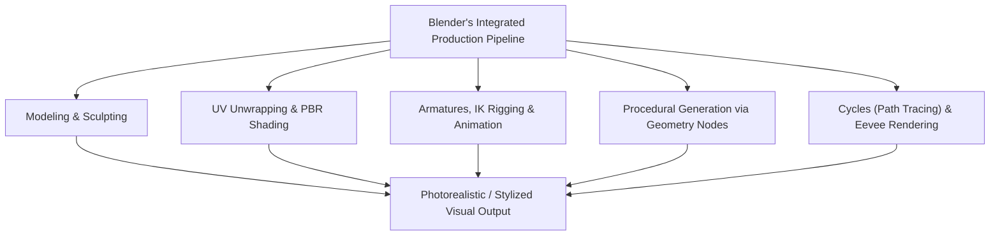
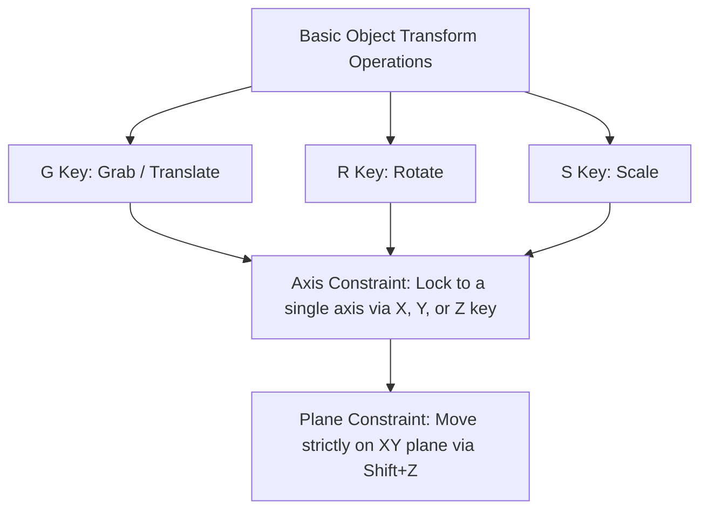
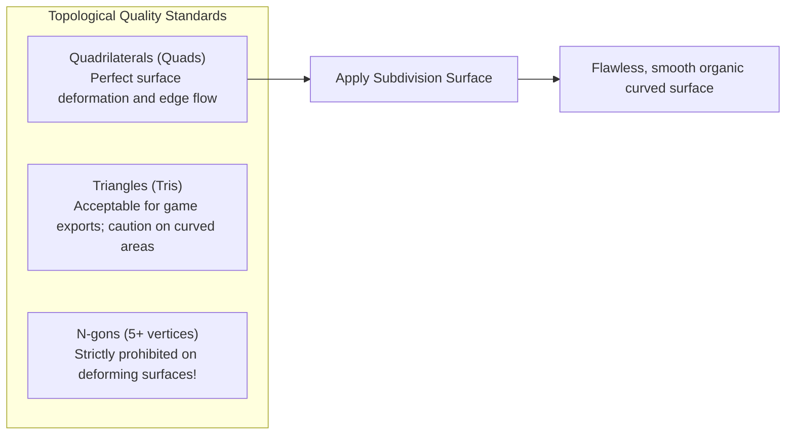
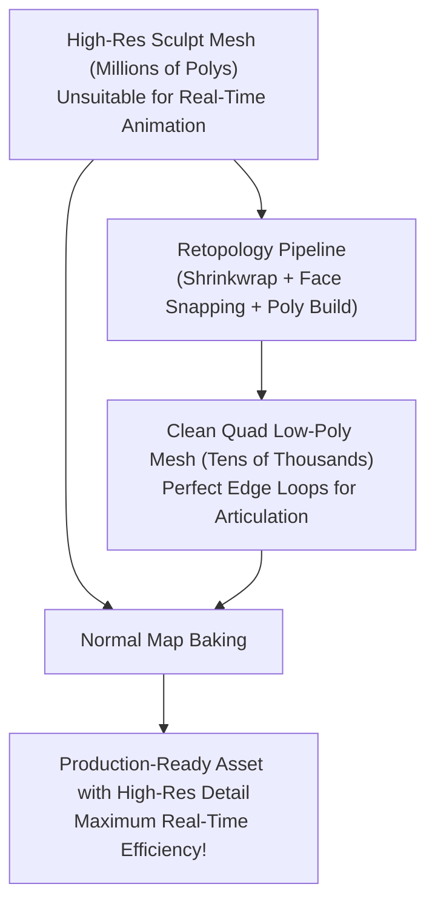
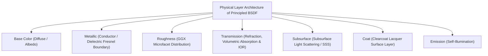
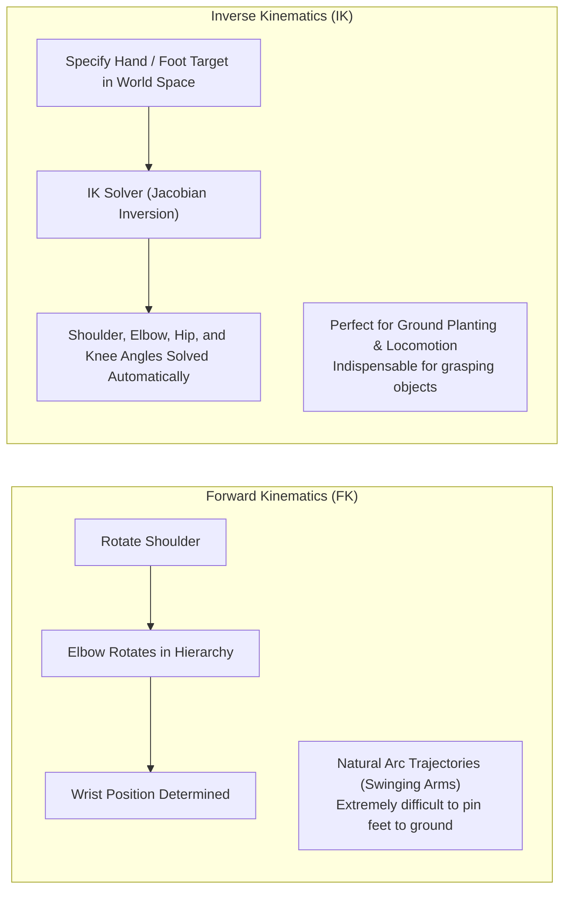
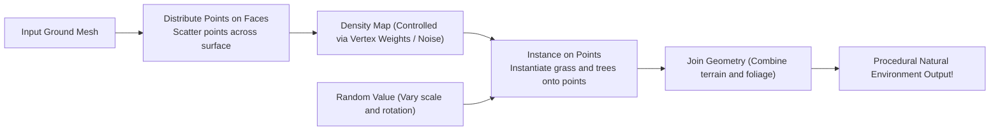
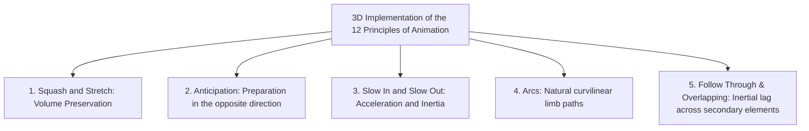
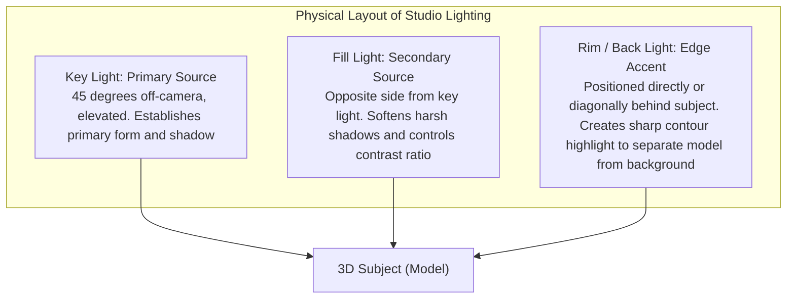

## 1. Introduction: Blender as an Open-Source 3DCG Revolution

### 1.1 The Miraculous History of Ton Roosendaal and the Blender Foundation

Originating in the early 1990s as an in-house tool for the Dutch animation studio NeoGeo, "Blender" has evolved into the world's most powerful open-source 3DCG suite, underpinning the foundations of global digital entertainment, game development, Hollywood VFX, architectural visualization, and scientific research.

Its history reads like a dramatic miracle. Following the insolvency of NeoGeo, Blender's intellectual property was seized by creditors, placing development on the brink of permanent termination. In 1998, founder Ton Roosendaal established the "Blender Foundation" and launched an unprecedented crowdfunding campaign. Rallying 100,000 euros in donations from creators across the globe, he bought back the source code from the creditors. On October 13, 2002, Blender was officially released to the world as fully open-source software under the GNU General Public License (GPL).

While expensive proprietary software (such as Maya, 3ds Max, and Cinema 4D) levies thousands of dollars in annual subscription fees, Blender has steadfastly adhered to its noble founding creed: **"Never exclude anyone; provide the finest creation tools to every artist on earth, completely free of charge, forever."**



---

### 1.2 The Major UI Overhaul of 2.80 and Reaching Industry Standard in the 4.x Era

For many years, Blender was often shunned by mainstream artists due to its idiosyncratic and intimidating user interface, most notably its default "right-click select" paradigm.

However, the release of "Blender 2.80" in 2019 triggered an unprecedented paradigm shift across the CG industry, introducing a complete UI overhaul, standardized left-click selection, and the real-time PBR viewport engine "Eevee." Global tech giants—including Epic Games (Unreal Engine), Ubisoft, Unity, NVIDIA, AMD, Apple, Microsoft, and Amazon—promptly pledged major financial support to the Blender Development Fund as Corporate Patrons.

With today's "Blender 4.x" generation, features such as the AgX color management system by default, Light Linking, the physically grounded overhaul of Principled BSDF v2, and the exponential expansion of Geometry Nodes have elevated Blender to a premier tool proudly integrated into the primary pipelines of commercial production studios.

---

## 2. Fundamental Architecture, UI, and Shortcut Philosophy

The biggest initial learning hurdle in Blender—and the very factor that yields unmatched execution speed once mastered—is its radically refined shortcut-driven interface.

### 2.1 Geometric Coordinate Systems and Transformations in 3D Space

Blender's virtual space is defined by a 3D Cartesian coordinate system ($X$-axis: Left/Right / Red, $Y$-axis: Front/Back / Green, $Z$-axis: Up/Down / Blue), adhering to a right-handed coordinate convention.



- **Coordinate System Orientations**:
  - **Global**: The absolute cardinal directions of the entire virtual universe.
  - **Local**: Relative coordinates oriented to the object's own rotation (pressing $Z$ twice constrains movement along the object's local $Z$-axis).
  - **Normal**: A coordinate system oriented to the surface normal of selected faces.
- **Pivot Points (Transform Centers)**:
  - Bounding Box Center, Median Point, Individual Origins, Active Element, and the ubiquitous **"3D Cursor"**.
  - The 3D Cursor (positioned anywhere in 3D space via Shift + Right-Click) serves as an arbitrary rotational pivot or instantiation point, enabling Blender's uniquely fluid and lightning-fast workflow.

---

### 2.2 The 8 Essential Shortcuts in Edit Mode

Selecting an object and pressing `Tab` switches from Object Mode (which manipulates objects as whole entities) to Edit Mode (which allows direct manipulation of mesh geometry). Core polygonal modeling relies on these eight fundamental key combinations:

| Shortcut | Operation | Internal Behavior & Practical Options |
| :---: | :--- | :--- |
| **`E`** | **Extrude** | Extends selected faces, edges, or vertices along their surface normals (or specified axis) to construct new geometry. `Alt + E` offers "Extrude Individual Faces" and "Extrude Along Normals." |
| **`I`** | **Inset Faces** | Creates concentric new faces within the selection offset inward by a uniform margin. The primary tool for defining borders and panel lines. |
| **`Ctrl + B`** | **Bevel** | Chamfers sharp edges obliquely. Scrolling the mouse wheel adds segments to produce smooth rounded fillets. Pressing `V` switches to vertex beveling. |
| **`Ctrl + R`** | **Loop Cut** | Inserts a continuous edge loop that cuts through quad topology across the mesh. Scrolling adjusts the cut count; left-clicking permits sliding along the rails. |
| **`K`** | **Knife Tool** | Interactively cuts and splits polygons along custom freehand straight lines directly across the mesh surface. `C` locks angles; `Z` enables cut-through to occluded geometry. |
| **`Alt + M` / `M`** | **Merge** | Combines multiple selected vertices into a single point ("At Center", "At Cursor", "At First / Last"). Enabling Auto Merge welds vertices within a threshold distance automatically. |
| **`GG`** | **Vertex / Edge Slide** | Selecting vertices or edges and double-tapping `G` slides them along adjacent edges while strictly preserving existing surface contours. |
| **`F`** | **Make Edge / Face** | Creates an edge between two selected vertices, or generates a polygonal face bounded by three or more selected vertices or edges. |

---

## 3. Polygon Modeling and the Pinnacle of Subdivision Surfaces

### 3.1 Principles of Topology and the Primacy of Quad Polygons

In 3DCG polygonal modeling, faces are categorized into three distinct classes based on their vertex count:
1. **Triangles (Tris: 3 vertices)**: Guaranteed to remain planar and used natively in real-time game engines, but prone to pinching and unpredictable deformation under subdivision algorithms and skeletal rigging.
2. **Quadrilaterals (Quads: 4 vertices)**: **The absolute professional gold standard**. Ensures clean, predictable edge flow and subdivides flawlessly under surface refinement schemes.
3. **N-gons (5 or more vertices)**: Acceptable exclusively on completely flat surfaces during early construction; **maintaining N-gons across curved or deforming regions is strictly forbidden**. Subdivision algorithms cannot resolve non-planar multi-sided polygons reliably, resulting in catastrophic shading artifacts and black rendering glitches.

Furthermore, vertices connected to five or more edges (E-poles) or only three edges (N-poles) act as topological turning points (Poles) that redirect edge loops. Strategic topology requires positioning these poles away from major joint bending axes and expressive facial muscle zones, guiding edge flow along anatomical lines.



---

### 3.2 The Mathematics of Subdivision Surfaces: The Catmull-Clark Method

Smooth character models and aerodynamic automotive body panels in film production are produced by applying the **"Subdivision Surface Modifier"** (`Ctrl + 1~3`) to coarse base meshes.

The Catmull-Clark subdivision algorithm, formulated in 1978 by Edwin Catmull and Jim Clark, iteratively refines geometry through three sequential calculations at each subdivision pass:

1. **Face Point**: Calculated as the average of all vertices comprising the face.
   $$F = \frac{1}{n} \sum_{i=1}^n V_i$$
2. **Edge Point**: Calculated as the average of the edge's two endpoints and the face points of the two adjacent faces sharing that edge.
   $$E = \frac{V_1 + V_2 + F_1 + F_2}{4}$$
3. **New Vertex Point**: For an original vertex $V$, its refined coordinates $V'$ are determined by combining the average $Q$ of all adjacent face points, the average $R$ of all adjacent edge midpoints, and the vertex itself with valence $n$:
   $$V' = \frac{Q + 2R + (n-3)V}{n}$$

By recursively computing these positions, an angular, low-resolution cage converges mathematically toward a continuous, smooth limit surface equivalent to a cubic B-spline.

#### Crestlines and Support Loops
When using subdivision surfaces, sharp features are preserved by placing **"Support Loops" (holding edges)** in close proximity to primary structural edges. The tighter the spacing between parallel edges, the more the Catmull-Clark rounding effect is restricted, yielding crisp highlights on hard-surface metal and plastic components (alternatively controlled via Edge Crease weighting).

---

### 3.3 The Non-Destructive Workflow of the Modifier Stack

The cornerstone of Blender's modeling power lies in its **"Modifier Stack"**, which performs procedural, non-destructive geometric operations parametrically in real time without altering the underlying raw mesh data.

| Modifier | Category | Functional Behavior & Industry Best Practices |
| :--- | :---: | :--- |
| **Mirror** | Generate | Automatically generates a bilateral symmetric mesh across a chosen axis (typically $X$). Enabling "Clipping" fuses vertices seamlessly along the center seam. Indispensable for character and vehicle modeling. |
| **Array** | Generate | Duplicates geometry multiple times based on offset distance, count, or Object Offset rotation. Used to generate stairs, chains, fences, and radial bolt arrays parametrically. |
| **Boolean** | Generate | Performs constructive solid geometry (Union, Difference, Intersect). Features Exact and Fast solver modes. Carves grooves, recesses, and perforations instantaneously in hard-surface modeling. |
| **Solidify** | Generate | Imparts uniform wall thickness along surface normals to zero-thickness shell meshes. Crucial for clothing, glassware, and automotive body sheet metal. |
| **Bevel** | Edit | Non-destructively rounds sharp edges based on Weight or Angle thresholds (typically $\ge 30^\circ$). Produces realistic specular edge highlights without permanently baking dense polygons. |
| **Weighted Normal** | Modify | Recalculates vertex normals by weighting large planar faces over small bevel chamfers. Eliminates shading gradients on low-poly flat surfaces, achieving mirror-like planar reflections without Subsurf. |

---

## 4. Digital Sculpting and Retopology

Sculpt Mode provides an intuitive, tactile sculpting paradigm akin to manipulating digital clay, ideal for organic creatures, human anatomy, and intricate wrinkles.

### 4.1 Key Sculpting Brushes and Their Behaviors

- **Draw**: Displaces vertices outward along surface normals, or carves inward when holding `Ctrl`.
- **Clay Strips**: Applies square strips of clay to rapidly block out structural anatomy, skeletal landmarks, and muscular volumes.
- **Grab**: Pulls broad areas of the mesh to dynamically reshape major silhouettes and anatomical proportions.
- **Crease**: Carves sharp crevices and pinches valleys, essential for facial wrinkles and cloth folds.
- **Smooth**: Evens out surface irregularities (accessible dynamically from any brush by holding `Shift`).
- **Inflate**: Expands vertices radially outward along their local normals like an inflating balloon.

---

### 4.2 Dyntopo vs. Voxel Remesher

When sculpting high-fidelity meshes exceeding millions of polygons, managing geometric density dynamically is vital.

1. **Dynamic Topology (Dyntopo)**:
   - Locally tessellates geometry into adaptive triangles only directly beneath the active brush stroke.
   - Allows fine detailing on micro-features (fingers, eyelids, ears) without allocating unnecessary polygons across the rest of the model.
2. **Voxel Remesh (`Ctrl + R`)**:
   - Reconstructs the entire mesh into a uniform quad lattice based on a global 3D cubic voxel grid (e.g., $0.01\,\text{m}$).
   - Instantly fuses intersecting separate parts combined via Booleans, clearing stretched polygons and topological pinching to return the sculpt to a uniform sculpting base.

---

### 4.3 Theory and Practice of Retopology

Sculpted high-resolution digital sculpts (often spanning millions or tens of millions of polygons) possess far too much data for direct deployment in real-time game engines or stable skeletal deformation.

**"Retopology"** is the deliberate process of rebuilding a clean, optimized low-polygon mesh (spanning thousands to tens of thousands of quads) snapped directly onto the high-resolution sculpt's outer surface with proper edge flow.



1. Enable the **Shrinkwrap Modifier** alongside **Face Project** snapping.
2. Lay down concentric topological loops around high-deformation facial areas (eyes, mouth, nasal folds).
3. Connect flowing loops from the jaw across the neck to the clavicles; embed triple-edge loops (joint rings) around knees and elbows to prevent volume collapse during severe bending.
4. Once completed, minute high-frequency details (micro-creases, skin pores) are baked from the high-res mesh onto the low-poly asset as a **Normal Map**.

---

## 5. Material Shading and the Science of Physically Based Rendering (PBR)

Blender's material authoring centers around its node-based Shader Editor. Modern CG workflows rely on Physically Based Rendering (PBR), which simulates the electromagnetic wave interactions of light (reflection, refraction, absorption, scattering) grounded strictly in physical law.

### 5.1 Mathematical Breakdown of Principled BSDF v2

Blender's primary surface shader, the "Principled BSDF," builds upon the Disney Principled BRDF model introduced in 2012, significantly enhanced in Blender 4.0 to enforce strict microfacet energy conservation.



1. **Base Color (Albedo)**:
   - For dielectrics (insulators): Represents diffuse reflected light that enters the surface, undergoes internal scattering, and re-emerges.
   - For conductors (metals): Light entering the medium is immediately absorbed by free conduction electrons; diffuse reflection is precisely zero. The Base Color directly specifies the specular reflectance at normal incidence ($F_0$) (e.g., yellowish-gold, reddish-copper).
2. **Metallic ($0.0 \sim 1.0$)**:
   - In nature, materials are fundamentally binary: either **Dielectrics (Metallic = 0.0)** or **Conductors (Metallic = 1.0)**. Intermediate fractional values (such as 0.5) are physically ungrounded, representing only transitions such as dust-covered surfaces or microscopic oxidation.
3. **Roughness**:
   - Governs the microfacet normal distribution function (GGX distribution).
   - $0.0$: A mathematically pristine specular mirror (specular rays reflect in a single deterministic direction).
   - $1.0$: Extreme macroscopic roughness (rays scatter uniformly in all directions, as on chalk or dry clay).
4. **IOR (Index of Refraction)**:
   - Governs light refraction based on Snell's Law ($n_1 \sin \theta_1 = n_2 \sin \theta_2$).
   - Air: $1.0003$, Water: $1.333$, Acrylic Resin: $1.49$, Standard Window Glass: $1.52$, Diamond: $2.417$.
5. **Subsurface Scattering (SSS)**:
   - Simulates light penetrating translucent media (human skin, marble, wax, milk, jade), undergoing countless internal volumetric scattering events before exiting at adjacent surface locations.
   - Human skin scatters blue wavelengths shallowly, whereas red wavelengths (due to hemoglobin) penetrate deeper, causing ears and fingers to glow warm crimson under strong backlighting (configured via per-RGB Subsurface Radius).

---

### 5.2 UV Unwrapping and Texel Density

To project two-dimensional texture maps (albedo, roughness, normal maps) onto complex 3D meshes without distortion, the surface must be flattened into 2D coordinates through **"UV Unwrapping"**.

- **Placing Seams**:
  - `Ctrl + E` $\rightarrow$ "Mark Seam".
  - Analogous to tailored garment patterns, seams must be strategically hidden along low-visibility areas (inner thighs, underarms, beneath hair fringes, behind the back).
- **Enforcing Uniform Texel Density**:
  - Texel density measures texture resolution per unit of 3D physical surface area (e.g., pixels per centimeter, $\text{px/cm}$).
  - If a character's face is allocated $20.48\,\text{px/cm}$ while the torso receives only $2.56\,\text{px/cm}$, jarring visual inconsistencies occur. All UV islands must be uniformly normalized and packed tightly within the unit square ($0 \sim 1$) to maximize texture memory utilization.

---

## 6. Armature Rigging and the Mechanics of Animation

Rigging is the structural craft of engineering an internal skeletal hierarchy ("Armature") that enables static 3D meshes to deform convincingly for animation.

### 6.1 Mathematical Conflict: Forward Kinematics (FK) vs. Inverse Kinematics (IK)

Controlling character limbs involves two opposing mathematical frameworks:



- **Forward Kinematics (FK)**: Rotational transforms propagate hierarchically down the chain from parent bone to child. Ideal for free-swinging arced gestures (such as waving or swinging a sword), but virtually impossible for anchoring feet firmly to the ground; rotating the pelvis forces endless manual counter-rotations down the limb.
- **Inverse Kinematics (IK)**: The position of the end-effector (wrist or ankle) is placed at a specific target in world space; an **IK solver (such as CCD-IK or FABRIK)** calculates the necessary joint rotations for parent bones (thigh, calf, upper arm) automatically. Essential for walking cycles where feet must lock to the terrain.
- **Pole Target**: An external target vector that determines the orientation plane for the bending elbow or knee joint, preventing unphysical twisting or joint inversion.

---

### 6.2 Weight Painting

Weight painting defines the degree of influence ($0.0 \sim 1.0$, visualized from blue $= 0$ to green $= 0.5$ to red $= 1.0$) each skeletal bone exerts over individual mesh vertices.
- Smooth joint flexing demands steep gradients at the inner crease of elbows and knees, with gentle falloff across the outer curvature.
- The sum of bone influences per vertex must be strictly normalized to $1.0$ ("Normalize All"). Failure to do so causes severe geometric tearing or explosive displacement when bones rotate.

---

## 7. The Procedural Generation Revolution: Geometry Nodes

Since Blender 3.0, technical artists have embraced **"Geometry Nodes"**, a visual programming paradigm that constructs complex, infinite variations of 3D geometry parametrically through interconnected computational nodes.

### 7.1 The Fields Architecture

Geometry Nodes utilizes a computational dataflow model known as "Fields." Rather than executing sequential loops over individual elements, operations are expressed as mathematical functions evaluated across the entire geometric domain.



### 7.2 Practical Case: Procedural Forest Generation

1. Supply the ground terrain mesh as the `Group Input`.
2. **Distribute Points on Faces**: Generate a random point cloud across the surface utilizing Poisson Disk sampling to enforce minimum spatial distance between instances.
3. Pipe a **Noise Texture** into the point `Density` socket to generate natural clustering, alternating between dense copses and open clearings.
4. **Instance on Points**: Scatter pre-modeled tree collections (`Collection Info`) onto the generated point array.
5. **Rotate Instances / Scale Instances**: Connect a **Random Value** node to introduce randomized $Z$-rotations ($0 \sim 2\pi$) and scale variations following a normal distribution between $0.7$ and $1.3$.
6. Modifying or sculpting the underlying terrain mesh updates the entire ecosystem parametrically in real time.

Furthermore, with **Simulation Nodes**, complex behaviors such as wind-buffeted foliage, falling sand grains, raindrop splashes, and basic fluid dynamics can be calculated entirely within Geometry Nodes.

---

## 8. Render Engine Physics: Cycles vs. Eevee Next

Blender houses two distinct, state-of-the-art rendering engines tailored for different production goals.

### 8.1 Cycles: The Physics of Monte Carlo Path Tracing

Cycles is a physically based, unbiased path-tracing production engine that models the physical propagation of light with uncompromising fidelity.

The engine casts virtual rays backward from the camera sensor into the scene, calculating thousands of stochastic bounces as rays interact with material BSDFs according to Monte Carlo integration:

$$L_o(p, \omega_o) = L_e(p, \omega_o) + \int_{\Omega} f_r(p, \omega_i, \omega_o) L_i(p, \omega_i) (\omega_i \cdot n) d\omega_i$$

- By evaluating **Kajiya's Rendering Equation**, Cycles organically resolves global illumination, color bleeding (where a white floor adjacent to a crimson wall catches a warm red cast), refraction, caustics, and physical soft shadows without artificial rasterization tricks.
- **AI Denoising**: Initial stochastic noise inherent in path tracing is instantaneously reconstructed using deep-learning AI denoisers (Intel Open Image Denoise / NVIDIA OptiX), producing crisp, noise-free production frames at remarkably modest sample counts (128 to 512 samples).

---

### 8.2 Eevee Next: Real-Time Rasterization Pushed to the Limit

"Eevee" delivers high-performance real-time viewport feedback at interactive framerates.
The revamped "Eevee Next" architecture significantly upgrades Screen Space Reflections (SSR), eliminates shadow map resolution constraints through Virtual Shadow Maps (VSM), and integrates screen-space subsurface scattering alongside Ground Truth Ambient Occlusion (GTAO), rendering near-Cycles imagery in seconds.

---

### 8.3 Color Management: The Science of AgX

Adopted as the default color transform in Blender 4.0, **"AgX"** resolves the notorious color clipping and hue shifts that plagued legacy sRGB and Filmic pipelines (where intensely lit highlights prematurely saturated, distorted in hue, and abruptly clipped to harsh white).

Emulating the photosensitive cone response of the human eye and the gentle logarithmic dynamic range of photographic film, AgX maintains hue purity into extreme overexposure through smooth luminance roll-off. Blazing fires, neon signs, and sun-drenched skin tones render with filmic warmth and nuanced dynamic range.

---

## 6.4 The Lifeline of Animation: 3D Implementation of Disney's 12 Principles and F-Curve Interpolation

Merely keyframing bones (`I` key) in 3D space produces stiff, mechanical, and lifeless movement that plummets into the uncanny valley. Breathing authentic vitality into a character requires translating the **"12 Basic Principles of Animation"** —codified in the 1930s by Walt Disney's "Nine Old Men"—into numerical curves within Blender's Graph Editor.



### 1. Volume Preservation in Squash and Stretch
When a bouncing ball hits the ground, it flattens (Squash); as it rebounds, it elongates along its trajectory (Stretch).
- **Core Physical Law**: Throughout any deformation, **the total volume of the object must remain strictly constant**.
- Compressing along the $Z$-axis to $0.5\times$ requires expanding the $X$ and $Y$ dimensions by $\sqrt{1 / 0.5} \approx 1.414\times$ to maintain mass continuity. In Blender, this volume preservation is fully automated using the "Stretch To" bone constraint.

### 2. The Graph Editor and Cubic Bézier Interpolation
Blender's Graph Editor visualizes parameter transformation over time as two-dimensional "F-Curves" (Function Curves).
- **Linear Interpolation**: Produces constant, robotic velocities devoid of weight.
- **Bézier Interpolation**: Modulating curve tangents creates natural easing—accelerating smoothly from rest (Ease-In) and decelerating gracefully before stopping (Ease-Out) via cubic polynomial formulations.
- In a walking cycle, offsetting the phase of pelvic bounce, leg strides, and arm counter-swings by a few frames (Overlapping Action) accurately simulates the complex mass dynamics of human locomotion.

---

## 7.5 Procedural Scripting Automation with the Python API (`bpy`)

The ultimate architectural strength of Blender is that virtually every operator, parameter, and UI element is comprehensively exposed through its native Python interface. Hovering the cursor over any button instantly displays its underlying Python attribute path.

Launching the `Scripting` workspace allows technical artists to synthesize complex mathematical surfaces in seconds that would otherwise take days of manual labor.

### Python Script: Procedural Generation of a Möbius Strip
```python
import bpy
import math

# Clear existing mesh objects
bpy.ops.object.select_all(action='SELECT')
bpy.ops.object.delete()

# Parameters for the Möbius strip
R = 3.0           # Major radius
w = 1.0           # Strip half-width
u_segments = 120  # Circumferential resolution
v_segments = 20   # Width resolution

verts = []
faces = []

for i in range(u_segments):
    u = 2.0 * math.pi * i / u_segments
    for j in range(v_segments + 1):
        v = -w + (2.0 * w * j / v_segments)
        
        # Parametric equations of the Möbius strip
        x = (R + v * math.cos(u / 2.0)) * math.cos(u)
        y = (R + v * math.cos(u / 2.0)) * math.sin(u)
        z = v * math.sin(u / 2.0)
        
        verts.append((x, y, z))

# Generate face indices
for i in range(u_segments):
    next_i = (i + 1) % u_segments
    for j in range(v_segments):
        p1 = i * (v_segments + 1) + j
        p2 = i * (v_segments + 1) + (j + 1)
        
        # Invert topology connection on final loop closure to match half-twist
        if next_i == 0:
            p3 = next_i * (v_segments + 1) + (v_segments - (j + 1))
            p4 = next_i * (v_segments + 1) + (v_segments - j)
        else:
            p3 = next_i * (v_segments + 1) + (j + 1)
            p4 = next_i * (v_segments + 1) + j
            
        faces.append((p1, p2, p3, p4))

# Construct mesh and link object to scene
mesh = bpy.data.meshes.new(name="Mobius_Strip_Mesh")
mesh.from_pydata(verts, [], faces)
mesh.update()

obj = bpy.data.objects.new(name="Mobius_Strip", object_data=mesh)
bpy.context.collection.objects.link(obj)

# Enable smooth shading
for poly in mesh.polygons:
    poly.use_smooth = True
```

Harnessing the Python API (`bpy`), Blender serves not merely as a creative suite, but as a premier computational platform for architectural design, medical CT visualization, and automated synthetic dataset generation for deep learning.

---

## 8.4 Studio Lighting Physics and the Art of the Compositor

Regardless of how immaculate a mesh's topology or how physically accurate its PBR shaders are, amateurish lighting will instantly render the image flat and artificial.

### 1. Mastering Classic Three-Point Lighting
The timeless foundation for accentuating depth, form, and texture in three dimensions:



- **Contrast Ratios (Key-to-Fill)**:
  - Commercial / Comedy: $2:1 \sim 3:1$ (Bright, buoyant, minimal shadow density).
  - Cinematic / Film Noir: $8:1 \sim 16:1$ (Deep dramatic contrast, brooding shadows).
- **Light Radius and Shadow Penumbra**:
  - A point emitter with a near-zero radius casts razor-sharp, hard shadows.
  - Expanding emitter radius (such as Softboxes and Area Lights) wraps rays around silhouettes, casting realistic, smooth penumbras.

### 2. Cinematic Post-Production in the Compositor
Raw render output functions essentially as digital negative data. Blender's node-based Compositor applies finishing cinematic polish:

1. **Glare Node**: In "Fog Glow" mode, adds gentle optical atmospheric blooming around luminous highlights. In "Streaks" mode, recreates horizontal flare lines characteristic of anamorphic glass.
2. **Depth of Field Calibration**: Modulates camera focal length and physical f-stop to generate realistic optical bokeh, directing the viewer's focus to the primary narrative subject.
3. **Lens Distortion & Dispersion**: Introducing subtle chromatic dispersion ($0.01 \sim 0.02$) splits RGB wavelengths near frame peripheries, countering digital sterility with the warm optical imperfecions of real camera lenses.

---

## 8.5 Mechanics of Physics Simulation

Blender integrates robust computational dynamics engines capable of solving classical physics equations:

1. **Rigid Body Dynamics**:
   - Calculates collisions, restitution, friction, and tumbling stacks governed by Newtonian mechanics.
   - Assign objects as "Active" (dynamic participants) or "Passive" (static colliders), choosing collision bounds from "Convex Hull" to exact "Mesh."
2. **Cloth Simulation**:
   - Models textiles, garments, and billowing flags via a mass-spring system.
   - Adjusts Structural Stiffness, Bending resistance, air drag, and activates Self-Collision to prevent self-intersecting mesh artifacts.
3. **Fluid and Smoke Dynamics (Mantaflow)**:
   - Evaluates fluid behavior based on the Navier-Stokes equations.
   - Bakes high-resolution fluid splashes, fire combustions, and smoke vorticity within a designated Domain voxel volume.

---

## 9. Conclusion: The Horizon of 3D Creation Powered by Blender

Mastering Blender is an expansive multidisciplinary voyage where mathematics, physics, optics, anatomy, color science, and artistic expression converge.

Beginning with the deletion of the Default Cube and the extrusion of a single vertex:
- Catmull-Clark subdivision sculpts raw geometry into organic life;
- Physically based shader networks capture the subtle dance of light across matter;
- Skeletal rigging and kinematics breathe physical presence into characters;
- Geometry Nodes proceduralizes infinite algorithmic landscapes;
- And Cycles path tracing resolves the physics of millions of photons into photorealistic imagery.

Once the exclusive domain of multi-million-dollar workstations and specialized Hollywood studios, the entire spectrum of high-end 3D computer graphics is now freely accessible to any individual equipped with an ordinary computer and Blender.

"If you can imagine it, you can build it."
With the wings of Blender, creators stand before an infinite creative cosmos bounded only by the horizons of their own imagination.
