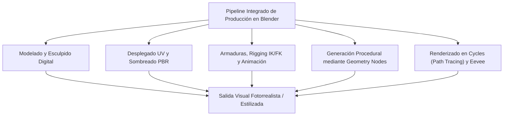
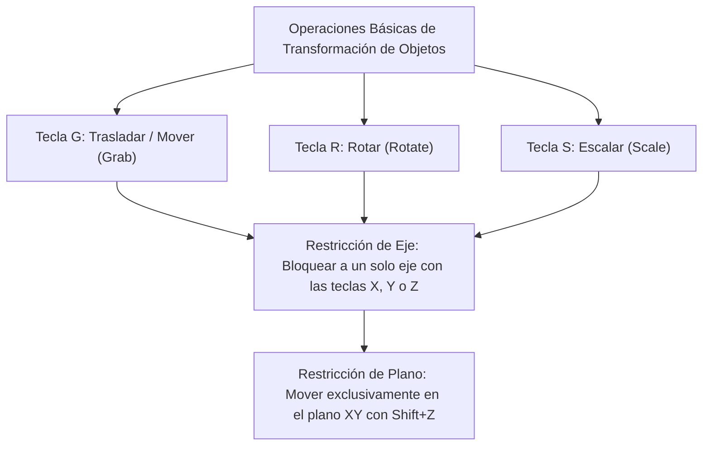
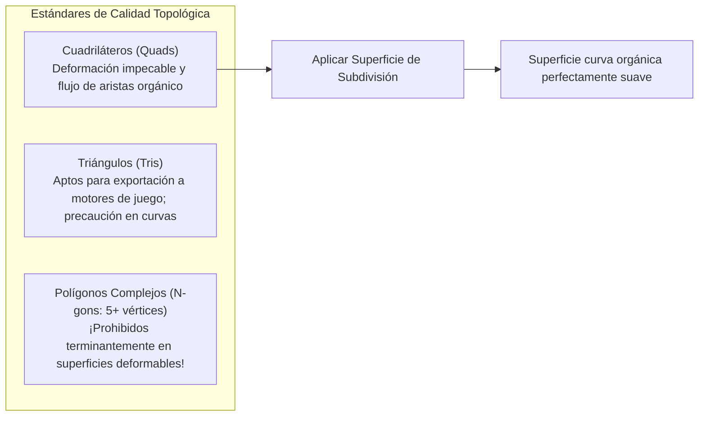
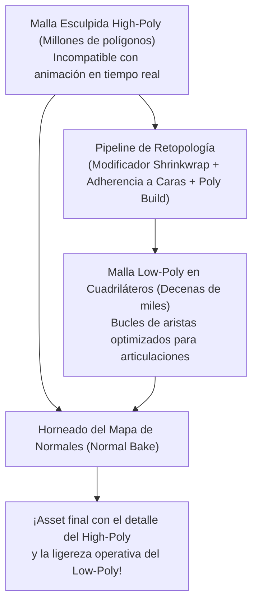
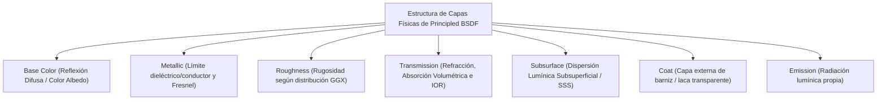
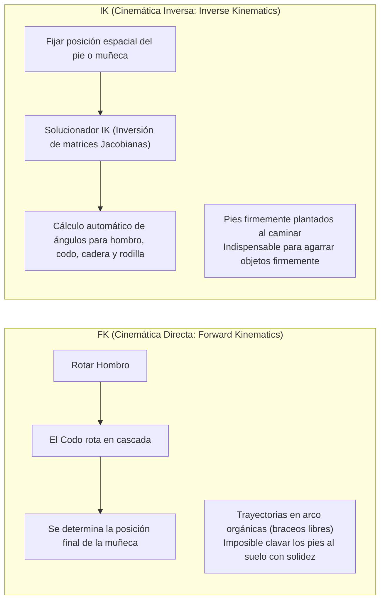
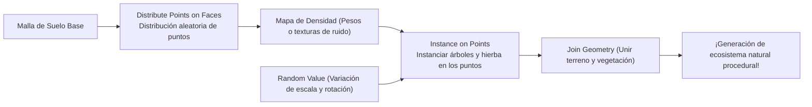
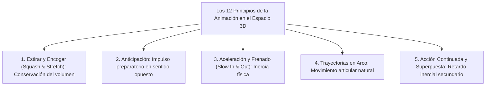
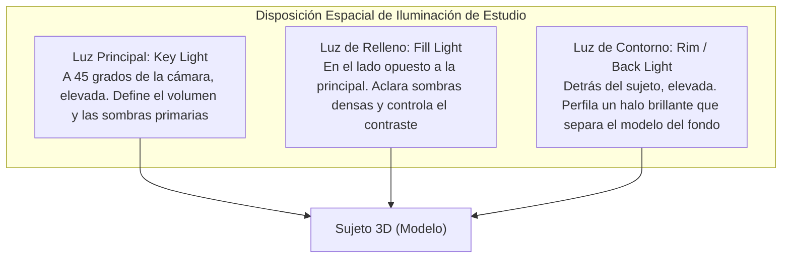

## 1. Introducción: Blender como la Revolución del 3DCG de Código Abierto

### 1.1 La Milagrosa Historia de Ton Roosendaal y la Fundación Blender

Nacido a principios de la década de 1990 como una herramienta interna para el estudio de animación holandés NeoGeo, "Blender" ha evolucionado hasta convertirse en la suite 3DCG de código abierto más potente del mundo, sustentando la industria global del entretenimiento digital, el desarrollo de videojuegos, los efectos visuales (VFX) de Hollywood, la visualización arquitectónica y la investigación científica de vanguardia.

Su historia está repleta de giros dramáticos y casi milagrosos. Tras la quiebra de NeoGeo, los derechos de propiedad intelectual de Blender fueron confiscados por los acreedores, dejando el desarrollo al borde de la cancelación definitiva. En 1998, su creador, Ton Roosendaal, fundó la "Fundación Blender" e impulsó una campaña de micromecenazgo sin precedentes. Recaudando 100.000 euros en donaciones de creadores de todo el planeta, recompró el código fuente a los acreedores. El 13 de octubre de 2002, Blender fue liberado oficialmente al mundo como software completamente libre bajo la Licencia Pública General de GNU (GPL).

Mientras el costoso software privativo (como Maya, 3ds Max o Cinema 4D) impone suscripciones anuales de miles de dólares, Blender se mantiene fiel a su noble credo fundacional: **"No excluir a nadie; proporcionar las mejores herramientas de creación a todos los artistas del planeta, de forma totalmente gratuita y para siempre."**



---

### 1.2 La Gran Renovación de la UI en la Versión 2.80 y la Consagración como Estándar de la Industria en la Era 4.x

Durante muchos años, Blender fue esquivado por artistas profesionales debido a su interfaz de usuario sumamente idiosincrásica e intimidante, en particular su tradicional selección mediante el clic derecho del ratón.

Sin embargo, el lanzamiento de "Blender 2.80" en 2019 provocó un auténtico terremoto en la industria del CG, introduciendo una renovación integral de la interfaz, estandarizando la selección con el clic izquierdo e incorporando "Eevee", un motor de visualización PBR en tiempo real. Colosos tecnológicos globales como Epic Games (Unreal Engine), Ubisoft, Unity, NVIDIA, AMD, Apple, Microsoft y Amazon comenzaron a respaldar masivamente el Fondo de Desarrollo de Blender como Patrocinadores Corporativos.

Hoy en día, en la generación "Blender 4.x", la adopción predeterminada de la gestión del color AgX, el Light Linking (vinculación de luces), la refundación física de Principled BSDF v2 y la explosión técnica de Geometry Nodes han consolidado a Blender como un pilar fundamental en los pipelines de producción de los estudios comerciales más exigentes.

---

## 2. Arquitectura Fundamental, UI y Filosofía de Atajos de Teclado

El mayor obstáculo al aprender Blender —y al mismo tiempo el factor que otorga una velocidad de trabajo inalcanzable para cualquier otro software de CG una vez dominado— reside en su "interfaz ultradepurada guiada por atajos de teclado".

### 2.1 Sistemas de Coordenadas Geométricas y Transformaciones en el Espacio 3D

El espacio virtual tridimensional de Blender se rige por un sistema de coordenadas cartesianas ($X$: Izquierda/Derecha / Rojo, $Y$: Delante/Detrás / Verde, $Z$: Arriba/Abajo / Azul), siguiendo la regla de la mano derecha.



- **Orientaciones del Sistema de Coordenadas**:
  - **Global**: Los ejes cardinales absolutos de todo el universo virtual.
  - **Local**: Coordenadas relativas alineadas con la propia rotación del objeto (pulsar $Z$ dos veces desplaza a lo largo del eje $Z$ local del objeto).
  - **Normal**: Sistema de coordenadas orientado en función de la normal de las caras seleccionadas.
- **Puntos de Pivote (Centros de Transformación)**:
  - Centro de la caja delimitadora (Bounding Box), Punto medio (Median Point), Orígenes individuales, Elemento activo y el insustituible **"Cursor 3D"**.
  - El Cursor 3D (posicionable en cualquier lugar del espacio mediante Shift + Clic Derecho) actúa como eje de rotación arbitrario o punto de generación de nuevos objetos, posibilitando el flujo de trabajo relámpago distintivo de Blender.

---

### 2.2 Los 8 Atajos Esenciales en el Modo Edición (Edit Mode)

Al seleccionar un objeto y pulsar la tecla `Tab`, se pasa del "Modo Objeto" (que manipula entidades completas) al "Modo Edición" (que permite modificar la geometría poligonal directamente). El modelado poligonal se basa en ocho comandos fundamentales:

| Atajo | Función | Mecanismo Interno y Opciones Prácticas |
| :---: | :--- | :--- |
| **`E`** | **Extruir (Extrude)** | Extiende las caras, aristas o vértices seleccionados a lo largo de su normal (o eje designado), generando nueva geometría. `Alt + E` despliega "Extruir caras individuales" y "Extruir a lo largo de las normales". |
| **`I`** | **Insertar Caras (Inset)** | Genera caras concéntricas en el interior de la selección con un desplazamiento uniforme. Indispensable para crear marcos, molduras y biseles preliminares. |
| **`Ctrl + B`** | **Biselar (Bevel)** | Chaflana aristas vivas oblicuamente. Girar la rueda del ratón incrementa los segmentos, redondeando la esquina. La tecla `V` conmuta a biselado exclusivo de vértices. |
| **`Ctrl + R`** | **Corte en Bucle (Loop Cut)** | Inserta un bucle de aristas continuo a través de la topología cuadrangular de la malla. La rueda ajusta la cantidad de cortes; tras hacer clic izquierdo, se puede deslizar. |
| **`K`** | **Herramienta Cuchillo (Knife)** | Permite cortar y dividir polígonos interactivamente a mano alzada mediante líneas rectas. `C` fija el ángulo; `Z` permite cortar a través de geometrías ocluidas. |
| **`Alt + M` / `M`** | **Fusionar (Merge)** | Suelda múltiples vértices seleccionados en un único punto ("En el centro", "En el cursor", "Al primero / último"). La opción Auto Merge suelda vértices próximos automáticamente. |
| **`GG`** | **Deslizar Vértice / Arista** | Al seleccionar vértices o aristas y pulsar dos veces la tecla `G`, se deslizan a lo largo de las aristas adyacentes manteniendo la curvatura original de la superficie. |
| **`F`** | **Crear Arista / Cara (Make Edge/Face)** | Traza una arista entre dos vértices seleccionados, o genera una cara poligonal a partir de tres o más vértices o aristas que forman un contorno cerrado. |

---

## 3. Modelado Poligonal y la Cumbre de las Superficies de Subdivisión

### 3.1 Principios de Topología y la Primacía Absoluta de los Cuadriláteros

En el modelado poligonal 3D, las caras se clasifican según su número de vértices:
1. **Triángulos (Tris: 3 vértices)**: Siempre garantizan la coplanaridad y son el estándar final en motores de videojuegos en tiempo real, pero provocan tensiones (pinching) y artefactos bajo algoritmos de subdivisión y deformación por esqueletos.
2. **Cuadriláteros (Quads: 4 vértices)**: **El estándar de oro indiscutible en la industria profesional**. Los bucles de aristas (Edge Flow) fluyen con armonía y se subdividen matemáticamente de forma limpia y predecible.
3. **Polígonos Complejos (N-gons: 5 o más vértices)**: Salvo en fases tempranas de modelado sobre superficies rigurosamente planas, **mantener N-gons en zonas curvas o articulaciones deformables es un error inadmisible**. Los algoritmos de curvatura no pueden resolver la partición interna, generando manchas oscuras y gravísimos artefactos de sombreado al renderizar.

Además, los vértices de los que emergen cinco o más aristas (Polos E) o solo tres (Polos N) actúan como nodos directores (Poles) que desvían el flujo de aristas. Evitar estos polos en zonas de flexión articular o en la musculatura facial es el sello distintivo de un modelador de élite.



---

### 3.2 Matemáticas de las Superficies de Subdivisión: El Método Catmull-Clark

Los personajes hiperrealistas del cine de animación y las carrocerías aerodinámicas de los superdeportivos se generan aplicando el modificador **"Subdivision Surface"** (`Ctrl + 1~3`) sobre mallas base de baja densidad poligonal.

El algoritmo de Catmull-Clark, formulado en 1978 por Edwin Catmull y Jim Clark, refina recursivamente la geometría ejecutando tres cálculos fundamentales en cada pasada de subdivisión:

1. **Punto de Cara (Face Point)**: El baricentro de todos los vértices que componen la cara:
   $$F = \frac{1}{n} \sum_{i=1}^n V_i$$
2. **Punto de Arista (Edge Point)**: El promedio aritmético entre los dos extremos de la arista y los puntos de cara de las dos caras adyacentes que comparten dicha arista:
   $$E = \frac{V_1 + V_2 + F_1 + F_2}{4}$$
3. **Nuevo Punto de Vértice (Vertex Point)**: Para un vértice original $V$, sus nuevas coordenadas $V'$ se obtienen combinando el promedio $Q$ de los puntos de cara adyacentes, el promedio $R$ de los puntos medios de las aristas concurrentes y el propio vértice con valencia $n$:
   $$V' = \frac{Q + 2R + (n-3)V}{n}$$

Al aplicar este algoritmo de manera recursiva, la malla facetada converge matemáticamente hacia una superficie límite B-spline cúbica perfectamente continua.

#### Líneas de Soporte y Bucles de Retención (Holding Loops)
Para conservar esquinas nítidas al aplicar la subdivisión, se deben colocar **bucles de soporte (holding edges)** muy cerca de las aristas principales. Cuanto menor sea la separación entre aristas paralelas, mayor será la contención del redondeo de Catmull-Clark, logrando resaltes nítidos propios del metal o el plástico inyectado (o bien ajustando el peso de pliegue mediante la función Crease).

---

### 3.3 El Flujo de Trabajo No Destructivo de la Pila de Modificadores

La gran fortaleza de Blender reside en su **"Pila de Modificadores (Modifier Stack)"**, capaz de encadenar deformaciones y operaciones geométricas paramétricas en tiempo real sin destruir ni consolidar la malla base original.

| Modificador | Categoría | Mecanismo y Mejores Prácticas Industriales |
| :--- | :---: | :--- |
| **Mirror (Espejo)** | Generar | Duplica simétricamente la malla a través de un eje (normalmente X). Al activar "Clipping", los vértices centrales se fusionan de forma indivisible. Base del modelado de personajes y vehículos. |
| **Array (Matriz)** | Generar | Clona la geometría múltiples veces mediante desplazamientos fijos o rotaciones relativas (Object Offset). Ideal para escaleras, cadenas, vallas y matrices circulares de tornillería. |
| **Boolean (Booleana)** | Generar | Ejecuta operaciones booleanas de conjuntos sólidos (Unión, Diferencia, Intersección). Incluye los algoritmos Exact y Fast. Permite perforar ranuras y orificios al instante en hard-surface. |
| **Solidify (Solidificar)** | Generar | Otorga un grosor uniforme a lo largo de las normales a mallas laminares sin espesor. Imprescindible para prendas de vestir, cristalería y paneles de carrocería. |
| **Bevel (Biselar)** | Editar | Bisela aristas vivas de manera no destructiva según pesos o ángulos (normalmente $\ge 30^\circ$). Aporta reflejos especulares realistas sin densificar destructivamente la geometría. |
| **Weighted Normal** | Modificar | Recalcula las normales de los vértices dando prioridad a los grandes planos frente a los pequeños biseles. Elimina artefactos de sombreado en piezas mecánicas low-poly sin necesidad de subdivisión. |

---

## 4. Esculpido Digital y Retopología

El "Modo Esculpido (Sculpt Mode)" permite moldear modelos como si de arcilla digital se tratase, siendo idóneo para criaturas orgánicas, anatomía humana y arrugas complejas.

### 4.1 Pinceles Clave de Esculpido y sus Características

- **Draw**: Eleva la superficie siguiendo la normal; al mantener presionado `Ctrl`, hunde la geometría.
- **Clay Strips**: Aplica tiras cuadradas de arcilla para definir rápidamente volúmenes óseos y paquetes musculares.
- **Grab**: Mueve grandes porciones de la malla para ajustar dinámicamente siluetas y proporciones generales.
- **Crease**: Traza hendiduras afiladas y pliegues profundos, indispensable para arrugas de la piel y pliegues textiles.
- **Smooth**: Suaviza las irregularidades superficiales (accesible de inmediato desde cualquier pincel manteniendo `Shift`).
- **Inflate**: Infla la zona seleccionada hacia el exterior de sus normales, simulando un globo de aire.

---

### 4.2 Topología Dinámica (Dyntopo) frente a Voxel Remesh

Al esculpir modelos de alta definición con millones de polígonos, la gestión dinámica de la densidad geométrica resulta decisiva.

1. **Topología Dinámica (Dyntopo)**:
   - Tesela y subdivide triángulos adaptativamente en tiempo real solo bajo la trayectoria del trazo del pincel.
   - Permite concentrar millones de polígonos en detalles ínfimos (ojos, dedos, poros) sin saturar el resto del cuerpo.
2. **Remallado por Vóxeles (Voxel Remesh: `Ctrl + R`)**:
   - Cuadricula el espacio 3D en vóxeles cúbicos regulares (p. ej., $0,01\,\text{m}$), reconstruyendo la malla completa en una red isotrópica de cuadriláteros uniformes.
   - Fusiona instantáneamente las costuras entre piezas unidas mediante booleanas, eliminando polígonos estirados y devolviendo el modelo a un bloque de arcilla homogéneo.

---

### 4.3 Teoría y Práctica de la Retopología

Las esculturas digitales hiperdetalladas (a menudo de millones o decenas de millones de polígonos) poseen un volumen de datos inasumible para motores de videojuegos o deformaciones óseas fluidas.

La **"Retopología"** es el proceso metódico de reconstruir una malla optimizada de baja resolución (de miles a decenas de miles de quads) proyectada y adherida a la superficie de alta resolución con una disposición anatómica impecable.



1. Activar el modificador **Shrinkwrap** junto con la adherencia proyectada a caras (**Face Project**).
2. Trazar anillos concéntricos alrededor de orificios de alta deformación (ojos, boca, fosas nasales).
3. Conectar los bucles desde la mandíbula hacia el cuello y hombros, e insertar bucles triples de protección en codos y rodillas para evitar el colapso de volumen al flexionarse.
4. Al concluir, los microdetalles (arrugas y poros) se transfieren del modelo denso al low-poly mediante un **Mapa de Normales (Normal Map)** horneado.

---

## 5. Sombreado de Materiales y la Ciencia del Renderizado Físico (PBR)

La creación de materiales en Blender se articula en el "Shader Editor" basado en nodos. El estándar actual de la industria, "PBR (Physically Based Rendering)", simula rigurosamente las interacciones electromagnéticas de la luz (reflexión, refracción, absorción y dispersión) según las leyes de la física óptica.

### 5.1 Análisis Matemático de Principled BSDF v2

El nodo principal de Blender, "Principled BSDF", se basa en el modelo Disney Principled BRDF de 2012, optimizado a fondo en Blender 4.0 para garantizar una conservación de energía microfacetaria impecable.



1. **Base Color (Color Base / Albedo)**:
   - Dieléctricos (aislantes): Representa la luz difusa que penetra en el material, se dispersa internamente y vuelve a salir a la superficie.
   - Conductores (metales): La luz que penetra es absorbida de inmediato por los electrones libres de conducción, por lo que la reflexión difusa es exactamente cero. El Base Color determina la reflectancia especular a incidencia normal ($F_0$) (el oro es amarillo brillante, el cobre es rojizo).
2. **Metallic (Metalicidad: $0.0 \sim 1.0$)**:
   - En la física real, los materiales son binarios: o son **aislantes (Metallic = 0.0)** o son **conductores (Metallic = 1.0)**. Salvo por transiciones microscópicas de polvo o herrumbre, los valores intermedios (como 0.5) carecen de sentido físico.
3. **Roughness (Rugosidad)**:
   - Rige la dispersión de la función de distribución microfacetaria GGX.
   - $0.0$: Espejo perfecto sin imperfecciones microscópicas.
   - $1.0$: Rugosidad extrema donde la luz se dispersa uniformemente en todas direcciones, como en la tiza o arcilla seca.
4. **IOR (Índice de Refracción)**:
   - Determina la desviación de los rayos de luz según la Ley de Snell ($n_1 \sin \theta_1 = n_2 \sin \theta_2$).
   - Aire: $1.0003$, Agua: $1.333$, Resina acrílica: $1.49$, Vidrio común: $1.52$, Diamante: $2.417$.
5. **Dispersión Subsuperficial (Subsurface Scattering / SSS)**:
   - Ocurre en medios translúcidos (piel humana, mármol, cera, leche, jade), donde la luz penetra, rebota internamente innumerables veces y emerge por puntos adyacentes.
   - En la piel, la luz azul se dispersa superficialmente, mientras que la luz roja penetra profundamente a través de la hemoglobina, otorgando ese brillo rojizo característico a orejas y dedos a contraluz (calibrado mediante el radio por canal RGB en Subsurface Radius).

---

### 5.2 Desplegado UV y Densidad de Téxeles (Texel Density)

Para mapear texturas bidimensionales (albedo, rugosidad, normales) sobre una superficie tridimensional sin distorsión, la malla debe aplanarse en un plano 2D mediante el proceso de **"Desplegado UV (UV Unwrapping)"**.

- **Estrategia de Costuras (Seams)**:
  - `Ctrl + E` $\rightarrow$ "Mark Seam (Marcar costura)".
  - Al igual que en la sastrería, las costuras deben ocultarse en zonas poco visibles (entrepierna, nacimiento del cabello, línea central de la espalda).
- **Consistencia en la Densidad de Téxeles**:
  - Número de píxeles de textura asignados a cada unidad de medida tridimensional física (p. ej., $\text{px/cm}$).
  - Si el rostro posee $20,48\,\text{px/cm}$ y el torso solo $2,56\,\text{px/cm}$, el espectador percibirá un desajuste intolerable de nitidez. Todas las islas UV deben normalizarse con la misma escala y empaquetarse de forma compacta en el espacio unitario $[0, 1]$.

---

## 6. Rigging de Armaduras y la Dinámica de la Animación

El rigging es el arte técnico de erigir una jerarquía ósea interna ("Armadura") que permite deformar mallas tridimensionales con coherencia física y anatómica para su posterior animación.

### 6.1 Cinemática Directa (FK) frente a Cinemática Inversa (IK)

El control motriz de las extremidades descansa sobre dos paradigmas matemáticos opuestos:



- **FK (Forward Kinematics)**: Las rotaciones descienden de padres a hijos a lo largo de la cadena. Es ideal para gestos libres en el aire (saludos, oscilaciones de espada), pero al agachar el cuerpo manteniendo los pies en el suelo, las extremidades atraviesan el terreno, obligando a corregir cuadro por cuadro manualmente.
- **IK (Inverse Kinematics)**: El extremo de la cadena (pie o mano) se fija en una coordenada espacial, y un **algoritmo solucionador inverso (como CCD-IK o FABRIK)** deduce automáticamente los ángulos de giro precisos de las articulaciones intermedias. Esencial para fijar los pies al suelo en ciclos de caminata.
- **Objetivo Polar (Pole Target)**: Vector de orientación externa que guía la dirección hacia la que debe apuntar el codo o la rodilla al doblarse, impidiendo que las articulaciones se tuerzan de forma antinatural.

---

### 6.2 Pintado de Pesos (Weight Painting)

Determina la influencia ($0.0 \sim 1.0$, con un gradiente visual de azul $= 0$, verde $= 0.5$ a rojo $= 1.0$) de cada hueso sobre los vértices circundantes de la malla.
- Para flexiones creíbles, el interior de codos y rodillas requiere gradientes abruptos, mientras que el exterior necesita transiciones suaves.
- La suma total de influencias óseas sobre cada vértice debe normalizarse estrictamente a $1.0$ ("Normalize All"). Si se omite, los vértices pueden explotar o rasgarse incontroladamente al rotar los huesos.

---

## 7. La Revolución de la Generación Procedural: Geometry Nodes

Desde Blender 3.0, los technical artists han adoptado con entusiasmo **"Geometry Nodes"**, un sistema de programación visual mediante nodos capaz de generar variaciones geométricas infinitas mediante algoritmos matemáticos en tiempo real.

### 7.1 El Sistema de Campos (Fields)

Geometry Nodes no procesa los vértices mediante lentos bucles iterativos tradicionales, sino a través del modelo de flujo de datos "Fields", donde las operaciones se evalúan como funciones continuas sobre todo el contexto geométrico.



### 7.2 Ejemplo Práctico: Bosque Procedural con Geometry Nodes

1. Introducir la malla del terreno a través de `Group Input`.
2. **Distribute Points on Faces**: Generar una nube de puntos aleatoria sobre la superficie usando muestreo Poisson Disk para garantizar una distancia mínima de seguridad entre elementos.
3. Conectar una textura de ruido (**Noise Texture**) al conector de densidad (`Density`) para alternar orgánicamente entre claros de bosque y zonas densamente pobladas.
4. **Instance on Points**: Instanciar colecciones de especies arbóreas prediseñadas (`Collection Info`) sobre los puntos generados.
5. **Rotate Instances / Scale Instances**: Asignar un nodo **Random Value** para aleatorizar la rotación en $Z$ ($0 \sim 2\pi$) y variar la escala mediante una curva normal entre $0.7$ y $1.3$.
6. A partir de este momento, modificar el terreno en Modo Edición reubica dinámicamente toda la vegetación en tiempo real.

Además, con los **"Simulation Nodes"**, es posible calcular hierba meciente por el viento, partículas de arena cayendo por gravedad, colisiones de lluvia y fluidos elementales dentro de la propia red de nodos.

---

## 8. Física de los Motores de Render: Cycles frente a Eevee Next

Blender integra dos motores de renderizado de última generación diseñados para objetivos complementarios.

### 8.1 Cycles: La Física del Trazado de Trayectorias Monte Carlo (Path Tracing)

Cycles es un motor de render de producción físicamente basado y no sesgado (Unbiased) que modela la propagación de la luz con fidelidad absoluta.

El motor traza rayos en sentido inverso desde el sensor de la cámara hacia la escena tridimensional, evaluando miles de rebotes estocásticos según las funciones BSDF del material mediante integración de Monte Carlo:

$$L_o(p, \omega_o) = L_e(p, \omega_o) + \int_{\Omega} f_r(p, \omega_i, \omega_o) L_i(p, \omega_i) (\omega_i \cdot n) d\omega_i$$

- Al resolver la **Ecuación de Renderizado de Kajiya**, la iluminación global, el sangrado de color (color bleeding: una pared carmesí tiñendo sutilmente el suelo blanco adyacente), la refracción fidedigna, las cáusticas y las sombras suaves surgen de forma natural sin recurrir a trucos de rasterización.
- **Reducción de Ruido con IA (Denoising)**: El ruido estocástico inherente al trazado de caminos se limpia al instante gracias a redes neuronales de aprendizaje profundo (Intel Open Image Denoise / NVIDIA OptiX), permitiendo obtener fotogramas cristalinos con apenas 128 a 512 muestras.

---

### 8.2 Eevee Next: La Cúspide de la Rasterización en Tiempo Real

Para flujos de trabajo interactivos que demandan decenas de fotogramas por segundo, "Eevee" ofrece una visualización deslumbrante.
La arquitectura de "Eevee Next" eleva los reflejos en espacio de pantalla (SSR), suprime las limitaciones de resolución mediante mapas de sombras virtuales (Virtual Shadow Maps: VSM), e integra dispersión subsuperficial y oclusión ambiental en espacio de pantalla (GTAO), aproximándose visualmente a Cycles en cuestión de segundos.

---

### 8.3 Gestión del Color: La Ciencia Detrás de AgX

Estandarizado en Blender 4.0, el sistema de gestión cromática **"AgX"** erradicó las dramáticas alteraciones de tono y quemados plásticos que sufrían los estándares previos sRGB y Filmic en altas luces.

Al modelar la respuesta espectral de los conos de la retina humana y emular la curva logarítmica de las emulsiones cinematográficas, AgX conserva la pureza del tono (Hue) incluso ante sobreexposiciones extremas mediante un desvanecimiento suave de altas luces (roll-off). El fuego ardiente, las luces de neón y los tonos de piel iluminados por el sol retienen una latitud y riqueza plenamente cinematográficas.

---

## 6.4 El Alma de la Animación: Los 12 Principios de Disney en 3D e Interpolación de Curvas F

Limitarse a insertar fotogramas clave (`I`) en los huesos produce movimientos rígidos e inexpresivos que caen en el "valle inquietante". Insuflar alma y peso físico a un personaje requiere trasladar los **"12 Principios Básicos de la Animación"**—concebidos en la década de 1930 por los legendarios animadores de Walt Disney—a curvas numéricas en el Graph Editor de Blender.



### 1. Conservación de Volumen en Estirar y Encoger (Squash and Stretch)
Cuando una pelota impacta contra el suelo, se aplasta (Squash); al rebotar, se elonga en la dirección del movimiento (Stretch).
- **Ley Física Primordial**: A lo largo de toda deformación, **el volumen total del objeto debe permanecer estrictamente constante**.
- Si se comprime en el eje $Z$ al $50\%$ ($0.5$), las dimensiones $X$ e $Y$ deben expandirse en $\sqrt{1 / 0.5} \approx 1.414$ para compensar la masa. En Blender, la restricción de hueso "Stretch To" automatiza este cálculo en tiempo real.

### 2. El Graph Editor y la Dinámica de Interpolación Bézier Cúbica
El Graph Editor muestra las variaciones espaciales en función del tiempo como curvas bidimensionales denominadas "Curvas F" (Function Curves).
- **Interpolación Lineal**: Movimiento mecánico a velocidad constante carente de peso biológico.
- **Interpolación Bézier**: Modulando las tangentes de los tiradores, genera aceleraciones suaves (Ease-In) y deceleraciones elegantes (Ease-Out) mediante polinomios cúbicos.
- En un ciclo de caminata (Walk Cycle), desfasar unos pocos cuadros los movimientos de la pelvis, zancadas y balanceo de brazos (Acción Superpuesta) recrea el balanceo natural del centro de gravedad humano.

---

## 7.5 Automatización y Scripting Procedural con la API de Python (`bpy`)

La mayor virtud de la arquitectura de Blender radica en que prácticamente cada botón, estructura de datos y operador está completamente expuesto a través de su API nativa de "Python". Al colocar el cursor sobre cualquier control de la interfaz, se muestra de inmediato su ruta de atributo correspondiente en Python.

En el espacio de trabajo `Scripting`, es posible generar superficies complejas y estructuras matemáticas abstractas en segundos mediante código.

### Script de Python: Generación Procedural de una Banda de Möbius
```python
import bpy
import math

# Eliminar objetos de malla existentes en la escena
bpy.ops.object.select_all(action='SELECT')
bpy.ops.object.delete()

# Parámetros geométricos de la banda de Möbius
R = 3.0           # Radio principal
w = 1.0           # Semiancho de la cinta
u_segments = 120  # Subdivisiones longitudinales
v_segments = 20   # Subdivisiones en anchura

verts = []
faces = []

for i in range(u_segments):
    u = 2.0 * math.pi * i / u_segments
    for j in range(v_segments + 1):
        v = -w + (2.0 * w * j / v_segments)
        
        # Ecuaciones paramétricas de la banda de Möbius
        x = (R + v * math.cos(u / 2.0)) * math.cos(u)
        y = (R + v * math.cos(u / 2.0)) * math.sin(u)
        z = v * math.sin(u / 2.0)
        
        verts.append((x, y, z))

# Generación de índices de caras poligonales
for i in range(u_segments):
    next_i = (i + 1) % u_segments
    for j in range(v_segments):
        p1 = i * (v_segments + 1) + j
        p2 = i * (v_segments + 1) + (j + 1)
        
        # Inversión topológica en el cierre del bucle para completar la media torsión
        if next_i == 0:
            p3 = next_i * (v_segments + 1) + (v_segments - (j + 1))
            p4 = next_i * (v_segments + 1) + (v_segments - j)
        else:
            p3 = next_i * (v_segments + 1) + (j + 1)
            p4 = next_i * (v_segments + 1) + j
            
        faces.append((p1, p2, p3, p4))

# Crear la malla e instanciar el objeto en la escena
mesh = bpy.data.meshes.new(name="Mobius_Strip_Mesh")
mesh.from_pydata(verts, [], faces)
mesh.update()

obj = bpy.data.objects.new(name="Mobius_Strip", object_data=mesh)
bpy.context.collection.objects.link(obj)

# Aplicar sombreado suave
for poly in mesh.polygons:
    poly.use_smooth = True
```

Gracias a su potente API (`bpy`), Blender trasciende el ámbito del modelado manual para erigirse en una plataforma de vanguardia para la arquitectura paramétrica, la visualización de tomografías médicas 3D y la generación masiva de conjuntos de datos sintéticos (Synthetic Datasets) para entrenamiento de inteligencia artificial.

---

## 8.4 Física de la Iluminación de Estudio y el Arte del Compositor

Por muy impecable que sea una topología o exactos sus shaders PBR, una iluminación descuidada condenará cualquier imagen a un aspecto plano y artificial.

### 1. Dominio de la Iluminación Clásica de Tres Puntos (Three-Point Lighting)
El estándar indiscutible para dotar de tridimensionalidad, volumen y atmósfera a cualquier sujeto:



- **Ratios de Contraste (Principal a Relleno)**:
  - Comercial / Comedia: $2:1 \sim 3:1$ (Escenas luminosas con sombras tenues).
  - Dramático / Cine Negro (Film Noir): $8:1 \sim 16:1$ (Grandes sombras y dramatismo acusado).
- **Dimensiones de la Fuente y Penumbra de la Sombra**:
  - Un punto de luz con radio tendente a cero proyecta sombras duras y cortantes.
  - Al aumentar el tamaño físico del emisor (cajas de luz y luces de área), la luz bordea los contornos, generando transiciones suaves de penumbra.

### 2. Postproducción Cinematográfica en el Compositor
El renderizado en bruto equivale a un negativo digital por procesar. El Compositor por nodos de Blender permite añadir los toques finales de calidad cinematográfica:

1. **Nodo Glare**: En modo "Fog Glow", genera sutiles halos de dispersión atmosférica (Bloom); en modo "Streaks", reproduce destellos horizontales propios de lentes anamórficas.
2. **Profundidad de Campo (Depth of Field)**: Calibrando la distancia focal y el diafragma físico (F-Stop), recrea un desenfoque óptico orgánico (Bokeh) que dirige la mirada hacia el foco narrativo.
3. **Distorsión Cromática de Lente (Dispersion)**: Introducir valores mínimos de dispersión ($0.01 \sim 0.02$) desfasa ligeramente las longitudes de onda RGB en los márgenes de la imagen, desdibujando la frialdad estéril del CG digital para conferir la textura cálida de una óptica física de cine.

---

## 8.5 Dinámica de los Sistemas de Simulación Física

Blender integra potentes motores numéricos para simular leyes de la física clásica:

1. **Dinámica de Cuerpos Rígidos (Rigid Body)**:
   - Resuelve colisiones, rebotes, fricción y desplome de estructuras según la mecánica newtoniana.
   - Configura objetos como "Active" (dinámicos) o "Passive" (estáticos), eligiendo formas de colisión desde "Convex Hull" hasta "Mesh" exacta.
2. **Simulación de Telas (Cloth)**:
   - Modela telas, ropa y estandartes mediante sistemas masa-muelle (Mass-Spring System).
   - Ajusta la rigidez estructural, resistencia a la flexión y fricción del aire, activando "Self-Collision" para evitar que la tela se autointercepte.
3. **Fluidos y Humo (Mantaflow)**:
   - Cálculos hidrodinámicos basados en las ecuaciones de Navier-Stokes.
   - Hornea con alta fidelidad salpicaduras de líquidos, explosiones, fuego y vórtices turbulentos dentro de un volumen acotado (Domain).

---

## 9. Conclusión: El Futuro de los Creadores 3D y el Horizonte Abierto por Blender

Sumergirse en el universo de Blender es emprender un viaje multidisciplinar donde convergen las matemáticas, la física óptica, la anatomía, la teoría del color y la pura sensibilidad estética.

Desde el instante en que eliminamos el Cubo por Defecto (Default Cube) y extruimos el primer vértice:
- Las superficies Catmull-Clark modelan formas orgánicas rebosantes de vida;
- Los shaders basados en física capturan el viaje de la luz sobre la materia;
- La cinemática ósea y las armaduras insuflan presencia y peso;
- Geometry Nodes engendra paisajes procedurales de complejidad fractal;
- Y el trazado de trayectorias en Cycles plasma la luz de millones de fotones en imágenes hiperrealistas.

Lo que antaño fue el coto cerrado de estaciones de trabajo millonarias y grandes estudios cinematográficos, hoy está libremente en manos de cualquier individuo en el mundo armado con un ordenador y Blender.

"Todo aquello que puedas imaginar, lo puedes materializar."
Con las alas de Blender, los creadores se hallan ante un cosmos infinito donde los únicos límites son su propio intelecto y su visión artística.
