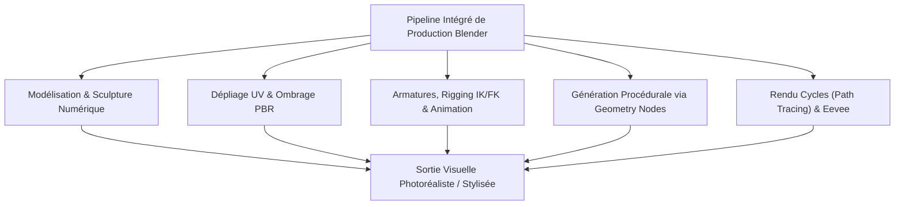
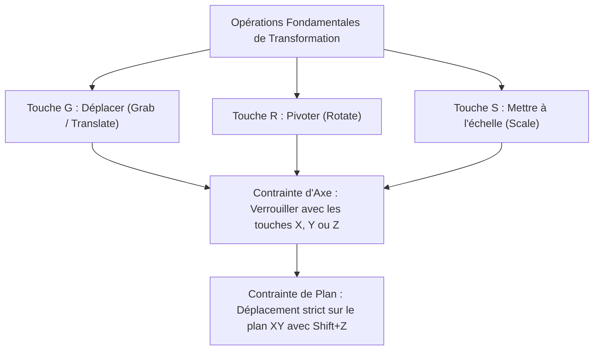
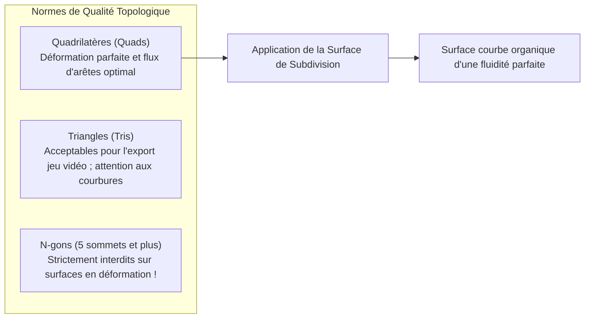
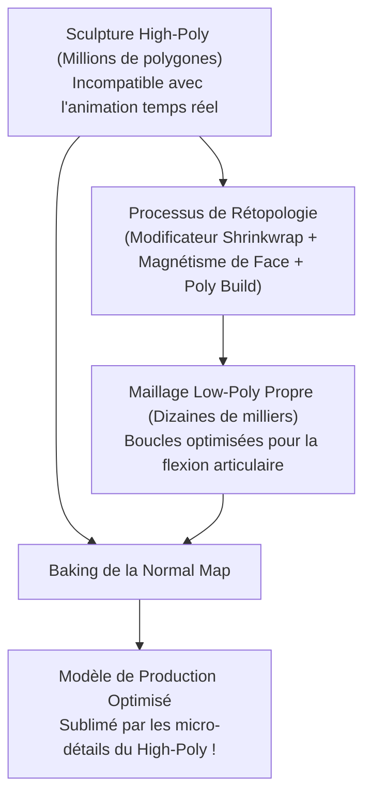
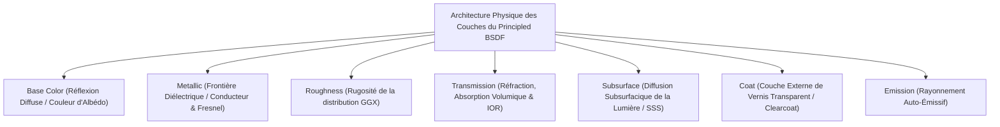
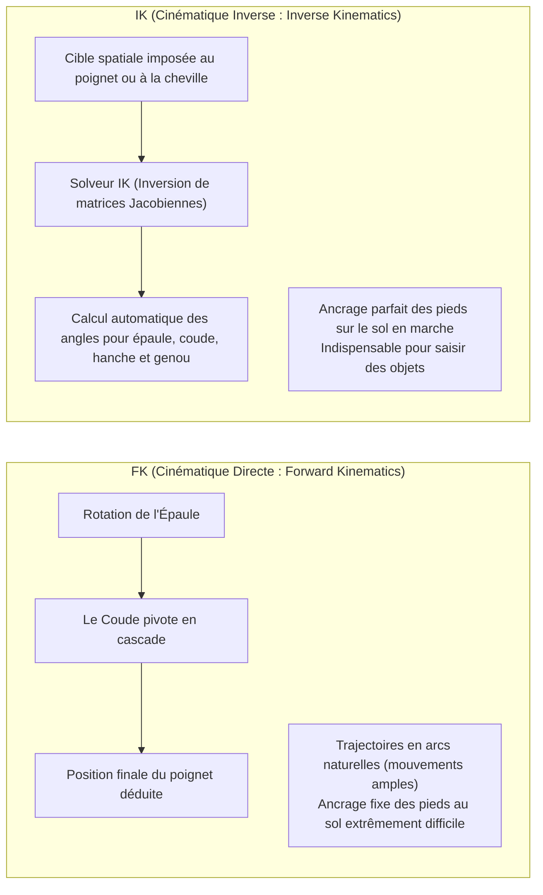
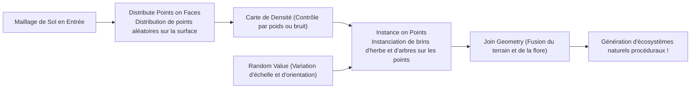
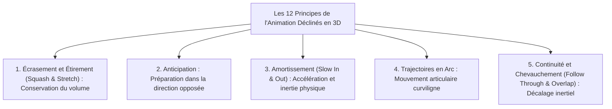
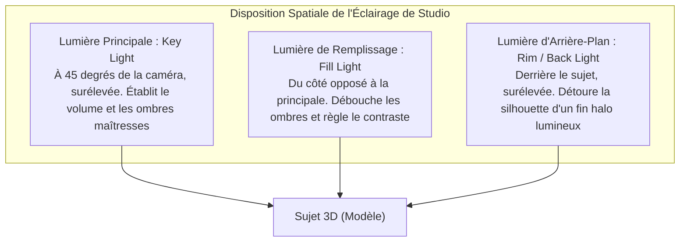

## 1. Introduction : Blender, la Révolution du 3DCG Open-Source

### 1.1 L'Histoire Miraculeuse de Ton Roosendaal et de la Fondation Blender

Conçu au début des années 1990 comme un outil interne au studio d'animation néerlandais NeoGeo, « Blender » s'est métamorphosé en la suite 3DCG open-source la plus puissante au monde, soutenant aujourd'hui les piliers de l'industrie du divertissement numérique, du développement de jeux vidéo, des effets visuels hollywoodiens (VFX), de la visualisation architecturale et de la recherche scientifique.

Son histoire s'apparente à une véritable épopée. À la suite de la faillite de NeoGeo, les droits de propriété intellectuelle de Blender furent saisis par les créanciers, menaçant le logiciel d'un abandon définitif. En 1998, son créateur Ton Roosendaal fonda la « Fondation Blender » et orchestra une campagne de financement participatif sans précédent. En réunissant 100 000 euros de dons auprès de créateurs du monde entier, il racheta le code source aux créanciers. Le 13 octobre 2002, Blender fut officiellement libéré sous la licence GNU General Public License (GPL).

Alors que les logiciels propriétaires onéreux (tels que Maya, 3ds Max ou Cinema 4D) imposent des abonnements annuels de plusieurs milliers d'euros, Blender demeure fidèle à sa noble profession de foi : **« N'exclure personne ; offrir pour toujours et gratuitement les meilleurs outils de création à tous les artistes du monde. »**



---

### 1.2 La Refonte Majeure de l'UI en 2.80 et l'Accession au Standard Industriel en Version 4.x

Pendant de nombreuses années, Blender est resté boudé par les artistes professionnels en raison d'une interface utilisateur singulière et déroutante, notamment sa sélection par défaut via le clic droit.

Cependant, la sortie de « Blender 2.80 » en 2019 a provoqué une onde de choc majeure dans l'industrie du CG, en instaurant une refonte ergonomique intégrale, la sélection standard au clic gauche et l'intégration du moteur de prévisualisation PBR temps réel « Eevee ». Les géants mondiaux de la technologie — Epic Games (Unreal Engine), Ubisoft, Unity, NVIDIA, AMD, Apple, Microsoft et Amazon — se sont alors empressés de soutenir le fonds de développement de Blender en tant que mécènes institutionnels.

Aujourd'hui, avec la génération « Blender 4.x », l'adoption par défaut du système de gestion des couleurs AgX, le Light Linking (liaison de sources lumineuses), la refonte physique du Principled BSDF v2 et la maturité prodigieuse des Geometry Nodes ont définitivement consacré Blender au sein des principaux pipelines de production des studios commerciaux.

---

## 2. Architecture Fondamentale, Ergonomie et Philosophie des Raccourcis

Le principal obstacle dans l'apprentissage de Blender — mais aussi la raison pour laquelle il offre une rapidité d'exécution sans égal une fois maîtrisé — réside dans son « interface ultra-optimisée pilotée par les raccourcis clavier ».

### 2.1 Systèmes de Coordonnées Géométriques et Transformations 3D

L'espace tridimensionnel virtuel de Blender est régi par un système de coordonnées cartésiennes orthogonales (axe $X$ : Gauche/Droite / Rouge, axe $Y$ : Avant/Arrière / Vert, axe $Z$ : Haut/Bas / Bleu), respectant la règle de la main droite.



- **Modes de Systèmes de Coordonnées** :
  - **Global** : Les orientations cardinales absolues de l'univers virtuel.
  - **Local** : Coordonnées relatives alignées sur la rotation propre de l'objet (presser $Z$ deux fois contraint le déplacement sur l'axe $Z$ local de l'objet).
  - **Normal** : Système orienté selon la normale géométrique des faces sélectionnées.
- **Points de Pivot (Centres de Transformation)** :
  - Centre de la boîte englobante (Bounding Box), Point médian (Median Point), Origines individuelles, Élément actif et le légendaire **« Curseur 3D (3D Cursor) »**.
  - Le Curseur 3D (placé n'importe où dans l'espace via Shift + Clic Droit) fait office de centre de rotation arbitraire ou de point d'apparition pour les nouveaux objets, autorisant des flux de travail d'une vélocité remarquable.

---

### 2.2 Les 8 Raccourcis Indispensables du Mode Édition (Edit Mode)

En sélectionnant un objet et en appuyant sur `Tab`, on bascule du Mode Objet au Mode Édition afin de modifier directement la géométrie polygonale. Le modelage polygonal repose sur ces huit raccourcis capitaux :

| Raccourci | Opération | Comportement Interne & Options Pratiques |
| :---: | :--- | :--- |
| **`E`** | **Extruder (Extrude)** | Étire les faces, arêtes ou sommets sélectionnés le long de leurs normales (ou d'un axe défini) pour générer de nouveaux polygones. `Alt + E` propose l'extrusion individuelle ou le long des normales. |
| **`I`** | **Insérer des Faces (Inset)** | Crée des faces concentriques à l'intérieur de la sélection avec un décalage régulier. Outil de base pour la création de bordures et de découpes mécaniques. |
| **`Ctrl + B`** | **Biseauter (Bevel)** | Chanfreine les arêtes vives. Faire défiler la molette de la souris ajoute des segments pour arrondir les angles. La touche `V` active le biseautage de sommets. |
| **`Ctrl + R`** | **Coupe en Boucle (Loop Cut)** | Insère une boucle d'arêtes continue traversant la topologie en quadrilatères du maillage. La molette règle le nombre de coupes ; un clic gauche permet ensuite de glisser le long des rails. |
| **`K`** | **Outil Couteau (Knife)** | Découpe librement des polygones à la volée le long de segments tracés à la main levée. `C` verrouille les angles ; `Z` autorise la découpe traversante à travers toute l'épaisseur. |
| **`Alt + M` / `M`** | **Fusionner (Merge)** | Soude plusieurs sommets sélectionnés en un point unique (« Au centre », « Au curseur », « Au premier / dernier sélectionné »). L'option Auto Merge soude automatiquement les sommets proches. |
| **`GG`** | **Glissement de Sommet / Arête** | Sélectionner un sommet ou une arête et appuyer deux fois sur `G` permet de le faire glisser le long des arêtes adjacentes en préservant scrupuleusement la courbure du modèle. |
| **`F`** | **Créer Arête / Face (Make Edge/Face)** | Raccorde deux sommets par une arête, ou engendre une face polygonale fermée bordée par au moins trois sommets ou arêtes. |

---

## 3. Modélisation Polygonale et Apogée des Surfaces de Subdivision

### 3.1 Règles Topologiques et Suprématie Absolue des Quadrilatères

En modélisation polygonale 3D, les faces sont réparties en trois familles selon leur décompte de sommets :
1. **Triangles (Tris : 3 sommets)** : Garantissent une planéité stricte et constituent la norme de rendu temps réel dans les moteurs de jeu, mais provoquent des pincements indésirables lors de l'application d'algorithmes de subdivision et de déformation d'armatures.
2. **Quadrilatères (Quads : 4 sommets)** : **La norme d'excellence absolue de l'industrie**. Le flux d'arêtes (Edge Flow) s'y déploie de manière prévisible, et le maillage se subdivise sans la moindre rupture de courbure.
3. **Polygones Multiples (N-gons : 5 sommets ou plus)** : À l'exception des surfaces strictement planes lors d'étapes préliminaires, **la présence de N-gons sur des surfaces courbes ou soumises à la déformation est rigoureusement proscrite**. Les algorithmes de subdivision sont incapables de déterminer leur tesselation interne, ce qui produit de graves artefacts d'ombrage et des zones sombres aberrantes au rendu.

De surcroît, les sommets d'où émergent cinq arêtes ou plus (Pôles E) ou seulement trois arêtes (Pôles N) agissent comme des charnières topologiques (Poles) réorientant les boucles d'arêtes. Réserver ces pôles aux zones planes et les éloigner impérativement des axes de flexion articulaire ou des muscles expressifs du visage constitue la marque d'un modeleur accompli.



---

### 3.2 Mathématiques des Surfaces de Subdivision : L'Algorithme de Catmull-Clark

Les personnages gracieux des longs-métrages d'animation et les galbes aérodynamiques des carrosseries automobiles sont générés en appliquant le modificateur **« Subdivision Surface »** (`Ctrl + 1~3`) sur un maillage de base basse définition.

L'algorithme de subdivision Catmull-Clark, établi en 1978 par Edwin Catmull et Jim Clark, effectue à chaque niveau d'itération trois résolutions mathématiques fondamentales :

1. **Point de Face (Face Point)** : Le barycentre de l'ensemble des sommets constituant la face :
   $$F = \frac{1}{n} \sum_{i=1}^n V_i$$
2. **Point d'Arête (Edge Point)** : La moyenne arithmétique des deux sommets de l'arête et des points de face des deux faces adjacentes partageant cette arête :
   $$E = \frac{V_1 + V_2 + F_1 + F_2}{4}$$
3. **Nouveau Point de Sommet (Vertex Point)** : Pour un sommet initial $V$, ses coordonnées lissées $V'$ sont calculées en pondérant la moyenne $Q$ des points de face adjacents, la moyenne $R$ des milieux des arêtes connectées, et le sommet lui-même selon sa valence $n$ :
   $$V' = \frac{Q + 2R + (n-3)V}{n}$$

En itérant ce calcul récursivement, la cage polygonale anguleuse converge avec rigueur vers une surface limite B-spline cubique continue.

#### Boucles de Soutien et Poids de Pli (Support Loops & Crease)
Pour préserver la netteté d'une arête sous subdivision, on insère des **« boucles de soutien » (holding loops)** à proximité immédiate des arêtes directrices. Plus l'espacement est resserré, plus l'arrondi de Catmull-Clark est bridé, reproduisant les reflets vifs du métal usiné ou des plastiques industriels (contrôlable également via le paramètre de pli non destructif Crease).

---

### 3.3 Flux Non Destructif de la Pile de Modificateurs (Modifier Stack)

La force conceptuelle de Blender réside dans sa **pile de modificateurs**, qui applique des déformations et des opérations géométriques en temps réel sans détruire les données géométriques originelles.

| Modificateur | Catégorie | Mécanisme & Bonnes Pratiques |
| :--- | :---: | :--- |
| **Mirror (Miroir)** | Générer | Génère une symétrie axiale parfaite (le plus souvent sur l'axe X). L'activation de « Clipping » fusionne automatiquement les sommets sur l'axe médian. Pilier de la création de personnages et de véhicules. |
| **Array (Réseau)** | Générer | Duplique une géométrie selon un décalage constant, un nombre d'occurrences ou une rotation d'objet (Object Offset). Permet d'engendrer instantanément escaliers, chaînes et réseaux circulaires de boulons. |
| **Boolean (Booléen)** | Générer | Opère des calculs d'ensembles solides (Union, Différence, Intersection). Modes Exact et Fast. Permet de creuser rainures et cavités instantanément en modélisation hard-surface. |
| **Solidify (Épaissir)** | Générer | Confère une épaisseur matérielle uniforme le long des normales à des surfaces planes sans volume. Incontournable pour les vêtements, flacons et tôles de carrosserie. |
| **Bevel (Biseau)** | Éditer | Adoucit les arêtes vives de façon non destructive selon un poids ou un angle de seuil ($\ge 30^\circ$). Apporte des reflets spéculaires réalistes sans densifier inutilement le maillage d'origine. |
| **Weighted Normal** | Modifier | Réajuste les normales des sommets en accordant la priorité aux grandes faces planes plutôt qu'aux chanfreins biseautés. Élimine les dégradés disgracieux sur les modèles low-poly sans recourir au Subsurf. |

---

## 4. Sculpture Numérique et Rétopologie

Le « Mode Sculpture (Sculpt Mode) » procure une approche tactile et intuitive semblable au modelage d'une pâte à modeler numérique, dédiée aux créatures vivantes, à l'anatomie et aux plissements d'étoffes.

### 4.1 Caractéristiques des Principales Brosses de Sculpture

- **Draw** : Repousse la surface vers l'extérieur le long des normales ; creuse en maintenant `Ctrl`.
- **Clay Strips** : Dépose des bandes de matière rectangulaires pour structurer prestement les volumes osseux et musculaires.
- **Grab** : Déplace d'amples portions du maillage pour équilibrer silhouettes et proportions anatomiques.
- **Crease** : Marque des sillons incisifs et des plissures nettes, indispensable pour les rides faciales et les drapés.
- **Smooth** : Lisse les irrégularités de surface (accessible instantanément depuis n'importe quelle brosse avec `Shift`).
- **Inflate** : Gonfle la géométrie vers l'extérieur à la manière d'un ballon pneumatique.

---

### 4.2 Topologie Dynamique (Dyntopo) vs Remillage Voxel (Voxel Remesh)

Lors de la sculpture de modèles d'une densité de plusieurs millions de polygones, la gestion dynamique de la résolution géométrique s'avère stratégique.

1. **Topologie Dynamique (Dyntopo)** :
   - Subdivise et génère des triangles adaptatifs uniquement sous l'empreinte directe du tracé de la brosse.
   - Permet d'affiner à l'extrême des détails locaux (doigts, yeux, rides) sans alourdir le reste du corps.
2. **Remillage Voxel (Voxel Remesh : `Ctrl + R`)** :
   - Segmente l'espace tridimensionnel en une grille de voxels cubiques uniformes (ex. $0,01\,\text{m}$), reconstituant l'intégralité du modèle en un maillage régulier de quadrilatères.
   - Fusionne instantanément les raccords de pièces soudées par des booléens, dissipant les distorsions extrêmes pour restituer un bloc de terre glaise homogène.

---

### 4.3 Théorie et Mise en Œuvre de la Rétopologie

Une sculpture haute définition (arborant souvent des millions de polygones) recèle une charge de données trop massive pour être intégrée directement dans un moteur de jeu ou articulée par un squelette d'animation.

La **« Rétopologie »** consiste à reconstruire manuellement par-dessus la sculpture haute résolution un maillage optimisé composé de quadrilatères réguliers (de quelques milliers à quelques dizaines de milliers de faces) doté d'un flux d'arêtes anatomique irréprochable.



1. Activer le modificateur **Shrinkwrap** et le magnétisme de projection sur les faces (**Face Project**).
2. Déposer des anneaux concentriques autour des zones à forte déformation expressive (yeux, lèvres, ailes du nez).
3. Connecter les flux de la mâchoire vers le cou et les épaules ; insérer trois boucles de protection concentriques sur les coudes et les genoux pour empêcher tout effondrement de volume en flexion.
4. Au terme du processus, la porosité et les micro-plis sont transférés sur le modèle optimisé sous la forme d'une texture de **Normal Map (Carte de Normales)** par calcul de baking.

---

## 5. Matériaux, Shading et Science du Rendu PBR

L'élaboration des matériaux sous Blender se déploie au sein de l'Éditeur de Shaders nodale. Le rendu basé sur la physique (« PBR : Physically Based Rendering ») reproduit fidèlement les interactions électromagnétiques de la lumière (réflexion, réfraction, absorption, diffusion) selon les lois de la physique optique.

### 5.1 Analyse Mathématique du Principled BSDF v2

Le shader universel de Blender, le « Principled BSDF », s'inspire du modèle Disney Principled BRDF introduit en 2012, révisé en profondeur avec Blender 4.0 pour assurer une conservation stricte de l'énergie des microfacettes.



1. **Base Color (Couleur de Base / Albédo)** :
   - Diélectriques (isolants) : Couleur de la lumière diffuse qui pénètre sous la surface, y subit des diffusions multiples et ressort.
   - Conducteurs (métaux) : La lumière pénétrant dans le métal est instantanément absorbée par les électrons libres de conduction ; la composante diffuse est rigoureusement nulle. La Base Color dicte directement la réflectance spéculaire à incidence normale ($F_0$) (jaune d'or, rouge cuivré).
2. **Metallic (Métallocité : $0.0 \sim 1.0$)** :
   - Dans le monde réel, les matériaux obéissent à une règle binaire stricte : soit **isolants (Metallic = 0.0)**, soit **métaux (Metallic = 1.0)**. À l'exception de surfaces poussiéreuses ou de micro-oxydations, les valeurs intermédiaires (comme 0.5) sont physiquement infondées.
3. **Roughness (Rugosité)** :
   - Régule la dispersion de la fonction de distribution normale des microfacettes (distribution GGX).
   - $0.0$ : Miroir spéculaire parfait sans déviation des rayons lumineux.
   - $1.0$ : Rugosité extrême où la lumière est renvoyée de manière isotrope dans toutes les directions, simulant la craie ou l'argile sèche.
4. **IOR (Indice de Réfraction)** :
   - Déviation de la trajectoire lumineuse selon la loi de Snell-Descartes ($n_1 \sin \theta_1 = n_2 \sin \theta_2$).
   - Air : $1.0003$, Eau : $1.333$, Résine acrylique : $1.49$, Verre à vitre classique : $1.52$, Diamant : $2.417$.
5. **Diffusion Subsurfacique (Subsurface Scattering / SSS)** :
   - Phénomène lumineux propre aux milieux translucides (épiderme humain, marbre, cire, lait, jade) où les photons pénètrent, subissent d'innombrables collisions internes et émergent à proximité.
   - La peau humaine absorbe promptement les courtes longueurs d'onde bleues, tandis que le rouge pénètre profondément grâce à l'hémoglobine, provoquant l'embrasement vermillon caractéristique des oreilles et doigts à contre-jour (paramétrable via le rayon Subsurface Radius pour chaque canal RVB).

---

### 5.2 Dépliage UV et Densité de Texels (Texel Density)

Afin d'appliquer sans distorsion des textures matricielles bidimensionnelles (couleur, rugosité, relief) sur des volumes 3D, le maillage doit être mis à plat selon un patron 2D : c'est le **« Dépliage UV (UV Unwrapping) »**.

- **Agencement des Découpes (Seams)** :
  - Raccourci `Ctrl + E` $\rightarrow$ « Mark Seam (Marquer la couture) ».
  - À l'image de la haute couture, les coutures doivent être discrètement dissimulées hors du champ de vision principal de la caméra (intérieur des cuisses, lisière des cheveux, axe dorsal).
- **Harmonisation de la Densité de Texels (Texel Density)** :
  - Représente le nombre de pixels de texture alloués à une unité physique de surface 3D (ex. $\text{px/cm}$).
  - Si le visage dispose d'une résolution de $20,48\,\text{px/cm}$ tandis que le torse n'atteint que $2,56\,\text{px/cm}$, une hétérogénéité criante de netteté apparaîtra à l'écran. L'ensemble des îlots UV doit être calibré à une échelle homogène et compacté rationnellement dans l'espace $[0, 1]$.

---

## 6. Rigging d'Armatures et Dynamique de l'Animation

Le rigging est l'art d'implanter une structure squelettique interne hiérarchique (« Armature ») permettant de déformer et d'animer avec expressivité un maillage tridimensionnel statique.

### 6.1 Confrontation Mathématique : Cinématique Directe (FK) vs Cinématique Inverse (IK)

Le contrôle gestuel des membres repose sur deux formulations mathématiques opposées :



- **FK (Forward Kinematics)** : La rotation se répercute de l'os parent vers les os enfants successifs. Idéal pour les trajectoires amples en arc dans les airs (gestes de bras, balancements), mais contraignant dès lors qu'il s'agit de maintenir les pieds rivés au sol lors d'une flexion du bassin : les pieds s'enfoncent sous le sol, exigeant de fastidieuses retouches image par image.
- **IK (Inverse Kinematics)** : L'extrémité de la chaîne (cheville ou poignet) est fixée à une coordonnée dans l'espace ; un **solveur de cinématique inverse (tel que CCD-IK ou FABRIK)** calcule automatiquement les angles d'articulation requis pour les os parents (fémur, tibia). Indispensable pour verrouiller les pieds au sol lors d'un cycle de marche.
- **Cible Polaire (Pole Target)** : Vecteur d'orientation dans l'espace qui guide la direction vers laquelle doit pointer le coude ou le genou lors de sa flexion, empêchant les articulations de se tordre de façon aberrante.

---

### 6.2 Peinture de Poids (Weight Painting)

Définit l'amplitude d'influence ($0.0 \sim 1.0$, visualisée de bleu $= 0$ à vert $= 0.5$ puis rouge $= 1.0$) de chaque os sur les sommets du maillage.
- Pour assurer des déformations anatomiques naturelles, l'intérieur des articulations (creux du coude, arrière du genou) exige une rupture nette de poids, tandis que l'extérieur requiert un dégradé étendu et souple.
- La somme des influences de tous les os sur chaque sommet doit être strictement normalisée à $1.0$ (« Normalize All »), sous peine de voir la géométrie se déchirer ou exploser dans l'espace lors des rotations articulaires.

---

## 7. Révolution de la Génération Procédurale : Geometry Nodes

Depuis Blender 3.0, les technical artists plébiscitent les **« Geometry Nodes »**, un système de programmation visuelle par nœuds capable d'engendrer algorithmiquement d'infinies variations géométriques en temps réel.

### 7.1 L'Architecture des Champs (Fields)

Les Geometry Nodes abandonnent les traditionnelles boucles de traitement élément par élément pour adopter un paradigme de flux de données fondé sur les « Champs » (Fields). Les données véhiculées entre les nœuds ne sont pas de simples entités géométriques statiques, mais des fonctions mathématiques évaluées sur l'ensemble du contexte géométrique.



### 7.2 Cas Concret : Générateur Procédural de Forêt

1. Injecter le maillage du terrain via `Group Input`.
2. **Distribute Points on Faces** : Répartir un nuage de points aléatoires sur la surface par échantillonnage Poisson Disk, garantissant un écartement minimal entre chaque sujet.
3. Raccorder un nœud de texture de bruit (**Noise Texture**) à la prise de densité (`Density`) pour alterner de manière naturelle entre futaies denses et clairières dégagées.
4. **Instance on Points** : Instancier aléatoirement des collections d'arbres pré-modélisés (`Collection Info`) sur chacun des points générés.
5. **Rotate Instances / Scale Instances** : Intercaler des nœuds **Random Value** pour varier la rotation autour de l'axe $Z$ ($0 \sim 2\pi$) et moduler l'échelle selon une distribution gaussienne de $0.7$ à $1.3$.
6. Dès lors, toute modification apportée au relief du terrain en Mode Édition réadapte instantanément l'implantation de la forêt tout entière en temps réel.

Grâce aux récents **« Simulation Nodes »**, les mouvements de l'herbe oscillant au vent, l'écoulement granulaire du sable sous la gravité, l'éclaboussement des gouttes de pluie et la dynamique de fluides simplifiée s'opèrent désormais intégralement au sein des Geometry Nodes.

---

## 8. Physique des Moteurs de Rendu : Cycles vs Eevee Next

Blender embarque nativement deux moteurs de rendu d'élite répondant à des exigences artistiques et industrielles complémentaires.

### 8.1 Cycles : La Physique du Tracé de Chemins de Monte-Carlo (Path Tracing)

Cycles est un moteur de rendu de production basé sur la physique, non biaisé (Unbiased), simulant fidèlement la propagation des ondes lumineuses.

Le moteur projette des rayons virtuels depuis le capteur de la caméra vers la scène, calculant des milliers de rebonds stochastiques selon les distributions BSDF des matériaux par intégration de Monte-Carlo :

$$L_o(p, \omega_o) = L_e(p, \omega_o) + \int_{\Omega} f_r(p, \omega_i, \omega_o) L_i(p, \omega_i) (\omega_i \cdot n) d\omega_i$$

- En résolvant l'**Équation de Rendu de Kajiya**, l'illumination globale (GI), le débordement de couleur (color bleeding : un mur écarlate teintant subtilement le parquet blanc adjacent), la réfraction réaliste du verre, les caustiques et les ombres douces apparaissent naturellement sans aucun artifice d'approximation.
- **Débruitage par IA (Denoising)** : Le bruit stochastique résiduel inhérent au tracé de rayons est instantanément filtré grâce à des réseaux de neurones (Intel Open Image Denoise / NVIDIA OptiX), délivrant des images pures et définies à des seuils d'échantillonnage réduits (128 à 512 échantillons).

---

### 8.2 Eevee Next : L'Excellence de la Rastérisation Temps Réel

Fournissant une réactivité fluide de plusieurs dizaines d'images par seconde à l'instar d'un moteur de jeu vidéo moderne, « Eevee » est un chef-d'œuvre de technologie d'affichage.
Le nouveau moteur « Eevee Next » perfectionne les réflexions en espace écran (SSR), surmonte les limites de résolution grâce aux Virtual Shadow Maps (VSM), et associe la diffusion subsurfacique en espace écran à l'occlusion ambiante GTAO, produisant des rendus approchant la qualité de Cycles en une fraction de seconde.

---

### 8.3 Gestion des Couleurs : La Révolution Scientifique AgX

Érigé en standard par défaut depuis Blender 4.0, le système de gestion colorimétrique **« AgX »** a résolu définitivement les dérives de teinte et les brûlures disgracieuses aux reflets plastiques dont souffraient les anciens profils sRGB et Filmic dans les hautes lumières.

S'inspirant de la sensibilité spectrale des cônes de la rétine humaine et de la dynamique logarithmique (Log) des émulsions cinématographiques argentiques, AgX conserve l'intégrité de la teinte (Hue) même en cas de surexposition extrême grâce à un adoucissement progressif des hautes lumières (roll-off). Les flammes vives, les néons incandescents et les éclats de peau en plein soleil restituent ainsi une profondeur cinématographique incomparable.

---

## 6.4 L'Âme de l'Animation : Implémentation 3D des 12 Principes de Disney et Courbes F

Se contenter de poser des clés d'animation (`I`) sur des os produit des mouvements raides et sans âme qui plongent le spectateur au cœur de la vallée de l'étrange (Uncanny Valley). Pour insuffler une véritable force vitale à un personnage, il est indispensable de retranscrire les **« 12 Principes Fondamentaux de l'Animation »** — formulés dans les années 1930 par les maîtres pionniers des studios Walt Disney — sous forme de courbes d'animation mathématiques dans l'Éditeur Graphique de Blender.



### 1. Conservation du Volume dans l'Écrasement et l'Étirement (Squash and Stretch)
Lorsqu'une balle percute le sol, elle s'écrase (Squash) ; lorsqu'elle rebondit, elle s'étire dans le sens de son impulsion (Stretch).
- **Loi Physique Cardinale** : Tout au long de la déformation, **le volume global de l'objet doit demeurer rigoureusement constant (Volume Preservation)**.
- Si l'objet est compressé à $0.5$ sur l'axe $Z$, il doit s'élargir sur les axes $X$ et $Y$ d'un facteur $\sqrt{1 / 0.5} \approx 1.414$ pour préserver sa masse volumique. Dans Blender, la contrainte d'os « Stretch To » automatise intégralement cette compensation en temps réel.

### 2. L'Éditeur Graphique (Graph Editor) et la Dynamique des Courbes de Bézier Cubiques
L'Éditeur Graphique formalise l'évolution spatio-temporelle des paramètres sous forme de courbes bidimensionnelles nommées « Courbes F » (Function Curves).
- **Interpolation Linéaire** : Produit un déplacement rectiligne à vitesse constante, froid et robotique.
- **Interpolation Bézier** : En ajustant les tangentes des poignées, génère une accélération progressive (Ease-In) suivie d'une décélération feutrée avant l'arrêt complet (Ease-Out) via des équations polynomiales cubiques.
- Dans un cycle de marche (Walk Cycle), décaler de quelques images la synchronisation des oscillations du bassin, de l'enjambée et du balancement des bras (Actions Chevauchées) recrée toute la complexité du transfert de centre de gravité du corps humain.

---

## 7.5 Automatisation et Scripting Procédural via l'API Python (`bpy`)

L'atout maître de l'architecture logicielle de Blender repose sur le fait que la totalité de ses outils, structures de données et éléments graphiques est entièrement interfacée avec « Python ». Survoler n'importe quel bouton de l'interface affiche instantanément sa commande Python sous-jacente.

En accédant à l'espace de travail `Scripting`, l'exécution d'un script Python permet d'engendrer en une fraction de seconde des formes mathématiques d'une complexité vertigineuse.

### Script Python : Génération Procédurale d'un Ruban de Möbius
```python
import bpy
import math

# Nettoyage des objets géométriques existants dans la scène
bpy.ops.object.select_all(action='SELECT')
bpy.ops.object.delete()

# Paramètres géométriques du ruban de Möbius
R = 3.0           # Rayon principal
w = 1.0           # Demi-largeur du ruban
u_segments = 120  # Résolution circonférentielle
v_segments = 20   # Résolution en largeur

verts = []
faces = []

for i in range(u_segments):
    u = 2.0 * math.pi * i / u_segments
    for j in range(v_segments + 1):
        v = -w + (2.0 * w * j / v_segments)
        
        # Équations paramétriques du ruban de Möbius
        x = (R + v * math.cos(u / 2.0)) * math.cos(u)
        y = (R + v * math.cos(u / 2.0)) * math.sin(u)
        z = v * math.sin(u / 2.0)
        
        verts.append((x, y, z))

# Génération des index de faces polygonales
for i in range(u_segments):
    next_i = (i + 1) % u_segments
    for j in range(v_segments):
        p1 = i * (v_segments + 1) + j
        p2 = i * (v_segments + 1) + (j + 1)
        
        # Raccordement topologique inversé lors du bouclage (demi-torsion)
        if next_i == 0:
            p3 = next_i * (v_segments + 1) + (v_segments - (j + 1))
            p4 = next_i * (v_segments + 1) + (v_segments - j)
        else:
            p3 = next_i * (v_segments + 1) + (j + 1)
            p4 = next_i * (v_segments + 1) + j
            
        faces.append((p1, p2, p3, p4))

# Création du maillage et association de l'objet à la collection de la scène
mesh = bpy.data.meshes.new(name="Mobius_Strip_Mesh")
mesh.from_pydata(verts, [], faces)
mesh.update()

obj = bpy.data.objects.new(name="Mobius_Strip", object_data=mesh)
bpy.context.collection.objects.link(obj)

# Application de l'ombrage lissé
for poly in mesh.polygons:
    poly.use_smooth = True
```

Grâce à cette API Python exhaustive (`bpy`), Blender dépasse le statut de simple outil artistique pour s'affirmer comme une plateforme d'ingénierie de pointe, dédiée à l'architecture paramétrique, à la reconstruction volumique 3D d'imagerie médicale scanner, et à la génération automatisée de jeux de données synthétiques (Synthetic Datasets) pour l'apprentissage profond (Deep Learning).

---

## 8.4 Physique de l'Éclairage de Studio et Haute Post-Production au Compositeur

Même doté d'une topologie impeccable et de shaders PBR conformes aux lois physiques, un modèle 3D perd toute crédibilité et devient terne si la composition lumineuse est négligée.

### 1. Maîtrise de l'Éclairage Classique Trois Points (Three-Point Lighting)
Le protocole éprouvé pour accentuer les volumes, la matière et la profondeur tridimensionnelle :



- **Rapports de Contraste (Lumière Principale / Remplissage)** :
  - Registre commercial / comédie : $2:1 \sim 3:1$ (ambiance claire et lumineuse, ombrage délicat).
  - Registre dramatique / Film Noir : $8:1 \sim 16:1$ (noirs abyssaux, contrastes appuyés).
- **Taille de Source et Pénombre Portée (Shadow Penumbra)** :
  - Une source ponctuelle de rayon nul produit des ombres nettes et dures (Hard Shadows).
  - Plus la source lumineuse s'élargit physiquement (boîtes à lumière, Area Lights), plus les rayons contournent l'objet pour diffuser de douces zones de pénombre (Soft Shadows).

### 2. Post-Production Cinématographique dans le Compositeur
L'image sortant du moteur de rendu constitue un « négatif numérique brut ». Le Compositeur nodale de Blender y apporte la touche d'étalonnage cinématographique finale :

1. **Nœud Glare** : En mode « Fog Glow », génère un halo de diffusion atmosphérique (Bloom) sur les brillances intenses ; en mode « Streaks », recrée les reflets horizontaux propres aux optiques anamorphiques.
2. **Gestion de la Profondeur de Champ (Depth of Field)** : En simulant la longueur focale et l'ouverture physique du diaphragme (F-Stop), fait naître un flou d'arrière-plan organique (Bokeh), guidant le regard vers le cœur de la narration.
3. **Distorsion et Dispersion Chromatique (Lens Distortion)** : Insérer une dispersion infime ($0,01 \sim 0,02$) dissocie subtilement les canaux RVB en périphérie d'image, brisant la stérilité du numérique pour insuffler l'imperfection vivante des lentilles de verre de cinéma.

---

## 8.5 Dynamique des Systèmes de Simulation Physique

Blender réunit des moteurs de calcul numérique avancés simulant les lois de la physique newtonienne et mécanique :

1. **Dynamique des Corps Rigides (Rigid Body)** :
   - Calcule collisions, rebonds, frottements et effondrements de structures.
   - Paramètre les objets en « Active » (mobiles subissant la gravité) ou « Passive » (décors fixes récepteurs), en sélectionnant les maillages de collision du « Convex Hull » au « Mesh » exact.
2. **Simulation de Tissus (Cloth)** :
   - Modélise les étoffes, vêtements et bannières selon un système masse-ressort (Mass-Spring System).
   - Ajuste la raideur structurelle (Stiffness), la résistance à la flexion (Bending), la prise au vent, et active les auto-collisions (« Self-Collision ») pour proscrire toute interpénétration textile.
3. **Dynamique des Fluides et Fumées (Mantaflow)** :
   - Résolution hydrodynamique haute précision basée sur les équations de Navier-Stokes.
   - Calcule et enregistre (Bake) au sein d'un volume de domaine (Domain) les rejaillissements liquides, déflagrations et tourbillons gazeux complexes (Vorticity).

---

## 9. Conclusion : L'Avenir des Créateurs 3D et les Horizons Déployés par Blender

L'apprentissage de Blender constitue une traversée transdisciplinaire fascinante où s'unissent les mathématiques, l'optique physique, l'anatomie, la colorimétrie et la pure exigence esthétique.

Depuis la suppression du Cube par Défaut (Default Cube) et l'extrusion d'un premier sommet :
- Les surfaces Catmull-Clark sculptent l'élan de formes organiques vivantes ;
- Les shaders physiques captent les subtilités vibrantes de la lumière sur la matière ;
- Les armatures squelettiques et la cinématique insufflent aux corps une présence tangible ;
- Les Geometry Nodes érigent par l'algorithme des univers fractals infinis ;
- Et le tracé de chemins Cycles capture la course de milliards de photons pour composer des images d'un réalisme saisissant.

Autrefois réservé aux stations de calcul de plusieurs dizaines de milliers d'euros et aux studios hollywoodiens hégémoniques, l'univers du 3DCG d'élite est désormais mis gratuitement à la disposition de tout individu muni d'un ordinateur et de Blender.

« Tout ce que l'esprit peut concevoir, Blender permet de le matérialiser. »
Doté de ces ailes de liberté, l'artiste contemple un cosmos de création sans limites, dont la seule frontière réside dans l'étendue de sa propre imagination.
